### 简单blog搭建过程
* 分享一下自用的笔记记录 + 白嫖的网站搭建
#### 环境准备
1. **github**: 全球最大同性交友网站, 可以存储任意类型的文件, 纯白嫖, 当作云端备份
    * **github-pages**: github 提供的免费自动搭建网站的功能
<br>

2. **vscode**: 万能编辑器 + 加上对应文件插件, 几乎能编辑除 
office 和 多媒体类型的任意其他文件
    * **Markdown Preview Enhanced**: VS Code 用于编辑 markdown 文档插件, 是我使用过的功能最全最多的markdown 编辑器, 具体功能看[官方文档](https://shd101wyy.github.io/markdown-preview-enhanced/#/zh-cn/)
    * **Paste Image**: VS Code 用于截图的VS Code插件
    * **Git History(选装)**: 用于文件编辑时快速观察对比文件的历史记录情况的插件  
    * **graphviz**: 用于在本地 markdown 文档内部使用 plantuml 画图时的渲染工具, 独立安装的一个服务
<br>

3. **ScourceTree**: 管理 **git** 的可视化工具, 用于上传到云端进行下载、备份、追溯历史记录等

4. **docsify-expand**: **docsify** 项目的个人改造版, 用于在线解析markdown文档生成对应的网页的工具

#### 环境搭建
##### github 环境
* [官网注册账号](https://github.com/)
* 创建文件仓库
    1. 登录首页左侧菜单栏右上角 new 即可.
    2. 然后按照描述填写所需信息创建文件保存仓库即可
    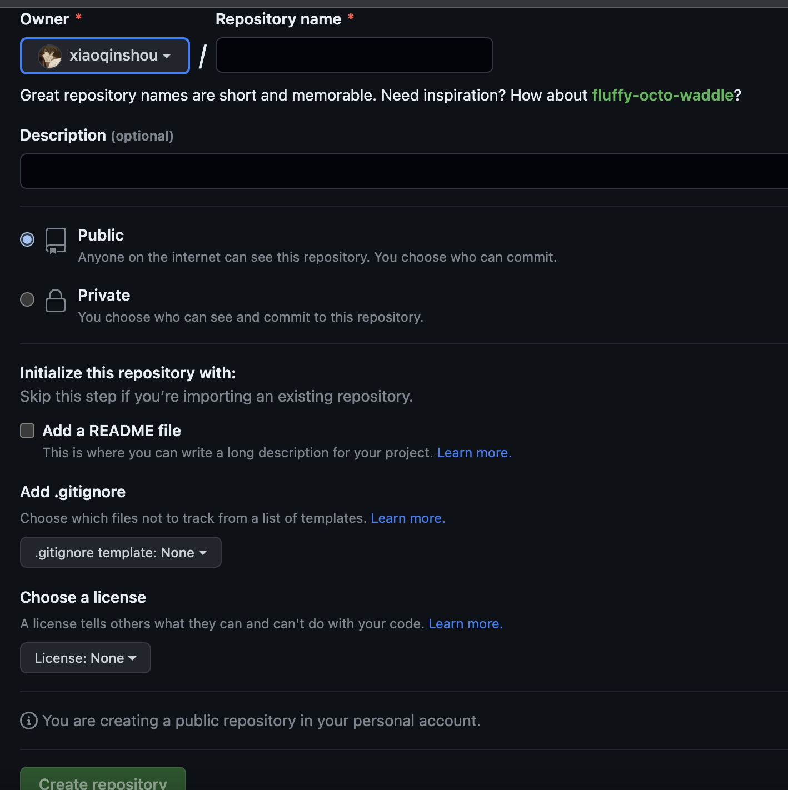

##### Vs code (本地编辑) 环境
1. 下载 Vs Code 编辑器安装
2. 左侧打开插件栏搜索对应插件安装即可
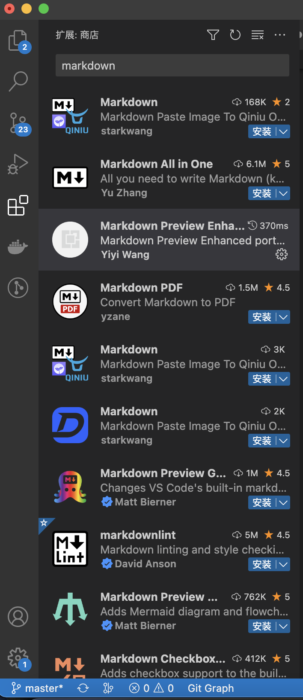
3. 依次安装 **Markdown Preview Enhanced**、**Paste Image** 插件
4. 如果有用到 plantuml 画图的话, 需要搜索安装 [graphviz](https://www.graphviz.org/download/) 工具, 选择对应系统的**安装包**安装即可. 安装包安装是免配置的
* 到此处已经完成平时编辑文档时的环境

###### 配置 Paste Image 插件
* 配置图片生成文件夹路径和贴图时的文件前缀, 修改如下即可
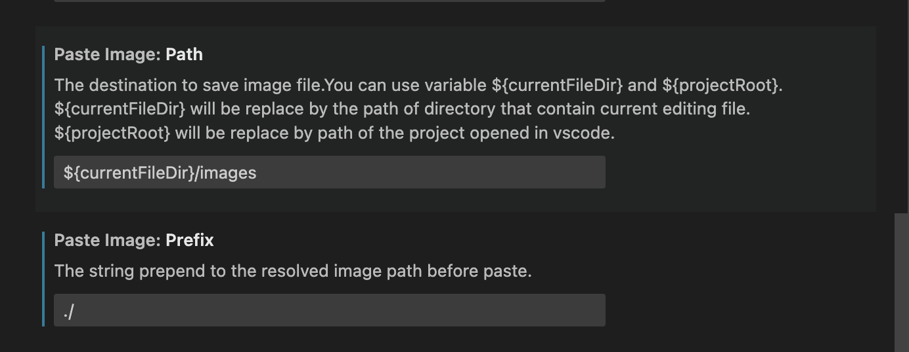

* 使用时只要通常使用微信或者QQ的截图在你想插入图片的地方粘贴(opt+cmd+V)即可, 就会生成下图的格式路径, 并且在对应的位置处会生成文件夹和图片文件
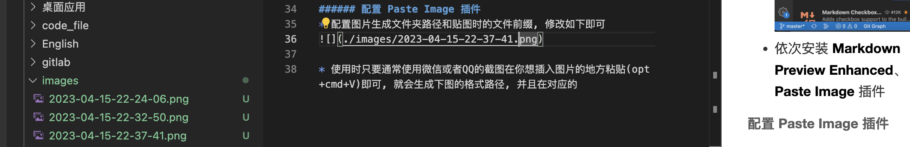

###### 配置同步设置
* VS Code 是可以登录 github 账号, 同步备份Vs Code 的个性化配置环境的, 以上我们的操作除了安装 graphviz 都属于, Vs code 的个性化配置
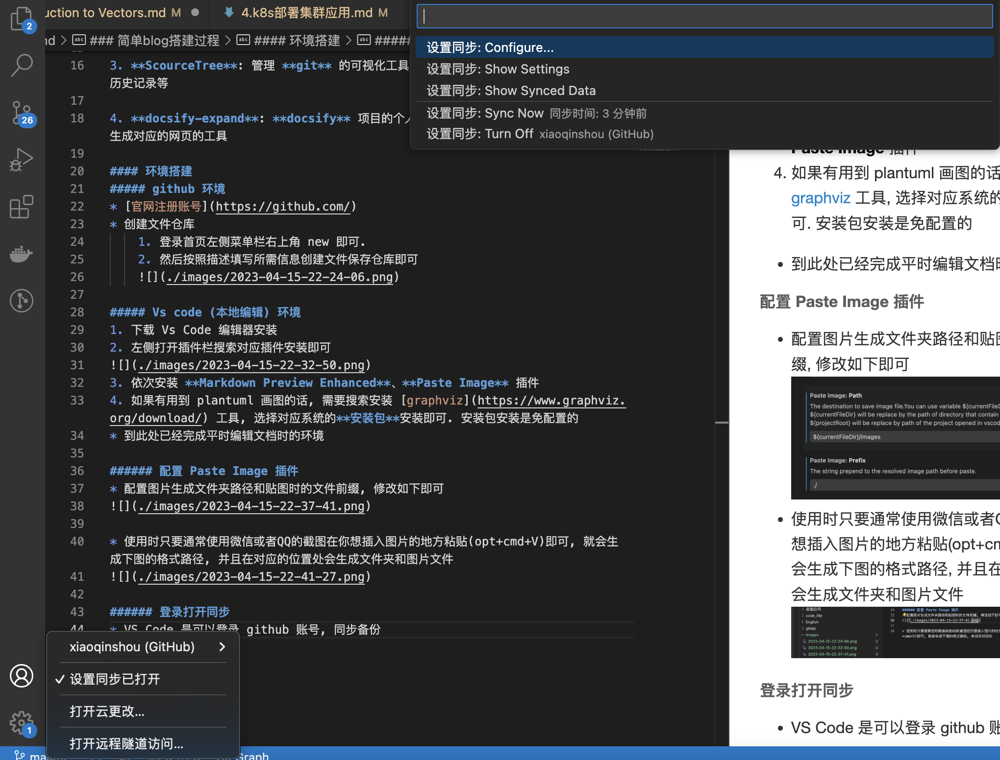

##### 同步云端环境
* 懂 git 的跳过, 用自己喜欢趁手的工具即可
1. 安装 Source Tree 工具.
2. 登录账户, 选择自己之前创建好的仓库克隆下来即可
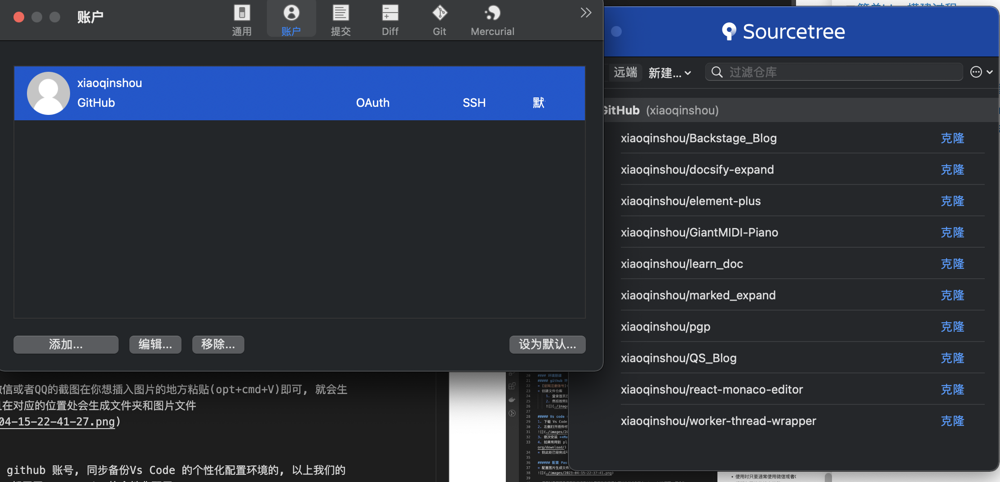

3. (**图片右上角**)选择编辑过的文档**提交**, 然后上传(**推送**)到云端上. 同理下载只要**拉取**即可
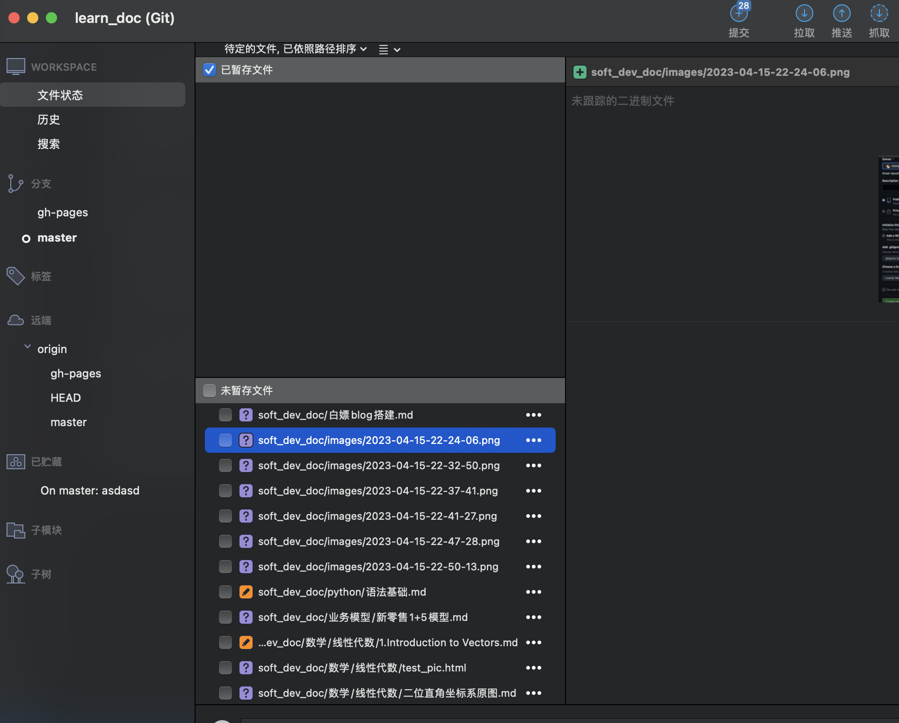

#### 在线网站的创建
* 过去了大半年, 几乎都忘记了...
##### 创建文档仓库
* 打开 github 项目界面, 找到项目设置, 然后进入pages界面, 配置成以下这样即可
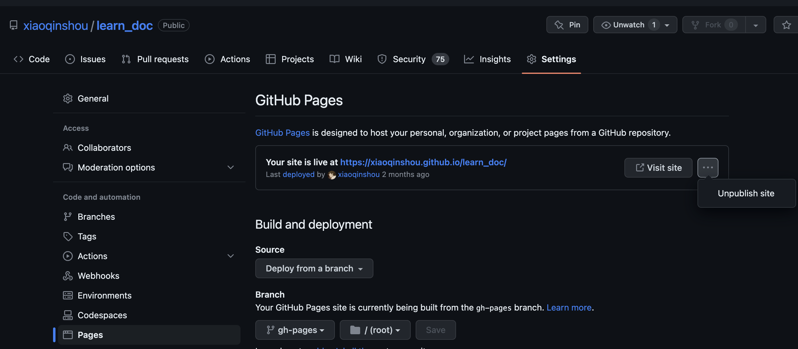
* 由于我是半路知道github-pages 这个东西的, 为了不妨碍我以前写的笔记, 所以选择了新建一条分支生成blog网站, 让记笔记和生成网站互不干涉

##### 创建网站首页
* 在对应仓库 gh-pages 分支下, 创建一个index.html 文件, 以下是文件内容 
```html
<!DOCTYPE html>
<html lang="en">
  <head>
    <meta charset="UTF-8" />
    <title>docsify</title>
    <meta http-equiv="X-UA-Compatible" content="IE=edge,chrome=1" />
    <meta name="viewport" content="width=device-width,initial-scale=1" />
    <link rel="stylesheet" href="//cdn.jsdelivr.net/npm/docsify-expand@1.0.0/themes/vue.css">
    <link rel="stylesheet" href="//cdn.jsdelivr.net/npm/katex@0.16.0/dist/katex.min.css">
    <link rel="stylesheet" href="//cdn.jsdelivr.net/npm/docsify-sidebar-collapse/dist/sidebar-folder.min.css" />
    <style>
      nav.app-nav li ul {
        min-width: 100px;
      }

      #carbonads {
        box-shadow: none !important;
        width: auto !important;
      }
    </style>
  </head>

  <body>
    <div id="app"></div>
    <script src="//cdn.jsdelivr.net/npm/docsify-plugin-carbon@1"></script>
    <script>
      // Set html "lang" attribute based on URL
      var lang = location.hash.match(/#\/(de-de|es|ru-ru|zh-cn)\//);

      if (lang) {
        document.documentElement.setAttribute('lang', lang[1]);
      }

      // Docsify configuration
      window.$docsify = {
        auto2top: true,
        basePath: '/learn_doc/soft_dev_doc/',
        coverpage: true,
        executeScript: true,
        loadSidebar: true,
        alias: {
          '/.*/_sidebar.md': '/_sidebar.md'
        },
        mergeNavbar: true,
        subMaxLevel: 3,
        autoHeader: true,
        name: 'lean_doc',
        search: {
          paths: 'auto',
        }
      };
    </script>
    <script src="\//cdn.jsdelivr.net/npm/docsify-expand@1.0.0/lib/docsify.min.js"></script>
    <!-- <script src="/lib/plugins/search.min.js"></script> -->
    <!-- <script src="/lib/plugins/front-matter.min.js"></script> -->
    <script src="//cdn.jsdelivr.net/npm/docsify-sidebar-collapse/dist/docsify-sidebar-collapse.min.js"></script>
    <!-- <script src="//cdn.jsdelivr.net/npm/docsify/lib/plugins/search.min.js"></script> -->
    <script src="//cdn.jsdelivr.net/npm/plantuml-encoder@1.4.0/dist/plantuml-encoder.min.js"></script>
    <script src="//cdn.jsdelivr.net/npm/mermaid/dist/mermaid.min.js"></script>
    <script src="//cdn.jsdelivr.net/npm/vega@5/build/vega.min.js"></script>
    <script src="//cdn.jsdelivr.net/npm/vega-lite@4/build/vega-lite.min.js"></script>
    <script src="//cdn.jsdelivr.net/npm/vega-embed@6/build/vega-embed.min.js"></script>
  </body>
</html>
```
* 懂代码的可了解一下, 不懂得跳过
* 解释一下, 其中的配置呢, 参考[docsify 官方文档](https://docsify.js.org/#/)
* plugins 是对应的 docsify 的插件, 直接引用即可
* 如果没用到 mermaid, vega, plantuml 等画图, 可以把相应的 js 注释掉提高网站的流畅度
* 其中引用的不是官方的 **docsify** 而是 **docsify-expand**, 因为 **docsify** 不支持, latex、 plantuml 等功能, 我在**docsify**源码的基础上增加了解析以上的功能, 感兴趣的可看[docsify升级](./%E5%89%8D%E7%AB%AF%E6%8A%80%E6%9C%AF/%E9%9A%8F%E6%89%8B%E8%AE%B0/docsify%E5%8D%87%E7%BA%A7%E6%B8%B2%E6%9F%93%E6%A8%A1%E5%9D%97.md)
* 并且 **docsify-expand** 也根据图片路径和文档跳转的引用做出过优化, 使得这两方面能完美契合网站和离线编辑能达到相同的效果 

##### 目录生成脚本(可选)
* 提供自动根据你文档的结构生成对应的目录, 如果不用这个脚本那就得根据[docsify 官方文档](https://docsify.js.org/#/)手写目录文件, 慢慢维护. 
* 使用这个脚本还需要安装 [nodejs](https://nodejs.org/en) 找个对应版本安装即可
* 在对应仓库 gh-pages 分支下, 创建一个 generatorSidebar.js 文件, 以下是文件内容
```js
const fs = require('fs')
const querystring = require('querystring')

function SortLikeWin(a, b) {
  var reg = /[0-9]+/g;
  var lista = a.match(reg);
  var listb = b.match(reg);
  if (!lista || !listb) {
      return a.localeCompare(b);
  }
  for (var i = 0, minLen = Math.min(lista.length, listb.length) ; i < minLen; i++) {
      //数字所在位置序号
      var indexa = a.indexOf(lista[i]);
      var indexb = b.indexOf(listb[i]);
      //数字前面的前缀
      var prefixa = a.substring(0, indexa);
      var prefixb = b.substring(0, indexb);
      //数字的string
      var stra = lista[i];
      var strb = listb[i];
      //数字的值
      var numa = parseInt(stra);
      var numb = parseInt(strb);
      //如果数字的序号不等或前缀不等，属于前缀不同的情况，直接比较
      if (indexa != indexb || prefixa != prefixb) {
          return a.localeCompare(b);
      }
      else {
          //数字的string全等
          if (stra === strb) {
              //如果是最后一个数字，比较数字的后缀
              if (i == minLen - 1) {
                  return a.substring(indexa).localeCompare(b.substring(indexb));
              }
              //如果不是最后一个数字，则循环跳转到下一个数字，并去掉前面相同的部分
              else {
                  a = a.substring(indexa + stra.length);
                  b = b.substring(indexa + stra.length);
              }
          }
              //如果数字的string不全等，但值相等
          else if (numa == numb) {
              //直接比较数字前缀0的个数，多的更小
              return strb.lastIndexOf(numb + '') - stra.lastIndexOf(numa + '');
          }
          else {
              //如果数字不等，直接比较数字大小
              return numa - numb;
          }
      }
  }
}

function filterDirectory(name) {
  if (name === '.history' || name === 'images' || name === 'code_file' || name === 'react_demo') {
    return false
  }
  return true
}

function filterFile(name) {
  return !name.startsWith('_') && name.endsWith('.md') && name !== 'README.md'
}

function newLine(deep) {
  return new Array(deep).fill('  ').join('')
}

const rootPath = './soft_dev_doc'
const sidebarFile = rootPath + '/_sidebar.md'
const sidebar = {}

function readDirSync(path) {
  var pa = fs.readdirSync(path);
  let namePaths = path.replace(`${rootPath}`, '').split('/')
  namePaths.shift()
  let that = sidebar
  // point to the right place
  while (namePaths.length) {
    const name = namePaths.shift()
    if (!that[name]) {
      that[name] = {}
    }
    that = that[name]
  }
  pa.forEach(function (ele, index) {
    var info = fs.statSync(path + "/" + ele)
    if (info.isDirectory()) {
      if (filterDirectory(ele)) {
        readDirSync(path + "/" + ele);
      }
    } else if (filterFile(ele)) {
      that[ele] = querystring.escape(`(${path.replace(`${rootPath}/`, '')}/${ele})`)
    }
  })
}

readDirSync(rootPath)

// 遍历 sidebar 对象，生成 _sidebar.md 文件
function generateSidebar(sidebar, deep = 0) {
  const keys = Object.keys(sidebar).sort(SortLikeWin)
  for (let key of keys) {
    let sidebarStr = ''
    if (typeof sidebar[key] === 'string') {
      sidebarStr = `${newLine(deep)}- [${key.replace('.md', '')}]${sidebar[key]}\n`
    } else {
      sidebarStr = `${newLine(deep)}- ${key}\n`
    }
    fs.appendFileSync(sidebarFile, sidebarStr, err => {
      if (err) {
        return console.error(err);
      }
    })
    if (typeof sidebar[key] === 'object') {
      generateSidebar(sidebar[key], deep + 1)
    }
  }
}

fs.writeFile(sidebarFile, '', function (err) {
  if (err) {
    return console.error(err);
  }
  console.log("Empty written successfully!");
})

generateSidebar(sidebar)
```
* 懂代码的可以根据代码稍作修改

#####  清空 .nojekyll 文件
* 清空 github-pages 自动生成的 .nojekyll 内容, 是清空内容不是删除文件
* 不清空的话, 会使用 github-pages 内置的生成网站的方式, 生成网站

#### 日常使用
1. 在离线环境正常编辑markdown文档即可
2. 正常云端备份**提交推送**即可. 想在不同的电脑上写作, 同样执行[同步云端环境](#同步云端环境)**下载上传**即可
* 主要编辑文档的分支, 上传备份文档
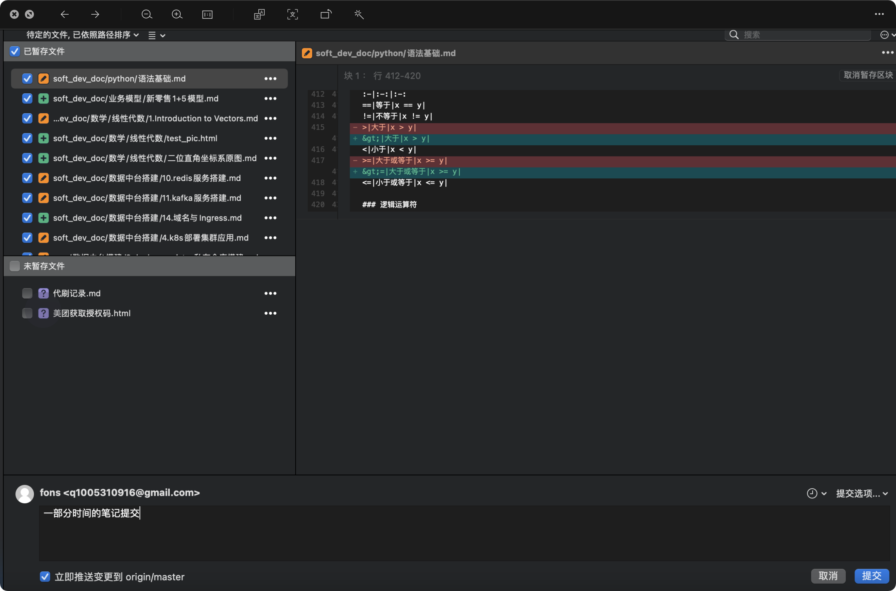

3. 想更新网站了. 执行一下合并操作就行了, 可以在你想要的任意地点写好的文档, 进行创建网站
* 线切换到 gh-pages 分支, 然后选择某个对应的点(对应你文档的不同时间点), 合并 
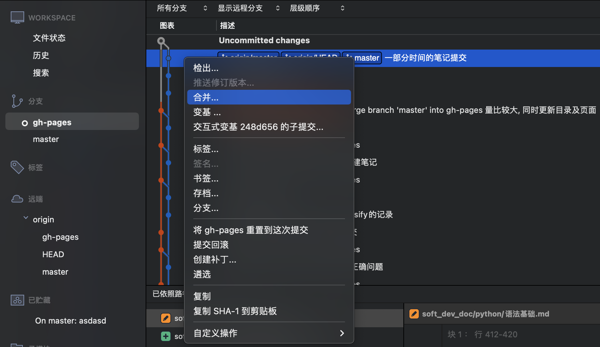
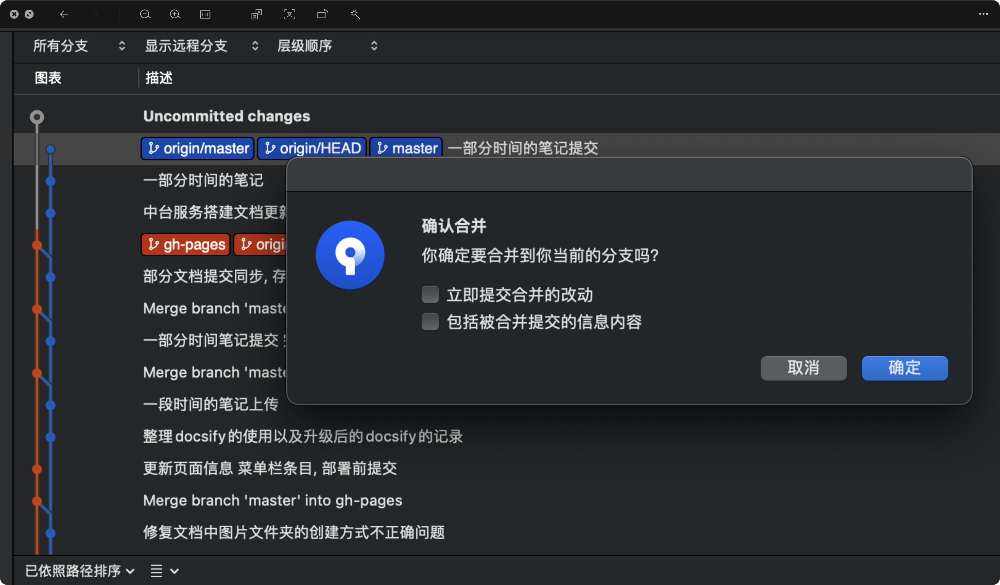

4. 在 gh-pages 界面生成一下目录, 可能新增了文档的数量或者文件夹的数量等. 
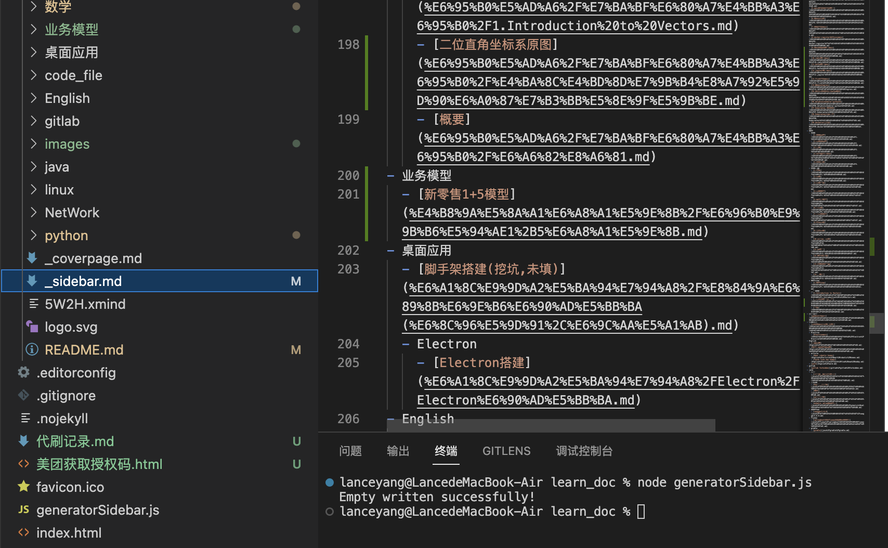
* 左边的绿色代表目录文件有做修改

5. gh-pages分支再次执行提交上传操作. github监测到 gh-pages 分支提交上传后, 就会自动生成或者更新你的网站了

#### gitee版本 

* gitee 所有功能几乎照搬 github 的, 也支持白嫖, 按照github的思路翻译成 gitee 的即可