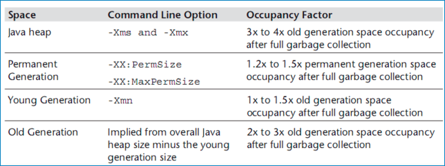
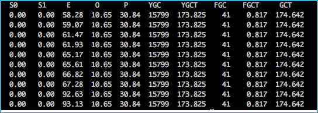
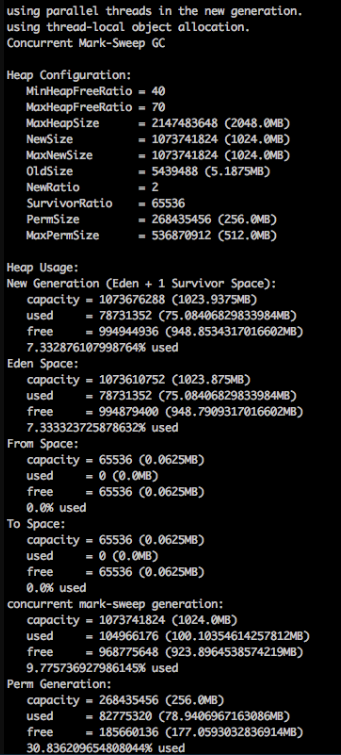
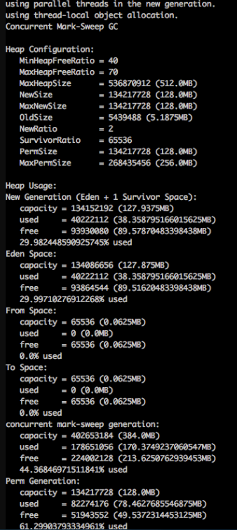
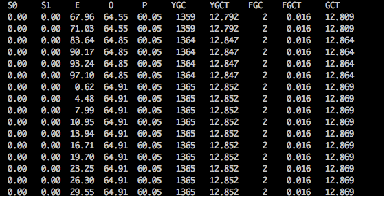

# JVM内存设置
本文地址：https://www.dutycode.com/jvm_xmx_xmn_xms_shezhi.html
除非注明，文章均为 www.dutycode.com 原创，欢迎转载！转载请注明本文地址,谢谢。

* 问题:

新上线一个java服务，或者是RPC或者是WEB站点， 内存的设置该怎么设置呢？设置成多大比较合适，既不浪费内存，又不影响性能呢？

* 分析：

依据的原则是根据Java Performance里面的推荐公式来进行设置。

* 具体来讲：

Java整个堆大小设置，Xmx 和 Xms设置为老年代存活对象的3-4倍，即FullGC之后的老年代内存占用的3-4倍

永久代 PermSize和MaxPermSize设置为老年代存活对象的1.2-1.5倍。

年轻代Xmn的设置为老年代存活对象的1-1.5倍。

老年代的内存大小设置为老年代存活对象的2-3倍。

* BTW：
1. Sun官方建议年轻代的大小为整个堆的3/8左右， 所以按照上述设置的方式，基本符合Sun的建议。
2. 堆大小=年轻代大小+年老代大小， 即xmx=xmn+老年代大小 。 Permsize不影响堆大小。
3. 为什么要按照上面的来进行设置呢？ 没有具体的说明，但应该是根据多种调优之后得出的一个结论。

* 方式1（推荐/比较稳妥）：

&emsp;JVM参数中添加GC日志，GC日志中会记录每次FullGC之后各代的内存大小，观察老年代GC之后的空间大小。可观察一段时间内（比如2天）的FullGC之后的内存情况，根据多次的FullGC之后的老年代的空间大小数据来预估FullGC之后老年代的存活对象大小（可根据多次FullGC之后的内存大小取平均值）

* 方式2：（强制触发FullGC, 会影响线上服务，慎用）

&emsp;方式1的方式比较可行，但需要更改JVM参数，并分析日志。同时，在使用CMS回收器的时候，有可能不能触发FullGC（只发生CMS GC），所以日志中并没有记录FullGC的日志。在分析的时候就比较难处理。

&emsp;BTW：使用jstat -gcutil工具来看FullGC的时候， CMS GC是会造成2次的FullGC次数增加。 具体可参见之前写的一篇关于jstat使用的文章

&emsp;所以，有时候需要强制触发一次FullGC，来观察FullGC之后的老年代存活对象大小。

&emsp;注：强制触发FullGC，会造成线上服务停顿（STW），要谨慎，建议的操作方式为，在强制FullGC前先把服务节点摘除，FullGC之后再将服务挂回可用节点，对外提供服务

&emsp;在不同时间段触发FullGC，根据多次FullGC之后的老年代内存情况来预估FullGC之后的老年代存活对象大小

* 如何触发FullGC ？

&emsp;使用jmap工具可触发FullGC
&emsp;jmap -dump:live,format=b,file=heap.bin <pid> 将当前的存活对象dump到文件，此时会触发FullGC
&emsp;jmap -histo:live <pid> 打印每个class的实例数目,内存占用,类全名信息.live子参数加上后,只统计活的对象数量. 此时会触发FullGC

* 具体操作实例：

以我司的一个RPC服务为例。

BTW：刚上线的新服务，不知道该设置多大的内存的时候，可以先多设置一点内存，然后根据GC之后的情况来进行分析。

初始JVM内存参数设置为： Xmx=2G Xms=2G xmn=1G

使用jstat 查看当前的GC情况。如下图：

YGC平均耗时： 173.825s/15799=11ms

FGC平均耗时：0.817s/41=19.9ms

平均大约10-20s会产生一次YGC

看起来似乎不错，YGC触发的频率不高，FGC的耗时也不高，但这样的内存设置是不是有些浪费呢？

为了快速看数据，我们使用了方式2，产生了几次FullGC，FullGC之后，使用的jmap -heap 来看的当前的堆内存情况（也可以根据GC日志来看）

heap情况如下图：（命令 ： jmap -heap <pid>）

上图中的concurrent mark-sweep generation即为老年代的内存描述。

老年代的内存占用为100M左右。 按照整个堆大小是老年代（FullGC）之后的3-4倍计算的话，设置各代的内存情况如下：

    Xmx=512m  Xms=512m  Xmn=128m PermSize=128m  老年代的大小为 （512-128=384m）为老年代存活对象大小的3倍左右

调整之后的，heap情况:

GC情况如下：

YGC 差不多在10s左右触发一次。每次YGC平均耗时大约9.41ms。可接受。

FGC平均耗时：0.016s/2=8ms

整体的GC耗时减少。但GC频率比之前的2G时的要多了一些。

注： **看上述GC的时候，发现YGC的次数突然会增多很多个，比如 从1359次到了1364次。具体原因是？**

总结：
在内存相对紧张的情况下，可以按照上述的方式来进行内存的调优， 找到一个在GC频率和GC耗时上都可接受的一个内存设置，可以用较小的内存满足当前的服务需要

但当内存相对宽裕的时候，可以相对给服务多增加一点内存，可以减少GC的频率，GC的耗时相应会增加一些。 一般要求低延时的可以考虑多设置一点内存， 对延时要求不高的，可以按照上述方式设置较小内存。

补充：

永久代（方法区）并不在堆内，所以之前有看过一篇文章中描述的 整个堆大小=年轻代+年老代+永久代的描述是不正确的。
