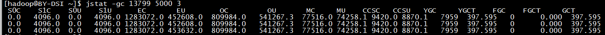

[toc]
# JVM问题实用排查
### jstat 查看`gc`实时执行情况
* 常用：
```shell
# 固定  可选参数 JSP所查线程号 间隔多少时间打印(单位ms,可选) 打印次数(可选)
$ jstat -gc pid 5000 10
# 固定格式
$ jstat options pid interval count
```
* 详细用法
`options`: 一般使用`-gcutil`或`-gc`查看`gc`情况
`pid`: 当前运行的`java`进程号
`interval`: 间隔时间，单位为秒或者毫秒
`count`: 打印次数，如果缺省则打印无数次

* `options`可选参数:
`-gc` ：统计`jdk``gc`时`heap`信息，以使用空间字节数表示
`-gcutil` ：统计`gc`时，`heap`情况，以使用空间的百分比表示
`-class` ：统计`class``loader`行为信息
`-compile` ：统计编译行为信息
`-gccapacity` ：统计不同`generations`（新生代，老年代，持久代）的`heap` 容量情况
`-gccause` ：统计引起`gc`的事件
`-gcnew` ：统计`gc` 时，新生代的情况
`-gcnewcapacity` ：统计`gc`时，新生代`heap`容量
`-gcold` ：统计`gc` 时，老年代的情况
`-gcoldcapacity` ：统计`gc`时，老年代`heap`容量
`-gcpermcapacity` ：统计`gc`时，`permanent`区`heap`容量

* 示例：
```shell
$ jstat -gc 13799 5000 3
# 每5秒一次显示进程号为13799的java进程的GC情况，一共显示3次。结果如下图：
```


* 结果说明：

标志|说明
:-|:-
S0C|年轻代中第一个survivor区的容量 (字节)
S1C|年轻代中第二个survivor区的容量 (字节)
S0U|年轻代中第一个survivor区目前已使用空间 (字节)
S1U|年轻代中第二个survivor区目前已使用空间 (字节)
EC|年轻代中Eden的容量 (字节)
EU|年轻代中Eden目前已使用空间 (字节)
OC|Old代的容量 (字节)
OU|Old代目前已使用空间 (字节)
PC|Perm(持久代)的容量 (字节)
PU|Perm(持久代)目前已使用空间 (字节)
YGC|从应用程序启动到采样时年轻代中gc次数
YGCT|从应用程序启动到采样时年轻代中gc所用时间(s)
FGC|从应用程序启动到采样时old代(全gc)gc次数
FGCT|从应用程序启动到采样时old代(全gc)gc所用时间(s)
GCT|从应用程序启动到采样时gc用的总时间(s)
NGCMN|年轻代(young)中初始化(最小)的大小 (字节)
NGCMX|年轻代(young)的最大容量 (字节)
NGC|年轻代(young)中当前的容量 (字节)
OGCMN|old代中初始化(最小)的大小 (字节)
OGCMX|old代的最大容量 (字节)
OGC|old代当前新生成的容量 (字节)
PGCMN|perm代中初始化(最小)的大小 (字节)
PGCMX|perm代的最大容量 (字节)
PGC|perm代当前新生成的容量 (字节)
S0|年轻代中第一个survivor区已使用的占当前容量百分比
S1|年轻代中第二个survivor区已使用的占当前容量百分比
E|年轻代中Eden已使用的占当前容量百分比
O|old代已使用的占当前容量百分比
P|perm代已使用的占当前容量百分比
S0CMX|年轻代中第一个survivor区的最大容量 (字节)
S1CMX|年轻代中第二个survivor区的最大容量 (字节)
ECMX|年轻代中Eden的最大容量 (字节)
DSS|当前需要survivor区的容量 (字节)（Eden区已满）
TT|持有次数限制
MTT|最大持有次数限制

