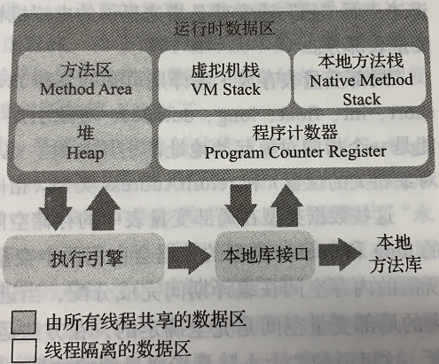

# 自动内存管理
> &emsp;JAVA 与 C++ 之间有一堵由内存动态分配和垃圾收集技术所围成的高墙，墙外的人想进去，墙内的人想出来。
> &emsp;从事C、C++程序开发的人来说，在内存管理区域，他们即是拥有最高权力的帝皇，又是从事最基础工作的劳动人民。既拥有每个对象的“所有权”，又担负着每个对象生命从开始到终结的维护责任。

## 运行时数据区域

### 程序计数器
> &emsp;程序计数器(Program Counter Register)是一块较小的内存空间，它可以看作是当前线程所执行的字节码的行号指示器。在Java虚拟机的概念模型里，字节码解释器工作时就是通过改变这个计数器的值来选取下一条需要执行的字节码指令，它是程序控制流的指示器，分支、循环、跳转、异常处理、线程恢复等基础功能都需要依赖这个计数器来完成。
&emsp;由于Java虚拟机的多线程是通过线程轮流切换、分配处理器执行时间的方式来实现的，在任何一个确定的时刻，一个处理器(对于多核处理器来说是一个内核)都只会执行一条线程中的指令。因此，为了线程切换后能恢复到正确的执行位置，每条线程都需要有一个独立的程序计数器，各条线程之间计数器互不影响，独立存储，我们称这类内存区域为“线程私有”的内存。
&emsp;如果线程正在执行的是一个Java方法，这个计数器记录的是正在执行的虚拟机字节码指令的地址;如果正在执行的是本地(Native) 方法，这个计数器值则应为空(Undefined)。此内存区域是唯一一个在 《Java虚拟机规范》中没有规定任何OutOfMemoryError情况的区域。

### JAVA 虚拟机栈
> &emsp;与程序计数器一样，Java 虚拟机栈(Java Virtual Machine Stack)也是线程私有的，它的生命周期与线程相同。虚拟机栈描述的是Java方法执行的线程内存模型：每个方法被执行的时候，JVM 都会同步创建一个栈帧(Stack Frame)用于存储局部变量表、操作数栈、动态连接、方法出口等信息。每一个方法被调用直至执行完毕的过程，就应对着一个栈帧在虚拟机中从出栈到入栈的过程。
&emsp;经常有人把Java内存区域笼统地划分为堆内存( Heap)和栈内存(Stack), 这种划分方式直接继承自传统的C、C++程序的内存布局结构，在Java语言里就显得有些粗糙了，实际的内存区域划分要比这更复杂。不过这种划分方式的流行也间接说明了程序员最关注的、与对象内存分配关系最密切的区域是“堆”和“栈”两块。其中，“堆”在稍后笔者会专门讲述，而“栈”通常就是指这里讲的虚拟机栈，或者更多的情况下只是指虚拟机栈中局部变量表部分。
&emsp;局部变量表存放了编译期可知的各种Java虚拟机基本数据类型(boolean、byte、char、short、int、float、long、double)、对象引用(reference类型，它并不等同于对象本身，可能是一个指间对象起始地址的引用指针，也可能的是指向一个代表对象的句柄或者其他与此对象相关的位置)和returnAddress类型(指向了一条字节码指令的地址)。
&emsp;这些数据类型在局部变量表中的存储空间以局部变量槽(Slot)来表示，其中64位长度的long和double类型的数据会占用两个变量槽，其余的数据类型只占用一个。局部变量表所需的内存空间在编译期间完成分配，当进入一个方法时，这个方法需要在栈帧中分配多大的局部变量空间是完全确定的，在方法运行期间不会改变局部变量表的大小。请读者注意，这里说的“大小”是指变量槽的数量，虚拟机真正使用多大的内存空间(譬如按照1个变量槽占用32个比特、64个比特，或者更多)来实现一个变量槽，这是完全由具体的虚拟机实现自行决定的事情。
&emsp;在《Java虚拟机规范》中，对这个内存区域规定了两类异常状况:如果线程请求的栈深度大于虚拟机所允许的深度，将抛出StackOverlowWEror异常;如果Java虚拟机栈容量可以动态扩展，当栈扩展时无法申请到足够的内存会抛出OutOfMemoryErr异常。

### 本地方法栈
>&emsp;本地方法栈(Native Method Stacks)与虚拟机栈所发挥的作用是非常相似的，其区别是虚拟机栈为虚拟机执行JAVA方法(也就是字节码)服务，而本地方法栈则是为虚拟机使用到的本地(Native)方法服务。
&emsp;《Java虚拟机规范》对本地方法栈中方法使用的语言、使用方式与数据结构并没有任何强制规定，因此具体的虚拟机可以根据需要自由实现它，甚至有的Java虚拟机(譬如HotSpot虚拟机)直接就把本地方法栈和虚拟机栈合二为一。与虚拟机栈一样，本地方法栈也会在栈深度溢出或者栈扩展失败时分别抛出StackOverflowError和OutOfMemoryError异常。

### JAVA 堆
>&emsp;对于JAVA应用程序来说，JAVA堆(Java Heap)是虚拟机所管理的内存中最大的一块。Java堆是被所有线程共享的一块内存区域，在虚拟机启动时创建。此内存区域唯一的目的就是存放对象实例，在JAVA的世界里"几乎"所有的对象实例都在这里分配内存。在《Java虚拟机规范》中对Java堆的描述是:“所有的对象实例以及数组都应当在堆上分配，而这里笔者写的“几乎”是指从实现角度来看，随着Java语言的发展，现在已经能看到些许迹象表明日后可能出现值类型的支持，即使只考虑现在。由于即时编译技术的进步，尤其是逃逸分析技术的日渐强大，栈上分配、标量替换优化手段已经导致一些微妙的变化悄然发生，所以说Java对象实例都分配在堆上也渐渐变得不是那么绝对了。
&emsp;Java 堆是垃圾收集 器管理的内存区域， 因此一些资料中它也被称作”GC堆”(GarbageClleted Heap,幸好国内设翻译成“垃圾堆)。从回收内存的角度看，由于现代垃圾收集器大部分都是基于分代收集理论设计的，所以Java堆中经常会出现“新生代”“老年代”“永久化””Eden空间”“From Survivor空间””To Survivor空间"等名词。这些概念在本书后续章节中还会反复登场亮相，在这里笔者想先说明的是这些区域划分仅仅是一部分垃圾收集器的共同特性或者说设计风格而已、而非某个Java虚拟机具体实现的固有内存布局，更不是《Java虚拟机规范》里对Java堆的进一步细致划分。不少资料上经常写着类似于“Java虚拟机的堆内存分为新生代、老年代、永久代、Eden、Survivor....”这样的内容。在十年之前(以G1收集器的出现为分界)，作为业界绝对主流的HotSpot虚报机，它内部的垃圾收集器全部都基于“经典分代”来设计，需要新生代、老年代收集器搭配才能工作，在这种背景下，上述说法还算是不会产生太大歧义。但是到了今天，垃圾收集器技术与十年前已不可同日而语，HoSpt里面也出现了不采用分代设计的新垃圾收集器，再按照上面的提法就有很多需要商榷的地方了。
&emsp;如果从分配内存的角度看，所有线程共享的Java堆中可以划分出多个线程私有的分配缓冲区(Trend Local Alocacion Bufer, TLAB), 以提升对象分配时的效率。不过无论从什么角度，无论如何划分，都不会改变Java堆中存储内容的共性，无论是哪个区城，在储的都只能是对象的实例，将Java堆细分的目的只是为了更好地回收内存，或者更快地分配内存。在本章中，我们仅仅针对内存区域的作用进行讨论，Jave堆中的上述各个区域的分配、回收等细节将会是下一章的主题。
&emsp;根据《Jave虚拟机规范》的规定，Java 堆可以处于物理上不连续的内存空间中，但在逻辑上它应该被视为连续的，这点就像我们用磁盘空间去存储文件一样，并不要求每个文件都连续存放。但对于大对象(典型的如数组对象)，多数虚拟机实现出于实现简单、存储高效的考虑，很可能会要求连续的内存空间。
&emsp;Java 堆既可以被实现成固定大小的，也可以是可扩展的，不过当前主流的Java虚拟机都是按照可扩展来实现的(通过参数Xmx和xXm设定)》。如果在Java堆中没有内存完成实例分配，并且堆也无法再扩展时，Java 虚拟机将会抛出 OutOfMemoryError 异常。

### 方法区
>&emsp;方法区( Method Area)与Java堆一样，是各个线程共享的内存区域，它用于存储被虚拟机加载的类型信息、常量、静态变量、即时编译器编译后的代码缓存等数据。虽然《Java虚拟机规范》中把方法区描述为堆的一个逻辑部分，但是它却有一个别名叫做“非堆”(Non-Heap),目的是与Java堆区分开来。
&emsp;说到方法区，不得不提-下“永久代”这个概念，尤其是在JDK 8以前，许多Java程序员都习惯在HotSpot虚拟机上开发、部署程序，很多人都更愿意吧方法区称呼为“永久代”(Permanent Generation)，或将两者混为一谈。本质上这两者并不是等价的，因为仅仅是当时的HolSpot虚拟机设计团队选择把收集器的分代设计扩展至方法区，或者说使用永久代来实现方法区而已，这样使得HotSpot的垃圾收集器能够像管理Java堆一样管理这部分内存，省去专门为方法区编写内存管理代码的工作。但是对于其他虚拟机实现，譬如BEA JRockit、IBM J9等来说，是不存在永久代的概念的。原则上如何实现方法区属于虚拟机实现细节，不受< Java虚拟机规范》管束，并不要求统一。但现在回头来看，当年使用永久代来实现方法区的决定并不是一个好主意，这种设计导致了Java应用更容易遇到内存溢出的问题(永久代有-XX:MaxPermSize的上线，即使不设置也有默认大小，而J9和JRockit只要没有触碰到进程可用内存上限，例如32位系统中的4GB限制，就不会出问题)，而且有极少数方法(例如String::intern())会因永久代的原因而导致不同虚拟机下有不同的表现。当Oracle收购BEA获得了JRokit的所有权后，准备把JRockit中的优秀功能，譬如Java Mssion Control 管理工具，移植到HotSpot虚拟机时，但因为两者对方法区实现的差异而面临诸多困难。考虑到HotSpot未来的发展，在JDK 6的时候HotSpot开发团队就有放弃永久代，逐步改为采用本地内存(Native Memory)来实现方法区的计划了，到了JDK 7 的HotSpot,已经把原本放在永久代的字符串常量池、静态变量等移出，而到了JDK8，终于完全废弃了永久代的概念，改用与JRockit. J9 一样在本地内存中实现的元空间(Meta-space) 来代替，把JDK 7中永久代还剩余的内容(主要是类型信息)全部移到元空间中。
&emsp;《Java虚拟机规范》对方法区的约束是非常宽松的，除了和Java堆一样不需要连续的内存和可以选择固定大小或者可扩展外，甚至还可以选择不实现垃圾收集。相对而言，垃极收集行为在这个区域的确是比较少出现的，但并非数据进入了方法区就如永久代的名字一样 “永久”存在了。这区域的内存回收目标主要是针对常量池的回收和对类型的卸载，一般来说这个区域的回收效果比较难令人满意，尤其是类型的卸载，条件相当苛刻，但是这部分区域的回收有时有确实是必要的。以前Sun公司的Bug列表中，曾出现过若干个严重的Bug就是由于低版本的HotSpot虚拟机对此区域未完全回收而导致内存泄漏。
&emsp;根据《Java虚拟机规范》的规定，如果方法区无法满足新的内存分配需求时，将抛出OutOfMemoryError异常。

### 运行时常量池
>&emsp;运行时常量池(Runtime Constant Pool)是方法区的一部分。Class 文件中除了有类的版本、字段、方法、接口等描述信息外，还有一项信息是常量池表( Constant Pool Table),用于存放编译期生成的各种字面量与符号引用，这部分内容将在类加载后存放到方法区的运行时常量池中。
&emsp;Java虚拟机对于Class文件每一部分 (自然也包括常量池)的格式都有严格规定，如每一个字 节用于存储哪种数据都必须符合规范上的要求才会被虚拟机认可、加载和执行，但对于运行时常量池，《Java虚拟机规范》并没有做任何细节的要求，不同提供商实现的虚拟机可以按照自己的需要来实现这个内存区域，不过一般来说， 除了保存Class文件中描述的符号引用外，还会把由符号引用翻译出来的直接引用也存储在运行时常量池中日。
&emsp;运行时常量池相对于Class文件常量池的另外一个重要特征是具备动态性，Java语言并不要求常量一定只有编译期才能产生，也就是说，并非预置人Class文件中常量池的内容才能进入方法区运行时常量池，运行期间也可以将新的常量放人池中，这种特性被开发人员利用得比较多的便是String类的interm()方法。
&emsp;既然运行时常量池是方法区的一部分，自然受到方法区内存的限制，当常量池无法再申请到内存时会抛出OutOfMemoryError异常。

### 直接内存
>&emsp;直接内存(Direct Memory)并不是虚拟机运行时数据区的一部分，也不是《Java虚拟机规范)中定义的内存区域。但是这部分内存也被频繁地使用，而且也可能导致OutOfMemoryError异常出现，所以我们放到这里一起讲解。
&emsp;在JDK 1.4中新加人了NIO ( New Input/Output)类，引人了一种基于通道( Channel)与缓冲区( Buffer)的I/O方式，它可以使用Native函数库直接分配堆外内存，然后通过一个存储在Java堆里面的DirectByteBuffer 对象作为这块内存的引用进行操作。 这样能在一些场景中显著提高性能，因为避免了在Java堆和Native堆中来回复制数据。
&emsp;显然，本机直接内存的分配不会受到Java堆大小的限制，但是，既然是内存，则肯定还是会受到本机总内存(包括物理内存、SWAP分区或者分页文件)大小以及处理器寻址空间的限制，一般服务器管理员配置虚拟机参数时，会根据实际内存去设置-Xmx等参数信息，但经常忽略掉直接内存，使得各个内存区域总和大于物理内存限制(包括物理的和操作系统级的限制)，从而导致动态打展时出现OutOfMemoryError异常。

