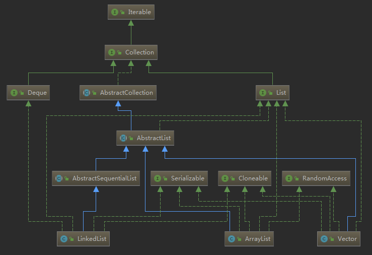
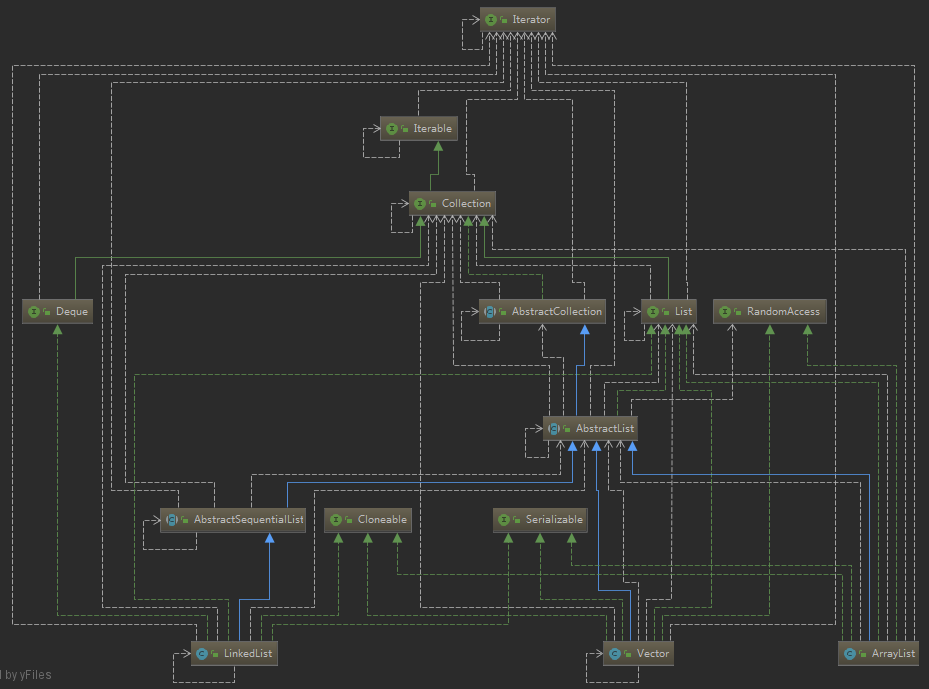

# JAVA 集合
&emsp;作为15年入学的带砖生，摸爬滚打也几年了，也应该要从 API 工程师，慢慢转行成程序猿了。刚好趁着这段时间准备复习，从头学习一遍，从实践经验来丰富一遍理论知识。
## JAVA集合类类图
* 队列全家桶


* 首先慢慢分析这张类图
1. Iterator 迭代器抽象, 由于源码比较少就直接贴出来，具体了解[迭代器模式](../../设计模式/迭代器模式.md)
```java
// 正常的一个迭代器抽象，以及迭代器必须有的几个方法
public interface Iterator<E> {
    // 判断是否有下一个节点
    boolean hasNext();
    // 获取下一个节点，并且指针移向下一个位置
    E next();
    // 删除当前节点
    default void remove() {
        throw new UnsupportedOperationException("remove");
    }
    default void forEachRemaining(Consumer<? super E> action) {
        Objects.requireNonNull(action);
        while (hasNext())
            action.accept(next());
    }
}
```
2. Iterable 创建迭代器抽象类，用于创建迭代器，而抽象出来的抽象类(代码也不多贴出来)。
```java
// 创建迭代器的抽象类
public interface Iterable<T> {
    // 生成返回一个属于自己的迭代器
    Iterator<T> iterator();
    // 这个主要就是1.8 中加入的函数式编程了 这里传进来的其实就是一个方法
    default void forEach(Consumer<? super T> action) {
        Objects.requireNonNull(action);
        for (T t : this) {
            action.accept(t);
        }
    }
    // 1.8 新加入的分流器，主要是Spliterators 生成根据迭代器生成对应的分流器
    // Spliterator 提供分流以后进行函数式编程的入口
    // 不过多展开。后期有时间再去看。
    default Spliterator<T> spliterator() {
        return Spliterators.spliteratorUnknownSize(iterator(), 0);
    }
}
```

3. Collection 中文直译就是集合，所以它里面主要是抽象出了集合类所有的共有的特性，用于给不同的集合子类进行统一实现
```java
public interface Collection<E> extends Iterable<E> {
    // 该集合的大小
    int size();

    // 该集合是否为空
    boolean isEmpty();

    // 该集合是否存在某种元素，查找
    boolean contains(Object o);

    // 生成自己的迭代器，由上层继承下来的
    Iterator<E> iterator();

    // 自身集合转数组
    Object[] toArray();

    // 英文不好看不太懂注释，方法名叫的也挺随便的
    // 看了一遍代码，简述一下此方法抽象的作用
    // 当传进来的数组长度小于该集合时，创建一个新的 T[] 数组，并将该集合所有的内容塞进新的数组并返回
    // 当传进来的数组长度大于等于该集合时，将该集合的所有数据顺序不变的塞到传进来的数组 a 中。(ArrayList中的处理方式)大于的部分将第一个设为下标为集合最大值的数组下标设为null
    <T> T[] toArray(T[] a);

    // 为自己添加一个节点
    boolean add(E e);

    // 删除自己一个节点
    boolean remove(Object o);

    // 判断本身是否包含另一个集合
    boolean containsAll(Collection<?> c);


    boolean addAll(Collection<? extends E> c);


    boolean removeAll(Collection<?> c);


    default boolean removeIf(Predicate<? super E> filter) {
        Objects.requireNonNull(filter);
        boolean removed = false;
        final Iterator<E> each = iterator();
        while (each.hasNext()) {
            if (filter.test(each.next())) {
                each.remove();
                removed = true;
            }
        }
        return removed;
    }


    boolean retainAll(Collection<?> c);


    void clear();


    boolean equals(Object o);


    int hashCode();


    @Override
    default Spliterator<E> spliterator() {
        return Spliterators.spliterator(this, 0);
    }


    default Stream<E> stream() {
        return StreamSupport.stream(spliterator(), false);
    }


    default Stream<E> parallelStream() {
        return StreamSupport.stream(spliterator(), true);
    }
}
```
