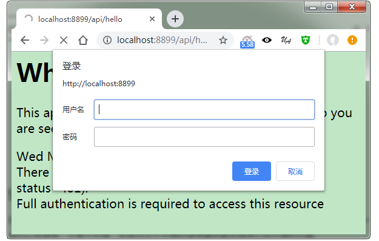
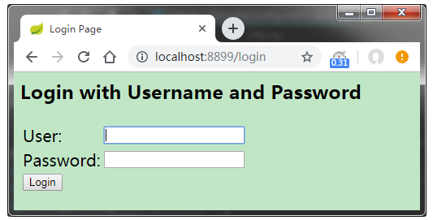
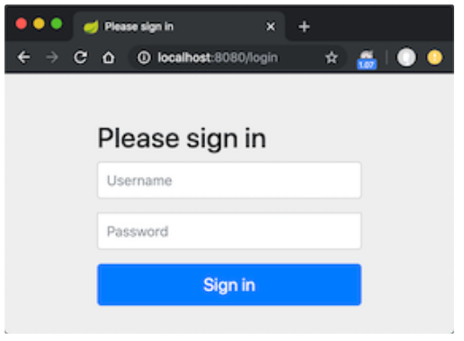
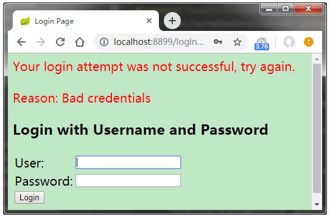
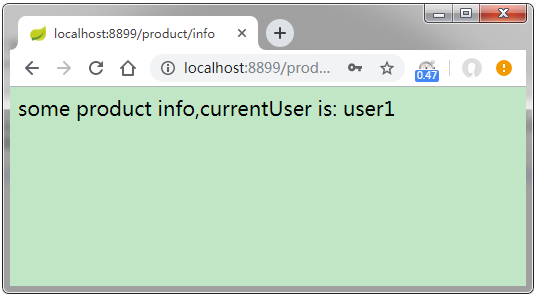

> 转载引用于[逃离沙漠](https://www.cnblogs.com/demingblog/p/10874753.html)的博文

## 前言
> 在web应用开发中，安全无疑是十分重要的，选择Spring Security来保护web应用是一个非常好的选择。Spring Security 是spring项目之中的一个安全模块，可以非常方便与spring项目无缝集成。特别是在spring boot项目中加入spring security更是十分简单。本篇我们介绍spring security，以及spring security在web应用中的使用。

## 从一个Spring Security的例子开始
* 创建不受保护的应用
假设我们现在创建好了一个springboot的web应用
```java
@Controller
public class AppController {

    @RequestMapping("/hello")
    @ResponseBody
    String home() {
        return "Hello ,spring security!";
    }
}
```

我们启动应用，假设端口是`8080`，那么当我们在浏览器访问`http://localhost:8080/hello`的时候可以在浏览器看到
`Hello ,spring security!。`

## 加入spring security 保护应用
此时，`/hello`是可以自由访问。假设，我们需要具有某个角色的用户才能访问的时候，我们可以引入`spring security`来进行保护。加入如下依赖，并重启应用：
```xml
<dependency>
    <groupId>org.springframework.boot</groupId>
    <artifactId>spring-boot-starter-security</artifactId>
</dependency>
```
再次访问`/hello`，我们可以得到一个`http-basic`的认证弹窗，如下：

说明`spring security`已经起作用了。如果我们点击取消，则会看到错误信息，如下所示：
`There was an unexpected error (type=Unauthorized, status=401).`
升级springboot到2.x之后，没有这个http-batic的弹窗了，这个后面说。

## 关闭security.basic ,使用form表单页面登录
我们在实际项目中不可能会使用，上面`http-basic`方式的弹窗来让用户完成登录，而是会有一个登录页面。所以，我们需要关闭`http-basic`的方式，关闭`http-basic`方式的认证弹窗的配置如下：
`security.basic.enabled=false`
`spring security` 默认提供了表单登录的功能。我们新建一个类`SecurityConfiguration`,并加入一些代码，如下所示：
```java
@Configuration
@EnableWebSecurity
public class SecurityConfiguration extends WebSecurityConfigurerAdapter {

	@Override
	protected void configure(HttpSecurity http) throws Exception {
		http
				.authorizeRequests()
				.anyRequest().authenticated()
				.and()
				.formLogin().and()
				.httpBasic();
	}
}
```
上面的代码其实就是 一种配置，`authorizeRequests()` 定义哪些URL需要被保护、哪些不需要被保护。 `formLogin()` 定义当需要用户登录时候，转到的登录页面。此时，我们并没有写登录页面，但是`spring security`默认提供了一个登录页面，以及登录控制器。

加完了上面的配置类之后，我们重启应用。然后继续访问`http://localhost:8080/hello`。会发现自动跳转到一个登录页面了，如下所示：

升级springboot到2.x之后，这个页面变漂亮了，是这样的：

这个页面是`spring security `提供的默认的登录页面，其中的html内容如下：
```html
<html><head><title>Login Page</title></head><body onload='document.f.username.focus();'>
<h3>Login with Username and Password</h3><form name='f' action='/login' method='POST'>
<table>
	<tr><td>User:</td><td><input type='text' name='username' value=''></td></tr>
	<tr><td>Password:</td><td><input type='password' name='password'/></td></tr>
	<tr><td colspan='2'><input name="submit" type="submit" value="Login"/></td></tr>
	<input name="_csrf" type="hidden" value="635780a5-6853-4fcd-ba14-77db85dbd8bd" />
</table>
</form></body></html>
```
我们可以发现，这里有个`form` 。`action="/login"`，这个`/login`依然是`spring security`提供的。`form`表单提交了三个数据：
* username 用户名
* password 密码
* _csrf CSRF保护方面的内容，暂时先不展开解释
为了登录系统，我们需要知道用户名密码，`spring security` 默认的用户名是`user`，`spring security`启动的时候会生成默认密码（在启动日志中可以看到）。本例，我们指定一个用户名密码，在配置文件中加入如下内容：
```properties
# security
security.basic.enabled=false
security.user.name=admin
security.user.password=admin
```
重启项目，访问被保护的`/hello`页面。自动跳转到了`spring security` 默认的登录页面，我们输入用户名`admin`密码`admin`。点击`Login`按钮。会发现登录成功并跳转到了`/hello`。除了登录，`spring security`还提供了`rememberMe`功能，这里不做过多解释。
>补充说明：`springboot2.x`之后，上面的配置`security.user.name`会提示错误`Deprecated configuration property 'security.user.password` ,因为`springboot2.x`之后，`spring security`升级了,删了一些配置，如果使用的旧的，需要迁移的话，可以参考[Spring-Boot-2.0-Migration-Guide](https://github.com/spring-projects/spring-boot/wiki/Spring-Boot-2.0-Migration-Guide#security)

## 角色-资源 访问控制
通常情况下，我们需要实现“特定资源只能由特定角色访问”的功能。假设我们的系统有如下两个角色：
* ADMIN 可以访问所有资源
* USER 只能访问特定资源
现在我们给系统增加`"/product"` 代表商品信息方面的资源（`USER`可以访问）；增加`"/admin"`代码管理员方面的资源（`USER`不能访问）。代码如下：
```java
@Controller
@RequestMapping("/product")
public class ProductTestController {

	@RequestMapping("/info")
	@ResponseBody
	public String productInfo(){
		return " some product info ";
	}
}
-------------------------------------------
@Controller
@RequestMapping("/admin")
public class AdminTestController {

	@RequestMapping("/home")
	@ResponseBody
	public String productInfo(){
		return " admin home page ";
	}
}
```
在正式的应用中，我们的用户和角色是保存在数据库中的；本例为了方便演示，我们来创建两个存放于内存的用户和角色。我们在上一步中创建的`SecurityConfiguration`中增加角色用户，如下代码：
```java
@Override
	protected void configure(AuthenticationManagerBuilder auth) throws Exception {
		auth
				.inMemoryAuthentication()
				.withUser("admin1") // 管理员，同事具有 ADMIN,USER权限，可以访问所有资源
					.password("admin1")
					.roles("ADMIN", "USER")
					.and()
				.withUser("user1").password("user1") // 普通用户，只能访问 /product/**
					.roles("USER");
	}
```
这里，我们增加了 管理员（`admin1`，密码`admin1`），以及普通用户（`user1`,密码`user1`）
> 补充说明：上面的代码是springboot1.x的，springboot2.x之后，上面的配置就得稍作调整了，否者会报错java.lang.IllegalArgumentException: There is no PasswordEncoder mapped for the id "null"

在springboot2.x的版本中上面的代码会调整成这样：
```java
@Override
	protected void configure(AuthenticationManagerBuilder auth) throws Exception {
		auth
				.inMemoryAuthentication()
				.withUser("admin1") // 管理员，同事具有 ADMIN,USER权限，可以访问所有资源
					.password("{noop}admin1")  //
					.roles("ADMIN", "USER")
					.and()
				.withUser("user1").password("{noop}user1") // 普通用户，只能访问 /product/**
					.roles("USER");
	}
```
变化的地方在：`.password("{noop}admin1")` 这里。
继续增加“链接-角色”控制配置，代码如下:
```java
	@Override
	protected void configure(HttpSecurity http) throws Exception {
		http
				.authorizeRequests()
				    .antMatchers("/product/**").hasRole("USER")
				    .antMatchers("/admin/**").hasRole("ADMIN")
				.anyRequest().authenticated()
				.and()
				.formLogin().and()
				.httpBasic();
	}
```
这个配置在上一步中登录配置的基础上增加了链接对应的角色配置。上面的配置，我们可以知道：
* 使用 user1 登录，只能访问/product/**
* 使用 admin1登录，可以访问所有。
下面来验证一下普通用户登录，重启项目，在浏览器中输入：`http://localhost:8080/admin/home`。同样，我们会到达登录页面，我们输入用户名`user1`,密码也为`user1` 结果错误页面了，拒绝访问了，信息为：
```
There was an unexpected error (type=Forbidden, status=403).
Access is denied
```
我们把浏览器中的uri修改成：`/product/info`，结果访问成功。可以看到`some product info`。说明 `user1`只能访问 `product/**` ,这个结果与我们预期一致。
再来验证一下管理员用户登录，重启浏览器之后，输入`http://localhost:8080/admin/home`。在登录页面中输入用户名`admin1`，密码`admin1`，提交之后，可以看到`admin home page`,说明访问管理员资源了。我们再将浏览器`uri`修改成`/product/info`,刷新之后，也能看到`some product info`,说明 `admin1`用户可以访问所有资源，这个也和我们的预期一致。

## 获取当前登录用户信息
上面我们实现了“资源 - 角色”的访问控制，效果和我们预期的一致，但是并不直观，我们不妨尝试在控制器中获取“当前登录用户”的信息，直接输出，看看效果。以`/product/info`为例，我们修改其代码，如下：
```java
@RequestMapping("/info")
	@ResponseBody
	public String productInfo(){
		String currentUser = "";
		Object principl = SecurityContextHolder.getContext().getAuthentication().getPrincipal();
		if(principl instanceof UserDetails) {
			currentUser = ((UserDetails)principl).getUsername();
		}else {
			currentUser = principl.toString();
		}
		return " some product info,currentUser is: "+currentUser;
	}
```
这里，我们通过`SecurityContextHolder`来获取了用户信息，并拼接成字符串输出。重启项目，在浏览器访问`http://localhost:8080/product/info`. 使用 `admin1`的身份登录，可以看到浏览器显示`some product info,currentUser is: admin1`.

## 小结
至此，我们已经对`spring security`有了一个基本的认识了。了解了如何在项目中加入`spring security`，以及如何控制资源的角色访问控制。`spring security`原不止这么简单，我们才刚刚开始。为了能够更好的在实战中使用`spring security` 我们需要更深入的了解。下面我们先来了解`spring security`的一些核心概念。

## Spring Security 核心组件
`spring security`核心组件有：
* SecurityContext
* SecurityContextHolder
* Authentication
* Userdetails
* AuthenticationManager
### SecurityContext
安全上下文，用户通过`Spring Security` 的校验之后，验证信息存储在`SecurityContext`中，`SecurityContext`的接口定义如下：
```java
public interface SecurityContext extends Serializable {
	/**
	 * Obtains the currently authenticated principal, or an authentication request token.
	 *
	 * @return the <code>Authentication</code> or <code>null</code> if no authentication
	 * information is available
	 */
	Authentication getAuthentication();

	/**
	 * Changes the currently authenticated principal, or removes the authentication
	 * information.
	 *
	 * @param authentication the new <code>Authentication</code> token, or
	 * <code>null</code> if no further authentication information should be stored
	 */
	void setAuthentication(Authentication authentication);
}
```
可以看到`SecurityContext`接口只定义了两个方法，实际上其主要作用就是获取`Authentication`对象。
### SecurityContextHolder
`SecurityContextHolder`看名知义，是一个`holder`,用来`hold`住`SecurityContext`实例的。在典型的`web`应用程序中，用户登录一次，然后由其会话`ID`标识。服务器缓存持续时间会话的主体信息。在`Spring Security`中，在请求之间存储`SecurityContext`的责任落在`SecurityContextPersistenceFilter`上，默认情况下，该上下文将上下文存储为`HTTP`请求之间的`HttpSession`属性。它会为每个请求恢复上下文`SecurityContextHolder`，并且最重要的是，在请求完成时清除`SecurityContextHolder`。`SecurityContextHolder`是一个类，他的功能方法都是静态的（`static`）。

`SecurityContextHolder`可以设置指定`JVM`策略（`SecurityContext`的存储策略），这个策略有三种：
* MODE_THREADLOCAL：SecurityContext 存储在线程中。
* MODE_INHERITABLETHREADLOCAL：SecurityContext 存储在线程中，但子线程可以获取到父线程中的 SecurityContext。
* MODE_GLOBAL：SecurityContext 在所有线程中都相同。
`SecurityContextHolder`默认使用`MODE_THREADLOCAL`模式，即存储在当前线程中。在`spring security`应用中，我们通常能看到类似如下的代码：
```java
SecurityContextHolder.getContext().setAuthentication(token);
```
其作用就是存储当前认证信息。

### Authentication
`authentication` 直译过来是“认证”的意思，在`Spring Security` 中`Authentication`用来表示当前用户是谁，一般来讲你可以理解为`authentication`就是一组用户名密码信息。`Authentication`也是一个接口，其定义如下：
```java
public interface Authentication extends Principal, Serializable {

	Collection<? extends GrantedAuthority> getAuthorities();
	Object getCredentials();
	Object getDetails();
	Object getPrincipal();
	boolean isAuthenticated();
	void setAuthenticated(boolean isAuthenticated) throws IllegalArgumentException;
}
```
接口有4个get方法，分别获取
* `Authorities`填充的是用户角色信息。
* `Credentials`直译，证书。填充的是密码。
* `Details`用户信息。
* `Principal`直译，形容词是“主要的，最重要的”，名词是“负责人，资本，本金”。感觉很别扭，所以，还是不翻译了，直接用原词`principal`来表示这个概念，其填充的是用户名。
因此可以推断其实现类有这4个属性。这几个方法作用如下：
* `getAuthorities`: 获取用户权限，一般情况下获取到的是用户的角色信息。
* `getCredentials`: 获取证明用户认证的信息，通常情况下获取到的是密码等信息。
* `getDetails`: 获取用户的额外信息，（这部分信息可以是我们的用户表中的信息）
* `getPrincipal`: 获取用户身份信息，在未认证的情况下获取到的是用户名，在已认证的情况下获取到的是 `UserDetails` (`UserDetails`也是一个接口，里边的方法有`getUsername`,`getPassword`等)。
* `isAuthenticated`: 获取当前 Authentication 是否已认证。
* `setAuthenticated`: 设置当前 Authentication 是否已认证（true or false）。

### UserDetails
UserDetails，看名知义，是用户信息的意思。其存储的就是用户信息，其定义如下：
```java
public interface UserDetails extends Serializable {

	Collection<? extends GrantedAuthority> getAuthorities();
	String getPassword();
	String getUsername();
	boolean isAccountNonExpired();
	boolean isAccountNonLocked();
	boolean isCredentialsNonExpired();
	boolean isEnabled();
}
```
* `getAuthorites`：获取用户权限，本质上是用户的角色信息。
* `getPassword`: 获取密码。
* `getUserName`: 获取用户名。
* `isAccountNonExpired`: 账户是否过期。
* `isAccountNonLocked`: 账户是否被锁定。
* `isCredentialsNonExpired`: 密码是否过期。
* `isEnabled`: 账户是否可用。

### UserDetailsService
提到了`UserDetails`就必须得提到`UserDetailsService`, `UserDetailsService`也是一个接口，且只有一个方法`loadUserByUsername`，他可以用来获取`UserDetails`。

通常在`spring security`应用中，我们会自定义一个`CustomUserDetailsService`来实现`UserDetailsService`接口，并实现其`public UserDetails loadUserByUsername(final String login);`方法。我们在实现`loadUserByUsername`方法的时候，就可以通过查询数据库（或者是缓存、或者是其他的存储形式）来获取用户信息，然后组装成一个`UserDetails`,(通常是一个`org.springframework.security.core.userdetails.User`，它继承自`UserDetails`) 并返回。

在实现`loadUserByUsername`方法的时候，如果我们通过查库没有查到相关记录，需要抛出一个异常来告诉`spring security`来“善后”。这个异常是`org.springframework.security.core.userdetails.UsernameNotFoundException`。

### AuthenticationManager
`AuthenticationManager` 是一个接口，它只有一个方法，接收参数为`Authentication`，其定义如下：
```java
public interface AuthenticationManager {
    Authentication authenticate(Authentication authentication)
			throws AuthenticationException;
}
```

`AuthenticationManager` 的作用就是校验`Authentication`,如果验证失败会抛出`AuthenticationException`异常。`AuthenticationException`是一个抽象类，因此代码逻辑并不能实例化一个`AuthenticationException`异常并抛出，实际上抛出的异常通常是其实现类，如`DisabledException`,`LockedException`,`BadCredentialsException`等。`BadCredentialsException`可能会比较常见，即密码错误的时候。

### 小结
这里，我们只是简单的了解了`spring security`中有哪些东西，先混个脸熟。这里并不需要我们一下子全记住这些名词和概念。先大概看看，有个印象。

## Spring Security的一些工作原理
在第一节中，我们通过在`pom`文件中增加`spring-boot-starter-security`依赖，便使得我们的项目受到了`spring security`保护，又通过增加`SecurityConfiguration`实现了一些安全配置，实现了链接资源的个性化访问控制。那么这是如何实现的呢？了解其原理，可以使我们使用起来得心应手。

### spring security 在web应用中是基于filter的
在`spring security`的官方文档中，我们可以看到这么一句话：
> Spring Security’s web infrastructure is based entirely on standard servlet filters.

我们可以得知，`spring security` 在`web`应用中是基于`filter`的。`filter`我们就很熟了，在没有`struts`,没有`spring mvc`之前，我们就是通过一个个`servlet`,一个个`filter`来实现业务功能的，通常我们会有多个`filter`，他们按序执行，一个执行完之后，调用`filterChain`中的下一个`doFilter`。`Spring Security` 在 `Filter` 中创建 `Authentication` 对象，并调用 `AuthenticationManager` 进行校验

`spring security` 维护了一个`filter chain`，`chain`中的每一个`filter`都具有特定的责任，并根据所需的服务在配置总添加。`filter`的顺序很重要，因为他们之间存在依赖关系。`spring securit`y中有如下`filter`(按顺序的):

* `ChannelProcessingFilter`,因为它可能需要重定向到不同的协议
* `SecurityContextPersistenceFilter`，可以在`web`请求开头的`SecurityContextHolder`中设置`SecurityContext`，并且`SecurityContext`的任何更改都可以复制到`HttpSession`当`web`请求结束时（准备好与下一个`web`请求一起使用）
* `ConcurrentSessionFilter`
* `身份验证处理-UsernamePasswordAuthenticationFilter`,`CasAuthenticationFilter`,`BasicAuthenticationFilter`等。以便`SecurityContextHolder`可以修改为包含有效的`Authentication`请求令牌
* `SecurityContextHolderAwareRequestFilter`
* `JaasApiIntegrationFilter`
* `RememberMeAuthenticationFilter`，记住我服务处理
* `AnonymousAuthenticationFilter`，匿名身份处理，更新`SecurityContextHolder`
* `ExceptionTranslationFilter`，获任何`Spring Security`异常，以便可以返回`HTTP`错误响应或启动适当的`AuthenticationEntryPoint`
* `FilterSecurityInterceptor`，用于保护`web URI`并在访问被拒绝时引发异常

这里我们列举了几乎所有的`spring security filter`。正是这些`filter`完成了`spring security`的各种功能。目前我们只是知道了有这些`filter`，并不清楚他们是怎么集成到应用中的。在继续深入了解之前，我们需要了解一下`DelegatingFilterProxy`。

### DelegatingFilterProxy
`DelegatingFilterProxy`是一个特殊的`filter`，存在于`spring-web`模块中。`DelegatingFilterProxy`通过继承`GenericFilterBean`使得自己变为了一个`Filter`（因为`GenericFilterBean implements Filter`）。它是一个`Filter`，其命名却以`proxy`结尾。非常有意思，为了了解其功能，我们看一下它的使用配置：
```xml
<filter>
    <filter-name>myFilter</filter-name>
    <filter-class>org.springframework.web.filter.DelegatingFilterProxy</filter-class>
</filter>
<filter-mapping>
    <filter-name>myFilter</filter-name>
    <url-pattern>/*</url-pattern>
</filter-mapping>
```
这个配置是我们使用`web.xml`配置`Filter`时做法。但是与普通的`Filter`不同的是`DelegatingFilterProxy`并没有实际的过滤逻辑，他会尝试寻找`filter-name`节点所配置的`myFilter`，并将过滤行为委托给`myFilter`来处理。这种方式能够利用`Spring`丰富的依赖注入工具和生命周期接口，因此`DelegatingFilterProxy`提供了`web.xml`与应用程序上下文之间的链接。非常有意思，可以慢慢体会。

### spring security入口——springSecurityFilterChain
`spring security`的入口`filter`就是`springSecurityFilterChain`。在没有`spring boot`之前，我们要使用`spring security`的话，通常在`web.xml`中添加如下配置：
```xml
  <filter>
       <filter-name>springSecurityFilterChain</filter-name>
       <filter-class>org.springframework.web.filter.DelegatingFilterProxy</filter-class>
   </filter>

   <filter-mapping>
       <filter-name>springSecurityFilterChain</filter-name>
       <url-pattern>/*</url-pattern>
   </filter-mapping>
```
看到没，这里配置的是`DelegatingFilterProxy`。有了上面的介绍之后，我们就知道，它实际上会去找到`filter-name`节点中的`Filter——springSecurityFilterChain`，并将实际的过滤工作交给`springSecurityFilterChain`处理。

在使用`spring boot`之后，这一`xml`配置被`Java`类配置给代替了。我们前面在代码种使用过`@EnableWebSecurity` 注解，通过跟踪源码可以发现`@EnableWebSecurity`会加载`WebSecurityConfiguration`类,而`WebSecurityConfiguration`类中就有创建`springSecurityFilterChain`这个`Filter`的代码：
```java
@Bean(name = {"springSecurityFilterChain"})
    public Filter springSecurityFilterChain() throws Exception {
        boolean hasConfigurers = this.webSecurityConfigurers != null && !this.webSecurityConfigurers.isEmpty();
        if (!hasConfigurers) {
            WebSecurityConfigurerAdapter adapter = (WebSecurityConfigurerAdapter)this.objectObjectPostProcessor.postProcess(new WebSecurityConfigurerAdapter() {
            });
            this.webSecurity.apply(adapter);
        }

        return (Filter)this.webSecurity.build();
    }
```
这里，我们介绍了`spring security`的入口——`springSecurityFilterChain`，也介绍了它的两种配置形式。但是，`springSecurityFilterChain`是谁，怎么起作用的，我们还不清楚，下面继续看。

### FilterChainProxy 和SecurityFilterChain
在spring的官方文档中，我们可以发现这么一句话：
> Spring Security’s web infrastructure should only be used by delegating to an instance of FilterChainProxy. The security filters should not be used by themselves.

>spring security 的web基础设施（上面介绍的那一堆filter）只能通过委托给FilterChainProxy实例的方式来使用。而不能直接使用那些安全filter。

这句话似乎透漏了一个信号，上面说的入口`springSecurityFilterChain`其实就是`FilterChainProxy`,如果不信，调试一下 代码也能发现，确实就是`FilterChainProxy`。它的全路径名称是`org.springframework.security.web.FilterChainProxy`。打开其源码，第一行注释是这样：

> Delegates {@code Filter} requests to a list of Spring-managed filter beans.

所以，没错了。它就是`DelegatingFilterProxy`要找的人，它就是`DelegatingFilterProxy`要委托过滤任务的人。下面贴出其部分代码：
```java
public class FilterChainProxy extends GenericFilterBean {

   private List<SecurityFilterChain> filterChains;//

   public FilterChainProxy(SecurityFilterChain chain) {
      this(Arrays.asList(chain));
   }

   public FilterChainProxy(List<SecurityFilterChain> filterChains) {
      this.filterChains = filterChains;
   }

   public void doFilter(ServletRequest request, ServletResponse response,
         FilterChain chain) throws IOException, ServletException {
         doFilterInternal(request, response, chain);
   }

   private void doFilterInternal(ServletRequest request, ServletResponse response,
         FilterChain chain) throws IOException, ServletException {

      FirewalledRequest fwRequest = firewall
            .getFirewalledRequest((HttpServletRequest) request);
      HttpServletResponse fwResponse = firewall
            .getFirewalledResponse((HttpServletResponse) response);

      List<Filter> filters = getFilters(fwRequest);

      if (filters == null || filters.size() == 0) {
         fwRequest.reset();
         chain.doFilter(fwRequest, fwResponse);
         return;
      }

      VirtualFilterChain vfc = new VirtualFilterChain(fwRequest, chain, filters);
      vfc.doFilter(fwRequest, fwResponse);
   }

   private List<Filter> getFilters(HttpServletRequest request) {
      for (SecurityFilterChain chain : filterChains) {
         if (chain.matches(request)) {
            return chain.getFilters();
         }
      }
      return null;
   }

}
```
可以看到，里边有个`SecurityFilterChain`的集合。这个才是众多`security filter`藏身之处，`doFilter`的时候会从`SecurityFilterChain`取出第一个匹配的`Filter`集合并返回。

### 小结
说到这里，可能有点模糊了。这里小结一下，梳理一下。
* `spring security` 的核心是基于`filter`
* 入口`filter`是`springSecurityFilterChain`(它会被`DelegatingFilterProxy`委托来执行过滤任务)
* `springSecurityFilterChain`实际上是`FilterChainProxy` （一个`filter`）
* `FilterChainProxy`里边有一个`SecurityFilterChain`集合，`doFIlter`的时候会从其中取。

到这里，思路清楚多了，现在还不知道`SecurityFilterChain`是怎么来的。下面介绍。

## 再说SecurityFilterChain

前面我们介绍了`springSecurityFilterChain`，它是由`xml`配置的，或者是由`@EnableWebSecurity`注解的作用下初始化的（`@Import({WebSecurityConfiguration.class）`）。具体是在`WebSecurityConfiguration`类中。上面我们贴过代码，你可以返回看，这里再次贴出删减版：
```java
 @Bean( name = {"springSecurityFilterChain"})
    public Filter springSecurityFilterChain() throws Exception {
        // 删除部分代码
        return (Filter)this.webSecurity.build();
    }
```

最后一行，发现`webSecurity.build()` 产生了`FilterChainProxy`。因此，推断`SecurityFilterChain`就是`webSecurity`里边弄的。贴出源码：
```java
public final class WebSecurity extends
      AbstractConfiguredSecurityBuilder<Filter, WebSecurity> implements
      SecurityBuilder<Filter>, ApplicationContextAware {

    @Override
	protected Filter performBuild() throws Exception {
		int chainSize = ignoredRequests.size() + securityFilterChainBuilders.size();
        // 我们要找的 securityFilterChains
		List<SecurityFilterChain> securityFilterChains = new ArrayList<SecurityFilterChain>(
				chainSize);
		for (RequestMatcher ignoredRequest : ignoredRequests) {
			securityFilterChains.add(new DefaultSecurityFilterChain(ignoredRequest));
		}
		for (SecurityBuilder<? extends SecurityFilterChain> securityFilterChainBuilder : securityFilterChainBuilders) {
			securityFilterChains.add(securityFilterChainBuilder.build());
		}
        // 创建 FilterChainProxy  ，传入securityFilterChains
		FilterChainProxy filterChainProxy = new FilterChainProxy(securityFilterChains);
		if (httpFirewall != null) {
			filterChainProxy.setFirewall(httpFirewall);
		}
		filterChainProxy.afterPropertiesSet();

		Filter result = filterChainProxy;
		postBuildAction.run();
		return result;
	}
}
```
---
至此，我们清楚了，`spring security` 是怎么在`spring web`应用中工作的了。具体的细节就是执行`filter`里的代码了，这里不再继续深入了。我们的目的是摸清楚他是怎么工作的，大致的脉路是怎样，目前整理的内容已经达到这个目的了。

## Spring Security 的一些实战

下面开始一些实战使用spring security 的实例。依然依托开篇的例子，并在此基础上调整。

### 通过数据库查询,存储用户和角色实现安全认证

开篇的例子中，我们使用了内存用户角色来演示登录认证。但是实际项目我们肯定是通过数据库完成的。实际项目中，我们可能会有3张表：用户表，角色表，用户角色关联表。当然，不同的系统会有不同的设计，不一定非得是这样的三张表。本例演示的意义在于：如果我们想在已有项目中增加`spring security`的话，就需要调整登录了。主要是自定义`UserDetailsService`,此外，可能还需要处理密码的问题，因为`spring`并不知道我们怎么加密用户登录密码的。这时，我们可能需要自定义`PasswordEncoder`，下面也会提到。.

### 添加spring-data-jpa , 创建数据表，并添加数据

继续完善开篇的项目，现在给项目添加`spring-data-jpa`，并使用`MySQL`数据库。因此在`POM`文件中加入如下配置：
```xml
<dependency>
    <groupId>org.springframework.boot</groupId>
    <artifactId>spring-boot-starter-data-jpa</artifactId>
</dependency>
<dependency>
    <groupId>mysql</groupId>
    <artifactId>mysql-connector-java</artifactId>
</dependency>
```

在`application.properties`文件中加入数据库连接信息：

```properties
spring.datasource.url=jdbc:mysql://localhost:3306/yourDB?useUnicode=true&characterEncoding=UTF-8
spring.datasource.username=dbuser
spring.datasource.password=******
spring.datasource.driver-class-name=com.mysql.jdbc.Driver
```
这里，为了简单方便演示，我们只创建一张表，字段如下：
```java
@Entity
public class User implements java.io.Serializable{

	@Id
	@Column
	private Long id;
	@Column
	private String login;
	@Column
	private String password;
	@Column
	private String role;
    // 省略get set 等
}
```
然后我们添加2条数据，如下：
id|login|password|role
:-|:-|:-|:-
1|user1|\$2a\$10\$PhynBxXaIYdBzd/OgXrKzeVr3Bj4fiDxdii14fMOVIwJTqoDoFL1e|USER
2|admin|\$2a\$10\$PhynBxXaIYdBzd/OgXrKzeVr3Bj4fiDxdii14fMOVIwJTqoDoFL1e|ADMIN

密码这里都是使用了`BCryptPasswordEncoder` 需在`SecurityConfiguration`中加入配置，后面会贴。

### 自定义UserDetailsService
前面我们提到过，`UserDetailsService`，`spring security`在认证过程中需要查找用户，会调用`UserDetailsService`的`loadUserByUsername`方法得到一个`UserDetails`，下面我们来实现他。代码如下：
```java
@Component("userDetailsService")
public class CustomUserDetailsService implements UserDetailsService {

	@Autowired
	UserRepository userRepository;

	@Override
	public UserDetails loadUserByUsername(String login) throws UsernameNotFoundException {
         // 1. 查询用户
		User userFromDatabase = userRepository.findOneByLogin(login);
		if (userFromDatabase == null) {
			//log.warn("User: {} not found", login);
		 throw new UsernameNotFoundException("User " + login + " was not found in db");
            //这里找不到必须抛异常
		}
	    // 2. 设置角色
		Collection<GrantedAuthority> grantedAuthorities = new ArrayList<>();
		GrantedAuthority grantedAuthority = new SimpleGrantedAuthority(userFromDatabase.getRole());
		grantedAuthorities.add(grantedAuthority);

		return new org.springframework.security.core.userdetails.User(login,
				userFromDatabase.getPassword(), grantedAuthorities);
	}
}
```

这个方法做了2件事情，查询用户以及设置角色，通常一个用户会有多个角色，即上面的`userFromDatabase.getRole()`通常是一个`list`，所以设置角色的时候，就是`for`循环`new` 多个`SimpleGrantedAuthority`并设置。（本例为了简单没有设置角色表以及用户角色关联表，只在用户中增加了一个角色字段，所以`grantedAuthorities`只有一个）

同时修改之前的`SecurityConfiguration`,加入`CustomUserDetailsServicebean`配置，如下：
```java
@Override
	protected void configure(AuthenticationManagerBuilder auth) throws Exception {
		auth.userDetailsService(userDetailsService)// 设置自定义的userDetailsService
				.passwordEncoder(passwordEncoder());
		/*auth
			.inMemoryAuthentication()
			.withUser("admin1")
				.password("admin1")
				.roles("ADMIN", "USER")
				.and()
			.withUser("user1").password("user1")
				.roles("USER");*/
	}

	@Bean
	public PasswordEncoder passwordEncoder() {
		return new BCryptPasswordEncoder();
	}
```

### 验证效果
上面我们自定义了`userDetailsService`,此时，`spring security` 在其作用流程中会调用，不出意外的话，重启系统，我们使用`user1`登录可以看到`/product/info`，但是不能看`/admin/home`。下面我们来重启项目验证一下。

先输入`user1`，以及错误密码，结果如下：


再输入user1 ，以及正确密码，结果如下：


再将浏览器链接修改为/admin/home，结果显示：
```text
There was an unexpected error (type=Forbidden, status=403).
Access is denied
```
这与我们的预期完全一致，至此，我们已经在项目中加入了`spring security`，并且能够通过查询数据库用户，角色信息交给`spring security`完成认证授权。

### spring security session 无状态
还记得我们开篇所举的例子吗？我们使用管理员账号密码登录之后，就可以访问`/admin/home`了，此时修改浏览器地址栏为`/product/info`之后刷新页面，仍然可以访问，说明认证状态被保持了；如果关闭浏览器重新输入`/admin/home`就会提示我们重新登录，这有点`session`的感觉。如果此时，我们将浏览器`cookie`禁用掉，你会发现登录之后自动跳转只会得到`403`，`403`是拒绝访问的意思，是没有权限的意思，说明这种情况下授权状态和`session`是挂钩的。即这时`spring security`使用了`session`。但是不是所有的系统都需要`session`，我们能让`spring security`不适用`session`吗？答案是可以！

使用`spring security` 我们可以准确控制`session`何时创建以及`Spring Security`如何与之交互：
* ***always*** – a session will always be created if one doesn’t already exist，没有session就创建。
* ***ifRequired*** – a session will be created only if required (default)，如果需要就创建（默认）。
* ***never*** – the framework will never create a session itself but it will use one if it already exists
* ***stateless*** – no session will be created or used by Spring Security 不创建不使用session

这里，我们要关注的是 ***stateless***，通常称为**无状态**的。为啥要关注这个 ***stateless无状态*** 的情况的呢？因为目前，我们的应用基本都是前后端分离的应用。比方说，你的一套`java api`是给`react`前端、安卓端、`IOS`端 调用的。这个时候你还提什么`session`啊，这时候我们需要的是无状态，通常以一种`token`的方式来交互。

`spring security` 配置`stateless` 的方式如下，依然是修改我们之前定义的`SecurityConfiguration`:
```java
http
    .sessionManagement()
    .sessionCreationPolicy(SessionCreationPolicy.STATELESS)
```

### 前后端分离应用中自定义token整合spring security
上面我们提到了`stateless`，实际中我们的前后端分离项目都是无状态的，并没有登录状态保持，服务器通过客户端调用传递的`token`来识别调用者是谁。
* 通常我们的系统流程是这样的：
  1. 客户端（`react`前端，`IOS`，安卓）调用“登录接口”获得一个包含`token`的响应（通常是个`JSON`，如 `{"token":"abcd","expires":1234567890}`）
  2. 客户端获取数据，并携带 `token`参数。
  3. 服务端根据`token`发现`token`过期/错误，返回"请登录"状态码
  4. 服务器发现`token`正常，并解析出来是`A`，返回`A`的数据。

如果我们想在`spring security`项目中使用自定义的`token`，那么我们需要思考下面的问题：

1. 怎么发`token`（即怎么登录？）
2. 发`token`怎么和`spring security`整合。
3. `spring security`怎么根据`token`得到授权认证信息。

下面从登录发`token`开始，这里需要使用到`UsernamePasswordAuthenticationToken`,以及`SecurityContextHolder`,代码如下：

```java
 @RequestMapping(value = "/authenticate",method = RequestMethod.POST)
    public Token authorize(@RequestParam String username, @RequestParam String password) {
        // 1 创建UsernamePasswordAuthenticationToken
        UsernamePasswordAuthenticationToken token
                           = new UsernamePasswordAuthenticationToken(username, password);
        // 2 认证
        Authentication authentication = this.authenticationManager.authenticate(token);
        // 3 保存认证信息
        SecurityContextHolder.getContext().setAuthentication(authentication);
        // 4 加载UserDetails
        UserDetails details = this.userDetailsService.loadUserByUsername(username);
        // 5 生成自定义token
        return tokenProvider.createToken(details);
    }
    @Inject
    private AuthenticationManager authenticationManager;
```

上面代码中1,2,3,4步骤都是和`spring security`交互的。只有第5步是我们自己定义的，这里`tokenProvider`就是我们系统中`token`的生成方式（这个完全是个性化的，通常是个加密串，通常可能会包含用户信息，过期时间等）。其中的`Token`也是我们自定义的返回对象，其中包含`token`信息类似`{"token":"abcd","expires":1234567890}`.

我们的`tokenProvider`通常至少具有两个方法，即：生成`token`，验证`token`。大致如下：

```java
public class TokenProvider {

    private final String secretKey;
    private final int tokenValidity;

    public TokenProvider(String secretKey, int tokenValidity) {
        this.secretKey = secretKey;
        this.tokenValidity = tokenValidity;
    }
   // 生成token
    public Token createToken(UserDetails userDetails) {
        long expires = System.currentTimeMillis() + 1000L * tokenValidity;
        String token =  computeSignature(userDetails, expires);
        return new Token(token, expires);
    }
    // 验证token
   public boolean validateToken(String authToken, UserDetails userDetails) {
        check token
        return true or false;
    }
     // 从token中识别用户
    public String getUserNameFromToken(String authToken) {
        // ……
        return login;
    }
    public String computeSignature(UserDetails userDetails, long expires) {
        // 一些特有的信息组装 ,并结合某种加密活摘要算法
        return 例如 something+"|"+something2+MD5(s);
    }

}
```

至此，我们客户端可以通过调用`http://host/context/authenticate`来获得一个`token`了，类似这样的：`{"token":"abcd","expires":1234567890}`。那么下次请求的时候，我们带上 `token=abcd`这个参数（或者也可以是自定义的请求头中）如何在`spring security`中复原`“session”`呢。我们需要一个`filter`：
```java
public class MyTokenFilter extends GenericFilterBean {

    private final Logger log = LoggerFactory.getLogger(XAuthTokenFilter.class);

    private final static String XAUTH_TOKEN_HEADER_NAME = "my-auth-token";

    private UserDetailsService detailsService;

    private TokenProvider tokenProvider;
    public XAuthTokenFilter(UserDetailsService detailsService, TokenProvider tokenProvider) {
        this.detailsService = detailsService;
        this.tokenProvider = tokenProvider;
    }

    @Override
    public void doFilter(ServletRequest servletRequest, ServletResponse servletResponse, FilterChain filterChain) throws IOException, ServletException {
        try {
            HttpServletRequest httpServletRequest = (HttpServletRequest) servletRequest;
            String authToken = httpServletRequest.getHeader(XAUTH_TOKEN_HEADER_NAME);
            if (StringUtils.hasText(authToken)) {
               // 从自定义tokenProvider中解析用户
                String username = this.tokenProvider.getUserNameFromToken(authToken);
                // 这里仍然是调用我们自定义的UserDetailsService，查库，检查用户名是否存在，
                // 如果是伪造的token,可能DB中就找不到username这个人了，抛出异常，认证失败
                UserDetails details = this.detailsService.loadUserByUsername(username);
                if (this.tokenProvider.validateToken(authToken, details)) {
                    log.debug(" validateToken ok...");
                    UsernamePasswordAuthenticationToken token = new UsernamePasswordAuthenticationToken(details, details.getPassword(), details.getAuthorities());
                    // 这里还是上面见过的，存放认证信息，如果没有走这一步，下面的doFilter就会提示登录了
                    SecurityContextHolder.getContext().setAuthentication(token);
                }
            }
            // 调用后续的Filter,如果上面的代码逻辑未能复原“session”，SecurityContext中没有想过信息，后面的流程会检测出"需要登录"
            filterChain.doFilter(servletRequest, servletResponse);
        } catch (Exception ex) {
            throw new RuntimeException(ex);
        }
    }
}
```
---

目前为止，我们实现了自定义的`token`生成类，以及通过一个`filter`来拦截客户端请求，解析其中的`token`，复原无状态下的`"session"`，让当前请求处理线程中具有认证授权数据，后面的业务逻辑才能执行。下面，我们需要将自定义的内容整合到`spring security`中。

首先编写一个类，继承`SecurityConfigurerAdapter`:
```java
public class MyAuthTokenConfigurer extends SecurityConfigurerAdapter<DefaultSecurityFilterChain, HttpSecurity> {

    private TokenProvider tokenProvider;  // 我们之前自定义的 token功能类
    private UserDetailsService detailsService;// 也是我实现的UserDetailsService

    public MyAuthTokenConfigurer(UserDetailsService detailsService, TokenProvider tokenProvider) {
        this.detailsService = detailsService;
        this.tokenProvider = tokenProvider;
    }

    @Override
    public void configure(HttpSecurity http) throws Exception {
        MyAuthTokenFilter customFilter = new MyAuthTokenFilter(detailsService, tokenProvider);
        http.addFilterBefore(customFilter, UsernamePasswordAuthenticationFilter.class);
    }
}
```

在 `SecurityConfiguration` 配置类中加入如下内容：

```java
 // 增加方法
    private MyAuthTokenConfigurer securityConfigurerAdapter() {
      return new MyAuthTokenConfigurer(userDetailsService, tokenProvider);
    }
    // 依赖注入
    @Inject
    private UserDetailsService userDetailsService;

    @Inject
    private TokenProvider tokenProvider;

     //方法修改 ， 增加securityConfigurerAdapter
     @Override
	protected void configure(HttpSecurity http) throws Exception {
		http
				.authorizeRequests()
				.anyRequest().authenticated()
                  // .... 其他配置
				.and()
                 .apply(securityConfigurerAdapter());// 这里增加securityConfigurerAdapter

	}
```
至此我们就完成了无状态应用中`token`认证结合`spring security`。
### 总结
本篇内容，我们通过一个小例子开始介绍了如何给`web`应用引入`spring security`保护；在展示了`http-basic`验证之后，我们使用了内存用户实验了“角色-资源”访问控制；然后我们介绍了`spring security`的一些核心概念；之后我们介绍了`spring security` 是通过`filter`的形式在`web`应用中发生作用的，并列举了`filter`列表，介绍了入口`filter`，介绍了`springboot`是如何载入`spring security`入口`filter`的。最后我们通过两个实战中的例子展示了`spring security`的使用。
