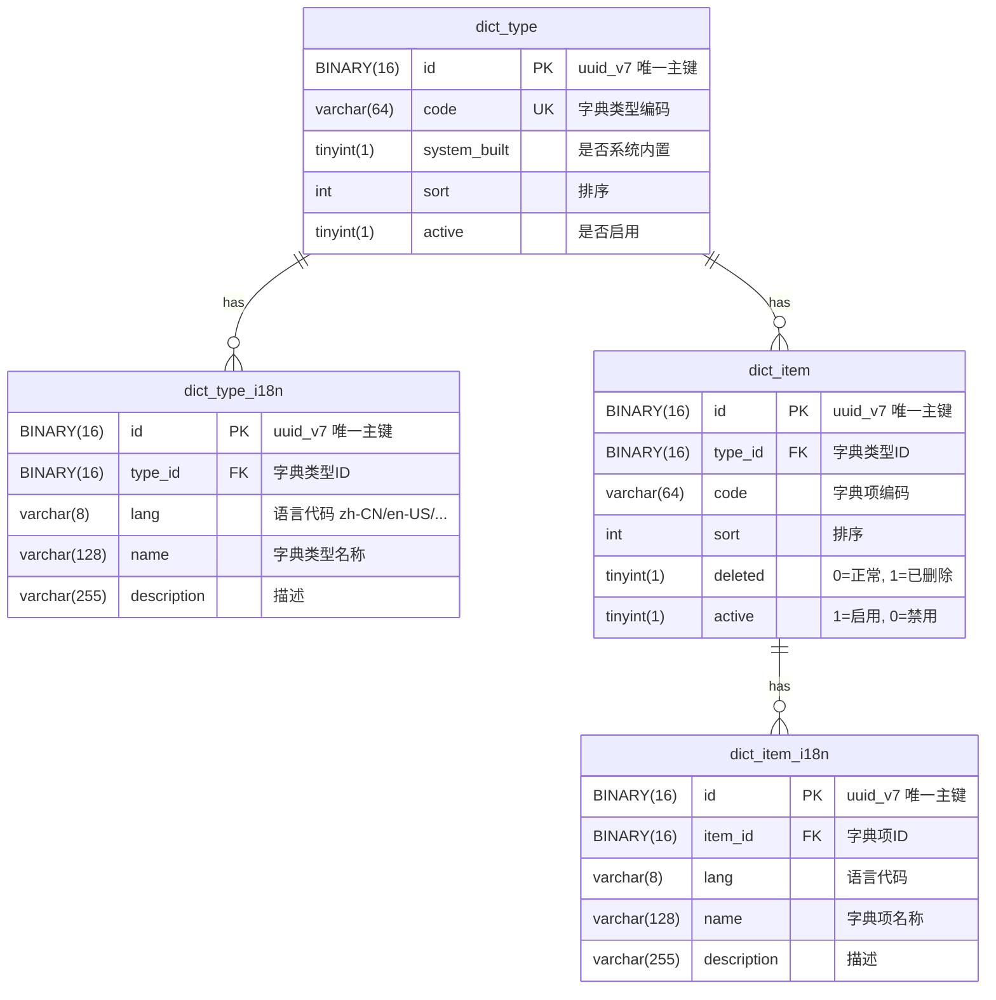
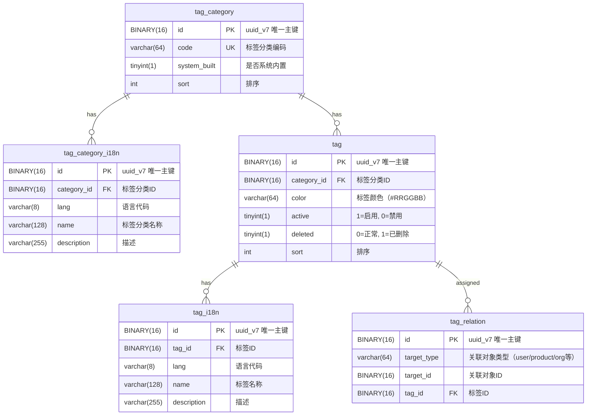

## 前言

- 市面上的各种开发框架太多太杂，不好用，所以自己开发一个符合自己习惯的中台微服务体系，致力于一次开发终身使用。

### 数据库结构
1. 字典模块


2. 标签模块


```apidesign
API: 获取字典列表
PATH: /dict-type/list
METHOD: GET

REQUEST object
  size int required >0 <100 '分页大小'
  offset int required >0 '偏移值'
  sort asc|desc '排序方式'
  names List<string> '排序字段'

RESPONSE list
  name string '字典名称'
  type string '字典类型'
  code string '字典编码'
```

