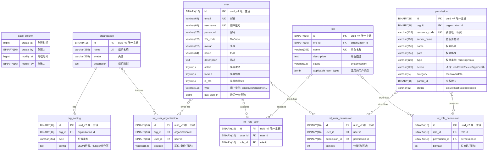

## 前言

- 市面上的各种开发框架太多太杂，不好用，所以自己开发一个符合自己习惯的中台微服务体系，致力于一次开发终身使用。

### 数据库结构

- 设计思路满足一下需求：

1. 任何系统都能嵌入这个微服务开箱使用
2. 自带网关面板可开箱使用，可选择关闭

```mermaid
erDiagram
  %% 公共列
  base_column {
    bigint create_at "创建时间"
    BINARY(16) create_by "创建人"
    bigint modify_at "修改时间"
    BINARY(16) modify_by "修改人"
  }

  organization {
    BINARY(16) id PK "uuid_v7 唯一主键"
    varchar(255) name UK "组织名称"
    varchar(255) avatar "头像"
    text description "组织描述"
  }

  org_setting {
    BINARY(16) id PK "uuid_v7 唯一主键"
    BINARY(16) org_id FK "organization id"
    varchar(255) type "配置类型"
    text config "JSON配置，如logo/颜色等"
  }

  rel_user_organization {
    BINARY(16) id PK "uuid_v7 唯一主键"
    BINARY(16) org_id FK "organization id"
    BINARY(16) user_id FK "user id"
    varchar(64) position "职位/身份(可选)"
  }

  user {
    BINARY(16) id PK "uuid_v7 唯一主键"
    varchar(64) email UK "邮箱"
    varchar(64) username UK "用户账号"
    varchar(255) password "密码"
    varchar(255) f2a_code "f2aCode"
    varchar(255) avatar "头像"
    varchar(64) name "名称"
    text description "描述"
    tinyint(1) active "是否激活"
    tinyint(1) locked "是否锁定"
    tinyint(1) is_f2a "是否启用f2a"
    varchar(128) type "用户类型: employee/customer/..."
    bigint last_sign_in "最后一次登陆"
  }

  role {
    BINARY(16) id PK "uuid_v7 唯一主键"
    BINARY(16) org_id FK "organization id"
    varchar(255) name UK "角色名称"
    text description "角色描述"
    varchar(32) scope "system/tenant"
    jsonb applicable_user_types "适用的用户类型"
  }

  permission {
    BINARY(16) id PK "uuid_v7 唯一主键"
    BINARY(16) org_id FK "organization id"
    varchar(128) resource_code UK "资源唯一标识"
    varchar(255) server_name "微服务名称"
    varchar(255) name "权限名称"
    varchar(255) path "权限路径"
    varchar(128) type "权限类型: route/api/data"
    varchar(128) action "动作: read/write/delete/approve等"
    varchar(64) category "menu/api/data"
    BINARY(16) parent_id "父权限ID"
    varchar(32) status "active/inactive/deprecated"
  }

  rel_role_user {
    BINARY(16) id PK "uuid_v7 唯一主键"
    BINARY(16) user_id FK "user id"
    BINARY(16) role_id FK "role id"
  }

  rel_role_permission {
    BINARY(16) id PK "uuid_v7 唯一主键"
    BINARY(16) role_id FK "role id"
    BINARY(16) permission_id FK "permission id"
    int bitmask "位掩码(可选)"
  }

  rel_user_permission {
    BINARY(16) id PK "uuid_v7 唯一主键"
    BINARY(16) user_id FK "user id"
    BINARY(16) permission_id FK "permission id"
    int bitmask "位掩码(可选)"
  }

  %% 关系
  organization ||--o{ org_setting : "has"
  organization }o--o{ rel_user_organization : "has-has"
  user }o--o{ rel_user_organization : "owns-has"
  user }o--o{ rel_role_user : "assigned"
  role }o--o{ rel_role_user : "assigned"
  role }o--o{ rel_role_permission : "owns-has"
  permission }o--o{ rel_role_permission : "owns-has"
  user }o--o{ rel_user_permission : "direct-has"
  permission }o--o{ rel_user_permission : "direct-has"
```
