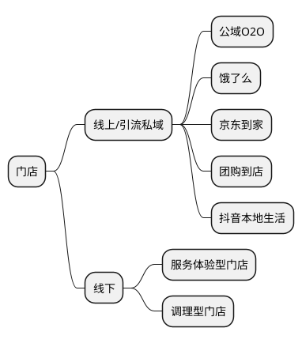
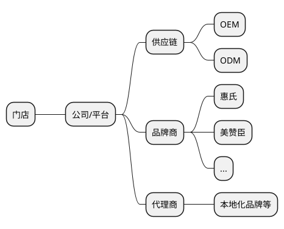

### 新零售1+5模式

```plantuml
@startmindmap
+ 门店
++ 线上/引流私域
+++ 公域O2O
+++ 饿了么
+++ 京东到家
+++ 团购到店
+++ 抖音本地生活
++ 线下
+++ 服务体验型门店
+++ 调理型门店
@endmindmap
```

### 公司整体模型
* 公司定位是平台公司, 整合资源
  中台后运营, 线上线下的代运营,
  城市合伙人计划

```plantuml
@startmindmap
+ 公司/平台
++ 供应链
+++ OEM
+++ ODM
++ 品牌商
+++ 惠氏
+++ 美赞臣
+++ ...
++ 代理商
+++ 本地化品牌等
-- 门店
@endmindmap
```
# O2O

1. 团队2人
2. 培训, 内部运营/门店培训
3. 系统, 商品 ERP ---- 美团/京东到家等 平台接口
  财务分账系统
4. 样板店+探店