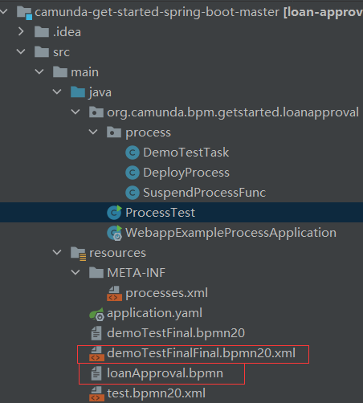

## camunda
* 工作流对比以及前置知识介绍，专业术语引用参考上篇文档[工作流引擎对比](./工作流引擎对比.md)

## 使用目标
* camunda 本就是一个完整的工作流引擎平台，我不需要他作为平台的功能，使用时候只需要它的工作流的壳子，当作工作流壳子来使用，所有的一些操作都经由我第三方服务或者其它来处理。

## 集成使用
* 可参考官方给出的例子: [camunda-get-started-spring-boot](https://github.com/camunda/camunda-get-started-spring-boot/)

1. 引包
```xml
    <dependency>
      <groupId>org.camunda.bpm.springboot</groupId>
      <artifactId>camunda-bpm-spring-boot-starter-webapp</artifactId>
      <version>${camunda.spring-boot.version}</version>
    </dependency>
```

2. 注解
```java
@EnableProcessApplication
```
3. 完事儿

## 制作工作流
### 可视化引擎
#### [camunda-modeler](https://github.com/camunda/camunda-modeler)
* 官方提供的客户端，好处可以搭配官方平台实时发布流程，可以绑定较为详细的方法，流程类，绑定平台中已有的用户做审核

#### [camunda-bpmn-js](https://github.com/camunda/camunda-bpmn-js)
* 看到camunda官方Git下有这么个项目，应该是基于 bpmn-js 适配改造而来的，没用过具体。估计可能是通过增加了可配置方法，调用类，变量值跳转的可视化配置界面吧

#### [bpmn-js](https://bpmn.io/)
* 基于 bpmn 规范制作的可视化 JS。只支持画流程并不支持 camunda 中的注入变量，调用方法类之类的配置项
* 目前我画的流程是基于这个可视化来画的

### 代码编辑工作流
* 不多说，直接上代码，这个用的应该比较少，需要用的画复制例子，贴到环境里面去，再找到camunda 所提供的，绘制源码慢慢进行绘制。
* 缺点：画出来的流程导入到可视化界面后，排版不够美观，甚至排版没办法看
```java
public class ProcessTest {
    public static void main(String[] args) {
        BpmnModelInstance modelInstance = Bpmn.createExecutableProcess()
                .startEvent()
                .userTask()
                .id("question")
                .exclusiveGateway("bk")
                .name("Everything fine?")
                .condition("no", "#{!fine}")
                .userTask()
                .connectTo("question")
                .moveToNode("bk")
                .condition("yes", "#{fine}")
                .userTask()
                .endEvent()
                .done();
        File outputFile = new File("C:\\Users\\yozor\\Documents\\camunda-get-started-spring-boot-master\\src\\main\\resources\\test.bpmn20.xml");
        Bpmn.writeModelToFile(outputFile, modelInstance);
    }
}
```

## camunda 使用
### camunda platform使用
* 纯英文界面，界面简洁易懂，学位英语都过不了的我，多把玩几边也能玩懂来。
* 我这里并不使用camunda 平台界面控制查看流程，只是当作工作流程壳子来使用，就不多说了

### 工作流提交
#### 插件提交
[camunda-modeler](https://github.com/camunda/camunda-modeler)编写完填写地址上传，即可，大部分关于camunda的使用文章都会提到，平台端也不是我讲的重点，不过多赘述

#### 代码提交
##### 字符串提交
```java
// 字符串发布 s1则为xml格式字符串
Deployment deploy = repositoryService.createDeployment().addString("demo1.bpmn20.xml", s1).deploy();
```

##### 文件提交
```java
// 文件发布 其中param 是文件的路径信息
Deployment deploy = repositoryService.createDeployment().addInputStream("bpmnProcessId",new FileInputStream(param)).deploy();
```

##### 压缩文件发布
```java
@Autowired
private RepositoryService repositoryService;

@Override
public void publish(ZipInputStream zipInputStream) {
    Deployment deployment = repositoryService.createDeployment().addZipInputStream(zipInputStream).deploy();
}
```
* 压缩文件发布

##### 自动发布

* 只要流程文件后缀为bpmn20.xml 或者 bpmn 即可，集成后camunda 启动的时候会自动扫描这个路径下的文件进行流程上传。

##### 发布坑
1. 文件形式 文件必须以bpmn20.xml结尾
2. 字符串形式 没有什么过多要求 名称必须是bpmn内的名称统一

#### 流程运行
##### 流程启动
###### 平台启动
* 可以在camunda自带平台启动工作流，进界面点点就能启动了不过多赘述

###### 代码启动
```java
// 不带全局变量启动
ProcessInstance processInstance = runtimeService.startProcessInstanceById("your_processID");
// 其中后面的 params 是流程中的全局变量
ProcessInstance processInstance = runtimeService.startProcessInstanceById("your_processID", params);
```

##### 流程调用方法
1. 这里的类是Spring容器中的类名 加上具体的方法名称即可，而且可以添加参数，这里的参数就是全局参数
```xml
<bpmn:userTask id=“usertask_1” name=“usertask111” camunda:assignee="#{demoTask.fun1(s1)}">
<bpmn:incoming>Flow_0u8v6zi</bpmn:incoming>
<bpmn:outgoing>Flow_1cjr3j9</bpmn:outgoing>
</bpmn:userTask>
```
```java
@Component
public class DemoTask {
    public String fun1(String s1) {
        System.out.println("fun1 run " + s1);
        return s1;
    }
}
```

##### 调用外部任务
* 调用方法有局限性不方便，调用外部任务泛用性更强，通过实现camunda内置的一个接口来实现
```xml
<bpmn:serviceTask id=“serviceTask_1” camunda:class=“com.xiangfu.core.workflow.DemoTask”>
<bpmn:incoming>Flow_136z0w9</bpmn:incoming>
<bpmn:outgoing>Flow_0d7jz10</bpmn:outgoing>
</bpmn:serviceTask>
```
```java
@Component
public class DemoTask implements JavaDelegate, Serializable {

    @Autowired
    private HttpClientUtil httpClientUtil;

    public String fun1(String s1) {
        System.out.println("fun1 run " + s1);
        return s1;
    }

    public void fun2(String s2) {
        System.out.println("fun2 run " + s2);
    }

    @Override
    public void execute(DelegateExecution execution) throws Exception {
        DemoParam s1 = (DemoParam)execution.getVariable("s1");
        ResponseEntity<String> stringResponseEntity = httpClientUtil.postRequest("", "application/json", null, null);
        System.out.println(stringResponseEntity);
        s1.setName(stringResponseEntity.toString());

        execution.setVariable("1", true);
    }
}


@Component
public class DemoTask2 implements JavaDelegate, Serializable {

    public String fun1(String s1) {
        System.out.println("fun1 run " + s1);
        return s1;
    }

    public void fun2(String s2) {
        System.out.println("fun2 run " + s2);
    }

    @Override
    public void execute(DelegateExecution execution) throws Exception {
        DemoParam s1 = (DemoParam)execution.getVariable("s1");
        System.out.println("----s1=" + s1);
    }
}
```
* 在demo2中我通过全局变量信息取到了这个设置的信息
说的大一点就是可以在运行中 两个节点之间传递各自的信息，当然肯定是后面的节点拿前面节点的信息

##### 流程挂起/暂停
```java
@Test
public void suspend(){
    String processInstanceId = "62dc671f-aae7-11ea-865e-000ec6dd34b8";
    runtimeService.suspendProcessInstanceById(processInstanceId);
    System.out.println("暂停/挂起成功");
}
```

##### 流程激活
```java
@Test
public void active(){
    String processInstanceId = "62dc671f-aae7-11ea-865e-000ec6dd34b8";
    runtimeService.activateProcessInstanceById(processInstanceId);
    System.out.println("激活成功");
}
```
* 其它激活流程方法
```java
// 更新流程实例的状态为挂起或者激活
runtimeService.updateProcessInstanceSuspensionState()
    			.byProcessInstanceId(processInstanceId)
//                .byProcessDefinitionKey(processDefinitionKey)
//                .byProcessDefinitionId(processDefinitionId)
    			.suspend();
//                .activate();
```
* 流程激活后会自动暂停在当前节点，还需要通过审批，启动它自动执行剩下流程

##### 流程审批
* 这里是拿到processId代办流程然后，进行审批
```java
@Autowired
    TaskService taskService;

    public void suspendProcess() {
        List<Task> list = taskService.createTaskQuery().processInstanceId("processId").active().list();
        list.forEach(s -> {
            taskService.complete(s.getId());
        });
    }
```

### 例子
#### bpmn.xml
* 这是一个自动化的比较复杂的流程
```xml
<?xml version="1.0" encoding="UTF-8"?>
<definitions xmlns:bpmndi="http://www.omg.org/spec/BPMN/20100524/DI"
             xmlns:omgdi="http://www.omg.org/spec/DD/20100524/DI" xmlns:omgdc="http://www.omg.org/spec/DD/20100524/DC"
             xmlns="http://www.omg.org/spec/BPMN/20100524/MODEL" xmlns:xsi="http://www.w3.org/2001/XMLSchema-instance"
             xmlns:camunda="http://camunda.org/schema/1.0/bpmn" id="sid-38422fae-e03e-43a3-bef4-bd33b32041b2"
             targetNamespace="http://www.omg.org/spec/BPMN/20100524/MODEL" exporter="bpmn-js (https://demo.bpmn.io)"
             exporterVersion="8.8.3">
    <process id="demoFlow" name="Demo Flow" isExecutable="true">
        <startEvent id="Event_0f2uh41">
            <outgoing>Flow_0rvbmxj</outgoing>
        </startEvent>
        <sequenceFlow id="Flow_0rvbmxj" sourceRef="Event_0f2uh41" targetRef="Activity_0n7ofte"/>
        <exclusiveGateway id="Gateway_0ntwyah" name="是否匹配">
            <incoming>Flow_02fwdf2</incoming>
            <outgoing>Flow_05jln32</outgoing>
            <outgoing>Flow_0miseyo</outgoing>
        </exclusiveGateway>
        <sequenceFlow id="Flow_02fwdf2" sourceRef="Activity_1sklm81" targetRef="Gateway_0ntwyah"/>
        <sequenceFlow id="Flow_05jln32" name="N" sourceRef="Gateway_0ntwyah" targetRef="Event_0hg16az">
            <conditionExpression>#{!fine}</conditionExpression>
        </sequenceFlow>
        <sequenceFlow id="Flow_0miseyo" name="Y" sourceRef="Gateway_0ntwyah" targetRef="Activity_1tpt3r1">
            <conditionExpression>#{fine}</conditionExpression>
        </sequenceFlow>
        <exclusiveGateway id="Gateway_0ha6pgx">
            <incoming>Flow_04jek4d</incoming>
            <outgoing>Flow_0g7wmk5</outgoing>
            <outgoing>Flow_01oixt1</outgoing>
        </exclusiveGateway>
        <sequenceFlow id="Flow_0g7wmk5" name="Y" sourceRef="Gateway_0ha6pgx" targetRef="Activity_0jzd4nm">
            <conditionExpression>#{fine}</conditionExpression>
        </sequenceFlow>
        <exclusiveGateway id="Gateway_0nhsqhz">
            <incoming>Flow_0iw7qzt</incoming>
            <outgoing>Flow_0khts8d</outgoing>
            <outgoing>Flow_1t6coil</outgoing>
        </exclusiveGateway>
        <sequenceFlow id="Flow_0yxg5it" name="Y" sourceRef="Gateway_1q187mv" targetRef="Activity_0ojz0nh">
            <conditionExpression>#{fine}</conditionExpression>
        </sequenceFlow>
        <exclusiveGateway id="Gateway_1q187mv" name="是否拉片">
            <incoming>Flow_1qey0yg</incoming>
            <outgoing>Flow_0yxg5it</outgoing>
            <outgoing>Flow_1n5z3pp</outgoing>
        </exclusiveGateway>
        <sequenceFlow id="Flow_1n5z3pp" name="N" sourceRef="Gateway_1q187mv" targetRef="Activity_0gqb5oz">
            <conditionExpression>#{!fine}</conditionExpression>
        </sequenceFlow>
        <sequenceFlow id="Flow_0khts8d" name="Y" sourceRef="Gateway_0nhsqhz" targetRef="Activity_1tsssuh">
            <conditionExpression>#{fine}</conditionExpression>
        </sequenceFlow>
        <exclusiveGateway id="Gateway_01vddxu">
            <incoming>Flow_12i9zr7</incoming>
            <outgoing>Flow_03rbp74</outgoing>
            <outgoing>Flow_0zwpmr9</outgoing>
        </exclusiveGateway>
        <sequenceFlow id="Flow_00999e7" sourceRef="Activity_1tsssuh" targetRef="Activity_0cwdb2w"/>
        <exclusiveGateway id="Gateway_1cdknkl" name="审核是否通过">
            <incoming>Flow_0nmy8o9</incoming>
            <outgoing>Flow_0v67i61</outgoing>
            <outgoing>Flow_14y4k00</outgoing>
        </exclusiveGateway>
        <sequenceFlow id="Flow_0nmy8o9" sourceRef="Activity_0cwdb2w" targetRef="Gateway_1cdknkl"/>
        <sequenceFlow id="Flow_0v67i61" name="N" sourceRef="Gateway_1cdknkl" targetRef="Event_0hg16az">
            <conditionExpression>#{!fine}</conditionExpression>
        </sequenceFlow>
        <sequenceFlow id="Flow_03rbp74" name="N" sourceRef="Gateway_01vddxu" targetRef="Activity_0wbgks3">
            <conditionExpression>#{!fine}</conditionExpression>
        </sequenceFlow>
        <exclusiveGateway id="Gateway_0dt7u7g">
            <incoming>Flow_1k6d830</incoming>
            <outgoing>Flow_1hx6hww</outgoing>
            <outgoing>Flow_04o5883</outgoing>
        </exclusiveGateway>
        <sequenceFlow id="Flow_1k6d830" sourceRef="Activity_0wbgks3" targetRef="Gateway_0dt7u7g"/>
        <sequenceFlow id="Flow_1hx6hww" name="N" sourceRef="Gateway_0dt7u7g" targetRef="Activity_0wbgks3">
            <conditionExpression>#{!fine}</conditionExpression>
        </sequenceFlow>
        <exclusiveGateway id="Gateway_1go0zti">
            <incoming>Flow_04nxz3l</incoming>
            <outgoing>Flow_117lsbs</outgoing>
            <outgoing>Flow_0wv6oyp</outgoing>
        </exclusiveGateway>
        <sequenceFlow id="Flow_117lsbs" name="N" sourceRef="Gateway_1go0zti" targetRef="Activity_14vl3tr">
            <conditionExpression>#{!fine}</conditionExpression>
        </sequenceFlow>
        <sequenceFlow id="Flow_0zms5n6" sourceRef="Activity_1w64np1" targetRef="Activity_1pohoxs"/>
        <sequenceFlow id="Flow_0iqadv8" sourceRef="Activity_14vl3tr" targetRef="Activity_1pohoxs"/>
        <sequenceFlow id="Flow_0fjrscb" sourceRef="Activity_1pohoxs" targetRef="Activity_173qd34"/>
        <endEvent id="Event_0hg16az">
            <incoming>Flow_0l8u7d2</incoming>
            <incoming>Flow_0mbve9m</incoming>
            <incoming>Flow_0g532j2</incoming>
            <incoming>Flow_05jp5ug</incoming>
            <incoming>Flow_0v67i61</incoming>
            <incoming>Flow_05jln32</incoming>
            <incoming>Flow_1d2upeo</incoming>
            <incoming>Flow_0k0vrax</incoming>
        </endEvent>
        <sequenceFlow id="Flow_0l8u7d2" sourceRef="Activity_173qd34" targetRef="Event_0hg16az"/>
        <exclusiveGateway id="Gateway_0j31vrm" name="是否智审">
            <incoming>Flow_1erygfc</incoming>
            <outgoing>Flow_0k1xd2f</outgoing>
            <outgoing>Flow_1532o6a</outgoing>
        </exclusiveGateway>
        <exclusiveGateway id="Gateway_1p3nicx">
            <incoming>Flow_1pxfzah</incoming>
            <outgoing>Flow_0ebecyj</outgoing>
            <outgoing>Flow_1d2upeo</outgoing>
        </exclusiveGateway>
        <exclusiveGateway id="Gateway_0xcdii0">
            <incoming>Flow_10tet6t</incoming>
            <outgoing>Flow_05jp5ug</outgoing>
            <outgoing>Flow_0mehlyk</outgoing>
        </exclusiveGateway>
        <sequenceFlow id="Flow_1erygfc" sourceRef="Activity_14ru7u1" targetRef="Gateway_0j31vrm"/>
        <sequenceFlow id="Flow_0k1xd2f" name="N" sourceRef="Gateway_0j31vrm" targetRef="Activity_0zuwlwx">
            <conditionExpression>#{!fine}</conditionExpression>
        </sequenceFlow>
        <sequenceFlow id="Flow_1532o6a" name="Y" sourceRef="Gateway_0j31vrm" targetRef="Activity_0hzvdt6">
            <conditionExpression>#{fine}</conditionExpression>
        </sequenceFlow>
        <sequenceFlow id="Flow_10tet6t" sourceRef="Activity_1pu4oms" targetRef="Gateway_0xcdii0"/>
        <sequenceFlow id="Flow_0ujskvh" sourceRef="Activity_0hzvdt6" targetRef="Activity_1pu4oms"/>
        <sequenceFlow id="Flow_04o5883" name="Y" sourceRef="Gateway_0dt7u7g" targetRef="Activity_14ru7u1">
            <conditionExpression>#{fine}</conditionExpression>
        </sequenceFlow>
        <sequenceFlow id="Flow_0zwpmr9" name="Y" sourceRef="Gateway_01vddxu" targetRef="Activity_14ru7u1">
            <conditionExpression>#{fine}</conditionExpression>
        </sequenceFlow>
        <sequenceFlow id="Flow_05jp5ug" name="N" sourceRef="Gateway_0xcdii0" targetRef="Event_0hg16az">
            <conditionExpression>#{!fine}</conditionExpression>
        </sequenceFlow>
        <exclusiveGateway id="Gateway_0pfl1o6" name="是否智审">
            <incoming>Flow_04ni279</incoming>
            <outgoing>Flow_1avalst</outgoing>
            <outgoing>Flow_0jvyxaa</outgoing>
        </exclusiveGateway>
        <exclusiveGateway id="Gateway_10v197i">
            <incoming>Flow_1tt6xk8</incoming>
            <outgoing>Flow_13ls332</outgoing>
            <outgoing>Flow_0k0vrax</outgoing>
        </exclusiveGateway>
        <exclusiveGateway id="Gateway_00ns2al">
            <incoming>Flow_1ddh9id</incoming>
            <outgoing>Flow_0cawgqr</outgoing>
            <outgoing>Flow_0mbve9m</outgoing>
        </exclusiveGateway>
        <sequenceFlow id="Flow_04ni279" sourceRef="Activity_067wj0f" targetRef="Gateway_0pfl1o6"/>
        <sequenceFlow id="Flow_1avalst" name="N" sourceRef="Gateway_0pfl1o6" targetRef="Activity_1bxintp">
            <conditionExpression>#{!fine}</conditionExpression>
        </sequenceFlow>
        <sequenceFlow id="Flow_0jvyxaa" name="Y" sourceRef="Gateway_0pfl1o6" targetRef="Activity_135ukro">
            <conditionExpression>#{fine}</conditionExpression>
        </sequenceFlow>
        <sequenceFlow id="Flow_1ddh9id" sourceRef="Activity_1ymwdj1" targetRef="Gateway_00ns2al"/>
        <sequenceFlow id="Flow_0jvmrr2" sourceRef="Activity_135ukro" targetRef="Activity_1ymwdj1"/>
        <exclusiveGateway id="Gateway_1ulrtib" name="是否智审">
            <incoming>Flow_1y0xdze</incoming>
            <outgoing>Flow_05vk4qx</outgoing>
            <outgoing>Flow_0imehb7</outgoing>
        </exclusiveGateway>
        <exclusiveGateway id="Gateway_1jq3dbq">
            <incoming>Flow_1mw87rg</incoming>
            <outgoing>Flow_08kftd2</outgoing>
            <outgoing>Flow_02739e5</outgoing>
        </exclusiveGateway>
        <exclusiveGateway id="Gateway_0il2j9n">
            <incoming>Flow_0ehti7q</incoming>
            <incoming>Flow_02739e5</incoming>
            <outgoing>Flow_0uq4q29</outgoing>
            <outgoing>Flow_0g532j2</outgoing>
        </exclusiveGateway>
        <sequenceFlow id="Flow_1y0xdze" sourceRef="Activity_18ce6dq" targetRef="Gateway_1ulrtib"/>
        <sequenceFlow id="Flow_05vk4qx" name="N" sourceRef="Gateway_1ulrtib" targetRef="Activity_0wh8zvz">
            <conditionExpression>#{!fine}</conditionExpression>
        </sequenceFlow>
        <sequenceFlow id="Flow_0imehb7" name="Y" sourceRef="Gateway_1ulrtib" targetRef="Activity_06mma4l">
            <conditionExpression>#{fine}</conditionExpression>
        </sequenceFlow>
        <sequenceFlow id="Flow_0ehti7q" sourceRef="Activity_0ajeqzm" targetRef="Gateway_0il2j9n"/>
        <sequenceFlow id="Flow_0c7qc7e" sourceRef="Activity_06mma4l" targetRef="Activity_0ajeqzm"/>
        <sequenceFlow id="Flow_0mehlyk" name="Y" sourceRef="Gateway_0xcdii0" targetRef="Activity_18ce6dq">
            <conditionExpression>#{fine}</conditionExpression>
        </sequenceFlow>
        <sequenceFlow id="Flow_0ebecyj" name="Y" sourceRef="Gateway_1p3nicx" targetRef="Activity_18ce6dq">
            <conditionExpression>#{fine}</conditionExpression>
        </sequenceFlow>
        <sequenceFlow id="Flow_0uq4q29" name="Y" sourceRef="Gateway_0il2j9n" targetRef="Activity_067wj0f">
            <conditionExpression>#{fine}</conditionExpression>
        </sequenceFlow>
        <sequenceFlow id="Flow_08kftd2" name="Y" sourceRef="Gateway_1jq3dbq" targetRef="Activity_067wj0f">
            <conditionExpression>#{fine}</conditionExpression>
        </sequenceFlow>
        <serviceTask id="Activity_0n7ofte" name="新增/注入媒资"
                     camunda:class="org.camunda.bpm.getstarted.loanapproval.process.DemoTestTask">
            <incoming>Flow_0rvbmxj</incoming>
            <outgoing>Flow_1mgmlgq</outgoing>
        </serviceTask>
        <serviceTask id="Activity_1tpt3r1" name="入库"
                     camunda:class="org.camunda.bpm.getstarted.loanapproval.process.DemoTestTask">
            <incoming>Flow_0miseyo</incoming>
            <outgoing>Flow_15kznnc</outgoing>
        </serviceTask>
        <serviceTask id="Activity_0ojz0nh" name="拉片"
                     camunda:class="org.camunda.bpm.getstarted.loanapproval.process.DemoTestTask">
            <incoming>Flow_0yxg5it</incoming>
            <outgoing>Flow_0suu39n</outgoing>
        </serviceTask>
        <serviceTask id="Activity_0jzd4nm" name="存档更新"
                     camunda:class="org.camunda.bpm.getstarted.loanapproval.process.DemoTestTask">
            <incoming>Flow_0g7wmk5</incoming>
            <outgoing>Flow_1apnrng</outgoing>
        </serviceTask>
        <serviceTask id="Activity_1tsssuh" name="提交智审平台"
                     camunda:class="org.camunda.bpm.getstarted.loanapproval.process.DemoTestTask">
            <incoming>Flow_0khts8d</incoming>
            <outgoing>Flow_00999e7</outgoing>
        </serviceTask>
        <serviceTask id="Activity_0cwdb2w" name="存储审核结果"
                     camunda:class="org.camunda.bpm.getstarted.loanapproval.process.DemoTestTask">
            <incoming>Flow_00999e7</incoming>
            <outgoing>Flow_0nmy8o9</outgoing>
        </serviceTask>
        <serviceTask id="Activity_0wbgks3" name="编目是否完成"
                     camunda:class="org.camunda.bpm.getstarted.loanapproval.process.DemoTestTask">
            <incoming>Flow_03rbp74</incoming>
            <incoming>Flow_1hx6hww</incoming>
            <outgoing>Flow_1k6d830</outgoing>
        </serviceTask>
        <serviceTask id="Activity_14ru7u1" name="一审待审"
                     camunda:class="org.camunda.bpm.getstarted.loanapproval.process.DemoTestTask">
            <incoming>Flow_04o5883</incoming>
            <incoming>Flow_0zwpmr9</incoming>
            <outgoing>Flow_1erygfc</outgoing>
        </serviceTask>
        <serviceTask id="Activity_0hzvdt6" name="提交智审平台"
                     camunda:class="org.camunda.bpm.getstarted.loanapproval.process.DemoTestTask">
            <incoming>Flow_1532o6a</incoming>
            <outgoing>Flow_0ujskvh</outgoing>
        </serviceTask>
        <serviceTask id="Activity_1pu4oms" name="存储审核结果"
                     camunda:class="org.camunda.bpm.getstarted.loanapproval.process.DemoTestTask">
            <incoming>Flow_0ujskvh</incoming>
            <outgoing>Flow_10tet6t</outgoing>
        </serviceTask>
        <serviceTask id="Activity_18ce6dq" name="二审待审"
                     camunda:class="org.camunda.bpm.getstarted.loanapproval.process.DemoTestTask">
            <incoming>Flow_0mehlyk</incoming>
            <incoming>Flow_0ebecyj</incoming>
            <outgoing>Flow_1y0xdze</outgoing>
        </serviceTask>
        <serviceTask id="Activity_06mma4l" name="提交智审平台"
                     camunda:class="org.camunda.bpm.getstarted.loanapproval.process.DemoTestTask">
            <incoming>Flow_0imehb7</incoming>
            <outgoing>Flow_0c7qc7e</outgoing>
        </serviceTask>
        <serviceTask id="Activity_0ajeqzm" name="存储审核结果"
                     camunda:class="org.camunda.bpm.getstarted.loanapproval.process.DemoTestTask">
            <incoming>Flow_0c7qc7e</incoming>
            <outgoing>Flow_0ehti7q</outgoing>
        </serviceTask>
        <serviceTask id="Activity_067wj0f" name="三审待审"
                     camunda:class="org.camunda.bpm.getstarted.loanapproval.process.DemoTestTask">
            <incoming>Flow_0uq4q29</incoming>
            <incoming>Flow_08kftd2</incoming>
            <outgoing>Flow_04ni279</outgoing>
        </serviceTask>
        <serviceTask id="Activity_135ukro" name="提交智审平台"
                     camunda:class="org.camunda.bpm.getstarted.loanapproval.process.DemoTestTask">
            <incoming>Flow_0jvyxaa</incoming>
            <outgoing>Flow_0jvmrr2</outgoing>
        </serviceTask>
        <serviceTask id="Activity_1ymwdj1" name="存储审核结果"
                     camunda:class="org.camunda.bpm.getstarted.loanapproval.process.DemoTestTask">
            <incoming>Flow_0jvmrr2</incoming>
            <outgoing>Flow_1ddh9id</outgoing>
        </serviceTask>
        <sequenceFlow id="Flow_0cawgqr" name="Y" sourceRef="Gateway_00ns2al" targetRef="Activity_1o4fuqi">
            <conditionExpression>#{fine}</conditionExpression>
        </sequenceFlow>
        <sequenceFlow id="Flow_0wv6oyp" name="Y" sourceRef="Gateway_1go0zti" targetRef="Activity_1w64np1">
            <conditionExpression>#{fine}</conditionExpression>
        </sequenceFlow>
        <sequenceFlow id="Flow_0mbve9m" name="N" sourceRef="Gateway_00ns2al" targetRef="Event_0hg16az">
            <conditionExpression>#{!fine}</conditionExpression>
        </sequenceFlow>
        <sequenceFlow id="Flow_0g532j2" name="N" sourceRef="Gateway_0il2j9n" targetRef="Event_0hg16az">
            <conditionExpression>#{fine}</conditionExpression>
        </sequenceFlow>
        <serviceTask id="Activity_14vl3tr" name="自动发布"
                     camunda:class="org.camunda.bpm.getstarted.loanapproval.process.DemoTestTask">
            <incoming>Flow_117lsbs</incoming>
            <outgoing>Flow_0iqadv8</outgoing>
        </serviceTask>
        <serviceTask id="Activity_1w64np1" name="人工发布"
                     camunda:class="org.camunda.bpm.getstarted.loanapproval.process.DemoTestTask">
            <incoming>Flow_0wv6oyp</incoming>
            <outgoing>Flow_0zms5n6</outgoing>
        </serviceTask>
        <serviceTask id="Activity_173qd34" name="接收并保存反馈结果"
                     camunda:class="org.camunda.bpm.getstarted.loanapproval.process.DemoTestTask">
            <incoming>Flow_0fjrscb</incoming>
            <outgoing>Flow_0l8u7d2</outgoing>
        </serviceTask>
        <serviceTask id="Activity_1pohoxs" name="通知运营商"
                     camunda:class="org.camunda.bpm.getstarted.loanapproval.process.DemoTestTask">
            <incoming>Flow_0zms5n6</incoming>
            <incoming>Flow_0iqadv8</incoming>
            <incoming>Flow_01oixt1</incoming>
            <outgoing>Flow_0fjrscb</outgoing>
        </serviceTask>
        <sequenceFlow id="Flow_1mgmlgq" sourceRef="Activity_0n7ofte" targetRef="Activity_1sklm81"/>
        <serviceTask id="Activity_1sklm81" name="策略匹配"
                     camunda:class="org.camunda.bpm.getstarted.loanapproval.process.DemoTestTask">
            <incoming>Flow_1mgmlgq</incoming>
            <outgoing>Flow_02fwdf2</outgoing>
        </serviceTask>
        <sequenceFlow id="Flow_15kznnc" sourceRef="Activity_1tpt3r1" targetRef="Activity_1h2vymm"/>
        <sequenceFlow id="Flow_1qey0yg" sourceRef="Activity_1h2vymm" targetRef="Gateway_1q187mv"/>
        <serviceTask id="Activity_1h2vymm" name="是否需要拉片"
                     camunda:class="org.camunda.bpm.getstarted.loanapproval.process.DemoTestTask">
            <incoming>Flow_15kznnc</incoming>
            <outgoing>Flow_1qey0yg</outgoing>
        </serviceTask>
        <sequenceFlow id="Flow_01oixt1" name="N" sourceRef="Gateway_0ha6pgx" targetRef="Activity_1pohoxs">
            <conditionExpression>#{!fine}</conditionExpression>
        </sequenceFlow>
        <sequenceFlow id="Flow_0suu39n" sourceRef="Activity_0ojz0nh" targetRef="Activity_0sp1qg8"/>
        <sequenceFlow id="Flow_04jek4d" sourceRef="Activity_0sp1qg8" targetRef="Gateway_0ha6pgx"/>
        <sequenceFlow id="Flow_1apnrng" sourceRef="Activity_0jzd4nm" targetRef="Activity_0gqb5oz"/>
        <sequenceFlow id="Flow_0iw7qzt" sourceRef="Activity_0gqb5oz" targetRef="Gateway_0nhsqhz"/>
        <serviceTask id="Activity_0sp1qg8" name="是否完成拉片"
                     camunda:class="org.camunda.bpm.getstarted.loanapproval.process.DemoTestTask">
            <incoming>Flow_0suu39n</incoming>
            <outgoing>Flow_04jek4d</outgoing>
        </serviceTask>
        <serviceTask id="Activity_0gqb5oz" name="是否进行智审"
                     camunda:class="org.camunda.bpm.getstarted.loanapproval.process.DemoTestTask">
            <incoming>Flow_1apnrng</incoming>
            <incoming>Flow_1n5z3pp</incoming>
            <outgoing>Flow_0iw7qzt</outgoing>
        </serviceTask>
        <sequenceFlow id="Flow_1t6coil" name="N" sourceRef="Gateway_0nhsqhz" targetRef="Activity_1j0xl74">
            <conditionExpression>#{!fine}</conditionExpression>
        </sequenceFlow>
        <sequenceFlow id="Flow_14y4k00" name="Y" sourceRef="Gateway_1cdknkl" targetRef="Activity_1j0xl74">
            <conditionExpression>#{fine}</conditionExpression>
        </sequenceFlow>
        <sequenceFlow id="Flow_12i9zr7" sourceRef="Activity_1j0xl74" targetRef="Gateway_01vddxu"/>
        <sequenceFlow id="Flow_1pxfzah" sourceRef="Activity_0zuwlwx" targetRef="Gateway_1p3nicx"/>
        <serviceTask id="Activity_0zuwlwx" name="人工一审"
                     camunda:class="org.camunda.bpm.getstarted.loanapproval.process.DemoTestTask">
            <incoming>Flow_0k1xd2f</incoming>
            <outgoing>Flow_1pxfzah</outgoing>
        </serviceTask>
        <serviceTask id="Activity_1j0xl74" name="提交一审"
                     camunda:class="org.camunda.bpm.getstarted.loanapproval.process.DemoTestTask">
            <incoming>Flow_14y4k00</incoming>
            <incoming>Flow_1t6coil</incoming>
            <outgoing>Flow_12i9zr7</outgoing>
        </serviceTask>
        <sequenceFlow id="Flow_1d2upeo" name="N" sourceRef="Gateway_1p3nicx" targetRef="Event_0hg16az">
            <conditionExpression>#{!fine}</conditionExpression>
        </sequenceFlow>
        <serviceTask id="Activity_0wh8zvz" name="人工二审"
                     camunda:class="org.camunda.bpm.getstarted.loanapproval.process.DemoTestTask">
            <incoming>Flow_05vk4qx</incoming>
            <outgoing>Flow_1mw87rg</outgoing>
        </serviceTask>
        <sequenceFlow id="Flow_1mw87rg" sourceRef="Activity_0wh8zvz" targetRef="Gateway_1jq3dbq"/>
        <sequenceFlow id="Flow_02739e5" name="N" sourceRef="Gateway_1jq3dbq" targetRef="Gateway_0il2j9n">
            <conditionExpression>#{!fine}</conditionExpression>
        </sequenceFlow>
        <serviceTask id="Activity_1bxintp" name="人工三审"
                     camunda:class="org.camunda.bpm.getstarted.loanapproval.process.DemoTestTask">
            <incoming>Flow_1avalst</incoming>
            <outgoing>Flow_1tt6xk8</outgoing>
        </serviceTask>
        <sequenceFlow id="Flow_1tt6xk8" sourceRef="Activity_1bxintp" targetRef="Gateway_10v197i"/>
        <sequenceFlow id="Flow_13ls332" name="Y" sourceRef="Gateway_10v197i" targetRef="Activity_1o4fuqi">
            <conditionExpression>#{fine}</conditionExpression>
        </sequenceFlow>
        <serviceTask id="Activity_1o4fuqi" name="发布策略匹配"
                     camunda:class="org.camunda.bpm.getstarted.loanapproval.process.DemoTestTask">
            <incoming>Flow_13ls332</incoming>
            <incoming>Flow_0cawgqr</incoming>
            <outgoing>Flow_04nxz3l</outgoing>
        </serviceTask>
        <sequenceFlow id="Flow_04nxz3l" sourceRef="Activity_1o4fuqi" targetRef="Gateway_1go0zti"/>
        <sequenceFlow id="Flow_0k0vrax" name="N" sourceRef="Gateway_10v197i" targetRef="Event_0hg16az"/>
    </process>
    <bpmndi:BPMNDiagram id="BpmnDiagram_1">
        <bpmndi:BPMNPlane id="BpmnPlane_1" bpmnElement="demoFlow">
            <bpmndi:BPMNEdge id="Flow_0k0vrax_di" bpmnElement="Flow_0k0vrax">
                <omgdi:waypoint x="4250" y="425"/>
                <omgdi:waypoint x="4250" y="570"/>
                <omgdi:waypoint x="5120" y="570"/>
                <omgdi:waypoint x="5120" y="290"/>
                <bpmndi:BPMNLabel>
                    <omgdc:Bounds x="4681" y="552" width="8" height="14"/>
                </bpmndi:BPMNLabel>
            </bpmndi:BPMNEdge>
            <bpmndi:BPMNEdge id="Flow_04nxz3l_di" bpmnElement="Flow_04nxz3l">
                <omgdi:waypoint x="4480" y="400"/>
                <omgdi:waypoint x="4555" y="400"/>
            </bpmndi:BPMNEdge>
            <bpmndi:BPMNEdge id="Flow_13ls332_di" bpmnElement="Flow_13ls332">
                <omgdi:waypoint x="4275" y="400"/>
                <omgdi:waypoint x="4380" y="400"/>
                <bpmndi:BPMNLabel>
                    <omgdc:Bounds x="4324" y="382" width="8" height="14"/>
                </bpmndi:BPMNLabel>
            </bpmndi:BPMNEdge>
            <bpmndi:BPMNEdge id="Flow_1tt6xk8_di" bpmnElement="Flow_1tt6xk8">
                <omgdi:waypoint x="4150" y="400"/>
                <omgdi:waypoint x="4225" y="400"/>
            </bpmndi:BPMNEdge>
            <bpmndi:BPMNEdge id="Flow_02739e5_di" bpmnElement="Flow_02739e5">
                <omgdi:waypoint x="3630" y="425"/>
                <omgdi:waypoint x="3630" y="505"/>
                <bpmndi:BPMNLabel>
                    <omgdc:Bounds x="3641" y="462" width="8" height="14"/>
                </bpmndi:BPMNLabel>
            </bpmndi:BPMNEdge>
            <bpmndi:BPMNEdge id="Flow_1mw87rg_di" bpmnElement="Flow_1mw87rg">
                <omgdi:waypoint x="3510" y="400"/>
                <omgdi:waypoint x="3605" y="400"/>
            </bpmndi:BPMNEdge>
            <bpmndi:BPMNEdge id="Flow_1d2upeo_di" bpmnElement="Flow_1d2upeo">
                <omgdi:waypoint x="2970" y="425"/>
                <omgdi:waypoint x="2970" y="650"/>
                <omgdi:waypoint x="5120" y="650"/>
                <omgdi:waypoint x="5120" y="290"/>
                <bpmndi:BPMNLabel>
                    <omgdc:Bounds x="4166" y="628" width="8" height="14"/>
                </bpmndi:BPMNLabel>
            </bpmndi:BPMNEdge>
            <bpmndi:BPMNEdge id="Flow_1pxfzah_di" bpmnElement="Flow_1pxfzah">
                <omgdi:waypoint x="2840" y="400"/>
                <omgdi:waypoint x="2945" y="400"/>
            </bpmndi:BPMNEdge>
            <bpmndi:BPMNEdge id="Flow_12i9zr7_di" bpmnElement="Flow_12i9zr7">
                <omgdi:waypoint x="2230" y="400"/>
                <omgdi:waypoint x="2295" y="400"/>
            </bpmndi:BPMNEdge>
            <bpmndi:BPMNEdge id="Flow_14y4k00_di" bpmnElement="Flow_14y4k00">
                <omgdi:waypoint x="2180" y="505"/>
                <omgdi:waypoint x="2180" y="440"/>
                <bpmndi:BPMNLabel>
                    <omgdc:Bounds x="2191" y="470" width="8" height="14"/>
                </bpmndi:BPMNLabel>
            </bpmndi:BPMNEdge>
            <bpmndi:BPMNEdge id="Flow_1t6coil_di" bpmnElement="Flow_1t6coil">
                <omgdi:waypoint x="1885" y="400"/>
                <omgdi:waypoint x="2130" y="400"/>
                <bpmndi:BPMNLabel>
                    <omgdc:Bounds x="1946" y="382" width="8" height="14"/>
                </bpmndi:BPMNLabel>
            </bpmndi:BPMNEdge>
            <bpmndi:BPMNEdge id="Flow_0iw7qzt_di" bpmnElement="Flow_0iw7qzt">
                <omgdi:waypoint x="1770" y="400"/>
                <omgdi:waypoint x="1835" y="400"/>
            </bpmndi:BPMNEdge>
            <bpmndi:BPMNEdge id="Flow_1apnrng_di" bpmnElement="Flow_1apnrng">
                <omgdi:waypoint x="1610" y="400"/>
                <omgdi:waypoint x="1670" y="400"/>
            </bpmndi:BPMNEdge>
            <bpmndi:BPMNEdge id="Flow_04jek4d_di" bpmnElement="Flow_04jek4d">
                <omgdi:waypoint x="1360" y="400"/>
                <omgdi:waypoint x="1415" y="400"/>
            </bpmndi:BPMNEdge>
            <bpmndi:BPMNEdge id="Flow_0suu39n_di" bpmnElement="Flow_0suu39n">
                <omgdi:waypoint x="1190" y="400"/>
                <omgdi:waypoint x="1260" y="400"/>
            </bpmndi:BPMNEdge>
            <bpmndi:BPMNEdge id="Flow_01oixt1_di" bpmnElement="Flow_01oixt1">
                <omgdi:waypoint x="1440" y="375"/>
                <omgdi:waypoint x="1440" y="150"/>
                <omgdi:waypoint x="4760" y="150"/>
                <omgdi:waypoint x="4760" y="230"/>
                <bpmndi:BPMNLabel>
                    <omgdc:Bounds x="3096" y="132" width="8" height="14"/>
                </bpmndi:BPMNLabel>
            </bpmndi:BPMNEdge>
            <bpmndi:BPMNEdge id="Flow_1qey0yg_di" bpmnElement="Flow_1qey0yg">
                <omgdi:waypoint x="920" y="400"/>
                <omgdi:waypoint x="975" y="400"/>
            </bpmndi:BPMNEdge>
            <bpmndi:BPMNEdge id="Flow_15kznnc_di" bpmnElement="Flow_15kznnc">
                <omgdi:waypoint x="750" y="400"/>
                <omgdi:waypoint x="820" y="400"/>
            </bpmndi:BPMNEdge>
            <bpmndi:BPMNEdge id="Flow_1mgmlgq_di" bpmnElement="Flow_1mgmlgq">
                <omgdi:waypoint x="340" y="400"/>
                <omgdi:waypoint x="390" y="400"/>
            </bpmndi:BPMNEdge>
            <bpmndi:BPMNEdge id="Flow_0g532j2_di" bpmnElement="Flow_0g532j2">
                <omgdi:waypoint x="3630" y="555"/>
                <omgdi:waypoint x="3630" y="610"/>
                <omgdi:waypoint x="5120" y="610"/>
                <omgdi:waypoint x="5120" y="288"/>
                <bpmndi:BPMNLabel>
                    <omgdc:Bounds x="4371" y="592" width="8" height="14"/>
                </bpmndi:BPMNLabel>
            </bpmndi:BPMNEdge>
            <bpmndi:BPMNEdge id="Flow_0mbve9m_di" bpmnElement="Flow_0mbve9m">
                <omgdi:waypoint x="4250" y="545"/>
                <omgdi:waypoint x="4250" y="570"/>
                <omgdi:waypoint x="5120" y="570"/>
                <omgdi:waypoint x="5120" y="288"/>
                <bpmndi:BPMNLabel>
                    <omgdc:Bounds x="4682" y="552" width="8" height="14"/>
                </bpmndi:BPMNLabel>
            </bpmndi:BPMNEdge>
            <bpmndi:BPMNEdge id="Flow_0wv6oyp_di" bpmnElement="Flow_0wv6oyp">
                <omgdi:waypoint x="4605" y="400"/>
                <omgdi:waypoint x="4710" y="400"/>
                <bpmndi:BPMNLabel>
                    <omgdc:Bounds x="4654" y="382" width="8" height="14"/>
                </bpmndi:BPMNLabel>
            </bpmndi:BPMNEdge>
            <bpmndi:BPMNEdge id="Flow_0cawgqr_di" bpmnElement="Flow_0cawgqr">
                <omgdi:waypoint x="4275" y="520"/>
                <omgdi:waypoint x="4430" y="520"/>
                <omgdi:waypoint x="4430" y="440"/>
                <bpmndi:BPMNLabel>
                    <omgdc:Bounds x="4349" y="502" width="8" height="14"/>
                </bpmndi:BPMNLabel>
            </bpmndi:BPMNEdge>
            <bpmndi:BPMNEdge id="Flow_08kftd2_di" bpmnElement="Flow_08kftd2">
                <omgdi:waypoint x="3655" y="400"/>
                <omgdi:waypoint x="3730" y="400"/>
                <bpmndi:BPMNLabel>
                    <omgdc:Bounds x="3689" y="382" width="8" height="14"/>
                </bpmndi:BPMNLabel>
            </bpmndi:BPMNEdge>
            <bpmndi:BPMNEdge id="Flow_0uq4q29_di" bpmnElement="Flow_0uq4q29">
                <omgdi:waypoint x="3655" y="530"/>
                <omgdi:waypoint x="3780" y="530"/>
                <omgdi:waypoint x="3780" y="440"/>
                <bpmndi:BPMNLabel>
                    <omgdc:Bounds x="3714" y="512" width="8" height="14"/>
                </bpmndi:BPMNLabel>
            </bpmndi:BPMNEdge>
            <bpmndi:BPMNEdge id="Flow_0ebecyj_di" bpmnElement="Flow_0ebecyj">
                <omgdi:waypoint x="2995" y="400"/>
                <omgdi:waypoint x="3080" y="400"/>
                <bpmndi:BPMNLabel>
                    <omgdc:Bounds x="3034" y="382" width="8" height="14"/>
                </bpmndi:BPMNLabel>
            </bpmndi:BPMNEdge>
            <bpmndi:BPMNEdge id="Flow_0mehlyk_di" bpmnElement="Flow_0mehlyk">
                <omgdi:waypoint x="2995" y="530"/>
                <omgdi:waypoint x="3130" y="530"/>
                <omgdi:waypoint x="3130" y="440"/>
                <bpmndi:BPMNLabel>
                    <omgdc:Bounds x="3059" y="512" width="8" height="14"/>
                </bpmndi:BPMNLabel>
            </bpmndi:BPMNEdge>
            <bpmndi:BPMNEdge id="Flow_0c7qc7e_di" bpmnElement="Flow_0c7qc7e">
                <omgdi:waypoint x="3340" y="530"/>
                <omgdi:waypoint x="3410" y="530"/>
            </bpmndi:BPMNEdge>
            <bpmndi:BPMNEdge id="Flow_0ehti7q_di" bpmnElement="Flow_0ehti7q">
                <omgdi:waypoint x="3510" y="530"/>
                <omgdi:waypoint x="3605" y="530"/>
            </bpmndi:BPMNEdge>
            <bpmndi:BPMNEdge id="Flow_0imehb7_di" bpmnElement="Flow_0imehb7">
                <omgdi:waypoint x="3290" y="425"/>
                <omgdi:waypoint x="3290" y="490"/>
                <bpmndi:BPMNLabel>
                    <omgdc:Bounds x="3301" y="455" width="8" height="14"/>
                </bpmndi:BPMNLabel>
            </bpmndi:BPMNEdge>
            <bpmndi:BPMNEdge id="Flow_05vk4qx_di" bpmnElement="Flow_05vk4qx">
                <omgdi:waypoint x="3315" y="400"/>
                <omgdi:waypoint x="3410" y="400"/>
                <bpmndi:BPMNLabel>
                    <omgdc:Bounds x="3359" y="382" width="8" height="14"/>
                </bpmndi:BPMNLabel>
            </bpmndi:BPMNEdge>
            <bpmndi:BPMNEdge id="Flow_1y0xdze_di" bpmnElement="Flow_1y0xdze">
                <omgdi:waypoint x="3180" y="400"/>
                <omgdi:waypoint x="3265" y="400"/>
            </bpmndi:BPMNEdge>
            <bpmndi:BPMNEdge id="Flow_0jvmrr2_di" bpmnElement="Flow_0jvmrr2">
                <omgdi:waypoint x="3980" y="520"/>
                <omgdi:waypoint x="4050" y="520"/>
            </bpmndi:BPMNEdge>
            <bpmndi:BPMNEdge id="Flow_1ddh9id_di" bpmnElement="Flow_1ddh9id">
                <omgdi:waypoint x="4150" y="520"/>
                <omgdi:waypoint x="4225" y="520"/>
            </bpmndi:BPMNEdge>
            <bpmndi:BPMNEdge id="Flow_0jvyxaa_di" bpmnElement="Flow_0jvyxaa">
                <omgdi:waypoint x="3930" y="425"/>
                <omgdi:waypoint x="3930" y="480"/>
                <bpmndi:BPMNLabel>
                    <omgdc:Bounds x="3941" y="450" width="8" height="14"/>
                </bpmndi:BPMNLabel>
            </bpmndi:BPMNEdge>
            <bpmndi:BPMNEdge id="Flow_1avalst_di" bpmnElement="Flow_1avalst">
                <omgdi:waypoint x="3955" y="400"/>
                <omgdi:waypoint x="4050" y="400"/>
                <bpmndi:BPMNLabel>
                    <omgdc:Bounds x="3999" y="382" width="8" height="14"/>
                </bpmndi:BPMNLabel>
            </bpmndi:BPMNEdge>
            <bpmndi:BPMNEdge id="Flow_04ni279_di" bpmnElement="Flow_04ni279">
                <omgdi:waypoint x="3830" y="400"/>
                <omgdi:waypoint x="3905" y="400"/>
            </bpmndi:BPMNEdge>
            <bpmndi:BPMNEdge id="Flow_05jp5ug_di" bpmnElement="Flow_05jp5ug">
                <omgdi:waypoint x="2970" y="555"/>
                <omgdi:waypoint x="2970" y="650"/>
                <omgdi:waypoint x="5120" y="650"/>
                <omgdi:waypoint x="5120" y="290"/>
                <bpmndi:BPMNLabel>
                    <omgdc:Bounds x="4041" y="632" width="8" height="14"/>
                </bpmndi:BPMNLabel>
            </bpmndi:BPMNEdge>
            <bpmndi:BPMNEdge id="Flow_0zwpmr9_di" bpmnElement="Flow_0zwpmr9">
                <omgdi:waypoint x="2345" y="400"/>
                <omgdi:waypoint x="2410" y="400"/>
                <bpmndi:BPMNLabel>
                    <omgdc:Bounds x="2374" y="382" width="8" height="14"/>
                </bpmndi:BPMNLabel>
            </bpmndi:BPMNEdge>
            <bpmndi:BPMNEdge id="Flow_04o5883_di" bpmnElement="Flow_04o5883">
                <omgdi:waypoint x="2460" y="295"/>
                <omgdi:waypoint x="2460" y="360"/>
                <bpmndi:BPMNLabel>
                    <omgdc:Bounds x="2471" y="325" width="8" height="14"/>
                </bpmndi:BPMNLabel>
            </bpmndi:BPMNEdge>
            <bpmndi:BPMNEdge id="Flow_0ujskvh_di" bpmnElement="Flow_0ujskvh">
                <omgdi:waypoint x="2660" y="530"/>
                <omgdi:waypoint x="2740" y="530"/>
            </bpmndi:BPMNEdge>
            <bpmndi:BPMNEdge id="Flow_10tet6t_di" bpmnElement="Flow_10tet6t">
                <omgdi:waypoint x="2840" y="530"/>
                <omgdi:waypoint x="2945" y="530"/>
            </bpmndi:BPMNEdge>
            <bpmndi:BPMNEdge id="Flow_1532o6a_di" bpmnElement="Flow_1532o6a">
                <omgdi:waypoint x="2610" y="425"/>
                <omgdi:waypoint x="2610" y="490"/>
                <bpmndi:BPMNLabel>
                    <omgdc:Bounds x="2621" y="455" width="8" height="14"/>
                </bpmndi:BPMNLabel>
            </bpmndi:BPMNEdge>
            <bpmndi:BPMNEdge id="Flow_0k1xd2f_di" bpmnElement="Flow_0k1xd2f">
                <omgdi:waypoint x="2635" y="400"/>
                <omgdi:waypoint x="2740" y="400"/>
                <bpmndi:BPMNLabel>
                    <omgdc:Bounds x="2684" y="382" width="8" height="14"/>
                </bpmndi:BPMNLabel>
            </bpmndi:BPMNEdge>
            <bpmndi:BPMNEdge id="Flow_1erygfc_di" bpmnElement="Flow_1erygfc">
                <omgdi:waypoint x="2510" y="400"/>
                <omgdi:waypoint x="2585" y="400"/>
            </bpmndi:BPMNEdge>
            <bpmndi:BPMNEdge id="Flow_0l8u7d2_di" bpmnElement="Flow_0l8u7d2">
                <omgdi:waypoint x="4990" y="270"/>
                <omgdi:waypoint x="5102" y="270"/>
            </bpmndi:BPMNEdge>
            <bpmndi:BPMNEdge id="Flow_0fjrscb_di" bpmnElement="Flow_0fjrscb">
                <omgdi:waypoint x="4810" y="270"/>
                <omgdi:waypoint x="4890" y="270"/>
            </bpmndi:BPMNEdge>
            <bpmndi:BPMNEdge id="Flow_0iqadv8_di" bpmnElement="Flow_0iqadv8">
                <omgdi:waypoint x="4630" y="270"/>
                <omgdi:waypoint x="4710" y="270"/>
            </bpmndi:BPMNEdge>
            <bpmndi:BPMNEdge id="Flow_0zms5n6_di" bpmnElement="Flow_0zms5n6">
                <omgdi:waypoint x="4760" y="360"/>
                <omgdi:waypoint x="4760" y="310"/>
            </bpmndi:BPMNEdge>
            <bpmndi:BPMNEdge id="Flow_117lsbs_di" bpmnElement="Flow_117lsbs">
                <omgdi:waypoint x="4580" y="375"/>
                <omgdi:waypoint x="4580" y="310"/>
                <bpmndi:BPMNLabel>
                    <omgdc:Bounds x="4591" y="340" width="8" height="14"/>
                </bpmndi:BPMNLabel>
            </bpmndi:BPMNEdge>
            <bpmndi:BPMNEdge id="Flow_1hx6hww_di" bpmnElement="Flow_1hx6hww">
                <omgdi:waypoint x="2460" y="245"/>
                <omgdi:waypoint x="2460" y="190"/>
                <omgdi:waypoint x="2320" y="190"/>
                <omgdi:waypoint x="2320" y="230"/>
                <bpmndi:BPMNLabel>
                    <omgdc:Bounds x="2386" y="172" width="8" height="14"/>
                </bpmndi:BPMNLabel>
            </bpmndi:BPMNEdge>
            <bpmndi:BPMNEdge id="Flow_1k6d830_di" bpmnElement="Flow_1k6d830">
                <omgdi:waypoint x="2370" y="270"/>
                <omgdi:waypoint x="2435" y="270"/>
            </bpmndi:BPMNEdge>
            <bpmndi:BPMNEdge id="Flow_03rbp74_di" bpmnElement="Flow_03rbp74">
                <omgdi:waypoint x="2320" y="375"/>
                <omgdi:waypoint x="2320" y="310"/>
                <bpmndi:BPMNLabel>
                    <omgdc:Bounds x="2331" y="323" width="8" height="14"/>
                </bpmndi:BPMNLabel>
            </bpmndi:BPMNEdge>
            <bpmndi:BPMNEdge id="Flow_0v67i61_di" bpmnElement="Flow_0v67i61">
                <omgdi:waypoint x="2180" y="555"/>
                <omgdi:waypoint x="2180" y="700"/>
                <omgdi:waypoint x="5120" y="700"/>
                <omgdi:waypoint x="5120" y="290"/>
                <bpmndi:BPMNLabel>
                    <omgdc:Bounds x="2256" y="712" width="8" height="14"/>
                </bpmndi:BPMNLabel>
            </bpmndi:BPMNEdge>
            <bpmndi:BPMNEdge id="Flow_0nmy8o9_di" bpmnElement="Flow_0nmy8o9">
                <omgdi:waypoint x="2080" y="530"/>
                <omgdi:waypoint x="2155" y="530"/>
            </bpmndi:BPMNEdge>
            <bpmndi:BPMNEdge id="Flow_00999e7_di" bpmnElement="Flow_00999e7">
                <omgdi:waypoint x="1910" y="530"/>
                <omgdi:waypoint x="1980" y="530"/>
            </bpmndi:BPMNEdge>
            <bpmndi:BPMNEdge id="Flow_0khts8d_di" bpmnElement="Flow_0khts8d">
                <omgdi:waypoint x="1860" y="425"/>
                <omgdi:waypoint x="1860" y="490"/>
                <bpmndi:BPMNLabel>
                    <omgdc:Bounds x="1871" y="478" width="8" height="14"/>
                </bpmndi:BPMNLabel>
            </bpmndi:BPMNEdge>
            <bpmndi:BPMNEdge id="Flow_1n5z3pp_di" bpmnElement="Flow_1n5z3pp">
                <omgdi:waypoint x="1000" y="425"/>
                <omgdi:waypoint x="1000" y="560"/>
                <omgdi:waypoint x="1720" y="560"/>
                <omgdi:waypoint x="1720" y="440"/>
                <bpmndi:BPMNLabel>
                    <omgdc:Bounds x="1356" y="542" width="8" height="14"/>
                </bpmndi:BPMNLabel>
            </bpmndi:BPMNEdge>
            <bpmndi:BPMNEdge id="Flow_0yxg5it_di" bpmnElement="Flow_0yxg5it">
                <omgdi:waypoint x="1025" y="400"/>
                <omgdi:waypoint x="1090" y="400"/>
                <bpmndi:BPMNLabel>
                    <omgdc:Bounds x="1054" y="382" width="8" height="14"/>
                </bpmndi:BPMNLabel>
            </bpmndi:BPMNEdge>
            <bpmndi:BPMNEdge id="Flow_0g7wmk5_di" bpmnElement="Flow_0g7wmk5">
                <omgdi:waypoint x="1465" y="400"/>
                <omgdi:waypoint x="1510" y="400"/>
                <bpmndi:BPMNLabel>
                    <omgdc:Bounds x="1484" y="382" width="8" height="14"/>
                </bpmndi:BPMNLabel>
            </bpmndi:BPMNEdge>
            <bpmndi:BPMNEdge id="Flow_0miseyo_di" bpmnElement="Flow_0miseyo">
                <omgdi:waypoint x="585" y="400"/>
                <omgdi:waypoint x="650" y="400"/>
                <bpmndi:BPMNLabel>
                    <omgdc:Bounds x="617" y="378" width="8" height="14"/>
                </bpmndi:BPMNLabel>
            </bpmndi:BPMNEdge>
            <bpmndi:BPMNEdge id="Flow_05jln32_di" bpmnElement="Flow_05jln32">
                <omgdi:waypoint x="560" y="375"/>
                <omgdi:waypoint x="560" y="80"/>
                <omgdi:waypoint x="5120" y="80"/>
                <omgdi:waypoint x="5120" y="250"/>
                <bpmndi:BPMNLabel>
                    <omgdc:Bounds x="545" y="219" width="8" height="14"/>
                </bpmndi:BPMNLabel>
            </bpmndi:BPMNEdge>
            <bpmndi:BPMNEdge id="Flow_02fwdf2_di" bpmnElement="Flow_02fwdf2">
                <omgdi:waypoint x="490" y="400"/>
                <omgdi:waypoint x="535" y="400"/>
                <bpmndi:BPMNLabel>
                    <omgdc:Bounds x="495" y="132" width="45" height="14"/>
                </bpmndi:BPMNLabel>
            </bpmndi:BPMNEdge>
            <bpmndi:BPMNEdge id="Flow_0rvbmxj_di" bpmnElement="Flow_0rvbmxj">
                <omgdi:waypoint x="188" y="400"/>
                <omgdi:waypoint x="240" y="400"/>
            </bpmndi:BPMNEdge>
            <bpmndi:BPMNShape id="Event_0f2uh41_di" bpmnElement="Event_0f2uh41">
                <omgdc:Bounds x="152" y="382" width="36" height="36"/>
            </bpmndi:BPMNShape>
            <bpmndi:BPMNShape id="Gateway_0ntwyah_di" bpmnElement="Gateway_0ntwyah" isMarkerVisible="true">
                <omgdc:Bounds x="535" y="375" width="50" height="50"/>
                <bpmndi:BPMNLabel>
                    <omgdc:Bounds x="537.5" y="435" width="45" height="14"/>
                </bpmndi:BPMNLabel>
            </bpmndi:BPMNShape>
            <bpmndi:BPMNShape id="Gateway_0ha6pgx_di" bpmnElement="Gateway_0ha6pgx" isMarkerVisible="true">
                <omgdc:Bounds x="1415" y="375" width="50" height="50"/>
            </bpmndi:BPMNShape>
            <bpmndi:BPMNShape id="Gateway_0nhsqhz_di" bpmnElement="Gateway_0nhsqhz" isMarkerVisible="true">
                <omgdc:Bounds x="1835" y="375" width="50" height="50"/>
                <bpmndi:BPMNLabel>
                    <omgdc:Bounds x="637" y="261" width="45" height="14"/>
                </bpmndi:BPMNLabel>
            </bpmndi:BPMNShape>
            <bpmndi:BPMNShape id="Gateway_0x26pmm_di" bpmnElement="Gateway_1q187mv" isMarkerVisible="true">
                <omgdc:Bounds x="975" y="375" width="50" height="50"/>
                <bpmndi:BPMNLabel>
                    <omgdc:Bounds x="978" y="351" width="44" height="14"/>
                </bpmndi:BPMNLabel>
            </bpmndi:BPMNShape>
            <bpmndi:BPMNShape id="Gateway_01vddxu_di" bpmnElement="Gateway_01vddxu" isMarkerVisible="true">
                <omgdc:Bounds x="2295" y="375" width="50" height="50"/>
                <bpmndi:BPMNLabel>
                    <omgdc:Bounds x="1817" y="205" width="66" height="14"/>
                </bpmndi:BPMNLabel>
            </bpmndi:BPMNShape>
            <bpmndi:BPMNShape id="Gateway_1cdknkl_di" bpmnElement="Gateway_1cdknkl" isMarkerVisible="true">
                <omgdc:Bounds x="2155" y="505" width="50" height="50"/>
                <bpmndi:BPMNLabel>
                    <omgdc:Bounds x="2215" y="523" width="67" height="14"/>
                </bpmndi:BPMNLabel>
            </bpmndi:BPMNShape>
            <bpmndi:BPMNShape id="Gateway_0dt7u7g_di" bpmnElement="Gateway_0dt7u7g" isMarkerVisible="true">
                <omgdc:Bounds x="2435" y="245" width="50" height="50"/>
            </bpmndi:BPMNShape>
            <bpmndi:BPMNShape id="Gateway_1go0zti_di" bpmnElement="Gateway_1go0zti" isMarkerVisible="true">
                <omgdc:Bounds x="4555" y="375" width="50" height="50"/>
            </bpmndi:BPMNShape>
            <bpmndi:BPMNShape id="Event_0hg16az_di" bpmnElement="Event_0hg16az">
                <omgdc:Bounds x="5102" y="252" width="36" height="36"/>
            </bpmndi:BPMNShape>
            <bpmndi:BPMNShape id="Gateway_0j31vrm_di" bpmnElement="Gateway_0j31vrm" isMarkerVisible="true">
                <omgdc:Bounds x="2585" y="375" width="50" height="50"/>
                <bpmndi:BPMNLabel>
                    <omgdc:Bounds x="2588" y="345" width="44" height="14"/>
                </bpmndi:BPMNLabel>
            </bpmndi:BPMNShape>
            <bpmndi:BPMNShape id="Gateway_1p3nicx_di" bpmnElement="Gateway_1p3nicx" isMarkerVisible="true">
                <omgdc:Bounds x="2945" y="375" width="50" height="50"/>
            </bpmndi:BPMNShape>
            <bpmndi:BPMNShape id="Gateway_0xcdii0_di" bpmnElement="Gateway_0xcdii0" isMarkerVisible="true">
                <omgdc:Bounds x="2945" y="505" width="50" height="50"/>
            </bpmndi:BPMNShape>
            <bpmndi:BPMNShape id="Gateway_0pfl1o6_di" bpmnElement="Gateway_0pfl1o6" isMarkerVisible="true">
                <omgdc:Bounds x="3905" y="375" width="50" height="50"/>
                <bpmndi:BPMNLabel>
                    <omgdc:Bounds x="3908" y="345" width="44" height="14"/>
                </bpmndi:BPMNLabel>
            </bpmndi:BPMNShape>
            <bpmndi:BPMNShape id="Gateway_10v197i_di" bpmnElement="Gateway_10v197i" isMarkerVisible="true">
                <omgdc:Bounds x="4225" y="375" width="50" height="50"/>
            </bpmndi:BPMNShape>
            <bpmndi:BPMNShape id="Gateway_00ns2al_di" bpmnElement="Gateway_00ns2al" isMarkerVisible="true">
                <omgdc:Bounds x="4225" y="495" width="50" height="50"/>
            </bpmndi:BPMNShape>
            <bpmndi:BPMNShape id="Gateway_1ulrtib_di" bpmnElement="Gateway_1ulrtib" isMarkerVisible="true">
                <omgdc:Bounds x="3265" y="375" width="50" height="50"/>
                <bpmndi:BPMNLabel>
                    <omgdc:Bounds x="3268" y="345" width="44" height="14"/>
                </bpmndi:BPMNLabel>
            </bpmndi:BPMNShape>
            <bpmndi:BPMNShape id="Gateway_1jq3dbq_di" bpmnElement="Gateway_1jq3dbq" isMarkerVisible="true">
                <omgdc:Bounds x="3605" y="375" width="50" height="50"/>
            </bpmndi:BPMNShape>
            <bpmndi:BPMNShape id="Gateway_0il2j9n_di" bpmnElement="Gateway_0il2j9n" isMarkerVisible="true">
                <omgdc:Bounds x="3605" y="505" width="50" height="50"/>
            </bpmndi:BPMNShape>
            <bpmndi:BPMNShape id="Activity_0hkvk2b_di" bpmnElement="Activity_0n7ofte">
                <omgdc:Bounds x="240" y="360" width="100" height="80"/>
            </bpmndi:BPMNShape>
            <bpmndi:BPMNShape id="Activity_1u2egdw_di" bpmnElement="Activity_1tpt3r1">
                <omgdc:Bounds x="650" y="360" width="100" height="80"/>
            </bpmndi:BPMNShape>
            <bpmndi:BPMNShape id="Activity_02rbuqn_di" bpmnElement="Activity_0ojz0nh">
                <omgdc:Bounds x="1090" y="360" width="100" height="80"/>
            </bpmndi:BPMNShape>
            <bpmndi:BPMNShape id="Activity_0dp5g2j_di" bpmnElement="Activity_0jzd4nm">
                <omgdc:Bounds x="1510" y="360" width="100" height="80"/>
            </bpmndi:BPMNShape>
            <bpmndi:BPMNShape id="Activity_0385lce_di" bpmnElement="Activity_1tsssuh">
                <omgdc:Bounds x="1810" y="490" width="100" height="80"/>
            </bpmndi:BPMNShape>
            <bpmndi:BPMNShape id="Activity_1gv27hv_di" bpmnElement="Activity_0cwdb2w">
                <omgdc:Bounds x="1980" y="490" width="100" height="80"/>
            </bpmndi:BPMNShape>
            <bpmndi:BPMNShape id="Activity_0nxtmig_di" bpmnElement="Activity_0wbgks3">
                <omgdc:Bounds x="2270" y="230" width="100" height="80"/>
            </bpmndi:BPMNShape>
            <bpmndi:BPMNShape id="Activity_1hz8sgh_di" bpmnElement="Activity_14ru7u1">
                <omgdc:Bounds x="2410" y="360" width="100" height="80"/>
            </bpmndi:BPMNShape>
            <bpmndi:BPMNShape id="Activity_052z5y1_di" bpmnElement="Activity_0hzvdt6">
                <omgdc:Bounds x="2560" y="490" width="100" height="80"/>
            </bpmndi:BPMNShape>
            <bpmndi:BPMNShape id="Activity_0llp1l5_di" bpmnElement="Activity_1pu4oms">
                <omgdc:Bounds x="2740" y="490" width="100" height="80"/>
            </bpmndi:BPMNShape>
            <bpmndi:BPMNShape id="Activity_19tm66p_di" bpmnElement="Activity_18ce6dq">
                <omgdc:Bounds x="3080" y="360" width="100" height="80"/>
            </bpmndi:BPMNShape>
            <bpmndi:BPMNShape id="Activity_14umhsv_di" bpmnElement="Activity_06mma4l">
                <omgdc:Bounds x="3240" y="490" width="100" height="80"/>
            </bpmndi:BPMNShape>
            <bpmndi:BPMNShape id="Activity_1fl6kv8_di" bpmnElement="Activity_0ajeqzm">
                <omgdc:Bounds x="3410" y="490" width="100" height="80"/>
            </bpmndi:BPMNShape>
            <bpmndi:BPMNShape id="Activity_020da7m_di" bpmnElement="Activity_067wj0f">
                <omgdc:Bounds x="3730" y="360" width="100" height="80"/>
            </bpmndi:BPMNShape>
            <bpmndi:BPMNShape id="Activity_0bnmaxe_di" bpmnElement="Activity_135ukro">
                <omgdc:Bounds x="3880" y="480" width="100" height="80"/>
            </bpmndi:BPMNShape>
            <bpmndi:BPMNShape id="Activity_1wqzw69_di" bpmnElement="Activity_1ymwdj1">
                <omgdc:Bounds x="4050" y="480" width="100" height="80"/>
            </bpmndi:BPMNShape>
            <bpmndi:BPMNShape id="Activity_1yw54vz_di" bpmnElement="Activity_14vl3tr">
                <omgdc:Bounds x="4530" y="230" width="100" height="80"/>
            </bpmndi:BPMNShape>
            <bpmndi:BPMNShape id="Activity_01xcqrg_di" bpmnElement="Activity_1w64np1">
                <omgdc:Bounds x="4710" y="360" width="100" height="80"/>
            </bpmndi:BPMNShape>
            <bpmndi:BPMNShape id="Activity_01zvgi1_di" bpmnElement="Activity_173qd34">
                <omgdc:Bounds x="4890" y="230" width="100" height="80"/>
            </bpmndi:BPMNShape>
            <bpmndi:BPMNShape id="Activity_0g4twy6_di" bpmnElement="Activity_1pohoxs">
                <omgdc:Bounds x="4710" y="230" width="100" height="80"/>
            </bpmndi:BPMNShape>
            <bpmndi:BPMNShape id="Activity_0y6y405_di" bpmnElement="Activity_1sklm81">
                <omgdc:Bounds x="390" y="360" width="100" height="80"/>
            </bpmndi:BPMNShape>
            <bpmndi:BPMNShape id="Activity_1b4q4ir_di" bpmnElement="Activity_1h2vymm">
                <omgdc:Bounds x="820" y="360" width="100" height="80"/>
            </bpmndi:BPMNShape>
            <bpmndi:BPMNShape id="Activity_1k6q3fl_di" bpmnElement="Activity_0sp1qg8">
                <omgdc:Bounds x="1260" y="360" width="100" height="80"/>
            </bpmndi:BPMNShape>
            <bpmndi:BPMNShape id="Activity_0scuxv3_di" bpmnElement="Activity_0gqb5oz">
                <omgdc:Bounds x="1670" y="360" width="100" height="80"/>
            </bpmndi:BPMNShape>
            <bpmndi:BPMNShape id="Activity_1c1pskz_di" bpmnElement="Activity_0zuwlwx">
                <omgdc:Bounds x="2740" y="360" width="100" height="80"/>
            </bpmndi:BPMNShape>
            <bpmndi:BPMNShape id="Activity_1ge4g32_di" bpmnElement="Activity_1j0xl74">
                <omgdc:Bounds x="2130" y="360" width="100" height="80"/>
            </bpmndi:BPMNShape>
            <bpmndi:BPMNShape id="Activity_0wh8zvz_di" bpmnElement="Activity_0wh8zvz">
                <omgdc:Bounds x="3410" y="360" width="100" height="80"/>
            </bpmndi:BPMNShape>
            <bpmndi:BPMNShape id="Activity_1bxintp_di" bpmnElement="Activity_1bxintp">
                <omgdc:Bounds x="4050" y="360" width="100" height="80"/>
            </bpmndi:BPMNShape>
            <bpmndi:BPMNShape id="Activity_1o4fuqi_di" bpmnElement="Activity_1o4fuqi">
                <omgdc:Bounds x="4380" y="360" width="100" height="80"/>
            </bpmndi:BPMNShape>
        </bpmndi:BPMNPlane>
    </bpmndi:BPMNDiagram>
</definitions>
```

#### DemoTestTask.java
```java
@Component
public class DemoTestTask implements JavaDelegate, Serializable {
    @Autowired
    private RuntimeService runtimeService;

    @Override
    public void execute(DelegateExecution execution) throws Exception {
        System.out.println("processId: " + execution.getId());
        Map<String, Object> variables = runtimeService.getVariables(execution.getId());
        // taskXmlId 查询task Variable
        String taskXmlId = ((ExecutionEntity) execution).getActivityId();
        String activityName = execution.getCurrentActivityName();
        String eventName = execution.getEventName();
        System.out.println("taskXmlId: " + taskXmlId);
        System.out.println("activityName: " + activityName);
        System.out.println("eventName: " + eventName);
        execution.setVariable("processId", execution.getId());
        execution.setVariable("fine", true);
    }
}
```

* 可在平台上启动起来  这样能自动跑完，所有的业务判断修改对应的节点，新增类似于 DemoTestTask 的方法绑定也行，调用方法也行。
* 然后再对应的方法中调用第三方甚至其它业务行为，这样达到一个完全只是用camunda 流程管理并不使用它的平台的效果。

## bpmn 规范 xml 标签头
* 因为生成bpmn 流程的方法很多种，但是有些需要后期改动加入新标签定义的可以参考一下的标签头按需添加
```xml
<bpmn:definitions xmlns:bpmn=“http://www.omg.org/spec/BPMN/20100524/MODEL”
xmlns:bpmndi=“http://www.omg.org/spec/BPMN/20100524/DI”
xmlns:dc=“http://www.omg.org/spec/DD/20100524/DC” xmlns:di=“http://www.omg.org/spec/DD/20100524/DI”
xmlns:camunda=“http://camunda.org/schema/1.0/bpmn” id=“Definitions_demo4”
targetNamespace=“http://bpmn.io/schema/bpmn” exporter=“Camunda Modeler” exporterVersion=“4.6.0”
xmlns:xsi=“http://www.w3.org/2001/XMLSchema-instance”
xsi:schemaLocation=“http://camunda.org/schema/1.0/bpmn”>
```

## 文献引用
[工作流之Camunda开发记录（一）----常用API与流程](https://blog.csdn.net/java_ying/article/details/116375781?spm=1001.2014.3001.5501)
[工作流之Camunda开发记录（二）---- 用户任务、服务任务、全局变量的使用](https://blog.csdn.net/java_ying/article/details/116376238)
[工作流操作-挂起(暂停)/激活](https://blog.csdn.net/weixin_43150720/article/details/106665876)
[【审批工作流camunda教程】（四）：不使用camunda-modeler，使用Fluent Builder API，代码编写流程定义并部署](https://blog.csdn.net/qq_40109075/article/details/113242876)
