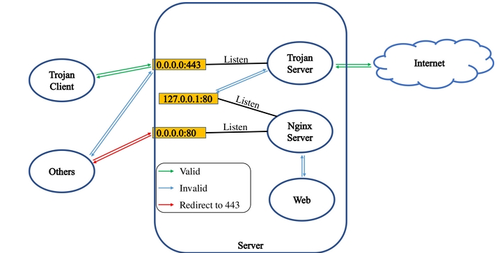
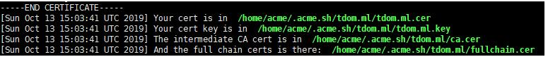
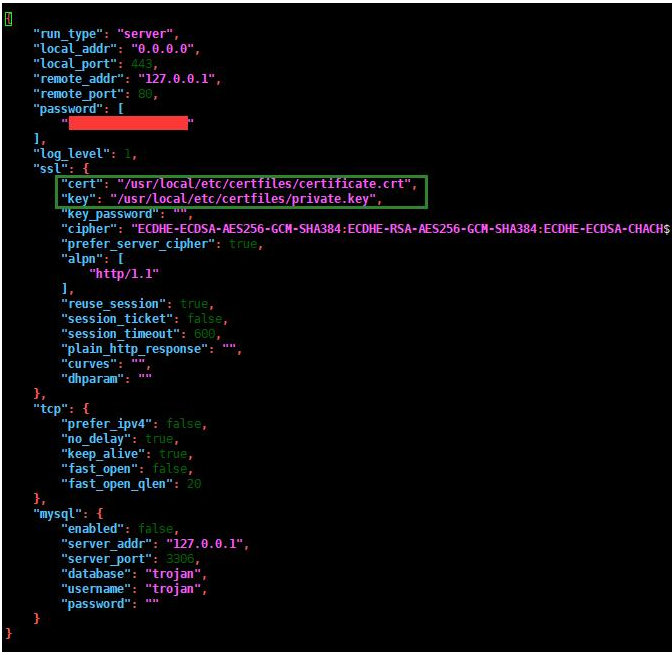
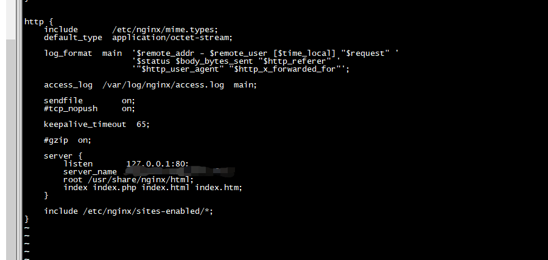
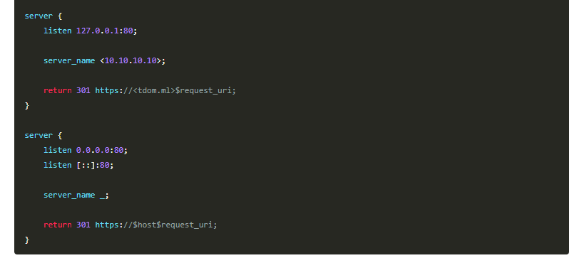
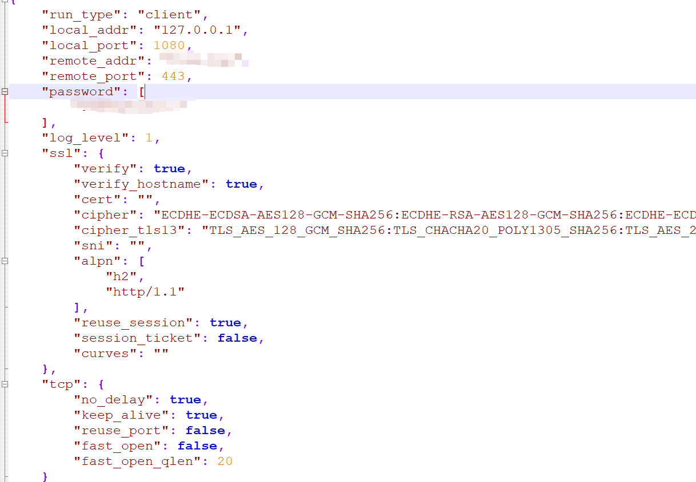

# Trojan 科学上网搭建
* 用了一个月了，挺稳定的。用来偶尔叉查资料还是很不错的。
* 现在把搭建步骤重新记录一下。

## Trojan工作原理浅析
> Trojan是一个比较新的翻墙软件，在设计时采用了更适应国情的思路。在穿透GFW时，人们认为强加密和随机混淆可能会欺骗GFW的过滤机制。然而，Trojan实现了这个思路的反面：它模仿了互联网上最常见的HTTPS协议，以诱骗GFW认为它就是HTTPS，从而不被识别。



## Trojan工作原理
如图所示，Trojan工作在443端口，并且处理来自外界的HTTPS请求，如果是合法的Trojan请求，那么为该请求提供服务，否则将该流量转交给web服务器Nginx，由Nginx为其提供服务。基于这个工作过程可以知道，Trojan的一切表现均与Nginx一致，不会引入额外特征，从而达到无法识别的效果。当然，为了防止恶意探测，我们需要将80端口的流量全部重定向到443端口，并且服务器只暴露80和443端口，这样可以使得服务器与常见的Web服务器表现一致。

**系统要求**
* Ubuntu >= 16.04；
* Debian >= 9；
* CentOS >= 7；

## VPS服务器购买
* 国内的太贵了，记录几个国外的，按需所取
* https://www.vultr.com/
* https://justhost.ru/

## 域名申请与解析
* 购买: https://www.namecheap.com/
* 解析: https://cloudflare.com
* trojan需要一个域名用来做伪装，所以需要先申请一个域名。如果你只是用来翻墙没有其他作用，那么建议注册一个免费域名即可。本教程使用域名和cloudflareDNS为例。

1. 将域名转移到cloudflare解析，这个对于已经有域名的来说应该不难。按照域名配置就行


## VPS服务器部署
> 跳过了上面系统选择与购买部分的要注意啦，本教程目前测试通过操作系统版本是Ubuntu 16.04 or Debian 9 or CentOS 7及以上，更低版本系统无法成功搭建，其他系统尚未测试！

### 安装依赖
> 由于Debian系列系统和CentOS系列系统使用不同的包管理软件，所以安装软件的命令不一样，下面两个小节自己对照自己系统选择命令。

#### Ubuntu or Debian
1) 更新源
```shell
sudo apt update
```
```shell
sudo apt upgrade -y
```

2) 安装acme.sh需要的依赖。
```shell
sudo apt install -y socat cron curl
```

3) 启动crontab
```shell
sudo systemctl start cron
```
```shell
sudo systemctl enable cron
```
4) 安装Trojan需要的依赖。
```shell
sudo apt install -y libcap2-bin xz-utils nano
```

5) 安装Nginx。
```shell
sudo apt install -y nginx
```

#### CentOS
1) 安装acme.sh需要的依赖。
```shell
sudo yum install -y socat cronie curl
```

2) 启动crontab
```shell
sudo systemctl start crond
```
```shell
sudo systemctl enable crond
```
3) 安装Trojan需要的依赖。
```shell
sudo yum install -y xz nano
```

4) 安装Nginx。
```shell
sudo yum install -y nginx
```

### 创建证书文件夹
新建一个文件夹/usr/local/etc/certfiles用于存放证书。
```shell
sudo mkdir /usr/local/etc/certfiles
```
将证书文件夹所有者改为acme，使得用户acme有权限写入证书。
```shell
sudo chown -R acme:acme /usr/local/etc/certfiles
```

### 配置证书
1) 安装acme.sh
```shell
curl  https://get.acme.sh | sh
```

2) 添加cloudflare Global CA Key<br/>
  需要让acme.sh自动管理你的证书，所以需要添加cloudflare的API。登录cloudflare之后定位到：头像>>My Profile>>API Tokens。可以看到这里有两个API Keys。我们需要的是Global API Key。Origin CA Key是不可以使用的。点击View即可查看，注意查看之后自己保存下来，每天可查看次数是有限制的。<br/>
  然后配置环境变量，注意：本文中代码需要手动修改的地方都使用<>包裹。
```shell
export CF_Key="<Your Global API Key>"
export CF_Email="<Your cloudflare account Email>"
```

3)  申请证书
执行如下命令（注意域名<tdom.ml>改为你自己的域名），等待一会儿。
```shell
acme.sh --issue --dns dns_cf -d <tdom.ml>
```
看到下图的提示表示证书申请成功。


4) 申请失败怎么办？证书申请失败的可能性一般有：
  1. CF_Key或CF_Email填写错误；
  2. 证书申请次数超限等。此时切忌反复尝试，原因是证书每一个周申请次数是有限制的（20次），如果超限了就需要等一个周或者更换域名了（这个限制是争对每一个子域单独做的限制，所以万一超限了还可以用子域名继续部署）。解决方案是：在上述命令后加–staging参数继续测试。测试通过之后，删除上图所示四个证书文件并取消–staging参数再执行一次。–staging参数申请的证书只作为测试用，客户端是无法认证通过的（提示SSL handshake failed: tlsv1 alert unknown ca），所以使用–staging参数申请到了证书之后要去掉–staging参数重新申请一次。

### 安装证书
1) 使用acme.sh将证书安装到certfiles目录，这样acme.sh更新证书的时候会自动将新的证书安装到这里。
```shell
acme.sh --install-cert -d <tdom.ml> --key-file /usr/local/etc/certfiles/private.key --fullchain-file /usr/local/etc/certfiles/certificate.crt
```

2) 配置acme.sh自动更新和自动更新证书，这样配置完Trojan之后一般不用管服务器。
```shell
acme.sh  --upgrade  --auto-upgrade
```

3)  修改权限
```shell
chmod -R 750 /usr/local/etc/certfiles
```

## 配置Trojan
### 安装Trojan
1) 安装Trojan，安装完成一般会提示版本号注意看是否是最新版本。
```shell
sudo bash -c "$(curl -fsSL https://raw.githubusercontent.com/trojan-gfw/trojan-quickstart/master/trojan-quickstart.sh)"
```
2) 备份Trojan配置文件，以防万一。
```shell
sudo cp /usr/local/etc/trojan/config.json /usr/local/etc/trojan/config.json.bak
```

3) nano修改配置文件
```shell
sudo nano /usr/local/etc/trojan/config.json
```
* Trojan的配置文件，定位到`password`、`cert`和`key`并修改。密码按自己喜好，`cert`和`key`分别改为`/usr/local/etc/certfiles/certificate.crt`和`/usr/local/etc/certfiles/private.key`。编辑完成配置文件之后按屏幕下方快捷键提示（`^O`和`^X`即：`Ctrl+O`和`Ctrl+X`）保存并退出`nano`。修改之后的`config`文件如图所示。另外，如果有`IPv6`地址，将`local_addr`的`0.0.0.0`改为`::`才可以使用。


### 启动Trojan
1) 配置Trojan监听443端口
* 执行如下命令，赋予Trojan监听1024以下端口的能力，使得Trojan可以监听到443端口。这是由于我们使用非root用户启动Trojan，但是Linux默认不允许非root用户启动的进程监听1024以下的端口，除非为每一个二进制文件显式声明。
```shell
sudo setcap CAP_NET_BIND_SERVICE=+eip /usr/local/bin/trojan
```

2) 使用systemd启动Trojan
Trojan启动、查看状态命令分别如下，第一条是启动Trojan，第二条是查看Trojan运行状态。启动之后再查看一下状态，Trojan显示active (running)即表示正常启动了。
```shell
sudo systemctl restart trojan
sudo systemctl status trojan
```

3) 更新证书
当`acme.sh`重新安装证书之后，需要通知`Trojan`重新加载证书。最简单的方案是每三个月登录服务器重启`Trojan`，但是不够完美，毕竟重启的时候会导致服务中断。其实`Trojan`有实现`reload certificate and private key` 功能，只需要在证书更新后给`Trojan`发送`SIGUSR1`消息即可。`Trojan`收到`SIGUSR1`消息后便会自动加载新的证书和密钥文件，这样就不用重启`Trojan`了。手动给`Trojan`发送`SIGUSR1`消息的命令是`sudo -u trojan killall -s SIGUSR1 trojan`，但是这样也不够完美，也得每三个月登录服务器运行一次该命令。其实我们可以给用户`root`添加定时任务，使其每个月运行一次该命令即可。实现如下。
首先，编辑用户trojan的crontab文件
```shell
sudo -u root crontab -e
```
在文件末尾添加一行如下，该行表示每个月1号的时候运行命令killall -s SIGUSR1 trojan。
```shell
0 0 1 * * killall -s SIGUSR1 trojan
```
最后查看crontab是否生效。
```shell
sudo -u trojan crontab -l
```

4) 更新Trojan
如果Trojan版本有更新（可以去 [这里](https://github.com/trojan-gfw/trojan/releases) 查看是否有更新）。
```shell
sudo bash -c "$(curl -fsSL https://raw.githubusercontent.com/trojan-gfw/trojan-quickstart/master/trojan-quickstart.sh)"
sudo setcap CAP_NET_BIND_SERVICE=+eip /usr/local/bin/trojan
sudo systemctl restart trojan
```
第一条命令会提示是否覆盖配置文件，如果没有必要请回答n，否则配置文件将会被覆盖（如果不小心覆盖了就得自己重新编辑了）。第二条命令重新赋予Trojan监听443端口的能力。第三条命令重启Trojan。

## 配置Nginx
### 写入虚拟主机到Nginx配置文件
由于Nginx配置在Debian系列系统和CentOS系列系统组织方式不同，所以配置文件位置和使用方式有细微区别，为了统一，我将CentOS系列系统的组织结构做细微调整。
<br/>
在Debian系列系统中，Nginx的虚拟主机配置文件在/etc/nginx/sites-available/文件夹中，如果要开启某一个虚拟主机，则建立一个软连接到/etc/nginx/sites-enabled/文件夹并重启Nginx即可。默认虚拟主机在/etc/nginx/sites-enabled/文件夹，需要关闭掉，否则会冲突。
<br/>
在CentOS系列系统中，Nginx的虚拟主机配置文件在/etc/nginx/conf.d/文件夹中以.conf后缀保存，写入之后就可以使用。默认虚拟主机集成在Nginx配置文件/etc/nginx/nginx.conf中，需要打开将其中的server块删除，否则会冲突。Debian系列系统中的/etc/nginx/sites-enabled/和/etc/nginx/sites-available/文件夹结构在CentOS系列系统中是没有的，不过这个策略很不错，可以很方便的开启和关闭虚拟主机，我这里手动调整一下。

#### CentOS
按上述分析，我们使用下面两条命令在/etc/nginx/中添加两个文件夹。
```shell
sudo mkdir /etc/nginx/sites-available
sudo mkdir /etc/nginx/sites-enabled
```
执行如下命令使用nano打开Nginx配置文件，删除其中server块，并添加对/etc/nginx/sites-enabled/文件夹的索引。
```shell
sudo nano /etc/nginx/nginx.conf
```
配置文件修改结果如下图所示。
默认写入了个伪装网站，大家可以自行去github上找。
```shell
rm -rf /usr/share/nginx/html/*   #删除目录原有文件
cd /usr/share/nginx/html/    #进入站点更目录
wget https://github.com/V2RaySSR/Trojan/raw/master/web.zip
unzip web.zip    #也可以上传自己的网站
```


CentOS反向代理需要配置SELinux允许httpd模块可以联网，否则服务器会返回502错误。
```shell
sudo setsebool -P httpd_can_network_connect true
```

#### Ubuntu or Debian
使用如下命令关闭Nginx默认虚拟主机。
```shell
sudo rm /etc/nginx/sites-enabled/default
```

### 写入配置
1) 执行如下命令，使用nano添加虚拟主机。(注意域名<tdom.ml>改为你自己的域名，这是虚拟主机的文件名，只是用来自己识别的。如果你已经有配置虚拟主机在这个文件中，可以自己使用cp命令备份一下或者换个名字也行，等介绍完基本配置再讲如何与现有服务集成。)
```shell
sudo nano /etc/nginx/sites-available/<tdom.ml>
```
基于综述部分讲解的Trojan工作原理，现给定Nginx虚拟主机如下所示。这些虚拟主机可以直接拷贝到上面虚拟主机配置文件中再修改为你自己的，其中要修改的地方包括：

第4行的server_name的值<10.10.10.10>改为你自己的IP；
第6行<tdom.ml>改为自己的域名，注意别填错了。



2) 使用配置文件注意域名<tdom.ml>改为你自己的域名
```shell
sudo ln -s /etc/nginx/sites-available/<tdom.ml> /etc/nginx/sites-enabled/
```

### 启动Nginx
* Nginx启动命令和Trojan一样，就不过多解释了。
```shell
sudo systemctl restart nginx
sudo systemctl status nginx
```

## 配置Trojan和Nginx开机自启
```shell
sudo systemctl enable trojan
sudo systemctl enable nginx
```

## 检查服务器是否配置成功
到这里服务器就配置完成了。此时你可以在浏览器里面访问你的网站看是否能够访问，如果你的网站可以访问了，那么就一切正常啦。

另外，基于以上考虑到的可能的恶意探测，可以验证一下以下情况是否正常。

* 浏览器中使用ip访问：重定向到https://tdom.ml;
* 浏览器中使用https://ip访问：重定向到https://tdom.ml(跳转的时候浏览器可能提示不安全是正常的);
* 浏览器中使用tdom.ml访问：重定向到https://tdom.ml。

## PC端链接
配置SwitchyOmega插件(代理浏览器流量) + Trojan客户端在(本地流量统一转发)即可，配置文件配置为客户端链接。


## 其他端链接
### IOS
* 美区ID + [ Pharos Pro | Shadowrocket ];

### 安卓
* [igniter](https://github.com/trojan-gfw/igniter/releases)

