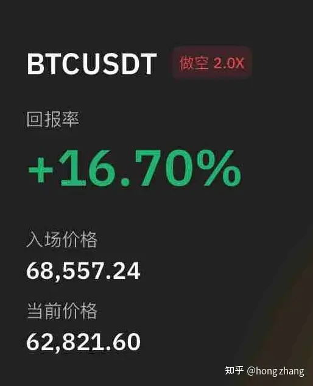

作者：hong zhang
链接：https://www.zhihu.com/question/581379326/answer/2904889200
来源：知乎
著作权归作者所有。商业转载请联系作者获得授权，非商业转载请注明出处。

我21年夏天刚进场就跟着几个up主的单子开合约，做技术面短线，成天老盯着，晚上睡觉都画一堆线设闹钟提醒，吃不香的睡不好成天被打止损，到七月底亏了本金的50%。然后转换了思路三倍低杠杆抗单，结果抗的是空单，ETH从2000刀抗到4000一路加仓拉高均价抗单，索性摆烂了如果真涨过5月前高爆仓把剩下50%亏完我就认了不玩儿了。运气好等来了9月8号暴跌，赚了空单还抄了个底把亏的钱赚回来了，这个确实是运气，想想还是后怕。再后来算是找到了适合自己的交易节奏，我的玩法就变成了二倍杠杆BTC对冲抗单，30%资金做多，10%资金做空。然后22年就一路下跌，扛着浮亏在技术面挂单，找低位加多仓减空仓，高位减多仓加空仓。上涨我不怕，我多单超过空单，盈利位我也挂好了。多单盈利减仓到最多和空单持平的时候，盈亏抵消我大不了把它俩一起毙了不赚不赔。下跌我也不怕，下跌空间是有限的不可能超过100%，二倍杠杆下我的仓位不会让我爆仓并且空单还能盈利补一点底部加仓的钱，浮亏那都不是事儿，多单越抗越便宜。我不贪心想多赚钱，我赚的就是能保住对冲的单子不崩的前提下，来回刮头皮的分批止盈的这点儿钱。BTC22年一年挪下来我的多单的均价从6万刀无损挪到了2.6万，整个过程中本金还增长了20%左右，现在多空加起来仓位50%，中长线重要支撑阻力和最坏的情况下我怎么样平衡风险都已经算好了，以目前24000的价位来说，涨到36000和跌到11000之前我基本可以不用操作，各种情况我都挂好单了，高枕无忧睡得香有人好奇怎么操作的，Hmmm其实这个真的没法三言两语说明白，随时都是灵活变化的。总之有以下几个要点：1，不贪心，随时计算控制仓位的原则的出发点不是为了赚钱，而是在对自己目前持仓最不利的情况下能够做到不亏损。不亏就行，这个市场不缺波动。2，从任意位置就可以开仓操作，尽量保持多空3:1到2:1的比例，谨慎点可以起始仓位小点多15%空5%。3，加减仓的位置和数量需要考虑的就太多了，我考虑的主要是4小时和日线两个级别下的技术面，主要参考的参数有偕波，斐波那契，趋势线，交易密集区，支撑阻力互换位，RSI等。K线的级别和支撑阻力的强度也要考虑。4，总体上保持多空加起来不要超过50%仓位，真就暴跌以后哪怕多单加多了点也尽量别超过75%，然后伺机在回调的时候找时间减仓，暴跌的越厉害，肯定也是有个自然反弹的，加仓的仓位和均价目标就应该是在技术面上中长线一个弱反弹你就能解套的水平。当然不用真的全解套，把仓位减少到50%以内就行，然后等后续。5，空单在心态上尽量作为多单的一个保险来使用，下跌过程中不要急着盈利空单，可以等明确的底部信号再说，或者盈利多了再减仓，小的空单利润回吐了也无所谓。上涨过程中也不要急着加更多空单，因为抗空的风险大于抗多，大可以等明确的顶部信号再加空，不然的话就在盈利多单的过程中不要卖完了，留和空单等量的，大不了最后这部分不亏不赚。不过也没有那么绝对，涨的实在多了感觉回调怎么都该来了的时候，空单超多单一点问题也不大，扣除抵消部分剩下的空单仓位小就行。除了技术面可能还要点盘感 我这套玩儿法吧其实相当于是现货拿长线加了个空单对冲，能够减少我被套的时间长度和降低解套的难度，但是也限制了利润。总的来说减少利润降低风险吧，但是好处是我确实可以不用关心消息面，该干嘛干嘛，不用提心吊胆的看着，我大可以后知后觉的在暴涨暴跌后完全无所谓 看着华尔街的骗子们一会儿唱多一会儿唱空的割韭菜笑而不语，你们随便说出花儿来，受情绪影响认一块钱止损算我输小更新一手：2024-01-10手贱了，去年春天饼哥上26000的时候，我就小利润多空同时平仓转战以太坊了，嘿这一年以太一潭死水很是无趣，大饼倒是上蹿下跳所以利润就少很多，2023落袋的年化25%左右吧，吃得好睡得香经常好几天都忘了我还有这个玩意儿，突然想起来了才看一下。目前仓位还行如图，在现在以太涨上来以后我出了一些多单盈利，然后现在剩下的多空单1:1，总仓位50%，同涨同跌锁定了50%利润差，等方向中，计划大回调的时候加多单再回到2:1的比例，回调完了再上涨可以增加更大的利润差，如果一路继续下跌探底去一千五，我就加到3:1嘛，再去二次探底甚至可以加到4:1（那时候总仓位可能吃到70-80%？那无所谓，都那个价位了，满仓都可以，80%仓位4:1多空比，多仓均价1500左右，空仓均价2200左右，那叠上空单盈利实际上才60%仓位左右），空单位置高加上浮盈可以抵消多单的浮亏，继续等上涨，低位加的越多，价格越低，上涨的时候利润更多咯，不急。反过来说，不回调了，如果真就一头冲到3300多的话就把空单再加一点，比例到2:3，问题不大，保着利润等回调过程中减空仓盈利，减到2:1又是很好的仓位。假设3300的价格，多空仓位2:3以后还继续涨就会消耗我锁定的50%利润了，但是粗略估算涨到4000之前消耗不完，他能闭着眼睛冲到4000不回头啊，我不信。退一万步讲冲到4000我就给多空同时毙了，无损出局等机会重新开仓。

作者：hong zhang
链接：https://www.zhihu.com/question/581379326/answer/2904889200
来源：知乎
著作权归作者所有。商业转载请联系作者获得授权，非商业转载请注明出处。

2024-01-23过了2500后继续上冲了，没到3300到了2700，所以空单加了点，大概加到了5:6的样子。然后现在回踩触发了2260减空仓的挂单，目前减完后多空3:2，总仓位40%多吧。去到2000-2050附近就加多减空挪成2:1，持仓50%。如果回踩完了上涨，OK，继续看3300。如果继续下跌，那就1500左右加一次多仓到3.1，再下跌去二次探底就再加一次多仓到4:1。单挂好了，大半夜的寻思春节去哪儿玩儿，结果饿的睡不着，吃完宵夜了更新一下帖子睡觉 

02-21-2024更新在3000附近减了多仓加了空仓，目前多空比1:2，手头仓位如下图，大概15%多@1784，30%空@2568。这么单边上涨的确是让我多空比超过了计划，最极限下继续涨到3500左右剩余多单盈利会被空单浮亏消耗掉。3250-3350附近应该是一个主要反转位，如果到这个位置我会进一步减多加空，如果没有反转成功到3500左右我会把剩余多空仓位都平了，等回踩以后重新开始2:1的新仓位。不过即使丢掉这个鱼尾巴行情，前面多单的主体已经落袋总仓位20%以上的利润了，知足了 。不过这是最坏的情况了。乐观一点的话，首先涨成这样回调应该是不远了以太感觉磨蹭磨蹭着跌破了上升楔形，弱回踩也会到2500-2600左右可以加多单减空单回到2:1左右，预计调整后将持有30%仓位多单均价为2150左右，15%空单仓位均价2568。回踩完再上涨自然是更高，如果迎来瀑布强回调，在跌到1800之前我基本都是盈利的。2000-2100左右是大支撑，甚至可以再加点仓

03-15-2024更新3月初插针回踩3200的时候触发了我的买单，给我多空拉回了1:1（各30%）。主要是没有踩的更深，所以没有减我的空单。就拿着同涨同跌的单子到了4000，这波涨的就离谱 。然后在4000左右又卖掉了点多单，加了点空（多20%，空35%），均价目前如下：

目前开始回踩，准备在3150左右换个手，加多减空到30%多 15%空，如果能去2900多的话就加到45%多然后观望。然后顺带短线带止损开个大饼空单玩玩儿，一看60000二看52000。它是跌破并且受到阻力没回去的，那形态就已经出来了，要是涨回72500形态就失效了那就风紧扯乎

4/13/2024更新

hmmm 上次没跌到60000目标位，差几百，后来大概在65000左右吧打了我的保护性止损。然后我觉得0.886是反转位（大概72500），我就在72188重新挂了空单，然后睡着觉就成交了，然后现在……黑天鹅这不就来了么

至于ETH对冲这边，刚才2828的加多减空挂单也成交了，目前多空2:1.5。后面看比特币能不能确认跌破6万（目前有支撑），如果跌破，就看比特币怎么走来决定ETH的操作位置了。大饼跌破6万后也不是一定回去42000那个位置，因为B点也没到6万，形态可能不成立，如果走M顶倒是大概率去48000到5万吧。再找机会操作以太

07/01/2024更新 自5月1号跌到56000又拉回来，在6万平了一点BTC空单，然后涨上来后又把空单加了回来，目前捏着均价68500左右的空单至今没有操作，最近太忙，忙着写文章，加上无聊的行情，我继续等44000。我感觉他还是在走我剧本里的趋势，只是B点不是我一开始预期的6万，而是5月1号的56000

以太呢基本没啥操作，只加了一点点空单，现在多单还是原来的多单，空单价格拉高了一点点，这几个月经常一两个礼拜不打开APP，好像也无所谓

