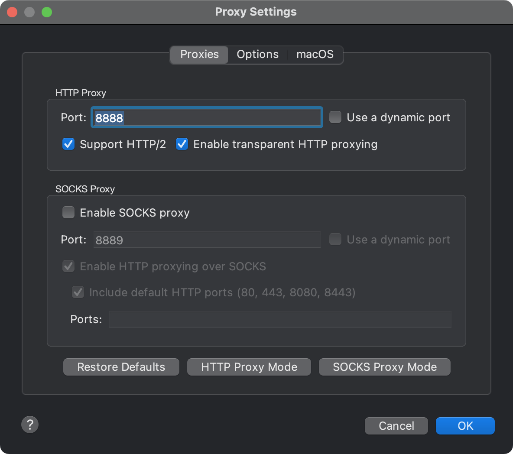
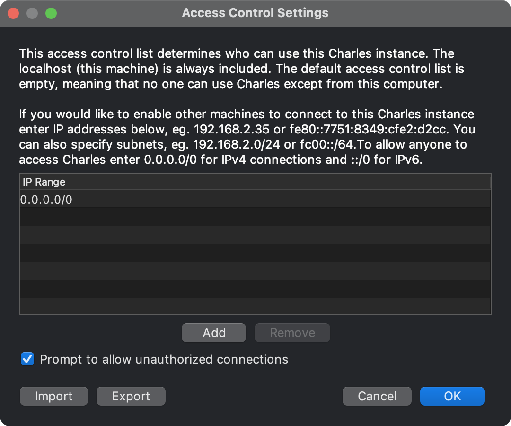
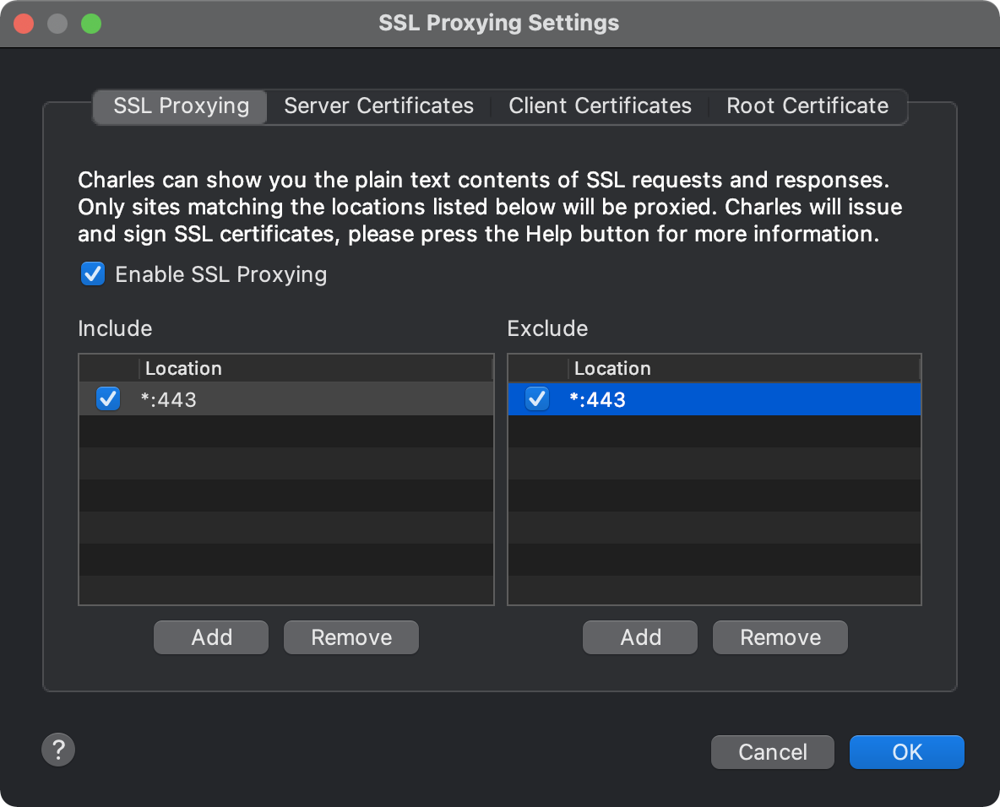
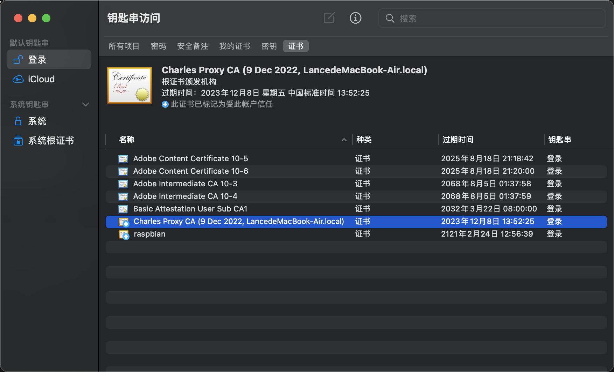

### 安装对应软件
* [wireshark](https://www.wireshark.org/download.html)

* [Charles](https://www.charlesproxy.com/download/)

### 配置Charles代理

proxy > proxySettings

Proxy -> Access Control Settings中添加个：0.0.0.0/0。（一劳永逸，所有的ip都识别通过）
不配置否则会拦截掉所有请求

#### https 解析
1. MacOS->Charles->Help->SSL Proxying->Install Charles Root Certificate on a Mobile Device or Remote Browser

2. 手机（iOS系统）中，打开浏览器（Safari），输入chls.pro/ssl（根据上一步提示），自动跳转到证书安装界面。（必须在设置了手机端代理之后才有效）

3. 手机（iOS系统）中，打开设置->通用->关于本机->证书信任设置->针对根证书启用完全信任，启用。

4. MacOS->Charles->Proxy->SSL Proxy Settings->SSL Proxying->[Add]按钮，并勾选Enable SSL Proxying

5. 配置MacOS端可以截获移动端代理出来的HTTPS。
MacOS->Charles->Help->SSL Proxying->Install Charles Root Certificate
设为始终信任证书

### 手机端配置
这里以apple手机为例：设置 > 无线局域网
找到对应的wifi配置代理即可,
输入电脑的IP地址, 端口输入 charles 代理的端口

### wrieshark
fileter 栏
`eth.addr == mac地址` 即可
