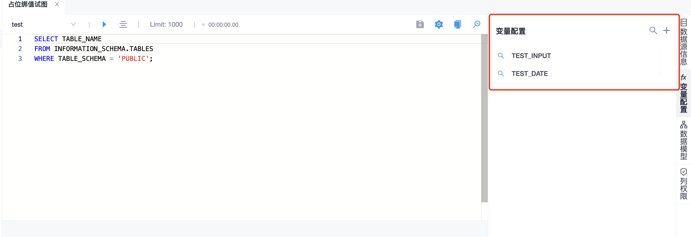
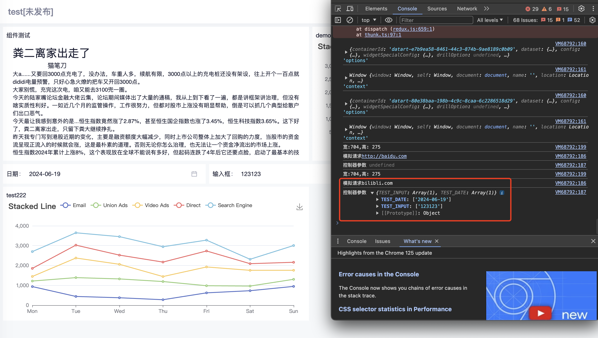

## 组件继承关系
```plantuml
rectangle 组件包装层 as WidgetMapper {
  rectangle 数据交互redux层 as WidgetDataProvider  {
    rectangle 样式redux层 as WidgetWrapper {
      rectangle 数据图表 as DataChartWidget{
      rectangle 图表配置层 as DataChartWidgetCore {
        rectangle 图表容器层 as ChartIFrameContainer{
          rectangle 图表实现层 as ChartIFrameLifecycleAdapter
        }
      }
    }
    }
  }
}
rectangle 组件包装层 as WidgetMappers {
  rectangle 其他组件 as OtherWidget  
}
```
* 每个组件都被相同的数据层包裹，共享redux里的数据
* 数据交互,逻辑操作全在redux里面

### 新增Http组件
* 按照官网的介绍逻辑无缝新增即可，这样有个好处就是，不入侵datart原本的制作逻辑
* [官方文档](https://running-elephant.github.io/datart-docs/docs/chart_plugin.html#4-1-1-onMount)
```js
function D3JSScatterChart({ dHelper }) {
  const generateRandomNumbers = (count)=>{
    const randomNumbers = [];
    for (let i = 0; i < count; i++) {
      const randomNumber = Array.from({length: 7}, () => Math.floor(Math.random() * (1000 - 100) + 100));
      randomNumbers.push(randomNumber);
    }
    return randomNumbers;
  }
  const mockData = ()=>{
    const datas = generateRandomNumbers(7)
    const series = [
      {
        name: 'Email',
        type: 'line',
        stack: 'Total'
      },
      {
        name: 'Union Ads',
        type: 'line',
        stack: 'Total'
      },
      {
        name: 'Video Ads',
        type: 'line',
        stack: 'Total'
      },
      {
        name: 'Direct',
        type: 'line',
        stack: 'Total'
      },
      {
        name: 'Search Engine',
        type: 'line',
        stack: 'Total'
      }
    ]
    for(let i =0;i<series.length;i++){
      series[i].data = datas[i]
    }
    return series
  }
  const echartsOptions = {
    title: {
      text: 'Stacked Line'
    },
    tooltip: {
      trigger: 'axis'
    },
    legend: {
      data: ['Email', 'Union Ads', 'Video Ads', 'Direct', 'Search Engine']
    },
    grid: {
      left: '3%',
      right: '4%',
      bottom: '3%',
      containLabel: true
    },
    toolbox: {
      feature: {
        saveAsImage: {}
      }
    },
    xAxis: {
      type: 'category',
      boundaryGap: false,
      data: ['Mon', 'Tue', 'Wed', 'Thu', 'Fri', 'Sat', 'Sun']
    },
    yAxis: {
      type: 'value'
    },
    series: []
  }

  return {
    //【可选】扩展配置图表功能，可配合`数据视图`对数据处理
    config: {
      styles: [
        {
          label: "common.title",
          key: "scatter",
          comType: "group",
          rows: [
            {
              label: "common.color",
              key: "color",
              comType: "fontColor",
            },
          ],
        },
        {
          label: "common.setting",
          key: "setting",
          comType: "group",
          rows: [
            {
              label: "common.uri",
              key: "uri",
              comType: "input",
            },
          ],
        },
      ],
      i18ns: [
        {
          lang: "zh-CN",
          translation: {
            common: {
              title: "散点图配置",
              color: "气泡颜色",
              setting: "设置",
              uri: "Url"
            },
          },
        },
        {
          lang: "en",
          translation: {
            common: {
              title: "Scatter Setting",
              color: "Bubble Color",
              setting: "Setting",
              uri: "Url"
            },
          },
        },
      ],
    },

    isISOContainer: "demo-d3js-scatter-chart",

    //【必须】加载D3JS绘图引擎，此处需给出CDN链接或者服务端相对资源地址即可
    dependency: ["https://d3js.org/d3.v5.min.js","https://cdn.jsdelivr.net/npm/echarts@5.5.0/dist/echarts.min.js"],

    //【必须】设置图表的基本信息，icon可从Datart Icon图标中选取，暂时不支持自定义
    meta: {
      id: "demo-d3js-scatter-chart",
      name: "[Plugin Demo] URL 测试图",
      icon: "sandiantu",
      requirements: [
        {
          group: [0, 999],
          aggregate: [0, 999],
        },
      ],
    },

    //【必须】Datart提供的生命周期函数，其他周期如onUpdated，onResize以及onUnMount
    onMount(options, context) {
      if (!context.document) {
        return;
      }
      // options 里有 url
      // 还有控制器传入值
      // 由于时间原因可以尝试改代码，破坏datart的控制器绑定规则
      // 尝试这破坏过，但是风险略高，不是很建议，保不齐会导致原生组件的交互出现问题
      console.log(options, "options")
      console.log(context.window, "context")
      // 读取 url 
      const url = options.config.styles[1].rows[0].value;

      // todo 发起请求
      // 使用的是echarts 渲染，模拟请求组装 echarts 的 options
      const host = context.document.getElementById(options.containerId);
      this.chart = context.window.echarts.init(host);
      this.chart.setOption(echartsOptions)
    },

    onUpdated(options, context) {
      // if (!options.dataset || !options.dataset.columns || !options.config) {
      //   return;
      // }

      // 由于每次都会调用更新可以判断条件是否重复，从而减少接口的请求次数

      // 读取 options 里面的条件

      // 获取url
      const url = options.config.styles[1].rows[0].value;
      // 获取 控制器参数
      const params = options.config.params
      // 模拟请求url，根据options 的条件组装传递 url 需要的参数
      console.log(`模拟请求${url}`)
      console.log(`控制器参数`, params)
      // 也可以顺带在此处动态的刷新图表的宽高, 达到一个简单的优化目的
      // 刷新图表， PS，时间有限此处只刷新了数据 没刷新宽高
      this.chart.setOption({series: mockData()})

    },

    onResize(options, context) {
      // 组件大小变化时调用，
      // 需要根据组件大小变化时获取容器的宽高，动态的刷新图表的宽高
      const clientWidth = context.window.innerWidth;
      const clientHeight = context.window.innerHeight;
      console.log(`宽:${clientWidth},高: ${clientHeight}`)
    },

    onUnMount() {},
  };
}
```

* 将以上文件放进服务器或者开发环境的custom-chart-plugins文件夹下即可
* 生产环境在服务器上的 custom-chart-plugins

### 修改逻辑注入控制器参数
* 由于原生逻辑只控制数据，组件只负责渲染，不负责数据的处理，原本逻辑是将控制器参数上传至数据redux层，然后发起统一的请求得到结果集，然后下发结果集用于渲染各种组件
* 所以需要改造一下，将控制器参数下发至各个组件当中

1. 修改文件获取控制器参数
修改 ./frontend/src/app/pages/DashBoardPage/components/Widgets/DataChartWidget/DataChartWidgetCore.tsx
文件里的config方法，注入控制器参数
```js
const config = useMemo(() => {
    if (!chart?.config) return undefined;
    if (!dataChart?.config) return undefined;
    let chartConfig = produce(chart.config, draft => {
      mergeToChartConfig(
        draft,
        produce(dataChart?.config, draft => {
          migrateChartConfig(draft as ChartDetailConfigDTO);
        }) as ChartDetailConfigDTO,
      );
    });
    return { ...chartConfig, params: widget.params } as ChartConfig;
  }, [chart?.config, dataChart?.config, widget.params]);
```

2. 保存控制器参数到对应的widget组件中
修改 ./frontend/src/app/pages/DashBoardPage/pages/Board/slice/index.ts
新增保存控制器参数方法
```js
// 在 updateWidget 方法下面新增这个方法即可
updateWidgetParams(state, action: PayloadAction<any>) {
      const { bid, wid, params } = action.payload;
      state.widgetRecord[bid][wid].params = params;
    },
```

3. 提交保存控制器参数
修改 ./frontend/src/app/pages/DashBoardPage/pages/Board/slice/thunk.ts
提交控制器参数
```js
// getChartWidgetDataAsync 方法中
// if (!requestParams) {
//   return null;
// }
// 找到上面这个代码，注入一个方法，提交控制器参数
// 向redux提交控制器参数
dispatch(
        boardActions.updateWidgetParams({bid: boardId, wid: widgetId, params: requestParams.params}),
      );
```
4. 新增类型，因为编译是强校验的，此处多了个类型，不添加编译会不通过
修改 ./frontend/src/app/pages/DashBoardPage/types/widgetTypes.ts
新增控制器类型:
```js
// 最后一行添加params类型即可
export interface Widget {
  id: string;
  dashboardId: string;
  datachartId: string;
  relations: Relation[];
  viewIds: string[];
  config: WidgetConf;
  parentId: string;
  params?: Object;
}
```
5. 完成HTTP组件的注入，只需要按照上面组件的注视开发即可
6. 此种操作对于datart来说几乎是0入侵，没修改它原本的任何业务逻辑，稳定程度几乎是百分之百

### 使用控制器关联组件
* 为了不破坏它原有的控制器参数注入逻辑，遵循它原有的参数注入方式
1. 新建一个无关的视图，按照它原本的方式注入需要用到的参数:

* SQL不是重点，能保存即可，重要是右侧的变量设置

2. 在使用Http组件的时候 选择这个视图，其实主要用到的是这个视图的变量，因为控制器只能绑定变量

3. 将对应的控制器，根据本来的使用方式将控制器绑定到变量上即可

4. 在之前修改了控制器参数注入后，在新增的组件中直接获取控制器参数，进行组件内部的额外业务逻辑的执行即可



### 后端逻辑集成其他系统
1. 将需要组件参数配置生成 datart
在datart的后台服务写个接口，将对应的数据插入进datart的对应表即可
2. 可以先查看写好的新组件所存到数据库里面的位置在哪张表中，行数据，JSON是什么样子的，然后模仿那个那条数据写个接口插入进去，就能达到添加一个组件的效果

3. 同理直接添加到dashboard里面也是一样的，要先看一下dashbord的代码，看下如何直接把组件添加到dashboard后面

4. 按需所取的开发几个接口(查询系统中有的dashboard,组件,将某个组件添加进去接口)即可，用@SkipLogin注解注释接口，这样其他系统访问就不会没权限