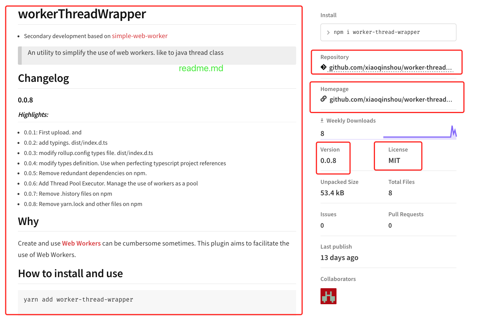

## 上传npm包
* 上传自己的 `npm` 模块包供自己或其他人使用. 记录一下自己踩的坑, 以及一些细节.
* 第一次写的npm包, 打包工具用的是`rollup`
* [worker-thread-wrapper](https://www.npmjs.com/package/worker-thread-wrapper), 以java线程的运作模式封装的一个`webWorker`工具包, 减轻`webWorker`使用上的繁琐, 以及复用问题. 

### 文件结构
* 上传时需要固定的几个文件
* `.npmignore`: 发布时需要忽略的文件, 一般情况下只需留下编译过后的`js`代码, `readme.md`文档, 以及`package.json`这几个文件即可(`.d.ts`文件根据发布的包是否需要兼容ts引用而决定)
  * 当时不知道,初次发布时的时候把当前目录下的所有文件都给发布出去了, 包括源码以及各种配置文件, 导致其他项目引入的时候就会非常冗余
* `package.json`: 包的核心配置文件, 该包的所有引用, 依赖, 说明, 作者等, 所有的一切信息

#### .npmignore
```makefile
src
node_modules
.npmignore
.gitignore
rollup.config.js
**/*yarn*
demo
config
jest.config.js
.history
tsconfig.json
yarn.lock
yarn-error.log
.babelrc
```

* 换行键入需要排除的文件或文件夹即可, 跟`.gitignore`文件类似, 不做过多的赘述

#### package.json
* 省略常见的属性, 只关注发布一个包对应需要的属性
```json5
{
  "name": "worker-thread-wrapper",
  "version": "0.0.8",
  "main": "dist/wtw.min.js",
  "typings": "dist/index.d.ts",
  "keywords": [
    "Web",
    "Worker",
    "Simple",
    "Util",
    "Tool"
  ],
  "author": "fons.yang",
  "license": "MIT",
  "repository": {
    "type": "git",
    "url": "git+https://github.com/xiaoqinshou/worker-thread-wrapper.git"
  },
  "bugs": {
    "url": "https://github.com/xiaoqinshou/worker-thread-wrapper/issues"
  },
  "homepage": "https://github.com/xiaoqinshou/worker-thread-wrapper#readme"
}
```
  * name: 对应的是包的名字
  * version: 此包的版本
  * main: 包的入口文件
  * typings: 包.d.ts的定义文件, 只有这个文件存在并定义正确时, 引用包的时候 typescript 才能正常工作
  * keywords: npm 官网搜索时的关键字
  * author: 包的作者
  * license: 开源协议
  * repository: 源码的存储库地址
  * bugs: bug提交地址
  * homepage: 包的官方地址

* 上传后对应: 
  
  * 左边的大框描述就是根目录下的 `readme.md` 文件
  * 右边的小框中字段名都与上面的 `package.json` 中的字段一一对应

### 发布
* 当准备好上面的包发布所需要的代码等文件后, 就可以开始准备发布了
  1. 首先得先在npm上注册一个账号 [npmjs](http://npmjs.com)
  2. 在根目录下运行 `npm adduser` 或 `yarn login` 命令, 提示我们输入账号密码, 将上一步注册好的用户添加进来
  3. 运行发布 `npm publish` 或 `yarn publish` 命令, 进行发布, 然后根据提示, 填入对应的 包名称, 版本, 密码, 一次性验证码等.
  4. 在渐入包名称时有可能报错, 提示包名称重复, 此时需要修改报名至不重复为止(可去官网搜索验证包名是否可用).

### 更新 
  * 包发布成功后, 大都会进入一个持续迭代的过程, 需要更新之前发布的包
    1. 先将待发布的代码编译
    2. 修改 `package.json` 文件中的版本号, 
    3. 直接执行 `npm publish` 或 `yarn publish` 命令, 根据提示填入对应信息
    4. 等待命令执行完成

## 补充
### 冷知识
  * 如果发布的模块是完整可执行的纯`webjs`脚本的话, 可免费白嫖中央仓库提供的`cdn`, 直接在`html`中引入
