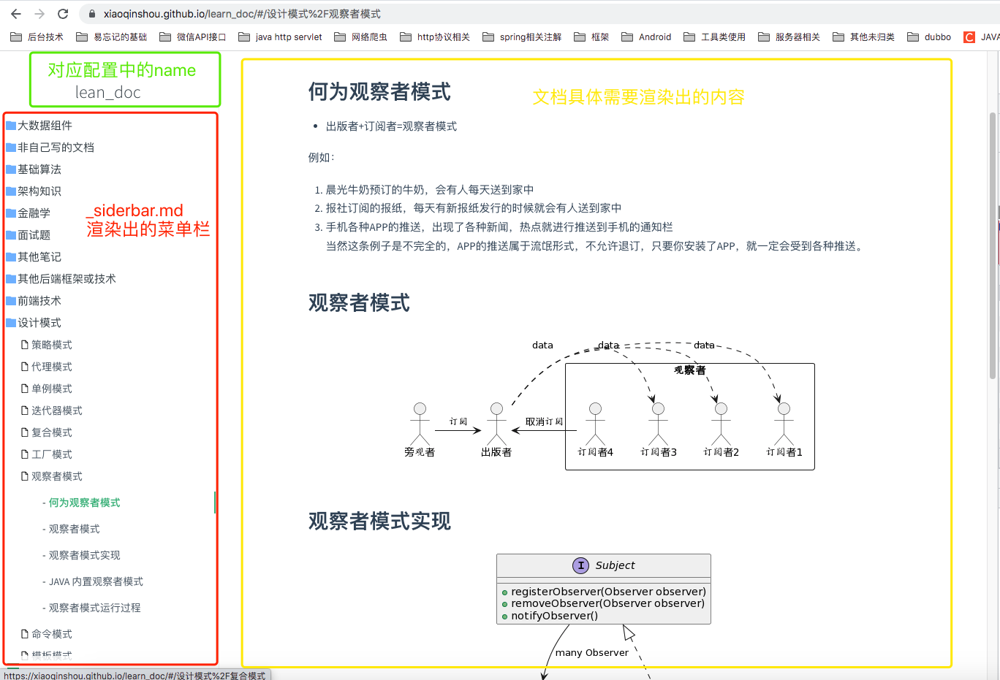

# docsify 部署
* [官方文档](https://docsify.js.org/)

## 概述
> docsify 可以快速帮你生成文档网站。不同于 GitBook、Hexo 的地方是它不会生成静态的 .html 文件，所有转换工作都是在运行时。如果你想要开始使用它，只需要创建一个 index.html 就可以开始编写文档并直接部署在 GitHub Pages。

## 工作原理
1. 通过监听路由器的hash路由的变化，进行markdown文件的请求
2. 请求文件后拿到markdown内容，将内容交由marked初步解析
3. 解析的结构明了后，再由内部的各类解析器(高亮语法解析器，表格解析器等等)进行解析转为Html Dom元素
4. 页面的呈现

* 工作原理其实很简单

## 部署
* 常用部署方式，nginx， tomcat等web服务器做个静态资源代理即可
* 参考原理：它内部是有一套完整的运行渲染解析体系的，只需要服务器提供对应的静态文件内容，http请求返回功能即可

* 常用配置如下注释：需要其他的配置需要去官方文档中查看
* 只需在服务器(例如：nginx)上的某一个文件夹下根结点部署该html文件即可
```html
<!DOCTYPE html>
<html lang="en">
  <head>
    <meta charset="UTF-8" />
    <title>docsify</title>
    <meta http-equiv="X-UA-Compatible" content="IE=edge,chrome=1" />
    <meta name="viewport" content="width=device-width,initial-scale=1" />
    <link rel="stylesheet" href="//cdn.jsdelivr.net/npm/docsify-expand@1.0.0/themes/vue.css">
    <link rel="stylesheet" href="//cdn.jsdelivr.net/npm/katex@0.16.0/dist/katex.min.css">
    <link rel="stylesheet" href="//cdn.jsdelivr.net/npm/docsify-sidebar-collapse/dist/sidebar-folder.min.css" />
    <style>
      nav.app-nav li ul {
        min-width: 100px;
      }

      #carbonads {
        box-shadow: none !important;
        width: auto !important;
      }
    </style>
  </head>

  <body>
    <div id="app"></div>
    <script src="//cdn.jsdelivr.net/npm/docsify-plugin-carbon@1"></script>
    <script>
      // Docsify configuration
      window.$docsify = {
        auto2top: true, // 切换页面后是否自动跳转到页面顶部。
        basePath: '/learn_doc/soft_dev_doc/', //文档加载的根路径，可以是二级路径或者是其他域名的路径。
        coverpage: true, // 启用封面页。开启后是加载 _coverpage.md 文件，也可以自定义文件名。
        loadSidebar: true, //加载自定义侧边栏，设置为 true 后会加载 _sidebar.md 文件，也可以自定义加载的文件名。
        mergeNavbar: true, //小屏设备下合并导航栏到侧边栏。
        subMaxLevel: 3, // 自定义侧边栏后默认不会再生成目录，你也可以通过设置生成目录的最大层级开启这个功能。
        autoHeader: true, //同时设置 loadSidebar 和 autoHeader 后，可以根据 _sidebar.md 的内容自动为每个页面增加标题。
        name: 'lean_doc', // 文档标题，会显示在侧边栏顶部。
      };
    </script>
    <script src="\//cdn.jsdelivr.net/npm/docsify-expand@1.0.0/lib/docsify.min.js"></script>
    <!-- <script src="/lib/plugins/search.min.js"></script> -->
    <!-- <script src="/lib/plugins/front-matter.min.js"></script> -->
    <script src="//cdn.jsdelivr.net/npm/docsify-sidebar-collapse/dist/docsify-sidebar-collapse.min.js"></script>
    <!-- <script src="//cdn.jsdelivr.net/npm/docsify/lib/plugins/search.min.js"></script> -->
    <script src="//cdn.jsdelivr.net/npm/plantuml-encoder@1.4.0/dist/plantuml-encoder.min.js"></script>
    <!-- <script src="//cdn.jsdelivr.net/npm/mermaid/dist/mermaid.min.js"></script>
    <script src="//cdn.jsdelivr.net/npm/vega@5/build/vega.min.js"></script>
    <script src="//cdn.jsdelivr.net/npm/vega-lite@4/build/vega-lite.min.js"></script>
    <script src="//cdn.jsdelivr.net/npm/vega-embed@6/build/vega-embed.min.js"></script> -->
  </body>
</html>
```

## 文档结构描述
* 文档结构应当如下：
```tree
+ learn_doc
  + soft_dev_doc 
    + anything Fiels Or Dictory // 若干文件夹或者文件 对应的菜单栏点击后进行渲染并将内容展示在黄色部分
    - README.md // 首页内容， 对应黄色部分，尚未点击菜单栏任何一项时所展示的内容
    - _coverpage.md // 首页渲染文件， 对应的是首次进入该网站的内容
    - _sidebar.md // 菜单渲染文件， 对应图片红色部分
  + index.html // 核心静态文档页面
```


## 目录脚本生成
* 当文档越写越多时，文件夹的分类管理以及，文档的命名越来越多， 对维护菜单栏的工作将日益增长
* 顺带写了一个脚本用于遍历所有文件下的内容，自动生成菜单(_siderbar.md文件)

* generatorSidebar.js
* 需要注意修改的配置项
```js
// 需要遍历文件夹的根结点
const rootPath = './soft_dev_doc'
// 需要生成的文件
const sidebarFile = rootPath + '/_sidebar.md'

// 需要过滤不生成目录的文件夹
function filterDirectory(name) {
  if (name === '.history' || name === 'images' || name === 'code_file' || name === 'react_demo') {
    return false
  }
  return true
}

// 需要过滤不生成目录的文件
function filterFile(name) {
  return !name.startsWith('_') && name.endsWith('.md') && name !== 'README.md'
}
```

* 运行
```sh
$ node generatorSidebar.js
```