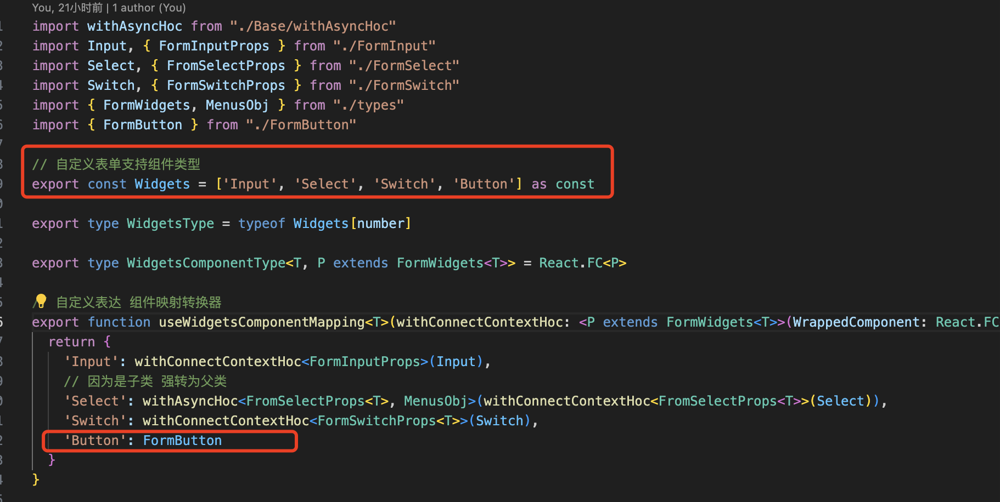
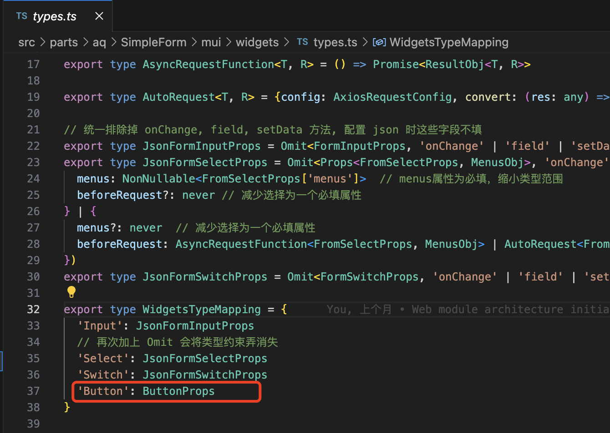
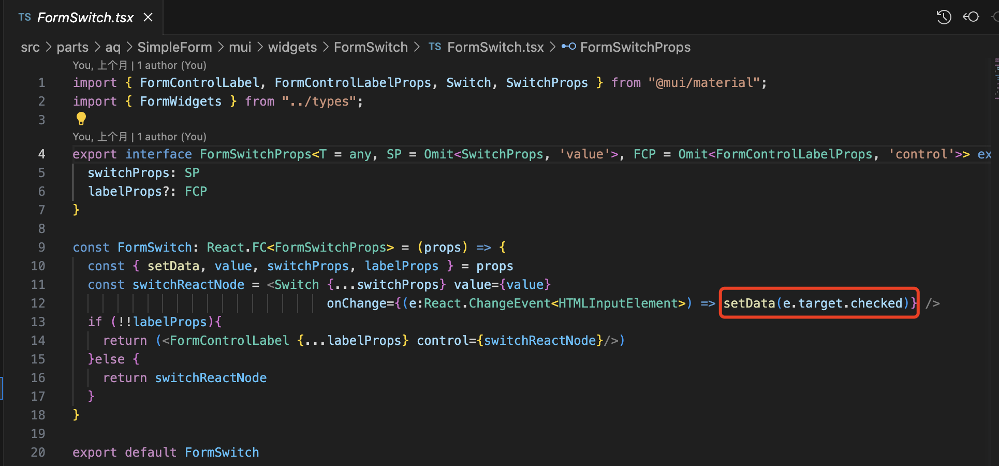
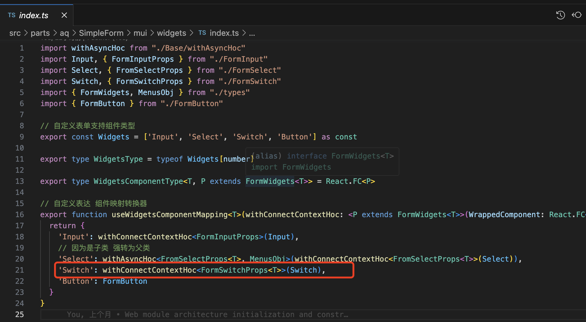
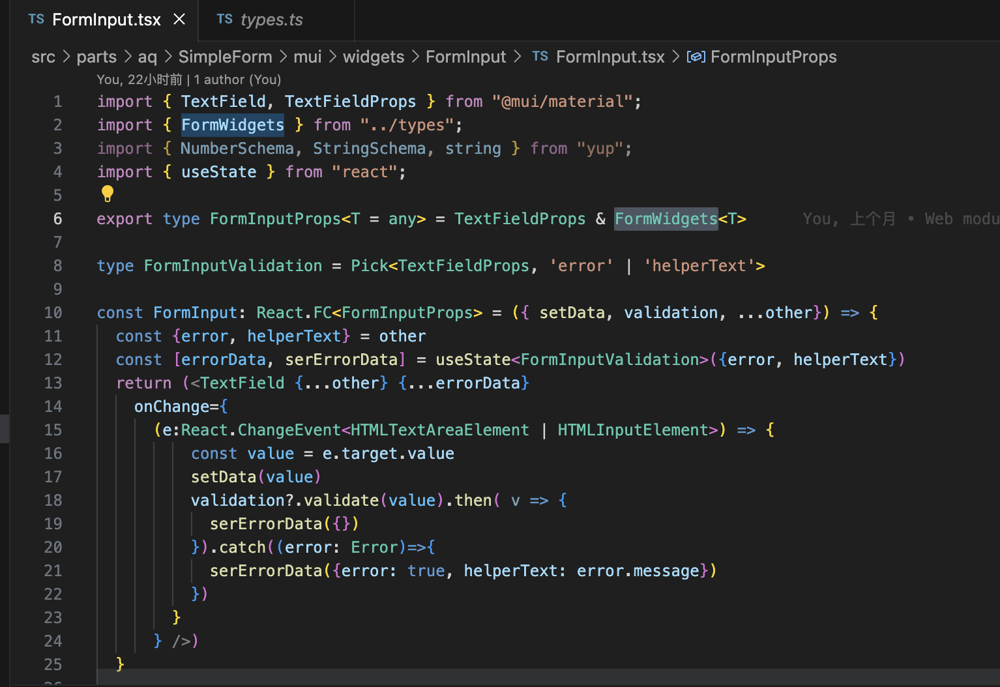
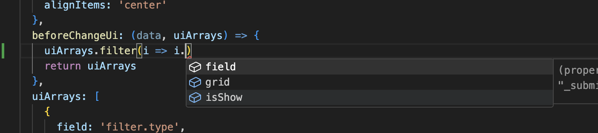
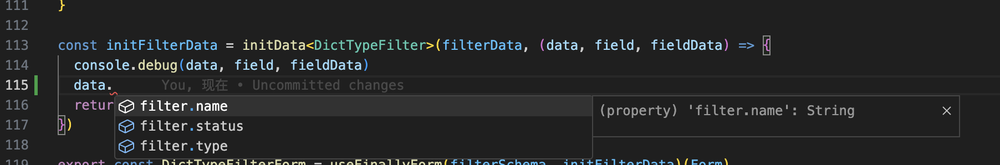
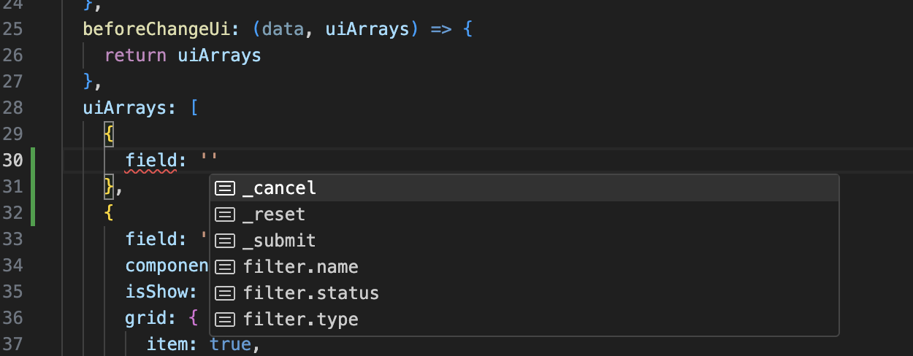
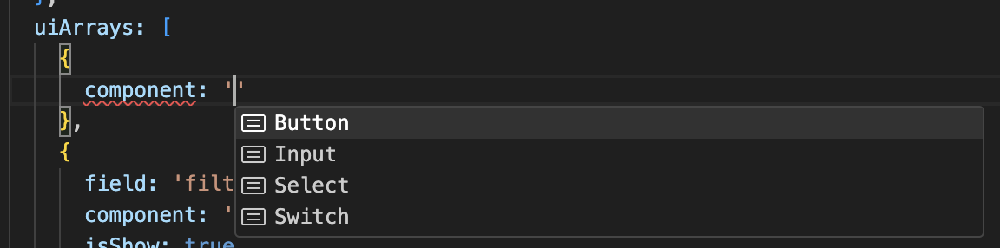

## 自定义表单实现思路
* 目前的自定义表单使用MU. 进行设计绑定的
### 大致思路
```plantuml
rectangle 自定义表单组件 as CustomForm{
  rectangle 内容共享层 as ReactContext {
    rectangle 布局层 as ReactComponent {
      rectangle 异步请求HOC as withAsync {
        rectangle 数据交互HOC as withContextConnect {
          rectangle Select
        } 
      }
      rectangle 数据交互HOC as withContextConnect1 {
        rectangle Input
      }
      rectangle 数据交互HOC as withContextConnect2 {
        rectangle Switch
      }
      rectangle Button
    }
  }
}
```
* 解释:
* 自定义表单组件: 指的是整个表单组件
* 内容共享层(Redux): 抽出表单的全部共享数据, 包括校验数据等
* 异步请求层HOC: 封装整个异步请求逻辑, 此层用于扩充异步请求的逻辑
* 数据交互HOC: 负责统一与内容层交互内容的修改, 只开放能直接使用的方法往下传递, 降低编写单个组件的心智

### 校验实现思路
```plantuml
:抽象的校验Object;
:传入自定义表单;
:保存在内容共享层;
note right: 除非重新渲染, 否则无法更改
:数据交互HOC;
note right: 根据字段获取对应Object初始化yup校验规则
:传入实际组件;
note right: 组件选地方使用即可
```
### 数据结构
* 数据结构主要分三块.
1. 格式 jsonSchema. 
```ts
export type UiArraysType<T> = Array<FromFieldType<T> | ChildrenCustomJsonFrom<T>>
export type CustomJsonFrom<T = any> = {
  // 暂时只支持一种布局格式
  // layoutMode: 'grid' | 'flex'
  layoutMode: 'flex'
  gridContainer: GridProps // 此处参考 https://mui.com/material-ui/api/grid/
  uiArrays: UiArraysType<T>
  // 此方法不涉及深拷贝, 谨慎修改值
  beforeChangeUi?: (data: T, uiArrays: UiArraysType<T>, prevUiArrays: UiArraysType<T>) => UiArraysType<T>
}
```
* 其中的beforeChangeUI. 每次可以修改组件的显示隐藏, 或是直接删除组件. 主要用于修改组件的布局
* 有格式其实可知. uiArrays 是允许嵌套结构的. 能支持表单布局的嵌套. 

2. 数据 data 
```ts
interface type<T> {
    data: T;
    afterDataReducer: AfterDataReducer<T>
    validation: InitFormValidation<T>;
}
```
* data: 表单初始值
* afterDataReducer: 数据更新后执行方法
* validation: 字段的校验规则


### 新增组件方式 
1. 扩充组件(可选). 有值组件需要实现setDate方法将绑定值交由, 自定义表单统一管理
2. SimpleForm/mui/widgets/index.ts 文件下添加, 一个组件即可
3. 在同级的SimpleForm/mui/widgets/types.ts类型, 将组件的提示给放进去, 扩充类型提示.

#### 无值组件
* 无需绑定值的组件, 只用来占位或者是调整样式结构 
0. 跳过第一步
1. 自定义表单根目录下添加一个MUI的无状态组件即可 

* 例如:此处的 Button, 添加好对应的组件即可
2. 再添加进对应组件的类型提示即可


#### 有值组件
* 有绑定值的组件, 用来填充自定义表单的内容
1. 扩充有绑定值组件的实现.
    
    * 核心在于setData方法, 通过数据交互HOC装饰后, 必定会从组件传入一个setData方法, 只需要将这个setData方法与组件的值修改所绑定即可.
    * 当对setData方法做一些安全性校验使用或者和组件原有方法融合一下, 能达原生融合自定义表单以及基础组件的效果

2. 新增组件内容, 并且使用值绑定HOC进行修饰


3. 再添加进对应组件的类型提示即可


#### 有值带校验组件
* 在有绑定值的基础上,扩充值校验功能
1. 扩充有绑定值组件的实现.
    
    * 核心在于validation方法, (实现使用的是yup校验模块)
    * 在组件值返回的时候, 找个合适的机会将值使用validation 方法进行验证即可.
2. 之后的步骤相同
### Demo
```tsx
// 初始化容器布局格式, 
const filterSchema:CustomJsonFrom<ObjExtendButton<DictTypeFilter>> = ({
  layoutMode: 'flex',
  gridContainer: {
    // 认为是容器
    container: true,
    // 默认 12 列
    columns: 12, 
    // 容器间隙
    spacing: 2,
    // 多屏适配 xs sm md lg xl 
    // xs: 12,
    display: 'flex',
    justifyContent: 'center',
    alignItems: 'center'
  },
  // 此处可修改容器
  beforeChangeUi: (data, uiArrays) => {
    return uiArrays  
  },
  uiArrays: [
    {
      field: 'filter.type',
      component: 'Input',
      isShow: true,
      grid: {
        item: true,
        xs: 4
      },
      Input: {
        label: <FormattedMessage id='code'/>,
        className: 'w-full',
      }
    },
    {
      field: 'filter.name',
      component: 'Input',
      isShow: true,
      grid: {
        item: true,
        xs: 4
      },
      Input: {
        label: <FormattedMessage id='name'/>,
        className: 'w-full'
      }
    },
    {
      field: 'filter.status',
      component: 'Switch',
      isShow: true,
      grid: {
        item: true,
        xs: 2,
        className: 'flex flex-col justify-start'
      },
      Switch: {
        labelProps: {
          label: <FormattedMessage id='isDelete'/>,
        },
        switchProps: {}
      }
    },
    {
      field: '_submit',
      component: 'Button',
      isShow: true,
      grid: {
        item: true,
        xs: 1,
        className: 'justify-center'
      },
      Button: {
        variant: "contained",
        children: <FormattedMessage id='search'/>,
        startIcon: <SearchIcon />
      }
    },
    {
      field: '_reset',
      component: 'Button',
      isShow: true,
      grid: {
        item: true,
        xs: 1,
        className: 'justify-center' 
      },
      Button: {
        variant: "outlined",
        children: <FormattedMessage id='reset'/>,
        startIcon: <RestartAltIcon />
      }
    }
  ]
})

// 初始化表单实例
const Form = useForm<DictTypeFilter>()

// 表单各个字段默认值
const filterData: ObjExtendButton<DictTypeFilter> = {
  "filter.name":"",
  "filter.type":"",
  "filter.status":"",
}

// 初始化data部分数据, 主要分三部分
// 初始值, 后置方法, 以及校验规则
const initFilterData = initData<DictTypeFilter>(filterData, (data, field, fieldData) => {
  console.debug(data, field, fieldData)
  return data;
})

// 创建最终表单 
export const DictTypeFilterForm = useFinallyForm(filterSchema, initFilterData)(Form)
```
* uiArrays 的类型以及内容提示, 可以通过isShow来改变组件的显示隐藏

* 基本所有方法所有值都有类型提示


* 结构层也有类型提示, 根据需要初始化的表单接口不同, 动态提示

