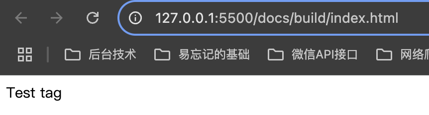
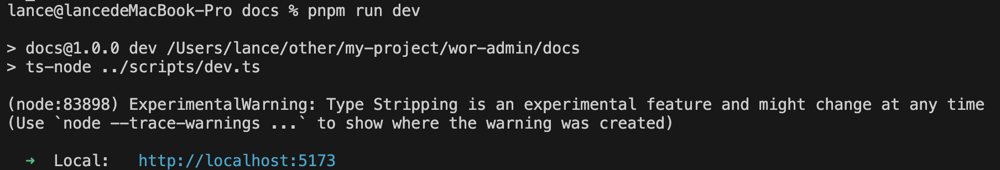
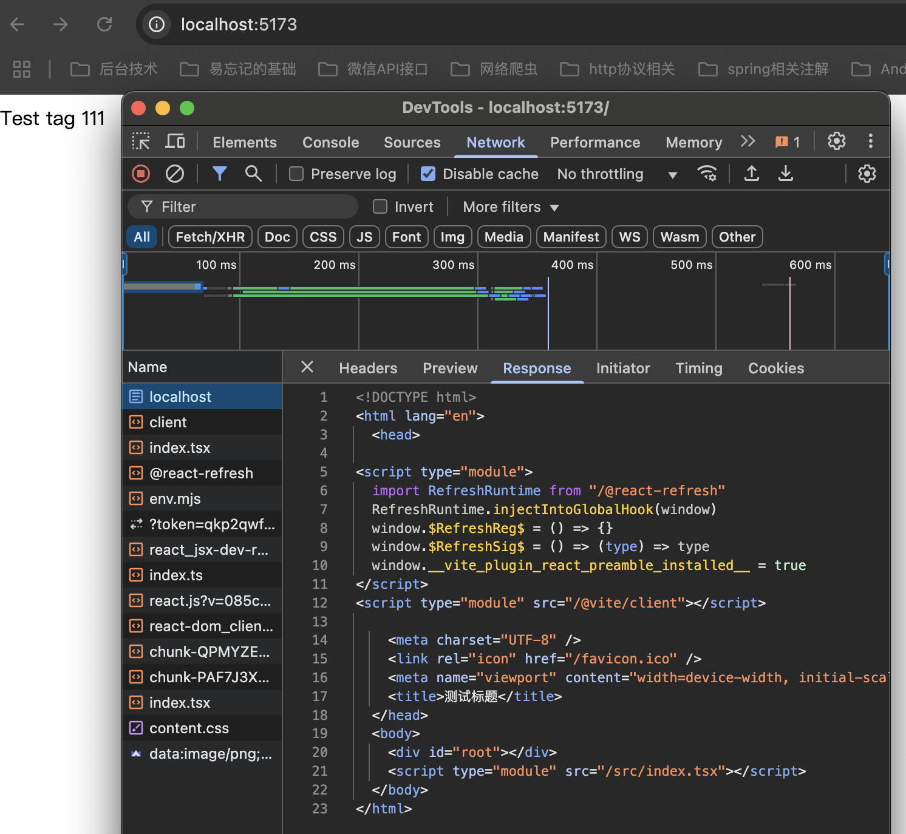

## monorepo 管理方式

### lerna

- 一个非常成熟的模块化管理工具
- [官方文档](https://lerna.js.org/docs/getting-started)

### 安装

```sh
# 全局安装后续不用加 npx 命令
npm install lerna -g
```

### 初始化

```shell
# 初始化 lerna 项目
$ npx lerna init --packages="packages/*"
# 添加缓存
$ npx lerna add-caching
```

### 构建子模块

- 建组去 npm 官网建组即可

```sh
# 创建一个单独的包模块
npx lerna create form-core
# 按照提示输入命令即可
# 包名设置为 @w-lab/form-core，后面用得到
# 创建一个文档模块，web端 引入
npx lerna create docs
```

### 查看子项目

```sh
npx lerna list
# or
npx lerna ls
```

### 安装依赖

```sh
# 安装内部依赖
pnpm add -D typescript --filter=@w-lab/form-core
pnpm add react react-dom --filter=@w-lab/form-core

# 安装全局依赖
pnpm add -D @types/react -w
```

### 常用命令

- [官网](https://lerna.nodejs.cn/docs/api-reference/commands)

### 配置模块

- 配置两个模块做演示

```sh
npx lerna create form-core
npx lerna create docs
```

### 创建统一打包脚本

- 先根目录下创建 srcirpts/virtualHtmlPlugin.ts 创建一个虚拟 Html 插件，用于运行打包时用于各个子项目自动加载 html 模板

```ts
import { type ViteDevServer } from "vite";

type HtmlTemplateOptions = { title: string; favicon: string };

// dev模式必须加这段代码，否则无法热更新和加载组件
const devServerHtml = `
<script type="module">
  import RefreshRuntime from "/@react-refresh"
  RefreshRuntime.injectIntoGlobalHook(window)
  window.$RefreshReg$ = () => {}
  window.$RefreshSig$ = () => (type) => type
  window.__vite_plugin_react_preamble_installed__ = true
</script>
<script type="module" src="/@vite/client"></script>
`;

// virtualHtmlPlugin.ts
// public html tamplate
const htmlTemplate = (
  { title, favicon }: HtmlTemplateOptions,
  isDev: boolean = false
) =>
  `
<!DOCTYPE html>
<html lang="en">
  <head>
    ${isDev || devServerHtml}
    <meta charset="UTF-8" />
    <link rel="icon" href="${favicon}" />
    <meta name="viewport" content="width=device-width, initial-scale=1.0" />
    <title>${title}</title>
  </head>
  <body>
    <div id="root"></div>
    <script type="module" src="/src/index.tsx"></script>
  </body>
</html>
`.trim();

export default function virtualHtmlPlugin(config: HtmlTemplateOptions) {
  const buildHtml = htmlTemplate(config);
  const devHtml = htmlTemplate(config, true);
  return {
    name: "virtual-html",
    configureServer(server: ViteDevServer) {
      server.middlewares.use((req, res, next) => {
        if (req.url === "/" || req.url === "/index.html") {
          res.statusCode = 200;
          res.setHeader("Content-Type", "text/html");
          res.end(buildHtml);
          return;
        }
        next();
      });
    },
    resolveId(id: string) {
      // 当请求 index.html 时，返回一个自定义的标识符
      if (id === "index.html") {
        return id;
      }
    },
    load(id: string) {
      if (id === "index.html") {
        // 返回内存中的 HTML 字符串
        return devHtml;
      }
    },
  };
}
```

- 模板 title,favicon 配置，交由环境变量管理,在对应的模块下创建环境变量文件.env, 注入变量即可

```txt
APP_TITLE = 测试标题
APP_FAVICON = /favicon.ico
```

- 再创建 srcirpts/build.ts 统一的 vite build 脚本

```ts
// build.ts 统一build脚本，运行位置在对应模块的目录下配置
import { build, defineConfig } from "vite";
import react from "@vitejs/plugin-react";
import dts from "vite-plugin-dts";
import yargs, { type ArgumentsCamelCase } from "yargs";
import path from "path";
import fs from "fs/promises";
// ts-node 启动必须带.ts后缀才会编译文件执行
// @ts-ignore
import virtualHtmlPlugin from "./virtualHtmlPlugin.ts";

async function run(
  argv: ArgumentsCamelCase<{
    mode: "lib" | "app";
    outDir: string;
    verbose: boolean;
  }>
) {
  const { mode, outDir, verbose } = argv;
  // 假设 monorepo 的结构是：根目录/packages/<pkgName>
  const pkgDir = process.cwd();
  const pkgJsonPath = path.join(pkgDir, "package.json");
  const pkgJson = JSON.parse(await fs.readFile(pkgJsonPath, "utf8"));

  // 默认入口文件为 src/index.ts
  const entry = path.join(pkgDir, "src", "index.ts");

  // 统一的基础配置
  const baseConfig = {
    root: pkgDir,
    resolve: {
      alias: {},
    },
    build: {
      sourcemap: true,
      outDir: path.resolve(process.cwd(), outDir),
    },
  };

  let config;
  if (mode === "lib") {
    // 库模式配置：支持生成 ESM/CJS 格式，外部依赖（比如 react）不打包进来
    config = defineConfig({
      ...baseConfig,
      plugins: [
        react(),
        // 生成类型声明文件（如果需要）
        dts({
          insertTypesEntry: true,
          // 这里的 entry 可以配置为你的入口类型文件
          entryRoot: path.join(pkgDir, "src"),
        }),
      ],
      build: {
        ...baseConfig.build,
        lib: {
          entry,
          name: pkgJson.name,
          // fileName: (format) => `${pkgJson.name}.${format}.js`,
        },
        rollupOptions: {
          // 声明外部依赖，不将其打包到库中
          external: ["react", "react-dom"],
          output: {
            globals: {
              react: "React",
              "react-dom": "ReactDOM",
            },
          },
        },
      },
    });
  } else {
    // 读取环境变量的值
    const { APP_TITLE, APP_FAVICON } = process.env;
    // Web 应用模式配置：通常不需要生成库模式相关的选项
    config = defineConfig({
      ...baseConfig,
      root: pkgDir,
      plugins: [
        react(),
        virtualHtmlPlugin({
          title: APP_TITLE || "Default Title",
          favicon: APP_FAVICON || "/favicon.ico",
        }),
      ],
      build: {
        ...baseConfig.build,
        rollupOptions: {
          input: "index.html",
        },
        // 可以添加应用特定的配置
      },
    });
  }

  if (verbose) {
    console.log("使用的 Vite 配置：");
    console.log(JSON.stringify(config, null, 2));
  }

  // 调用 Vite API 开始构建
  await build(config);
  console.log(`构建成功！输出目录：${baseConfig.build.outDir}`);
}

// 解析命令行参数
yargs(process.argv.slice(2))
  .command(
    "$0 <mode>",
    "build <mode>",
    (yargs) => {
      return yargs
        .positional("mode", {
          type: "string",
          choices: ["lib", "app"],
          default: "lib",
          description: "构建模式：lib 构建为库（npm 包），app 构建为 Web 应用",
        })
        .option("outDir", {
          type: "string",
          default: "./build",
          description: "打包后输出路径",
        })
        .option("verbose", {
          type: "boolean",
          default: false,
          description: "是否显示详细日志",
        });
    },
    run
  )
  .help()
  .strict()
  .version(false)
  .parse();
```

- 再创建 srcirpts/dev.ts 统一的 vite dev 脚本

```ts
// dev.ts
import { createServer, defineConfig } from "vite";
import react from "@vitejs/plugin-react";
import path from "path";
import fs from "fs/promises";
import yargs, { type ArgumentsCamelCase } from "yargs";
// ts-node 启动必须带.ts后缀才会编译文件执行
// @ts-ignore
import virtualHtmlPlugin from "./virtualHtmlPlugin.ts";
import dotenv from "dotenv";

// 加载环境变量
dotenv.config();

async function run(
  argv: ArgumentsCamelCase<{
    port: number;
    proxyUri: string;
  }>
) {
  const pkgDir = process.cwd();
  const pkgJsonPath = path.join(pkgDir, "package.json");
  const pkgJson = JSON.parse(await fs.readFile(pkgJsonPath, "utf8"));
  const pkgName = pkgJson.name;
  // 读取环境变量的值
  const { APP_TITLE, APP_FAVICON } = process.env;

  // app 模式需要确保 pkgDir 下有 index.html 文件
  const config = defineConfig({
    root: pkgDir,
    plugins: [
      react(),
      virtualHtmlPlugin({
        title: APP_TITLE || "Default Title",
        favicon: APP_FAVICON || "/favicon.ico",
      }),
    ],
    server: {
      port: argv.port,
      open: true,
    },
    build: {
      outDir: path.resolve(process.cwd(), "build", pkgName),
    },
  });
  const server = await createServer(config);
  await server.listen();
  console.info();
  console.info(
    "  \x1b[32m%s\x1b[0m  Local:   \x1b[36m%s\x1b[0m",
    "➜",
    `http://localhost:${argv.port}`
  );
}

// 解析命令行参数
yargs(process.argv.slice(1))
  .command(
    "$0 <mode>",
    "build <mode>",
    (yargs) => {
      return yargs
        .option("port", {
          type: "number",
          default: "5173",
          description: "运行端口",
        })
        .option("proxyUri", { type: "string", description: "代理地址" });
    },
    run
  )
  .help()
  .strict()
  .version(false)
  .parse();
```

### 使用统一脚本

```sh
# 按照文件路径在对应的模块加入 package.json 中添加打包命令
# form-core
"build": "ts-node ../../scripts/build.ts lib",
# docs
"build": "ts-node ../scripts/build.ts app",
"dev": "ts-node ../scripts/dev.ts",
# docs 引入 form-core
"@w-lab/form-core": "workspace:^",
```

- 在 form-core 模块加入测试代码

```tsx
"use client";
const TestCompontent = () => {
  return <div>Test tag</div>;
};
export { TestCompontent };
```

- 在 docs 模块中使用该代码

```tsx
import { TestCompontent } from "@w-lab/form-core";
import React from "react";
import ReactDOM from "react-dom/client";

const app: null | Element = document.getElementById("root"); // 避免 id 重复导致微应用挂载失败

ReactDOM.createRoot(app as Element).render(
  <React.StrictMode>
    <TestCompontent />
  </React.StrictMode>
);
```

- 分别打包，测试一下，最终效果，查看一下 docs 的打包引入效果
  

- 运行一下开发环境的服务器试试
  
  
- 其中的`(node:83898) ExperimentalWarning` 警告关不掉，ts-node 比较新这个测试功能无法关闭

/App.tsx 应用层统一入口文件
import { DarkTheme, LightTheme, ThemeProvider } from "@w-lab/tailwind-theme";
import React, { Suspense } from "react";
import { AuthProvider } from "./common/auth/AuthProvider";
import { BrowserRouter, HashRouter, Route, Routes } from "react-router";
import { routes } from './routes/common';

const App = ({ isSsr = false }: { isSsr: boolean }) => {
  const CurrentRouter = isSsr ? BrowserRouter : HashRouter
  return <ThemeProvider themeGroup={{ light: LightTheme, dark: DarkTheme, custom: LightTheme }}>
    <AuthProvider>
      <CurrentRouter>
        <Suspense fallback={<div>Loading...</div>}>
          <Routes>
            {routes.map((r) => (
              <Route path={r.path} element={r.element} key={r.path} />
            ))}
          </Routes>
        </Suspense>
      </CurrentRouter>
    </AuthProvider>
  </ThemeProvider>
}

export default App

/entry-server.tsx 服务端入口文件
import React, { Suspense } from 'react';
import { renderToPipeableStream, renderToString } from 'react-dom/server';
import App from '../App';
import { StaticRouter } from 'react-router';
import { routes } from '../routes/common';
import { AuthProvider } from '../common/auth/AuthProvider';
import '../common/i18n/i18n';
import { DarkTheme, LightTheme, ThemeProvider } from '@w-lab/tailwind-theme';

// SSR 渲染函数，由你的服务器调用
export const render = (
  url: string,
  manifest: Record<string, string[]>,
) => {
  const matched = routes.find(r => r.path === url);
  const helmetContext = {
    helmet: {
      title: 'title',
      meta: ''
    }
  }
  const app = (
    <App isSsr={true} />
  );
  const html = renderToPipeableStream(app)
  return html
}

/server.ts SSR开发或生产时启动脚本
// server.ts
import express from 'express';
import fs from 'fs/promises';
import path from 'path';
import type { ViteDevServer } from 'vite';
import virtualHtmlPlugin, { htmlTemplate } from './plugins/virtualHtmlPlugin.ts';
import dotenv from 'dotenv';
import { getWorkspaceRoot } from './utils/index.ts';
import injectTailwindPlugin from './plugins/injectTailwindPlugin.ts';
import tailwindcss from '@tailwindcss/vite';
import react from '@vitejs/plugin-react';
import { env } from 'process';

// 加载环境变量
dotenv.config();

function getBasePath(raw: string) {
  try {
    // 如果 raw 是完整的 URL，就返回它的 pathname
    return new URL(raw).pathname;
  } catch {
    // 不是 URL，那就假设它本身就是一个路径，直接返回
    return raw;
  }
}

const isProd = process.env.NODE_ENV === 'production';
const port = Number(process.env.PORT) || 8000;
const rawBase = process.env.BASE || '/';

const base = getBasePath(rawBase);

const app = express();

let vite: ViteDevServer | undefined;
let template: string;
let ssrRender: (
  url: string,
  manifest: Record<string, string[]>,
) => Promise<{
  head?: string;
  html: string;
}>;

let ssrManifest: Record<string, string[]> = {};

async function init() {
  if (!isProd) {
    // 开发模式
    const { createServer } = await import('vite');
    // 注入tailwindcss
    // 读取 Tailwind 生成的全局 CSS 路径
    const workspaceRoot = getWorkspaceRoot();
    const tailwindCssPath = path.join(workspaceRoot, 'tailwindcss', 'dev.css');

    vite = await createServer({
      server: { middlewareMode: true },
      mode: 'ssr',
      resolve: {
        alias: {
          '@w-lab/form-core': path.resolve(workspaceRoot, 'packages/form-core/src'),
          '@w-lab/wui-material': path.resolve(workspaceRoot, 'packages/wui-material/src'),
          '@w-lab/tailwind-theme': path.resolve(workspaceRoot, 'packages/tailwind-theme/src'),
        },
      },
      plugins: [
        injectTailwindPlugin(tailwindCssPath), // 把 Tailwind CSS link 注入到 template
        tailwindcss(), // Vuetify Tailwind 插件
        react(), // React 插件
        virtualHtmlPlugin({
          title: process.env.APP_TITLE as string,
          favicon: process.env.APP_FAVICON as string,
          isDev: true,
          mode: 'ssr',
        }),
      ],
      appType: 'custom',
      base,
    });
    app.use(vite.middlewares);
  } else {
    const pkgDir = process.cwd();
    // 生产模式：预加载模板、Manifest 与 SSR handler
    const clientDist = path.resolve(pkgDir, 'build/client');
    const serverDist = path.resolve(pkgDir, 'build/server');

    // 1. HTML 模板
    template = await fs.readFile(path.join(clientDist, 'index.html'), 'utf-8');

    // 2. SSR manifest
    const manifestJson = await fs.readFile(
      path.join(clientDist, '.vite/ssr-manifest.json'),
      'utf-8',
    );
    ssrManifest = JSON.parse(manifestJson);

    // 3. SSR 渲染函数
    const { render } = await import(path.join(serverDist, 'entry-server.mjs'));
    ssrRender = render;

    // 4. 静态资源
    const compression = (await import('compression')).default;
    const sirv = (await import('sirv')).default;
    app.use(compression());
    app.use(base, sirv(clientDist, { extensions: [] }));
  }
}

app.get(base, async (req, res) => {
  try {
    const url = req.originalUrl.replace(base, '/');

    if (!isProd) {
      // 每次请求都重新加载最新代码
      let devHtml = await vite!.transformIndexHtml(url, '');
      const { render } = await vite!.ssrLoadModule('/src/server/entry-server.tsx');
      const { head, html } = await render(url, {});
      res
        .status(200)
        .set({ 'Content-Type': 'text/html' })
        .send(devHtml.replace('<!--app-head-->', head ?? '').replace('<!--app-html-->', html));
    } else {
      // 生产环境：使用缓存
      const { head, html } = await ssrRender(req.url, ssrManifest);
      res
        .status(200)
        .set({ 'Content-Type': 'text/html' })
        .send(template.replace('<!--app-head-->', head ?? '').replace('<!--app-html-->', html));
    }
  } catch (e: any) {
    if (!isProd) vite?.ssrFixStacktrace(e);
    console.error(e.stack);
    res.status(500).send(e.stack);
  }
});

init()
  .then(() => {
    app.listen(port, () => {
      console.log(
        `🚀 Server running at http://localhost:${port} [${isProd ? 'production' : 'development'}]`,
      );
    });
  })
  .catch((err) => {
    console.error('❌ Server start failed:', err);
    process.exit(1);
  });
