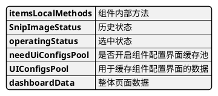
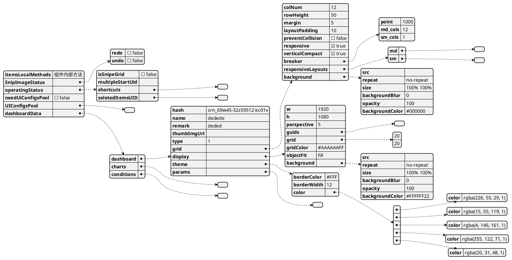
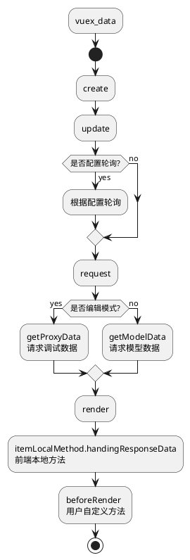

## 宏图BI可视化前端架构
### 概述
* 此文档主要是描述清楚, 宏图BI前端工程架构的架构原理以及思路, 重在描述, 不涉及任何技术, 架构上的优劣讨论

### 项目基础结构
```tree
.
├── dist 
├── favicon.ico
├── index.html
├── package.json
├── public
├── readme.md
├── src 
│   ├── App.vue
│   ├── assets
│   │   ├── css
│   │   │   ├── ons.css
│   │   │   └── theme.css
│   ├── main.js
│   ├── mixin
│   │   ├── back
│   │   ├── itemBase
│   │   ├── root
│   │   └── vue-bus
│   ├── pages
│   │   ├── error-403
│   │   ├── error-404
│   │   ├── exp-transition
│   │   ├── form-editor
│   │   ├── form-player
│   │   ├── index.js
│   │   ├── login
│   │   ├── main-org
│   │   ├── main-spc
│   │   ├── model-editor
│   │   ├── orgpages
│   │   ├── public
│   │   ├── screen-editor
│   │   ├── screen-player
│   │   ├── spcpages
│   │   ├── t-login
│   │   └── thumbnails
│   ├── parts
│   │   ├── aq
│   │   │   ├── canvas
│   │   │   ├── chart
│   │   │   ├── images
│   │   │   ├── interface
│   │   │   ├── transition
│   │   │   └── upload
│   │   ├── gc
│   │   ├── index.js
│   │   └── wg
│   ├── restful
│   │   ├── apis
│   │   │   ├── index.js
│   │   ├── index.js
│   │   ├── init
│   │   │   └── init.js
│   │   └── pipes
│   ├── router
│   │   └── index.js
│   ├── store
│   │   ├── index.js
│   │   ├── modules
│   │   │   ├── bms
│   │   │   ├── menus
│   │   │   ├── modelEdit
│   │   │   ├── msg
│   │   │   ├── power
│   │   │   └── user
│   │   └── stores
│   │       └── index.js
│   ├── utils
│   │   └── date-time.js
│   ├── visuals
│   │   ├── 01-text
│   │   ├── 02-charts
│   │   ├── 03-table
│   │   ├── 04-condition
│   │   ├── 05-target-board
│   │   ├── 06-cards
│   │   ├── 07-event
│   │   ├── index-comp.js
│   │   ├── index-config.js
│   │   ├── index-init.js
│   │   └── index-methods.js
│   └── vue-prototype
├── style.css
├── vite.config.eg.js
└── vite.config.js
```

* src 源码根目录
* assets 静态资源目录, 用于存放 css、icon、font、img 等静态资源
* mixin 通用可继承的vue根组件, 不是一个完整的组件, 只是实现了某件单一的功能而抽象出来的一个mixin, 
  1. root 主要是一些通用的公共方法, 在项目初始化时, 就将此mixin全局注册到每个vue组件上去, 使得每个组件都能用到这上面已经注册好的方法或功能
  2. itemBase 可视化组件的核心流程方法(模板设计模式)的抽象, 将整个可视化组件的生命周期定义成了一整个流程, 整个生命周期将在此处体现, 其他组件开发时只需引入这个mixin组件, 就能继承可视化组件的生命周期
  3. vue-bus 可视化组件的消息总线, 使用观察者模式封装了整个消息总线的通讯机制, 此处需要实现完整通信的组件已经配置好, 后续几乎没有使用到这个mixin的场景
  4. back 拦截返回组件, 封装拦截返回功能组件, 拦截当前页面的所有返回监听, 弹窗提示, 同意则返回, 不同意则拦截
* pages 页面源码目录, 根目录下会有个index.js文件负责遍历当前文件夹目录, 生成全部路由代码, 此处创建页面代码时需要按照index.js遍历的规范来创建
* parts 组件源码目录, 主要分为aq组件与wg组件
  * aq类组件, 主要类似于各种UI库的形式(Element, Ant Design等), 只注重UI展示与交互的封装, 不涉及单独业务的污染
  * wg类组件, 主要是基于页面块级组件的封装, 可被项目中的独特业务的污染, 例如很多地方都要用到同一个模块来展示相同的数据
* restful 接口请求统一配置, 其中请求也涉及到统一请求的封装, 以及api自动注入的方式, 导致新增新的API的时候需要按照自动注入方式, 接收请求的结构配置新的接口以及入参
  * apis 接口文件配置, 根目录下有个index.js文件, 用于遍历对应的文件属性, 并且向外统一抛出所有的接口配置
  * init 文件夹下, 存放的是 axios 的封装版请求, 在 axios 外层套了一个类似于洋葱的可拓展的壳
  * pipes 下, 存放axios外壳的插件
  * index.js 最终向外抛出封装好的 axios 请求方法与所有接口
* router 项目路由的统一配置
* store 该项目中所有的vuex中的数据定义, 包括编辑器里面的, 菜单栏数据, 用户数据, 权限数据等
* utils 常用工具包
* visuals 可视化组件源码, 根目录有4个index前缀的文件, 用于遍历其他文件夹下的组件内容, 组件, 配置面板, 初始值, 默认方法等, 然后全局注册进项目中, 在新增组件时, 需要遵守一定的规范进行新增操作

#### 自动注入
* 项目中的基础结构中用到了大量的自动注入组件,路由,api,属性面板等方式, 在导致参与此项目时, 对其他组件的位置, 问题定位, 加载方式, 以及开发时应该遵守的一些莫名的规范会有些不知所措. 再此提及一下各个模块自动注入原理, 以及方式

#### 页面组件
* 以下就是页面组件的整体自动注入过程
1. 创建新页面时, 需要有个路由文件, 路由文件以`.js`结尾即可
2. 自动注入的页面, 会以当前组件的父文件夹名称作为组件名称(父文件夹[parent-page] => 结果:ParentPage), 全局注册进vue中

```plantuml
folder "pages" as pages
file "index.js" as js
storage "object" as routerJson
file "router/index.js" as router
file "src/main.js" as main

pages -> js: 遍历文件夹内容
js --> routerJson: 生成全体页面的router对象
routerJson-left-> router: 获取页面路由全体对象
router-->main: 获取路由配置对象, 注册进vue中
```

#### 组件
* 以下是parts组件的自动注入过程
1. 创建新组件时, 需要有个组件懒加载文件, 文件以`.cp.js`,`.wg.js`,`.gc.js`结尾即可, 分别对应aq, wg, gc类型的组件
2. 自动注入的页面, 会以当前组件的父文件夹名称作为组件名称(父文件夹[parent-page] => 结果:ParentPage), 全局注册进vue中
```plantuml
folder "parts" as parts
file "parts/index.js" as js
storage "vue" as vue

parts -> js: 遍历文件夹内容
js -> vue: 全局注册
```

#### api(axios)
* 以下是 api 接口的自动注入过程
```plantuml
file "restful/init.js" as init
usecase "Axioser" as axioser
folder "apis" as apis
file "apis/index.js" as apijs
folder "pipes" as pipes
file "restful/index.js" as js

storage "packPath" as packPath {
  storage "pluckData" as pluckData {
    storage "encryptData" as encryptData {
      storage "packToken" as packToken {
        storage "formdata" as formdata {
          usecase "axios"
        }
      }
    }
  }
}
usecase "api"

init --> axioser: 创建 axios 包装器
apis --> apijs: 遍历汇总所有接口
axioser --> js: 获取axios包装器
pipes -left-> js: 组件库
apijs -right-> js: 透传api配置
js --> packPath: 对外抛出 实际改造过的axios请求方法
js --> api: 对外抛出api集合
```
* 改造后的 axios 实际请求过程, (实际过程是层层返回的, 只是返回后各个插件并没做任何操作)
```plantuml
actor user as user
control packPath as pack
control pluckData as pluck
control encryptData as encrypt
control packToken as token
control formdata as formdata
control axios as axios
participant HTTP as http

user -> pack: z发起请求
pack -> pluck: 替换地址段参数
pluck -> encrypt: 预制参数替换
encrypt -> token: 数据md5加密
token -> formdata: 自动塞token
formdata -> axios: 数据打包
axios -> http: 请求发送
http -> user: 请求结果返回
```

#### 可视化组件
* 组件页面注入, 与其他组件注入类似的操作
1. 创建新组件时, 需要有个组件懒加载文件, 文件以`.vue.js`结尾即可
2. 自动注入的页面, 会以当前组件的父文件夹名称作为组件名称(父文件夹[parent-page] => 结果:ParentPage), 全局注册进vue中
```plantuml
folder "visuals" as parts
file "visuals/index-comp.js" as js
storage "vue" as vue

parts -> js: 遍历文件夹内容
js -> vue: 全局注册
```

* 组件配置注入
1. 其中新组件的配置文件, 默认值文件, 本地方法文件, 分别以`.cg.js`、`.in.js`、`.fn.js` 结尾

```plantuml
folder "visuals" as visuals
file "visuals/index-config.js" as configjs
file "visuals/index-init.js" as initjs
file "visuals/index-methods.js" as methodjs

file "store/bms/bms-store.js" as bmsStore
file "store/index.js" as store

storage "vuex" as vuex


visuals --> configjs: 遍历组件配置
visuals --> initjs: 遍历配置默认值
visuals --> methodjs: 遍历组件本地方法
configjs --> bmsStore
initjs --> bmsStore: 组合对象
methodjs --> bmsStore
bmsStore --> store: 获取组合好的对象
store --> vuex: 根据情况写入Vuex中, 交由管理
```

### 编辑器架构
#### vuex数据
* bms_store摘要结构

* bms_store详情结构

#### 界面dom架构
* 以下则是编辑器的基础dom架构

```plantuml
@startsalt
{^"编辑页面"
  {+
    各
    种
    组
    件
    分
    类
    菜
    单
    .
  }{+
    页面
    所用
    组件
    列表
    .
    .
    .
    .
    .
  }{+
    编辑面板
    {+
      辅助工具、画板尺寸
      {+
        container
        {+
          ^droplist^
        }
      }{+
        container
        {+
          实际组件
        }
      }
      {+
        container
        {#
          . | Column 2 | Column 3
          Row 1 | value 1 | value 2
          Row 2 | A long cell | *
        }
      }{+
        container
        {+
          "更多其他"
        }
      } 
    }
  }{+
    属性
    配置
    面板
    .
    .
    .
    .
    .
    .
  }
}
@endsalt
```


#### 组件的添加
```plantuml
actor actor as actor
component menus
storage vuex {
  usecase "bms_store/dashboardData/charts" as bms_store
  control add

  bms_store <-> add
}

rectangle "画板" as board 

rectangle "组件列表" as list

actor -right-> menus: click
menus --> bms_store: 组件名称
bms_store --> board
bms_store --> list
```

#### 组件配置编辑
```plantuml
actor actor as actor
component "prop-edit" as propEdit
storage vuex {
  usecase "bms_store/operatingStatus" as bms_store
  usecase "bms_store/dashboardData/charts" as bms_stores
  control active

  bms_store <-> active
}

rectangle "画板" as board 

rectangle "组件列表" as list

actor --> board
actor --> list
board --> bms_store
list --> bms_store
bms_store --> propEdit
propEdit --> bms_stores: 写入配置
```

#### 事件传输机制
* 以下是事件传输机制
```plantuml
rectangle "container" as container {
  rectangle "筛选组件" as filter
  storage "下发配置" as sendConfig
}
rectangle "消息总线" as vueBus {

}
rectangle "container" as container2 {
  rectangle "展示组件" as view
  storage "update" as update
}

container -[hidden] vueBus
vueBus -[hidden] container2
container -right-> vueBus: 消息发送
vueBus -right-> container2: 消息广播
container2 -> view: 传递消息
sendConfig -> filter: 获取组装
filter -> container: 打包发送
view -> update
```
* 打包消息类型, 如下:
  1. remove: 删除vuex的各个条件缓存
  2. dependence: 联动事件, 主要是下发传送联动事件, 内部含有缓存池缓存数据
  3. condition: 条件事件, 与2类似, 其中内部还内置了两个代理事件
    * collect: 收集事件, 配置了该事件, 触发了条件事件, 会先把事件发给代理中心, 代理中心, 再发送到对应组件
    * intercept: 拦截事件, 配置了该事件, 触发了条件事件, 会先把事件发给代理中心, 然后再由用户主动触发代理中心
  4. event: 控制显示隐藏事件, 下发传输修改UI配置事件, 接受事件后修改组件的drager数据, 达到控制显隐的效果, 同时也可以用这个事件去修改其他的属性达到更丰富的功能和视觉展示
  5. clear: 主要是调用组件的clearData方法达到一个清空关联组件内部值的事件, 因为clearData可被重写,
  6. trigger: 触发事件, 主要是触发代理中心的触发事件(按钮组件)

* 以下是按钮组件处理机制
```plantuml
rectangle "container" as container {
  rectangle "筛选组件" as filter
  storage "下发配置" as sendConfig
}
rectangle "消息总线" as vueBus {

}

rectangle "按钮" as button

rectangle "container" as container2 {
  rectangle "展示组件" as view
  storage "更新生命周期" as update
}

container --> vueBus: 消息发送
vueBus -> button: 消息广播
button -> vueBus: 主动或自动
vueBus ..> container2
container2 -> view: 传递消息
sendConfig -> filter: 获取组装
filter -> container: 打包发送
view -> update
```

#### 组件生命周期
* 组件的渲染生命周期

* 以上就是一个完备可视化组件的完整生命周期, 每个生命周期都可根据不同组件的需要进行重写
  * resize、create、dispose、render 无默认实现
  * render, 这个生命周期方法必须被重写, 因为每个组件渲染方式必定不一样
  * resize、create、dispose、这三个方法, 在涉及到需要清除操作或者前置操作时, 按需重写

### 整体架构
