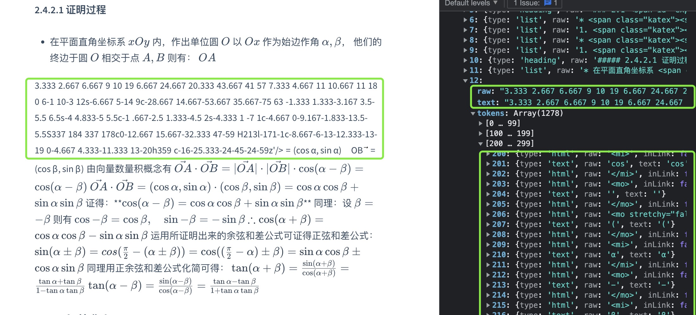

## Docsify Preview Plus
### 前言
* 因为我平常写的笔记还有文档需要搭建一个前端静态网站，需要和我目前写文档的Md编辑器（需要支持常用的嵌入latex表达式，plantuml，Vega-lite等功能）能达到同样的渲染效果，找了很多类似的渲染md内核除了作者[Yiyi Wang](https://github.com/shd101wyy)开发的vscode插件以及在线插件能复合我需要的要求， 其他的都不符合。所以故此写下这篇笔记

* 因为冲头写很麻烦，需要同时支持渲染功能和docsify那种静态自动热部署， 又能无缝嵌进github pages上。综合考虑，开刀 docsify 最合适

### 渲染 katex
#### 插件形式
* 开始写了个插件注的方式，在解析md字串前一步先将latex语言渲染成dom元素。
  js:
  ```js
  import katex from 'katex';
  // todo katex 替换
  export const install = function (hook, vm) {
    function getKatex(str) {
      let result = ""
      let katexStr = ""
      let isKatex = false
      for(let i = 0; i < str.length; i++) {
        if(str[i]=="$"){
          if(str[i+1]=="$"){
            i++
          }
          isKatex = !isKatex
          if(!isKatex && !!katexStr){
            result += katex.renderToString(katexStr)
            katexStr=""
          }
          continue
        }
        if(isKatex){
          katexStr += str[i]
        }else{
          result += str[i]
        }
      }
      return result;
    }
    hook.beforeEach(function (content) {
      try{
        const result = getKatex(content)
        console.log(result, "result")
        return result
      }catch(e){
      console.error(e)
      return content
      }
    })
  }

  $docsify.plugins = [].concat(install, $docsify.plugins);
  ``` 
  html:
  ```html
  <link rel="stylesheet" href="https://cdn.jsdelivr.net/npm/katex@0.16.0/dist/katex.min.css">
  ```
* 确实能自动渲染了，但是过早生成的\<svg\> 标签或者是dom标签过长有可能会导致,后续的md解析不到位
  例如：
  

* 虽然大部分都能正常解析了 但是后续的渲染导致有问题，所以暂时放弃插件形态

#### 扩展marked编辑器
* 没办法了。只能去修改tokens 里面的解析，新增一套解析 latex 表达式的语法规则，然后再调用katex进行渲染

### 渲染table
本以为直接支持，没想到啊，发现直接展示不出来。并且, 打开调试界面， 发现 `marked` 根本没解析 table 语法， 只能适配咯

#### 打开 gfm
* 阅读 `marked` 源码后发现` table `语法只在`gfm`模式下才识别

### 适配code块
* 放了个 ts 代码丢进去渲染， 都无法正确高亮， 看了下 `prismjs` 支持格式化的代码渲染太少了