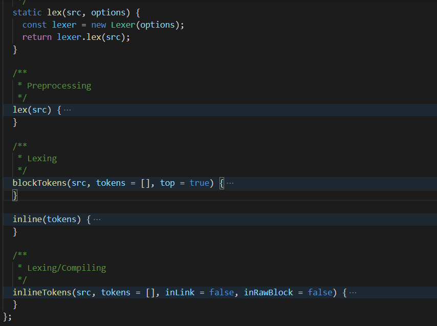
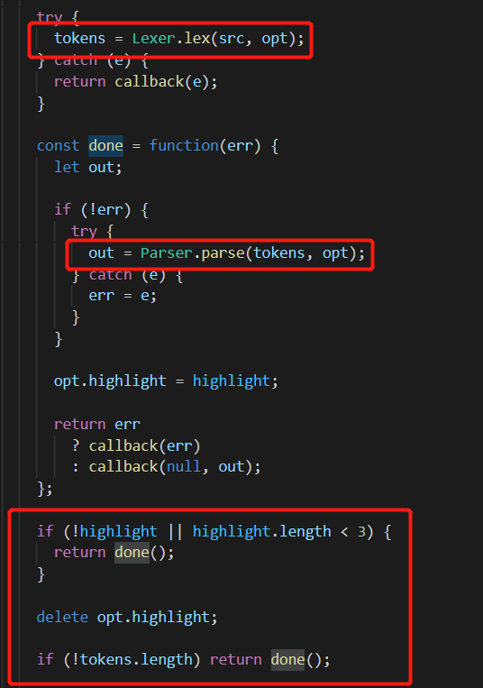

## Docsify Preview Plus
### 前言
* 因为我平常写的笔记还有文档需要搭建一个前端静态网站，需要和我目前写文档的Md编辑器（需要支持常用的嵌入latex表达式，plantuml，Vega-lite等功能）能达到同样的渲染效果，找了很多类似的渲染md内核除了作者[Yiyi Wang](https://github.com/shd101wyy)开发的vscode插件以及在线插件能复合我需要的要求， 其他的都不符合。所以故此写下这篇笔记

* 因为重头写很麻烦，需要同时支持渲染功能和docsify那种静态自动热部署， 又能无缝嵌进github pages上。综合考虑，开刀 docsify 最合适

### 扩展 katex
#### 需求
* 因为本人喜爱数学有时候会写一些数学的文章内容笔记，所以需要 docsify 支持 Katex 标记语言，但是原生为了轻量级，它本身是并不支持的， 下面是对拓展语法的一些尝试以及解决方案

#### 插件形式
* 开始写了个插件注的方式，在解析md字串前一步先将latex语言渲染成dom元素。
  js:
  ```js
  import katex from 'katex';
  // todo katex 替换
  export const install = function (hook, vm) {
    function getKatex(str) {
      let result = ""
      let katexStr = ""
      let isKatex = false
      for(let i = 0; i < str.length; i++) {
        if(str[i]=="$"){
          if(str[i+1]=="$"){
            i++
          }
          isKatex = !isKatex
          if(!isKatex && !!katexStr){
            result += katex.renderToString(katexStr)
            katexStr=""
          }
          continue
        }
        if(isKatex){
          katexStr += str[i]
        }else{
          result += str[i]
        }
      }
      return result;
    }
    hook.beforeEach(function (content) {
      try{
        const result = getKatex(content)
        console.log(result, "result")
        return result
      }catch(e){
      console.error(e)
      return content
      }
    })
  }

  $docsify.plugins = [].concat(install, $docsify.plugins);
  ``` 
  html:
  ```html
  <link rel="stylesheet" href="https://cdn.jsdelivr.net/npm/katex@0.16.0/dist/katex.min.css">
  ```
* 确实能自动渲染了，但是过早生成的\<svg\> 标签或者是dom标签过长有可能会导致,后续的md解析不到位
  例如：
  

* 虽然大部分都能正常解析了 但是后续的渲染导致有问题，所以暂时放弃插件形态

#### 扩展marked编辑器
* 没办法了。只能去修改tokens 里面的解析，新增一套解析 latex 表达式的语法规则，然后再调用katex进行渲染

1. 分析源码
* Lexer.js
根据文档，marked使用Lexer将markdown转换成tokens，则直接查看 Lexer.js，下图是Lexer的方法

其中获取Tokens分为了blockTokens/inlineTokens。根据方法名就能联想到分别是块级和行内的区别。由于我们想要新添加的表情属于行内，因此只需在inlineTokens中添加即可。
继续分析Lexer.js，inlineTokens方法的代码如下所示

src即为当前需要解析的字符串，然后当前方法循环解析字符串，并将字符串转换成token，之后保存在tokens中。
很容易可以看出，当前方法使用了一个tokenizer对象将字符串解析成Token对象。该对象存在于Tokenizer.js中

* Tokenizer.js
直接查看Tokenizer.js，找到如下代码

在这个方法中，很明显使用了 exec() 方法，该方法会检索字符串中的正则表达式的匹配，返回一个数组。如果未能找到，则返回null。
所以此方法调用了rules对象，将字符串进行解析，然后返回一个数组。那么该对象内存的则应该是正则表达式。该对象存在于rules.js中，我们接着看rules.js。

* rules.js

很明显，这里即为保存各种正则表达式的地方。
到这一步位置，将字符串转换为Tokens应该就很明确了。
那么，接下来的重点是，如果将Tokens渲染成html。前面也都没有看到有如何渲染的方法，那么，现在就需要我们找到调用Tokens的地方，根据代码，得到在marked.js中调用了Lexer.lex() 方法来获取Tokens。

* marked.js

根据源码可以知道，在Parser.parse()中调用了tokens。

* Parser.js

parseInline即为行内的解析器。它按顺序循环Tokens，取出Token中保存的数据，而后调用renderer对象将token渲染成字符串并拼接起来。
renderer对象在Renderer.js中。

* Renderer.js

很容易可以看出来，Renderer就是渲染字符串的地方。使用Parse中解析的值然后渲染成字符串并返回。
分析到这一步，整个思路就非常清楚了。

#### 分析总结
* 根据博主的上面的思路，简化了不少看源码的时间
// todo 把新增的语法解析放到此处

#### 渲染 katex
* 扩展完了marked编辑器，引入扩展后的marked包， 让它能识别 katex 语法标记块后就是调用docsify新增渲染逻辑了

1. compiler.js
核心渲染文件，经过调试和日志答应发现，marked编辑器解析语法后新增了一种katex类型, 同时新增一个类型解析
```js
_initRenderer() {
// something code...
origin.listitem = taskListItemCompiler({ renderer });
origin.katex = renderKatex({ renderer });
renderer.origin = origin;
// something code...
}
```

2. 创建新的解析器
```js
import katex from 'katex';

export const renderKatex = ({ renderer }) =>
  (renderer.katex = (text) => {
    try{
      return katex.renderToString(text)
    }catch(e){
      console.error(e)
      return text;
    }
  });
```

### 渲染table
本以为直接支持，没想到啊，发现直接展示不出来。并且, 打开调试界面， 发现 `marked` 根本没解析 table 语法， 只能适配咯

#### 打开 gfm
* 阅读 `marked` 源码后发现` table `语法只在`gfm`模式下才识别

### 适配code块
* 放了个 ts 代码丢进去渲染， 都无法正确高亮， 看了下 `prismjs` 支持格式化的代码渲染太少了，在项目中默认配置了几个代码语言高亮，对我来说灵活性不够，我常用的代码块有 `html`,`ts`,`java`,`css`,`yaml`,`xml`,`log`,`shell`,`python`等等。一个个加进去太麻烦了， 或许以后会用到扩展

#### 扩展code模块
* 为了支持更多的语法高亮，阅读文档后发现它能使用标签懒加载的方式在页面渲染后去调用`Prism.highlightAll()`方法，异步高亮全部类型的代码
* 官方原文没找到了，直接贴代码
* 同时借鉴这种思路， 扩展了常用的 `vega`,`mermaid`,`flowchart`,`plantuml`语法

1. code.js
```js
export const highlightCodeCompiler = ({ renderer }) =>
  (renderer.code = function (code, lang = 'markup') {
    let result = '';
    lang = lang.toLowerCase();
    let language = lang;
    switch (lang) {
      case 'vega': {
        result = `<p vega-dependencies style="display: flex;justify-content: center;">${code}</p>`;
        break;
      }
      case 'vega-lite': {
        result = `<p vega-lite-dependencies style="display: flex;justify-content: center;">${code}</p>`;
        break;
      }
      case 'mermaid': {
        result = `<p mermaid-dependencies style="display: flex;justify-content: center;">${code}</p>`;
        break;
      }
      case 'flow':
      case 'flowchart':
      case 'flowcharts': {
        result = `<p flow-dependencies style="display: flex;justify-content: center;">${code}</p>`;
        break;
      }
      case 'plantuml':
      case 'puml': {
        const { encode } = window.plantumlEncoder;
        result =
          encode &&
          `<p style="display: flex;justify-content: center;"></p>`;
        if (result) {
          break;
        }
        language = 'text';
        // caution: break is omitted intentionally
      }
      default: {
        const langOrMarkup =
          Prism.languages[language] || Prism.languages.markup;
        const text = Prism.highlight(
          code.replace(/@DOCSIFY_QM@/g, '`'),
          langOrMarkup,
          language
        );
        result = `<pre v-pre data-lang="${language}"><code data-dependencies="${language}" class="lang-${language}">${text}</code></pre>`;
      }
    }
    return result;
  });
```

2. render/index.js
此JS是核心渲染流程JS，其中插件渲染也可在此处做，太久没看，已经忘的差不多了
```js
// something codes ....
this.callHook('afterEach', html, hookData => {
            renderMain.call(this, hookData);
            next();
            // 在next()方法之后把所有需要异步渲染加载的功能全部渲染一遍
            // 脱离docsify渲染流程
            // async highlight
            Prism.highlightAll();
            // async flowchart
            renderFlowchart();
            // async mermaid
            renderMermaid();
            // async vega
            renderVega();
            // async vega-lite
            renderVegaLite();
          });
// something codes ....
```

* 同时更新全局Api， 新增`prismjs`全局自动高亮功能

```js
/* eslint camelcase: ["error", {properties: "never"}]*/
import prism from 'prismjs';
import 'prismjs/plugins/autoloader/prism-autoloader';
import { marked } from 'marked';
import * as util from './util';
import * as dom from './util/dom';
import { Compiler } from './render/compiler';
import { slugify } from './render/slugify';
import { get } from './fetch/ajax';

// TODO This is deprecated, kept for backwards compatibility. Remove in next
// major release. We'll tell people to get everything from the DOCSIFY global
// when using the global build, but we'll highly recommend for them to import
// from the ESM build (f.e. lib/docsify.esm.js and lib/docsify.min.esm.js).
export default function () {
  prism.plugins.autoloader.languages_path =
    'https://cdn.jsdelivr.net/npm/prismjs/components/';
  // loadScript('//cdn.jsdelivr.net/npm/mermaid/dist/mermaid.min.js', function () {
  //   console.log('加载完成',window.mermaid);
  //   window.mermaid.initialize({startOnLoad:true})
  // })
  window.Docsify = {
    util,
    dom,
    get,
    slugify,
    version: '__VERSION__',
  };
  window.DocsifyCompiler = Compiler;
  window.marked = marked;
  window.Prism = prism;
}
```
* 然后根据遍历之前的dom找到对应的dom读取内容，调用对应的渲染器进行渲染即可

3. render-flowchart.js
```js
import FlowChart from 'flowchart.js';

// :warning: **flowchart.js bug**
//
// If you are using RequireJS, add `"Raphael": "raphael"` to its `paths` option like this:
// npm i raphael

export function renderFlowchart() {
  const pDoms = document.getElementsByTagName('p');
  for (let i = 0; i < pDoms.length; i++) {
    const pDom = pDoms[i];
    const isFlow = pDom.hasAttribute('flow-dependencies');
    if (isFlow) {
      pDom.removeAttribute('flow-dependencies');
      pDom.setAttribute('flow-dependencies-finish', '');
      const code = pDom.textContent;
      pDom.innerText = '';
      const diagram = FlowChart.parse(code);
      diagram.drawSVG(pDom);
    }
  }
}
```

4. render-mermaid.js
```js
// HyperMD, copyright (c) by laobubu
// Distributed under an MIT license: http://laobubu.net/HyperMD/LICENSE
//
// POWERPACK for "addon/fold-code"
//
// This module provides `MermaidRenderer` for FoldCode addon
// so that you can render flowchart / diagram with powerful [mermaid](https://mermaidjs.github.io/)
//
// By default the renderer is enabled. You may disable it by setting `hmdFoldCode.mermaid` to `false`
//
// **Example**: https://laobubu.net/HyperMD/docs/examples/mermaid.html
//
// :hint: to change mermaid configuration
//
// :warning: **Please include mermaid via HTML tag**
//
// mermaid's module declaration is buggy (v8.0.0). HyperMD gave up importing it.
//
// If using RequireJS or bundler (eg. webpack), include `<script src="path/to/mermaid.min.js"></script>` manually,
// before RequireJS or `dist/your_app.js`
import { loadScript } from '../util';

const mermaidPath = '//cdn.jsdelivr.net/npm/mermaid/dist/mermaid.min.js';
const renderer = dom => {
  dom.removeAttribute('mermaid-dependencies');
  dom.setAttribute('mermaid-dependencies-finish', '');
  const code = dom.textContent;
  dom.innerText = '';
  try {
    const id = '_mermaid_id_' + Math.round(1e9 * Math.random()).toString(36);
    window.mermaid.parse(code);
    window.mermaid.render(id, code, (svgCode, bindFunctions) => {
      dom.innerHTML = svgCode;
      if (bindFunctions) {
        bindFunctions(dom);
      }
    });
  } catch (error) {
    dom.innerHTML = `<pre class="language-text">${error.toString()}</pre>`;
  }
};

export function renderMermaid() {
  const pDoms = document.getElementsByTagName('p');
  const tasks = [];
  for (let i = 0; i < pDoms.length; i++) {
    const pDom = pDoms[i];
    const isFlow = pDom.hasAttribute('mermaid-dependencies');
    if (isFlow) {
      tasks.push(pDom);
    }
  }
  if (tasks.length > 0) {
    if (!window.mermaid) {
      loadScript(mermaidPath, () => {
        tasks.forEach(renderer);
      });
    } else {
      tasks.forEach(renderer);
    }
  }
}
```

5. render-vega-lite.js
```js
// DESCRIPTION: Vega support
// Please include the following in your index.html file
//
//    <script src="https://cdn.jsdelivr.net/npm/vega-lite@4/build/vega-lite.min.js"></script>
//    <script src="https://cdn.jsdelivr.net/npm/vega-embed@6/build/vega-embed.min.js"></script>
import * as YAML from 'yamljs';
import { serialLoadScripts } from '../util';

const vegaLitePath = [
  '//cdn.jsdelivr.net/npm/vega@5',
  '//cdn.jsdelivr.net/npm/vega-lite@5',
  '//cdn.jsdelivr.net/npm/vega-embed@6',
];
const renderer = pDom => {
  pDom.removeAttribute('vega-lite-dependencies');
  pDom.setAttribute('vega-lite-dependencies-finish', '');
  const code = pDom.textContent;
  pDom.innerText = '';
  try {
    const id = '_vega_lite_id_' + Math.round(1e9 * Math.random()).toString(36);
    pDom.setAttribute('id', id);
    let spec = {};
    if (code.trim()[0] !== '{') {
      spec = YAML.parse(code);
    } else {
      spec = JSON.parse(code);
    }
    window.vegaEmbed('#' + id, spec);
  } catch (error) {
    pDom.innerHTML = `<pre class="language-text">${error.toString()}</pre>`;
  }
};
export function renderVegaLite() {
  const pDoms = document.getElementsByTagName('p');
  const tasks = [];
  for (let i = 0; i < pDoms.length; i++) {
    const pDom = pDoms[i];
    const isFlow = pDom.hasAttribute('vega-lite-dependencies');
    if (isFlow) {
      tasks.push(pDom);
    }
  }
  if (tasks.length > 0) {
    if (!window.vegaEmbed) {
      if (window.vega) {
        vegaLitePath.shift();
      }
      serialLoadScripts(vegaLitePath, () => {
        tasks.forEach(renderer);
      });
    } else {
      tasks.forEach(renderer);
    }
  }
}
```

6. render-vega.js
```js
// DESCRIPTION: Vega support
// Please include the following in your index.html file
//
//      <script src="https://cdn.jsdelivr.net/npm/vega@5/build/vega.min.js"></script>
import * as YAML from 'yamljs';
import { loadScript } from '../util';

const vegaPath = '//cdn.jsdelivr.net/npm/vega@5';
const renderer = pDom => {
  pDom.removeAttribute('vega-dependencies');
  pDom.setAttribute('vega-dependencies-finish', '');
  const code = pDom.textContent;
  pDom.innerText = '';
  try {
    const id = '_vega_id_' + Math.round(1e9 * Math.random()).toString(36);
    pDom.setAttribute('id', id);
    let spec = {};
    if (code.trim()[0] !== '{') {
      spec = YAML.parse(code);
    } else {
      spec = JSON.parse(code);
    }
    if (window.vega) {
      const vega = window.vega;
      const view = new vega.View(vega.parse(spec), {
        renderer: 'canvas',
        container: '#' + id,
      });
      view.runAsync();
    } else {
      pDom.innerHTML = `<pre class="language-text">vega not found</pre>`;
    }
  } catch (error) {
    pDom.innerHTML = `<pre class="language-text">${error.toString()}</pre>`;
  }
};

export function renderVega() {
  const pDoms = document.getElementsByTagName('p');
  const tasks = [];
  for (let i = 0; i < pDoms.length; i++) {
    const pDom = pDoms[i];
    const isFlow = pDom.hasAttribute('vega-dependencies');
    if (isFlow) {
      tasks.push(pDom);
    }
  }
  if (tasks.length > 0) {
    if (!window.vega) {
      loadScript(vegaPath, () => {
        tasks.forEach(renderer);
      });
    } else {
      tasks.forEach(renderer);
    }
  }
}
```

7. 注入依赖
* 以上拓展的功能，都是在 html 页面中引入对应的 cdn 即可， 从而达到插拔式的效果， 并没有将这些东西打包进入项目中， 这样容易导致包特别大，需要用到的功能按需引入即可
```html
<script src="//cdn.jsdelivr.net/npm/plantuml-encoder@1.4.0/dist/plantuml-encoder.min.js"></script>
    <!-- <script src="//cdn.jsdelivr.net/npm/mermaid/dist/mermaid.min.js"></script> -->
    <!-- <script src="//cdn.jsdelivr.net/npm/vega@5/build/vega.min.js"></script> -->
    <!-- <script src="//cdn.jsdelivr.net/npm/vega-lite@4/build/vega-lite.min.js"></script> -->
    <!-- <script src="//cdn.jsdelivr.net/npm/vega-embed@6/build/vega-embed.min.js"></script> -->
```
### 后言
* 因为隔了2个多月才写的这篇总结，还是在博客上找了一些内容进行引用

### 部分引用
[深巷里的黑猫](https://blog.csdn.net/qq_22241923/article/details/106900403)