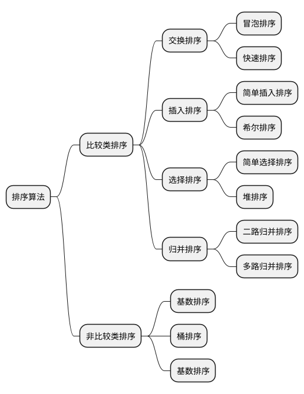
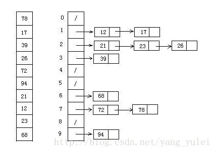

# 排序算法概要
## 排序算法分类
* 常见的经典排序算法分为两大类
1. **比较类排序**：通过比较来决定元素间的相对次序，由于时间复杂度不能突破 $O(n\lg{n})$, 因此也成为了**非线性时间比较类排序**
2. **非比较类排序**：不通过比较来决定相对次序，它可以突破基于比较排序的时间下界，以线性时间运行，因此也称为**线性时间非比较类排序**。



## 算法复杂度

排序方法|时间复杂度(平均)|时间复杂度(最坏)|时间复杂度(最好)|空间复杂度|稳定性
:-|:-|:-|:-|:-|:-
插入排序|$O(n^2)$|$O(n^2)$|$O(n)$|$O(1)$|稳定
希尔排序|$O(n^{1.3})$|$O(n^2)$|$O(n)$|$O(1)$|不稳定
选择排序|$O(n^2)$|$O(n^2)$|$O(n^2)$|$O(1)$|不稳定
堆排序|$O(n\log_2{n})$|$O(n\log_2{n})$|$O(n\log_2{n})$|$O(1)$|不稳定
冒泡排序|$O(n^2)$|$O(n^2)$|$O(n)$|$O(1)$|稳定
快速排序|$O(n\log_2{n})$|$O(n^2)$|$O(n\log_2{n})$|$O(n\log_2{n})$|不稳定
归并排序|$O(n\log_2{n})$|$O(n\log_2{n})$|$O(n\log_2{n})$|$O(n)$|稳定
||||
计数排序|$O(n+k)$|$O(n+k)$|$O(n+k)$|$O(n+k)$|稳定
桶排序|$O(n+k)$|$O(n^2)$|$O(n)$|$O(n+k)$|稳定
基数排序|$O(n*k)$|$O(n*k)$|$O(n*k)$|$O(n+k)$|稳定

### 相关概念
* **稳定**：如果a原本在b前面，而a=b，排序之后a仍然在b的前面。
* **不稳定**：如果a原本在b的前面，而a=b，排序之后可能会出现在b的后面。
* **时间复杂度**：对排序数据的中的操作次数。反应当n变化时，操作次数呈现什么规律。
* **空间复杂度**: 是指算法在计算机内执行时所需要存储空间的度量，他也是数据规模N的函数。

## 冒泡排序（Bubble Sort）
* 冒泡排序是一种简单的排序算法。它重复地走访过要排序的数列，一次比较两个元素，如果它们的顺序错误就把它们交换过来。走访数列的工作是重复地进行直到没有再需要交换，也就是说该数列已经排序完成。这个算法的名字由来是因为越小的元素会经由交换慢慢“浮”到数列的顶端。
### 思路描述
1. 比较相邻的元素。如果第一个比第二个打，就交换他们两个；
2. 对每一对相邻元素作同样的工作，从开始第一对到结尾的最后一对，这样在最后的元素应该会是最大的数；
3. 针对所有的元素重复以上的步骤，除了上一次执行完的最后一个；
4. 重复步骤1-3，直到排序完成、

### 动图演示


### 代码实现
```ts
function bubbleSort(arr:Array<number>){
  let len = arr.length;
  for(let i=0;i<len-1;i++){
    for(let j=0;j<len-1-i;j++){
      if(arr[i]>arr[j+1]){ // 比较相邻元素
        let temp = arr[j+1] // 元素交换
        arr[j+1] = arr[j]
        arr[j] = temp
      }
    }
  }
  return arr
}
```

## 选择排序（Selection Sort）
* 选择排序(Selection-sort)是一种简单直观的排序算法。它的工作原理：首先在为排序的序列中找到最小（大）元素，存放到排序序列的起始位置，然后，再从剩余未排序元素中继续寻找最小（大）元素。然后放到已排序序列的末尾。以此类推，直到所有元素均排序完毕。

### 思路描述
* n个记录的直接选择排序可经过n-1趟直接选择排序得到有序结果。具体算法描述如下：
1. 初始状态：无序区为$R[1..N]$，有序区为空；
2. 第$i$趟排序($i=1,2,3...n-1$)开始时，当前有序区和无序区分别为$R[1...i-1]$和$R(i..n)$。该趟排序从当前无序区中-选出关键字最小的记录$R[k]$,将它与无序区的第$i$个记录R交换，使$R[1..i]$和$R[i+1..n]$分别变为记录个数增加一个有序区和减少一个无序区；
3. $n-1$ 趟结束，数组有序化了

### 动图演示


### 代码实现
```ts
let selectionSort = (arr:Array<number>) => {
  let len = arr.length
  let minIndex, temp
  for(let i = 0;i < len - 1; i++){
    minIndex = i
    for(let j = i + 1; j < len - 1; j++){
      if(arr[j] < arr[minIndex]){ //寻找最小值，并保存下标
        minIndex = j
      }
    }
    temp = arr[i]
    arr[i] = arr[minIndex]
    arr[minIndex] = temp
  }
  return arr
}
```

### 算法分析
* 表现最稳定的排序算法之一，因为无论什么数据进去都是 $O(n^2)$ 的时间复杂度，所以用到它的时候，数据规模越小越好。唯一的好处可能就是不占用额外的内存空间，理论上讲选择排序也是平时一般人想到的最多的排序方法了吧。

## 插入排序(Insertion Sort)
* 插入排序（Insertion-Sort）的算法描述是一种简单直观的排序算法。它的工作原理是通过构建有序序列，对于未排序数据，在已排序序列中从后向前扫描，找到相应位置并插入

### 思路描述
* 一般来说，插入排序都采用 in-place 在数组上实现。具体算法描述如下：
1. 从第一个元素开始，该元素可以认为已经被排序；
2. 取出下一个元素，在已经排序的元素序列中从后向前扫描；
3. 如果该元素（已排序）大于新元素，将该元素移到下一位置；
4. 重复步骤3，知道找到已排序的元素小于或等于新元素的位置；
5. 将新元素插入到该位置后
6. 重复步骤2~5，直至该数组遍历完毕

### 动图演示


### 代码实现
```ts
var InsertionSort = (arr: Array<number>) =>{
  let len = arr.length
  let preIndex, current
  for(let i = 1; i< len - 1; i++){
    preIndex = i - 1
    current = arr[i]
    while(preIndex >= 0 && arr[preIndex] > current){
      arr[preIndex + 1] = arr[preIndex]
      preIndex--;
    }
    arr[preIndex + 1] = current
  }
  return arr
}
```

### 算法分析
* 插入排序在实现上，通常采用in-place排序（即只需用到O(1)的额外空间的排序），因而在从后向前扫描过程中，需要反复把已排序元素逐步向后挪位，为最新元素提供插入空间。

## 希尔排序(Shell Sort)
* 1959年Shell发明，第一个突破$O(n^2)$的排序算法，是简单插入排序的改进版。它与插入排序的不同之处在于，它会优先比较距离较远的元素。希尔排序又叫**缩小增量排序**。

### 算法描述
* 先将整个待排序列的记录序列分割称为若干子序列分别进行直接插入排序，具体算法描述：
1. 选择一个增量序列 $t_1,t_2,...,t_k$,其中 $t_i>t_j,t_k =1 $
2. 按增量序列个数K，对序列进行k趟排序；
3. 每趟排序，根据对应的增量 $t_i$， 将待排序列分割成若干个长度为m的子序列，分别对各子表进行直接插入排序。仅增量因子为1时，整个序列作为一个表来处理，表长度即为整个序列的长度

### 动图演示


### 代码排序
```ts
var shellSort = (arr: Array<number>) =>{
  let len = arr.length
  for(let gap = Math.floor(len/2); gap>0; gap = Math.floor(gap/2)){
    // 注意：这里和动图演示的不一样，动图是分组执行
    // 这里的实际操作是多个分组交替执行
    for(let i = gap; i< len; i++){
      let j = i
      let current = arr[i]
      while(j - gap >=0 && current < arr[j-gap]){
        arr[j] = arr [j - gap]
        j = j -gap
      }
      arr[j] = current
    }
  }
}
```

###  算法分析
* 希尔排序的核心在于间隔序列的设定。既可以提前设定好间隔序列，也可以动态的定义间隔序列。动态定义间隔序列的算法是《算法（第4版）》的合著者Robert Sedgewick提出的。　

## 归并排序(Merge Sort)
* 归并排序是建立在归并操作上的一种有效的排序算法。该算法是采用分治法（Divide and Conquer）的一个非常典型的应用。将已有序的子序列合并，得到完全有序的序列；即先使每个子序列有序，再使子序列段间有序。若将两个有序表合并成一个有序表，称为2-路归并。

### 思路描述
1. 把长度为 n 的输入序列分成两个长度为 n/2 的子序列；
2. 对这两个子序列分别采用归并排序
3. 将两个排序好的子序列合并成一个最终的排序序列。

### 动图演示


### 代码实现
```ts
var mergeSort = (arr: Array<number>) =>{
  let len = arr.length
  if(len < 2){
    return arr
  }
  let middle = Math.floor(len/2)
  left = arr.slice(0, middle)
  right = arr.slice(middle)
  return merge(mergeSort(left), mergeSort(right))
}

var merge = (leftArr: Array<number>, rightArr: Array<number>) =>{
  let result = []
  // 合并
  while(leftArr.length> 0 && rightArr.length>0){
    if(leftArr[0]<=rightArr[0]){
      result.push(leftArr.shift())
    }else{
      result.push(rightArr.shift())
    }
  }

  // 没添加干净的
  while(left.length){
    result.push(left.shift());
  }

  // 没添加干净的
  while(right.length){
    result.push(right.shift());
  }

  return result
}
```

### 算法分析
* 归并排序是一种稳定的排序方法。和选择排序一样，归并排序的性能不受输入数据的影响，但表现比选择排序好的多，因为始终都是O(nlogn）的时间复杂度。代价是需要额外的内存空间。

## 快速排序（Quick Sort）
* 快速排序的基本思想：通过一趟排序将待排记录分隔成独立的两部分，其中一部分记录的关键字均比另一部分的关键字小，则可分别对这两部分记录继续进行排序，以达到整个序列有序。

### 思路描述
* 快速排序使用分治法来把一个串（list）分为两个子串（sub-lists）。具体算法描述如下：
1. 从数列中挑出一个元素，称为 “基准”（pivot）
2. 重新排序数列，所有元素比基准值小的摆放在基准前面，所有元素比基准值大的摆在基准的后面（相同的数可以到任一边）。在这个分区退出之后，该基准就处于数列的中间位置。这个称为分区（partition）操作；
3. 递归地（recursive）把小于基准值元素的子数列和大于基准值元素的子数列排序。

### 动图演示


### 代码实现
```ts
var quickSort = (arr:Array<number>, left?: number = 0, right?: number = arr.length-1) =>{
  if(left < right){
    let partitionIndex = partition(arr, left, right)
    quickSort(arr, left, partitionIndex-1)
    quickSort(arr, partitionIndex+1, right)
  }
  return arr
}

var partition = (arr:Array<number>, left: number, right: number)=>{
  let pivot = left, // 设置基准值
  index = pivot + 1
  for(let i = index; i<= right; i++){
    if(arr[i] < arr[pivot]) {
      swap(arr, i, index);
      index++;
    }
  }
  swap(arr, pivot, index -1)
  return index - 1
}

var swap = (arr:Array<number>, i: number, j: number)=>{
  // 限纯数字,少占用点局部内存
  // arr[i] = arr[i] + arr[j]
  // arr[j] = arr[i] - arr[j]
  // arr[i] = arr[i] - arr[j]
  var temp = arr[i]
  arr[i] = arr[j]
  arr[j] = temp
}
```

## 堆排序(Heap Sort)
* 堆排序（Heapsort）是指利用堆这种数据结构所设计的一种排序算法。堆积是一个近似完全二叉树的结构，并同时满足堆积的性质：即子节点的键值或索引总是小于（或者大于）它的父节点。

### 思路描述
1. 将初始待排序关键字序列($R_1,R_2...R_N$)项建成大顶堆，此堆为初始的无序区
2. 将堆顶元素R[1]与最后一个元素R[n]交换，此事得到的新的无序区($R_1,R_2,...,R_{n-1}$)和新的有序区（$R_n$），切满足$R[1,2..n-1]<=R[n]$
3. 由于交换后新的堆顶R[1]可能违反堆的性质，因此需要对当前无序区($R_1,R_2,……R_{n-1}$)调整为新堆，然后再次将R[1]与无序区最后一个元素交换，得到新的无序区($R_1,R_2…R_{n-2}$)和新的有序区($R_{n-1},R_n$)。不断重复此过程直到有序区的元素个数为n-1，则整个排序过程完成。

### 动图演示


### 代码实现
```ts
var len
var heapSort = (arr: Array<number>) => {
  let arr = buildMaxHeap(arr)
  len = arr.length
  for(let i = len - 1; i>0; i--){
    swap(arr, 0, i)
    len--
    heapify(arr, 0)
  }
  return arr
}

var buildMaxHeap = (arr: Array<number>)=>{
  for(let i = Mat.floor(arr.length/2); i>0; i--){
    heapify(arr, i-1);
  }
}

var heapify = (arr: Array<number>, index: number)=>{
  // 调整堆
  let left = 2 * index + 1,
  right = 2 * index + 2,
  largest = index

  if(left < len && arr[left] > arr[largest]) {
    largest = left
  }

  if(right < len && arr[right] > arr[largest]) {
    largest = right
  }

  if(largest != index){
    swap(arr, largest, index)
    heapify(arr, largest);
  }
}

var swap = (arr:Array<number>, i: number, j: number)=>{
  var temp = arr[i]
  arr[i] = arr[j]
  arr[j] = temp
}
```

## 计数排序（Counting Sort）
* 技术排序不是基于比较的排序算法，其核心在于将输入的数据值转化为键存储在额外开辟的数组空间中。作为一种线性时间复杂度的排序，计数排序要求输入的数据必须是有确定范围的整数。

### 思路描述
1. 找出待排序的数组中的最大和最小的元素
2. 统计数组中每个值为i的元素出现的次数，存入数组C的第i项
3. 对所有的计数累加（从C中的第一个元素开始，每一项和前一项相加）
4. 反向填充目标数组：将每个元素i放在型数组的C(i)项，每放一个元素就将C(i)减去1

### 动图演示


### 代码实现
```ts
var countingSort = (arr: Array<number>, maxValue:number) => {
    let bucket =new Array(maxValue + 1),
        sortedIndex = 0,
        arrLen = arr.length,
        bucketLen = maxValue + 1

    for(vari = 0; i < arrLen; i++) {
        if(!bucket[arr[i]]) {
            bucket[arr[i]] = 0
        }
        bucket[arr[i]]++
    }

    for(varj = 0; j < bucketLen; j++) {
        while(bucket[j] > 0) {
            arr[sortedIndex++] = j
            bucket[j]--
        }
    }

    return arr
}
```

###  算法分析
* 计数排序是一个稳定的排序算法。当输入的元素是 n 个 0到 k 之间的整数时，时间复杂度是O(n+k)，空间复杂度也是O(n+k)，其排序速度快于任何比较排序算法。当k不是很大并且序列比较集中时，计数排序是一个很有效的排序算法。

## 桶排序（Bucket Sort）
* 桶排序是计数排序的升级版。它利用了函数的映射关系，高效与否的关键就在于这个映射函数的确定。桶排序 (Bucket sort)的工作的原理：假设输入数据服从均匀分布，将数据分到有限数量的桶里，每个桶再分别排序（有可能再使用别的排序算法或是以递归方式继续使用桶排序进行排）。

### 思路描述
1. 设置一个定量的数组当作桶
2. 遍历输入数据，并且把数据一个一个放到对应的桶里
3. 对每个不是空的桶进行排序
4. 从不是空的桶里把拍好序的数据拼接起来

### 图片演示


### 代码实现
```ts
var bucketSort = (arr: Array<number>, bucketSize?: number) => {
  if(arr.length < 2){
    return arr
  }

  let minValue=maxValue=arr[0]
  for(i = 1; i < arr.length; i++) {
    if(arr[i] < minValue) {
      minValue = arr[i];               // 输入数据的最小值
    }else if(arr[i] > maxValue) {
      maxValue = arr[i];               // 输入数据的最大值
    }
  }
  // 桶的初始化
  bucketSize = bucketSize || 10;
  let bucketCount = Math.floor((maxValue - minValue) / bucketSize) + 1;
  let buckets =new Array(bucketCount);
  for(i = 0; i < buckets.length; i++) {
    buckets[i] = [];
  }

  // 利用映射函数将数据分配到各个桶中
  for(i = 0; i < arr.length; i++) {
    buckets[Math.floor((arr[i] - minValue) / bucketSize)].push(arr[i]);
  }

  arr.length = 0;
  for(i = 0; i < buckets.length; i++) {
      let bucketSortArr = bucketSort(buckets[i]);// 对每个桶进行排序(可以使用其他排序算法)，这里使用了桶排序递归
      for(let j = 0; j < bucketSortArr.length; j++) {
          arr.push(bucketSortArr[j]);
      }
  }

  return arr;
}
```

## 基数排序（Radix Sort）
* 基数排序是按照低位先排序，然后收集；再按照高位排序，然后再收集；依次类推，直到最高位。有时候有些属性是有优先级顺序的，先按低优先级排序，再按高优先级排序。最后的次序就是高优先级高的在前，高优先级相同的低优先级高的在前。

### 思路描述
1. 去的数组中的最大数，并取得位数
2. arr为原始数组，从最低位开始取每个位组成radix数组
3. 对radix进行计数排序（利用计数排序适用于小范围数的特点）

### 动图演示


### 代码实现
```ts
let counter = []
var radixSort = (arr:Array<number>, maxDigit: number) =>{
  let mod = 10,
  dev = 1
  for(let i = 0; i < maxDigit; i++, dev *= 10, mod *= 10) {
    for(let j = 0; j < arr.length; j++) {
      let bucket = parseInt((arr[j] % mod) / dev);
      if(counter[bucket]==null) {
        counter[bucket] = []
      }
      counter[bucket].push(arr[j])
    }
    let pos = 0;
    for(let j = 0; j < counter.length; j++) {
      let value =null
      if(counter[j]!=null) {
        while((value = counter[j].shift()) !=null) {
          arr[pos++] = value
        }
      }
    }
  }
  return arr
}
```

###  算法分析
* 基数排序基于分别排序，分别收集，所以是稳定的。但基数排序的性能比桶排序要略差，每一次关键字的桶分配都需要O(n)的时间复杂度，而且分配之后得到新的关键字序列又需要O(n)的时间复杂度。假如待排数据可以分为d个关键字，则基数排序的时间复杂度将是O(d*2n) ，当然d要远远小于n，因此基本上还是线性级别的。
* 基数排序的空间复杂度为O(n+k)，其中k为桶的数量。一般来说n>>k，因此额外空间需要大概n个左右。

## 文章原址
微博：[一像素more](https://www.cnblogs.com/onepixel/articles/7674659.html)
