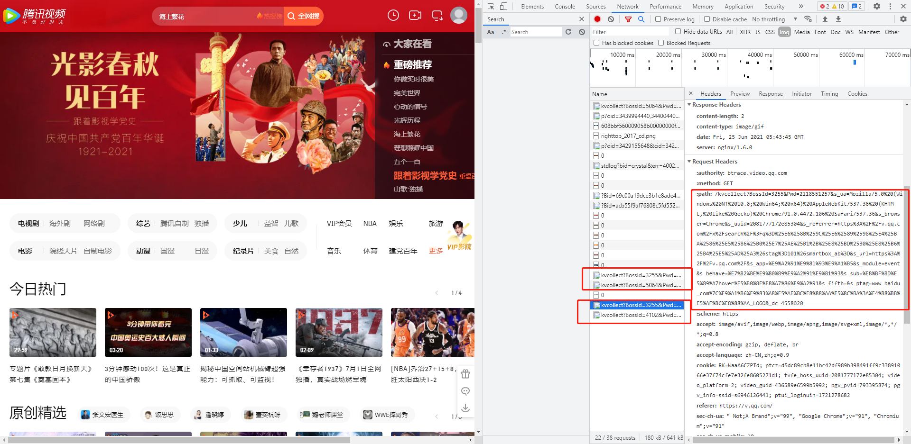

# 前言
## 术语

例子：
1. 用户从首页点击推荐看了节目亮剑30分钟。
2. 用户从百度广告平台进入订购界面，在订购页面中浏览了30秒，并且成功的订购某某产品。

**行为**：指的是某种行为，与结果无关。
例如：
由例1. 用户从哪里点击进去看了亮剑30分钟。这一个完整的流程是用户总的一个产生播放的行为
由例2. 用户从百度进来，看到我们订购产品，在页面犹豫了30秒，订购了某某产品
以上详细的流程才是完整的记录了用户的某种行为


**事件**：指的是最终某件事的结果
例如：
例1. 用户观看了亮剑
例2. 用户订购了某某产品


## 埋点方式对比


### 代码埋点
* 代码埋点分为客户端埋点和服务端埋点

#### 客户端代码埋点
* 通过用户使用客户端时每次请求、点击、跳转、浏览时心跳，在客户端代码中嵌入自定义请求，以获取**用户行为**与**事件数据**。

#### 服务端代码埋点
* 通过用户每次对服务端发起的请求，在服务端端代码中嵌入自定义的日志或者是发往其它数据中心的请求，以获取用户**事件数据**。

备注：并不是说服务端埋点不能获取到**用户行为**数据，而是大部分用户行为在前端能直接获取，而在把这些数据一起传到服务端，会影响服务端提供服务的质量

### 全埋点/无埋点
> 主要从web客户端的角度来解释全埋点
* 全埋点主要是涉及到客户端，服务端无法制作全埋点，全埋点主要是获取用户的操作行为。
* 通过监听web页面所有的元素，输入框、按钮、图片、链接等。自动发送当前页面跳转到下一个页面的所有情况。
* 每打开一个特定页面时自动新增一个心跳

其它客户端：
* Android&IOS: 原理与Web客户端差不多，监听用户在哪个页面下，用了点了哪个元素。能多采集一个用户手势，请按，长按，点击等事件。

* 主要就是能统一把客户端能监听到的所有事件都做一个埋点统一发送到数据中台，进行分析清洗

### 可视化埋点
> 主要从web客户端的角度来解释可视化埋点
* 可视化埋点其实就是全埋点的一种应用方式
* 通过
* 通过类内核去分析客户端的每个页面(例如：浏览器自带的开发者工具)，通过工具能自动定位到具体客户端的具体页面是属于哪个元素，通过元素文本内容，或者是页面元素的序号来标记当前元素。从而自定义当前元素的埋点事件


其它客户端：
* Android&IOS: 原理与Web客户端差不多。


# 神策数据分析平台
* 数据中台，主打私有部署。
* 主打数据采集，数据分析及数据可视化的一整套流程。

[神策全平台埋点接入文档](https://manual.sensorsdata.cn/sa/latest/page-1573907.html)

## 埋点技术
* 因为神策业务主打数据中台，数据处理所以对所有客户端都有专业的人员去开发对应的SDK，用于数据采集。
```plantuml
package SDK{
    package 前端SDK {
        package 支持全埋点/可视化埋点{
            rectangle IOS
            rectangle Android
            rectangle WEB
        }
        rectangle 小程序
        rectangle Unity
        rectangle Cocos2d
        rectangle App
        rectangle "C++"
        rectangle macOs
    }
    package 后端SDK {
        rectangle C
        rectangle "C#"
        rectangle JAVA
        rectangle GoLang
        rectangle PHP
        rectangle Python
        rectangle Ruby
        rectangle Node
    }
    package 文件导入 {
        rectangle BatchImporter
        rectangle LogAgent
        rectangle FormatImporter
        rectangle HdfsImporter
    }
}

cloud 神策服务

SDK -down-> 神策服务: 数据采集
```

* 采集数据大体效果就是通过在前端或者后端集成神策相关的SDK 通过统一的规范发送，探针信息。
    * 前端采集:
        * 默认采集数据:
        当前用户，来源渠道，当前平台，当前设备等
        * 全埋点:
        主要采集用户对于某个页面的浏览时长，以及页面跳转情况，从a页面跳转b页面。元素点击(广告采集)
        * [可视化全埋点](https://manual.sensorsdata.cn/sa/latest/visual_auto_track-7541326.html):
        通过自定义的设置元素点击事件来实现，自定义埋点的分类
        * 自定义采集(自定义埋点):
        自定义事件的定义与触发：订购事件，浏览事件，删除事件，搜索事件等。统一封装好，通过http或者https请求发出到神策服务中
        
        
    * 后端采集：
        * 自定义采集(自定义埋点):
        与前端采集相同，都是通过自定义事件然后http或者https请求发出到神策服务中

## 前端埋点
* 前端采集，根据不同客户的客户端技术栈封装不同的SDK。例如：
    * WEB客户端封装了ES5版本的JS SDK;
    * android客户端封装了Android版本的SDK;
    * IOS客户端封装了IOS版本的SDK;
### 优点
* 能详细的采集到用户的在使用客户端所有的操作习惯
* 可使用可视化埋点策略，应付短平快的需求，代码埋点不依赖于研发，速度快。
* 大部分客户端 **(web端，Android，IOS原生端)**。大部分的操作习惯能进行自动采集：
    例如：浏览时长，页面跳转，广告外链点击情况

### 缺点
* 大部分产品都会存在不同版本，所以在不同客户端 **(PC-web,Windows-exe,Linux-exe,Android-App,IOS-App)** 时需要做多种客户端之间的适配

## 后端埋点
* 后端采集，根据不同客户的服务端技术栈封装不同的SDK。例如:
    * JAVA服务端封装JAVA版本的SDK
    * GO服务端封装Go版本的SDK
    * python服务端封装python版本的SDK

### 优点
* 大部分客户服务端统一一种技术栈，所以使用服务端埋点时，少了很多的适配环节

### 缺点
* 无法获取到用户的操作行为日志 **(浏览时长，页面跳转，广告外链点击情况)**
* 没有自动埋点，和可视化全买点策略。只能使用代码埋点

## 代码埋点和可视化埋点
比较项|代码埋点|可视化埋点
:-|:-|:-
准确性|高|较高
兼容性|好|中等
稳定性|稳定|不稳定
自定义属性|支持|不支持
管理成本|中等|较高
埋点成本|较高|无
回溯历史|不支持|支持

可以看出，在埋点本身质量上，代码埋点是要远优于可视化全埋点的，但是可视化全埋点在埋点成本和回溯历史方面有着无可比拟的优势。对于满足如下情景的客户来说，可视化全埋点可以在早期更好地实现数据驱动。
* 没有研发资源或研发资源很少
* 项目较为早期，以交互分析为主，业务分析为辅
* 需要分析的大部分是活动类页面，分析诉求主要是移动端

场景|代码埋点|可视化全埋点
:-|:-|:-
分析 UV、PV、点击量等基础指标|高成本|低成本
查看某一控件的点击|高成本|低成本
精细化分析核心转化流程|可以实现|无法实现
评估活动 / 新功能快速上线迭代时的效果|高成本|低成本
考核客服服务质量|可以实现|无法实现
比较不同快递在不同省份运送不同品类产品的速度|可以实现|无法实现
* 考虑到可视化全埋点的事件还可能会随着时间推移失效，这就意味着核心的业务相关的监控用可视化全埋点实现并不是一个好事。

# 数澜
* 暂无，官网无披露相关文档。
* 可公私有云混合部署。
* 官方专注数据可视化、中台、搜索等场景，暂没发现埋点设置源头等技术点。
* 根据官方数栖介绍，数据交换并不包含埋点采集相关(主要是做数据的同步进数澜中台)


# 易视腾
* 暂无，属于做IPTV业务的公司，承接的是业务，并没有对外披露业务制作的技术点

# 百度统计
* 基于云分析的数据平台，数据不能存在私服，只能交由百度进行分析。
* 主要利用全埋点技术，分析网站的基本情况(用户活跃，新用户，使用时长，次数，留存等)
* 虽然也类似神策做了自定义埋点，以及可视化埋点，但是并不出名，相关文档也较少描述不是很详细。主要用户还是利用百度统计分析网站，游戏，移动应用留存等基础情况。

* [官方对接文档](https://mtj.baidu.com/static/userguide/book/chapter0/mtjintro.html)
## 埋点技术
* 与神策一样封装相关客户端的SDK，统一监听用户在客户端的各种行为。
* 事件分析相关，主要也是通过在客户端进行代码埋点
* 可视化埋点技术也差不多，但是只支持 IOS和Android的程序同步到电脑端。

* 与神策相比，少了Web端的可视化埋点

# 友盟
[官方文档](https://developer.umeng.com/docs/67963/cate/67963)

* 做法和其它厂家做法差不多，封装不同客户端得SDK
* 但是前端主要是的SDK使用得后端技术是PHP
* 主要类似百度统计网站得留存，流量，点击热点图等信息。主打数据统计。
* 自定义埋点也有，做法统一一样是封装请求，后台配置，但是主要是硬代码进行配置，没有神策那种可视化界面。(很不友好，文档写的也不好，很生硬，很难看懂)


# Google Analytics
* [官方文档](https://ga-dev-tools.appspot.com/)，需要翻墙
* [中文文档](https://developers.google.com/analytics/devguides/config/mgmt/v3/quickstart/service-java)

* 做法也是通用的无埋点做法，在对应得端引入相应得SDK

* 百度统计，应该是仿照谷歌统计做出来的。
* 也主要是云端分析网站的基础数据(用户活跃，来源，使用时长，次数，留存等)

# 腾讯视频
* 根据对页面观察和工具的分析，通过全埋点方式进行采集用户信息。
* 自定义埋点不确定有没有。
* 可以看出这些用户行为日志在每个按钮上点击都能触发，鼠标放在上面悬停了多久也能采集这信息，如果手动代码埋点这种采集量太大了。以下是采集请求的一些信息，采集了客户端d的所有基础数据，以及标记了未登录时的UUID


# 调研总结
## 埋点方式
* 各大厂商基本上都是使用 全埋点+自定义代码埋点 的行式
    * 全埋点采集用户点击，页面跳转，浏览事件等行为
    * 自定义代码埋点：针对具体事件，进行关键埋点
    * 服务端埋点较少，因为服务端基本上只能采集用户事件 ，就能从服务端进行采集。

## 实现方式
* 于不同客户端封装对应客户端的SDK，使得通用得用户行为埋点与正常业务分离。

## 关于全埋点
* 全埋点点主要是采集用户的行为（动作），
* 在现有得客户端用户的行为有限:
    * web端：滚动，浏览，悬停，点击，跳转页面等。
    * 移动端：点击，浏览，(上下左右)滑动，长按，短按。
* 这些用户行为，可以通过客户端的监听事件，能全部采集下来。
* 但是全埋点，并不能完全替代自定义事件的代码埋点。全埋点是以过程从开始到结束过程的一个采集。

## 可视化埋点
* 在全埋点的基础上增加可视化功能
* 因为想尽可能地屏蔽全埋点的弊端，因为全埋点监听了客户端的总体元素或者总的点击事件，数据太多。增加可视化标记的原因是为了把这部分数据重点抽离出来(其它数据不丢，这些数据重点标记)，或者是把其它数据给过滤掉(删除其它数据)
