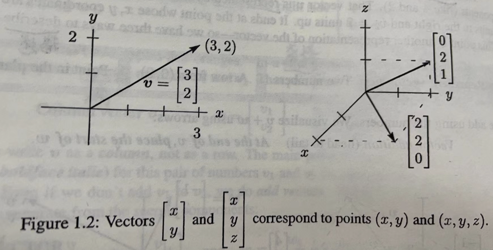

### Introduction to Vectors 

#### 1. 线性组合(Linear combination)
> 线性代数的核心是操作它们的向量 - 线性组合
* 我们添加一个向量 $v+w$, 我们将这个向量各自相乘常量$c$ 和 常量$d$并将它们组合在一起, 就得到了一个线性组合 $cv+dw$
  * Linear combination: $cv+dw=c\begin{bmatrix} 1 \\ 1\end{bmatrix}+d\begin{bmatrix} 2 \\ 3\end{bmatrix}=\begin{bmatrix} c+2d \\ c+3d\end{bmatrix}$

  * Example: $v+w=\begin{bmatrix} 1 \\ 1\end{bmatrix}+\begin{bmatrix} 2 \\ 3\end{bmatrix}=\begin{bmatrix} 3 \\ 4 \end{bmatrix}$. 此处 $c=d=1$

  * 向量 $cv$ 是一条直线, 当向量 $w$ 不在这条直线上, 则组合 $cv+dw$ 表示的是一整个二位平面
  * 线性组合在线性代数中是最重要的, 

#### 向量运算

##### 向量加减法(Vector Addition or Subtraction)
$$
v = \left[ 
\begin{array}{rcl}
v_1 \\
v_2
\end{array}
\right]
\ and \ \
w = \left[ 
\begin{array}{rcl}
w_1 \\
w_2
\end{array}
\right]
\ \ add \ or \ sub \ to \ \ \
v \pm w = \left[ 
\begin{array}{rcl}
v_1 \pm w_1 \\
v_2 \pm w_2
\end{array}
\right]
$$

##### 标量乘法 (Scalar Multiplication)
$$
\begin{align}
cv &= \left[ 
\begin{array}{rcl}
cv_1 \\
cv_2
\end{array}
\right]
\\
 if \ c &= 2
\ \ \
2v = \left[ 
\begin{array}{rcl}
2v_1 \\
2v_2
\end{array}
\right]
 = v + v
 \\
 if \ c &= -1
\ \ 
-v = \left[ 
\begin{array}{rcl}
-v_1 \\
-v_2
\end{array}
\right]
\end{align}
$$

  * $c$ 必须是一个常量(Scalar)

##### $0$ 向量(Vector)
  1. $-v + v = 0$, 此处的$0$是向量, 并不是数字$0$, 它被称作为 向量 $0$, 它是数字$0$与数字$0$的组合

##### 描述向量 
* 二维向量
  * Represent vector v
    1. 两个数字
    2. 从(0,0)坐标点出发的箭头
    3. 点平面
* 同理三维向量类似:
  

##### 多维向量
* 多维向量同理以上, 并且适用于以上所有运算规则 

##### 概念习题
1. 描述以下全部线性组合的几何性质
* (a) $\left[ \begin{array}{rcl}1\\2\\3\end{array}\right] and \left[ \begin{array}{rcl}3\\6\\9\end{array}\right]$
$$\begin{align*}
\\ solution \ \ \ &a \left[ \begin{array}{rcl}1\\2\\3\end{array}\right] + b\left[ \begin{array}{rcl}3\\6\\9\end{array}\right] = (a+3b)\left[ \begin{array}{rcl}1\\2\\3\end{array}\right]
\\ because\ \ \ &a、b\in R
\\ so\ \ \ &\left[ \begin{array}{rcl}1\\2\\3\end{array}\right] and \left[ \begin{array}{rcl}3\\6\\9\end{array}\right] in\ a\ line
\end{align*}$$

* (b) $\left[ \begin{array}{rcl}1\\0\\0\end{array}\right] and \left[ \begin{array}{rcl}0\\2\\3\end{array}\right]$
$$\begin{align*}
\\ solution \ \ \ &a \left[ \begin{array}{rcl}1\\0\\0\end{array}\right] + b\left[ \begin{array}{rcl}0\\2\\3\end{array}\right] = \left[ \begin{array}{rcl}a\\2b\\3b\end{array}\right]
\\ because\ \ \ &a、b\in R
\\ so\ \ \ &\left[ \begin{array}{rcl}1\\0\\0\end{array}\right] and \left[ \begin{array}{rcl}0\\2\\3\end{array}\right] fill\ a\ plane.\\ then\ &(0, 3, -2)\ perpendicular\ to\ the\ plane
\end{align*}$$

* (c) $\left[ \begin{array}{rcl}2\\0\\0\end{array}\right] and \left[ \begin{array}{rcl}0\\2\\2\end{array}\right] and \left[ \begin{array}{rcl}2\\2\\3\end{array}\right]$
$$\begin{align*}
\\ solution \ \ \ &a \left[ \begin{array}{rcl}2\\0\\0\end{array}\right] + b\left[ \begin{array}{rcl}0\\2\\2\end{array}\right] + c\left[ \begin{array}{rcl}2\\2\\3\end{array}\right] = \left[ \begin{array}{rcl}2a+2c\\2b+2c\\2b+3c\end{array}\right]
\\ because\ \ \ &a、b、c\in R
\\ so\ \ \ &
\left\{\begin{aligned}
2a+2c&=x \\
2b+2c&=y \\
2b+3c&=z 
\end{aligned}\right.
\rightarrow
\left\{
\begin{aligned}
a&=\frac{x-2z+2y}{2}\\
b&=\frac{3y-2z}{2}\\
c&=z-y
\end{aligned}\right.\\
therefore &\ \text{this linear combinations geometrically is } R^3 
\end{align*}$$

2. 画二维图图, 描述 $v = \left[ \begin{array}{rcl}4\\1\end{array}\right]$、$w = \left[ \begin{array}{rcl}-2\\2\end{array}\right]$、$v+w$、$v - w$

<svg width="360" height="360" viewBox="-50 -50 100 100">

  <defs>
    <marker id="arrow" viewBox="0 0 4 4" refX="2" refY="2"
        markerWidth="3" markerHeight="3"
        orient="auto-start-reverse">
      <path d="M 0 0 L 4 2 L 0 4 z" />
    </marker>
  </defs>
  <line x1="-45" y1="0" x2="45" y2="0" stroke="black" stroke-width="0.5" marker-end="url(#arrow)" />
  <!-- y轴 -->
  <line x1="0" y1="45" x2="0" y2="-45" stroke="black" stroke-width="0.5" marker-end="url(#arrow)" />
  <!-- x轴正方向等距点 -->
  <g font-size="2">
    <text x="44" y="2">x</text>
    <text x="-2" y="-44">y</text>
  </g>
  <!-- 等距点 -->
  <g stroke-width="0.2" stroke="gray" font-size="2">
    <circle cx="-40" cy="0" r="0.3" />
    <circle cx="-36" cy="0" r="0.3" />
    <circle cx="-32" cy="0" r="0.3" />
    <circle cx="-28" cy="0" r="0.3" />
    <circle cx="-24" cy="0" r="0.3" />
    <circle cx="-20" cy="0" r="0.3" />
    <circle cx="-16" cy="0" r="0.3" />
    <circle cx="-12" cy="0" r="0.3" />
    <circle cx="-8" cy="0" r="0.3" />
    <circle cx="-4" cy="0" r="0.3" />
    <circle cx="4" cy="0" r="0.3" />
    <circle cx="8" cy="0" r="0.3" />
    <circle cx="12" cy="0" r="0.3" />
    <circle cx="16" cy="0" r="0.3" />
    <circle cx="20" cy="0" r="0.3" />
    <circle cx="24" cy="0" r="0.3" />
    <circle cx="28" cy="0" r="0.3" />
    <circle cx="32" cy="0" r="0.3" />
    <circle cx="36" cy="0" r="0.3" />
    <circle cx="0" cy="-40" r="0.3" />
    <circle cx="0" cy="-36" r="0.3" />
    <circle cx="0" cy="-32" r="0.3" />
    <circle cx="0" cy="-28" r="0.3" />
    <circle cx="0" cy="-24" r="0.3" />
    <circle cx="0" cy="-20" r="0.3" />
    <circle cx="0" cy="-16" r="0.3" />
    <circle cx="0" cy="-12" r="0.3" />
    <circle cx="0" cy="-8" r="0.3" />
    <circle cx="0" cy="-4" r="0.3" />
    <circle cx="0" cy="4" r="0.3" />
    <circle cx="0" cy="8" r="0.3" />
    <circle cx="0" cy="16" r="0.3" />
    <circle cx="0" cy="20" r="0.3" />
    <circle cx="0" cy="24" r="0.3" />
    <circle cx="0" cy="28" r="0.3" />
    <circle cx="0" cy="32" r="0.3" />
    <circle cx="0" cy="36" r="0.3" />
    <circle cx="0" cy="40" r="0.3" />
  </g>
    <!-- 向量v(4,1) -->
  <g>
      <line x1="0" y1="0" x2="16" y2="-4" stroke="red" stroke-width="0.3" marker-end="url(#arrow)"/>
      <text x="16" y="-4" font-size="3">v</text>
  </g>
  <!-- 向量W(-2,2) -->
  <g>
      <line x2="-8" y2="-8" x1="0" y1="0" stroke="blue" stroke-width="0.3" marker-end="url(#arrow)"/>
      <text x="-8" y="-8" font-size="3">v</text>
  </g>
  <!-- 向量v-w(6,-1) -->
  <g>
      <line x2="24" y2="4" x1="0" y1="0" stroke="green" stroke-width="0.3" marker-end="url(#arrow)"/>
      <text x="24" y="4" font-size="3">v-w</text>
  </g>
  <!-- 向量v+w(2,3) -->
  <g>
      <line x2="8" y2="-12" x1="0" y1="0" stroke="purple" stroke-width="0.3" marker-end="url(#arrow)"/>
      <text x="8" y="-12" font-size="3">v+w</text>
  </g>
</svg>

3. $v+w=\left[ \begin{array}{rcl}5\\1\end{array}\right]、v-w=\left[ \begin{array}{rcl}1\\5\end{array}\right]$, 计算并画出向量, $v、w$

$$
\begin{align*}
solution &\\
assume &\ v = (a,b)、w=(c,d) \\
then  &\ \left\{\begin{aligned}
a+c&=5 \\
b+d&=1 \\
a-c&=1 \\
b-d&=5 
\end{aligned}\right. \rightarrow 
\left\{\begin{aligned}
a&=3 \\
b&=3 \\
c&=2 \\
d&=-2 
\end{aligned}\right. \Rightarrow 
v=\left[ \begin{array}{rcl}3\\3\end{array}\right]、
w=\left[ \begin{array}{rcl}2\\-2\end{array}\right]
\end{align*}
$$

<svg width="360" height="360" viewBox="-50 -50 100 100">
    <!-- x轴 -->
    <line x1="-45" y1="0" x2="45" y2="0" stroke="black" stroke-width="0.5" marker-end="url(#arrow)"/>
    <!-- y轴 -->
    <line x1="0" y1="45" x2="0" y2="-45" stroke="black" stroke-width="0.5" marker-end="url(#arrow)"/>
    <!-- x轴正方向等距点 -->
    <g font-size="2">
      <text x="44" y="2">x</text>
      <text x="-2" y="-44">y</text>
    </g>
    <!-- 等距点 -->
    <g stroke-width="0.2" stroke="gray" font-size="2">
      <circle cx="-40" cy="0" r="0.3" />
      <circle cx="-36" cy="0" r="0.3" />
      <circle cx="-32" cy="0" r="0.3" />
      <circle cx="-28" cy="0" r="0.3" />
      <circle cx="-24" cy="0" r="0.3" />
      <circle cx="-20" cy="0" r="0.3" />
      <circle cx="-16" cy="0" r="0.3" />
      <circle cx="-12" cy="0" r="0.3" />
      <circle cx="-8" cy="0" r="0.3" />
      <circle cx="-4" cy="0" r="0.3" />
      <circle cx="4" cy="0" r="0.3" />
      <circle cx="8" cy="0" r="0.3" />
      <circle cx="12" cy="0" r="0.3" />
      <circle cx="16" cy="0" r="0.3" />
      <circle cx="20" cy="0" r="0.3" />
      <circle cx="24" cy="0" r="0.3" />
      <circle cx="28" cy="0" r="0.3" />
      <circle cx="32" cy="0" r="0.3" />
      <circle cx="36" cy="0" r="0.3" />
      <circle cx="0" cy="-40" r="0.3" />
      <circle cx="0" cy="-36" r="0.3" />
      <circle cx="0" cy="-32" r="0.3" />
      <circle cx="0" cy="-28" r="0.3" />
      <circle cx="0" cy="-24" r="0.3" />
      <circle cx="0" cy="-20" r="0.3" />
      <circle cx="0" cy="-16" r="0.3" />
      <circle cx="0" cy="-12" r="0.3" />
      <circle cx="0" cy="-8" r="0.3" />
      <circle cx="0" cy="-4" r="0.3" />
      <circle cx="0" cy="4" r="0.3" />
      <circle cx="0" cy="8" r="0.3" />
      <circle cx="0" cy="16" r="0.3" />
      <circle cx="0" cy="20" r="0.3" />
      <circle cx="0" cy="24" r="0.3" />
      <circle cx="0" cy="28" r="0.3" />
      <circle cx="0" cy="32" r="0.3" />
      <circle cx="0" cy="36" r="0.3" />
      <circle cx="0" cy="40" r="0.3" />
    </g>
    <!-- 向量v(3,3) -->
    <g>
        <line x1="0" y1="0" x2="12" y2="-12" stroke="red" stroke-width="0.3" marker-end="url(#arrow)"/>
        <text x="12" y="-12" font-size="3">v</text>
    </g>
    <!-- 向量w(2,-2) -->
    <g>
        <line x1="0" y1="0" x2="-8" y2="8" stroke="blue" stroke-width="0.3" marker-end="url(#arrow)"/>
        <text x="-8" y="-8" font-size="3">w</text>
    </g>
    <!-- 向量v-w(1,5) -->
    <g>
        <line x1="0" y1="0" x2="4" y2="20" stroke="green" stroke-width="0.3" marker-end="url(#arrow)"/>
        <text x="4" y="20" font-size="3">v-w</text>
    </g>
    <!-- 向量v+w(5,1) -->
    <g>
        <line x1="0" y1="0" x2="20" y2="-4" stroke="purple" stroke-width="0.3" marker-end="url(#arrow)"/>
        <text x="20" y="-4" font-size="3">v+w</text>
    </g>
</svg>

4. 有 $v=\left[ \begin{array}{rcl}2\\1\end{array}\right]、w=\left[ \begin{array}{rcl}1\\2\end{array}\right]$, 求出组合 $3v+w$ 和 $cv+dw$
    $$
    \begin{align*}
    solution \\
    &3v+w = \left[ \begin{array}{rcl}7\\5\end{array}\right]
    &cv+dw = \left[ \begin{array}{rcl}2c+d\\c+2d\end{array}\right]
    \end{align*}
    $$

5. 计算 $u+v+w$ 和 $2u+2v+w$, 在什么情况下 $u,v,w$ 为平面
$w = cu+dv$ 情况下, $u,v,w$ 共面

6. 任意线性组合$v=(1,-2,1)$ 和 $w=(0,1,-1)$, 找到 cv+dw= 
(3,3,-6), 并且说明为什么不可能为(3,3,6)

    $$\begin{align*}
    solution \\
    &cv+dw = \left[ \begin{array}{rcl}c\\d-2c\\c-d\end{array}\right] =\left[ \begin{array}{rcl}3\\3\\-6\end{array}\right]
    \\
    then &\left\{\begin{aligned} &c=3 \\ &d=9\end{aligned}\right.
    \end{align*}$$
    对于给定的向量$v$和$w$，我们找到了满足$cv + dw = (3, 3, -6)$的系数$c$和$d$。$c = 3$和$d = 9$。
    然而，对于$(3, 3, 6)$，我们可以看到第三个方程将会变为：
    $c * 1 + d * (-1) = 6$
    对于我们已经找到的$c$和$d$值，这个方程将不成立：
    $3 - 9 ≠ 6$
    因此，对于给定的向量$v$和$w$，找不到满足$cv + dw = (3, 3, 6)$的系数$c$和$d$。

7. 在xy轴中绘制出以下9个线性组合的点 $c\left[ \begin{array}{rcl}2\\1\end{array}\right]+d\left[ \begin{array}{rcl}0\\1\end{array}\right]$, $c=0,1,2\ and\ d=0,1,2$

<svg width="360" height="360" viewBox="-50 -50 100 100">
  <line x1="-18" y1="0" x2="18" y2="0" stroke="black" stroke-width="0.5" marker-end="url(#arrow)" />
  <!-- y轴 -->
  <line x1="0" y1="18" x2="0" y2="-18" stroke="black" stroke-width="0.5" marker-end="url(#arrow)" />
  <!-- x轴正方向等距点 -->
  <g font-size="2">
    <text x="18" y="2">x</text>
    <text x="-2" y="-18">y</text>
  </g>
  <!-- 等距点 -->
  <g stroke-width="0.2" stroke="gray" font-size="2">
    <circle cx="-16" cy="0" r="0.3" />
    <circle cx="-12" cy="0" r="0.3" />
    <circle cx="-8" cy="0" r="0.3" />
    <circle cx="-4" cy="0" r="0.3" />
    <circle cx="4" cy="0" r="0.3" />
    <circle cx="8" cy="0" r="0.3" />
    <circle cx="12" cy="0" r="0.3" />
    <circle cx="16" cy="0" r="0.3" />>
    <circle cx="0" cy="-16" r="0.3" />
    <circle cx="0" cy="-12" r="0.3" />
    <circle cx="0" cy="-8" r="0.3" />
    <circle cx="0" cy="-4" r="0.3" />
    <circle cx="0" cy="4" r="0.3" />
    <circle cx="0" cy="8" r="0.3" />
    <circle cx="0" cy="16" r="0.3" />
  </g>
  <g>
  <!-- c = 0, d = 0 -->
    <line x1="0" y1="0" x2="0" y2="0" stroke="green" stroke-width="0.5" />
    <text x="0" y="3" font-size="3">0</text>
  <!-- c = 0, d = 2 -->
    <line x1="0" y1="0" x2="0" y2="-8" stroke="green" stroke-width="0.5" marker-end="url(#arrow)" />
    <text x="1" y="-8" font-size="3">2w</text>
  <!-- c = 0, d = 1 -->
    <line x1="0" y1="0" x2="0" y2="-4" stroke="red" stroke-width="0.5" marker-end="url(#arrow)" />
    <text x="1" y="-4" font-size="3">w</text>
  </g>
  <g>
  <!-- c = 2, d = 0 -->
    <line x1="0" y1="0" x2="16" y2="-8" stroke="green" stroke-width="0.5" marker-end="url(#arrow)" />
    <text x="16" y="-8" font-size="3">2v</text>
  <!-- c = 2, d = 2 -->
    <line x1="0" y1="0" x2="16" y2="-16" stroke="green" stroke-width="0.5" marker-end="url(#arrow)" />
    <text x="16" y="-16" font-size="3">2v+2w</text>
  <!-- c = 2, d = 1 -->
    <line x1="0" y1="0" x2="16" y2="-12" stroke="red" stroke-width="0.5" marker-end="url(#arrow)" />
    <text x="16" y="-12" font-size="3">2v+w</text>
  </g>
  <g>
  <!-- c = 1, d = 0 -->
    <line x1="0" y1="0" x2="8" y2="-4" stroke="green" stroke-width="0.5" marker-end="url(#arrow)" />
    <text x="8" y="-4" font-size="3">v</text>
  <!-- c = 1, d = 2 -->
    <line x1="0" y1="0" x2="8" y2="-12" stroke="green" stroke-width="0.5" marker-end="url(#arrow)" />
    <text x="8" y="-12" font-size="3">w+2v</text>
  <!-- c = 1, d = 1 -->
    <line x1="0" y1="0" x2="8" y2="-8" stroke="red" stroke-width="0.5" marker-end="url(#arrow)" />
    <text x="8" y="-8" font-size="3">w+v</text>
  </g>
</svg>

8. 在案例1.1中v+w为平行4边形的一条对角线, 他还有其他的对角线吗? 他们的对角线和是多少?, 画出向量和来
$$
\begin{align*}
solution\ & \text{diagonal 1 is }v+w\\
 & \text{diagonal 2 is }v-w\ or\ w-v \\
 so &\text{ sum of two diagonal is } 2v\ or\ 2w  
\end{align*}
$$

9. 如果一个平行四边形的三个角分别为 $(1,1),(4,2),(1,3)$,可能的第四个角一共有三个分别是什么?。并且画出其中两个
$$
\begin{align*}
solution\ & (4,2)-(1,1) = (3,1) = v \\
& (1,3) - (1,1) = (0,2) = w \\
then &\text{ corners is }\left\{\begin{aligned}
v+w+(1,1) = a \\
v-w+(1,1) = b \\
w-v+(1,1) = c 
\end{aligned}\right.\Rightarrow
\left\{\begin{aligned}
a = (4,4) \\
b = (4,0) \\
c = (-2, 2) 
\end{aligned}\right.
\end{align*}
$$

###### 一个四维空间下的立方体
* how many corners does a cube have in 4 dimensions? how many 3D faces? How many edges? 
0. 总结(根据后面的推论得出):
    1. 以下公式满足: $n \ge 1$
    1. $n$维标准几何体的顶点公式: $2^n$
    2. $n$维标准几何体的$n-1$面数量公式: $2C_n^{n-1} = 2n$
    3. $n$维标准几何体的一维面数量公式: $2^{n-1} \cdot n$
1. 类推: 
    1. 一维空间（1D）：一维空间只有一个维度，通常表示为一条线。在一维空间中，只有两个方向可以沿着这条线移动。
    **think:** 在一维空间就只有一种几何就是线, 它有两个顶点
     
    2. 二维空间（2D）：二维空间具有两个维度，通常表示为一个平面。在二维空间中，可以沿着水平和垂直方向移动。
    **think:** 由一维升至二维, 在一维的基础上, 沿着多出来的二维的方向移动, 经过的距离就升至成了二维, 1维的几何移动成了标准的四边形, 具有4个顶点
     
    3. 三维空间（3D）：三维空间具有三个维度，通常表示为我们生活中的空间。在三维空间中，可以沿着长度、宽度和高度移动。
    **think:** 由二维升至三维, 在二维的基础上, 沿着多出来的第三维的方向移动, 经过的距离就升至成了三维几何, 2维的几何移动成了标准的三维几何体, 假设二维形状是四边形, 则随着多出来的第三维移动变成了立方体, 含有 8 个顶点
     
    所以,以此逻辑上的类推, 四维空间下的立方体 是基于三维空间下的立方体在沿着第四维度移动出来的四维立方体, 应该在原有三维空间属性的基础上沿着第四个维度移动, 应该含有 8 * 2 = 16 个顶点
 
2. 假设: 不同维度下的标准几何形状长度都为 1  
    1. 一维空间下的标准几何, 它的顶点坐标为, $(0), (1)$, 他只有两个顶点, 因为是一维空间下, 所以每个顶点只能连接到一个点, 所以从$0\rightarrow 1$,$1\rightarrow 0$, 两个一维面, 但由于共一维面了, 所以 实际上是 $2/2=1$个一维面
    2. 二维空间下的标准几何, 它的顶点坐标为, $(0,0), (0,1), (1,0), (1,1)$, 每两个模长为1的顶点凑成一个一维面
    设: 一维的基础上增加了2维y轴, 一维面沿着y轴移动后, x轴上有开始和结束的两个一维面, 经过路径形成了y轴的两个一维面
    同理: 2维空间下每个顶点出发与另外两个顶点分别构成2个一维面, 但是每个顶点之间重复计算, 则二维空间上其实有 4 个一维面
    3. 三维空间下的标准几何, 它的顶点坐标为, $(0,0,0),(0,1,0),(0,0,1),(1,0,0),(1,1,0),(1,0,1),(0,1,1),(1,1,1)$, 同理每四个面积为1的顶点凑成一个二维面, 也就是三维空间下有6个二维面
    设: 二维的基础上增加了3维z轴, 二维面沿着z轴移动后, xy轴上有开始和结束的两个一维面, 经过路径形成了zy, zx轴的两个二维面, 也就是6个2维面, 其中每个二维面之间都两两共一个一维面, 则三维的基础上就拥有 $6*4/2=12$ 一维面
    同理: $8*3/2=12$个一维面
    4. 四维空间下的标准几何, 它的顶点坐标为, $(0,0,0,0),(0,1,0,0),(0,0,1,0),(1,0,0,0),(1,1,0,0),(1,0,1,0),(0,1,1,0),(1,1,1,0),(0,0,0,1),(0,1,0,1),(0,0,1,1),(1,0,0,1),(1,1,0,1),(1,0,1,1),(0,1,1,1),(1,1,1,1)$
    在一个超立方体中，有8个立方体（三维面），每个立方体由6个二维面组成。这8个立方体可以分为以下组合：
        1. 一个立方体由w=0平面上的所有顶点组成。
        2. 一个立方体由w=1平面上的所有顶点组成。
        3. 剩下的6个立方体分别位于四维空间中的x轴、y轴、z轴和w轴的两侧。每个轴都有一个正立方体（所有顶点的该轴坐标值为1）和一个负立方体（所有顶点的该轴坐标值为0）
    在四维的基础上有8个三维面, 每个三维面之间都两两共一个二维面
    则四维的基础上就有 $8*6/2=24$ 个二维面
    一维面数量是: $16*4/2=32$个一维面 

#### 1.2 向量点积(dot product)和向量长度
* **向量点积(dot product)/内积(inner product)公式**
$$
\begin{align*}
& v=(v_1,v_2),w=(w_1,w_2)\\
& v\cdot w= v_1w_1+v_2w_2
\end{align*}
$$

1. 向量点积为0, 两向量垂直
2. 向量点积满足乘法交换律
3. 

#### 1.3 矩阵(Matrices)、线性方程组(Linear equations)、解(Solutions)