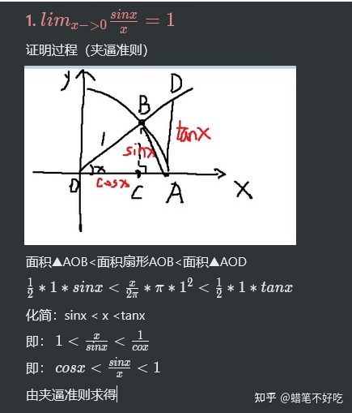

## 常用等价无穷小证明过程
[toc]
### 概念
* 要证明两个无穷小等价，其实也就是证明无穷小除另一个无穷小等于1。

### 重要极限
#### $\sin x\sim x$
* 这是一个重要无穷小，没办法通过公式正常推导，需要用到几何辅助圆构造线段，通过夹逼准则，去推导。

#### $\lim_{x\to\infin}(1+\frac{1}{x})^x=e$
* 构造数列 $x_n=(1+\frac{1}{n})^n$
$x_n=C_n^01^n(\frac{1}{n})^0+C_n^11^{n-1}(\frac{1}{n})^1+C_n^11^{n-2}(\frac{1}{n})^2+\cdot\cdot\cdot++C_n^n1^0(\frac{1}{n})^n$
$=1 + 1 + \frac{1}{2!}(1-\frac{1}{n})+\frac{1}{3!}(1-\frac{1}{n})(1-\frac{2}{n})+\cdot\cdot\cdot+\frac{1}{n!}(1-\frac{1}{n})(1-\frac{2}{n})\cdot\cdot\cdot(1-\frac{n-1}{n})<2+\frac{1}{2!}+\frac{1}{3!}+\cdot\cdot\cdot+\frac{1}{n!}<2+\frac{1}{2}+\frac{1}{2^2}+\frac{1}{2^3}+\cdot\cdot\cdot+\frac{1}{2^{n-1}}=3-\frac{1}{2^{n-1}}<3$
由等比数列求和公式可知：$\frac{1}{2^2}+\frac{1}{2^3}+\cdot\cdot\cdot+\frac{1}{2^{n-1}}=1-\frac{1}{2^{n-1}}$
同理构造数列 $x_{n+1}=(1+\frac{1}{n+1})^{n+1}$
可得 $x_{n+1}=2 + \frac{1}{2!}(1-\frac{1}{n})+\frac{1}{3!}(1-\frac{1}{n})(1-\frac{2}{n})+\cdot\cdot\cdot+\frac{1}{n!}(1-\frac{1}{n})(1-\frac{2}{n})\cdot\cdot\cdot(1-\frac{n-1}{n})+\frac{1}{(n+1)!}(1-\frac{1}{n+1})(1-\frac{2}{n+1})\cdot\cdot\cdot(1-\frac{n}{n+1})$
$x_{n+1}-x_n=\frac{1}{(n+1)!}(1-\frac{1}{n+1})(1-\frac{2}{n+1})\cdot\cdot\cdot(1-\frac{n}{n+1})>0$
此数列是递增的
$\therefore $

### 三角函数
#### $\sin x\sim{x}$
[$\sin x\sim x$](#sin-xsim-x)

### 对数
#### $\ln(1+x)\sim x$
* $\lim_{x\to0}\frac{\ln (1+x)}{x}=1$
$\Rightarrow \lim_{x\to0}\ln{(1+x)^{\frac{1}{x}}}$
$\Rightarrow \lim_{x\to0}e = 1$
其中用到了另一个重要极限公式 $\lim_{x\to0}(1+x)^{\frac{1}{x}}=e$

### 指数
#### $e^x-1\sim x$
* 设 $e^x-1=t$ 则 $x=\ln(t+1)$
$\Rightarrow \lim_{t\to0}\frac{t}{\ln (t+1)}$
$\Rightarrow \lim_{t\to0}\frac{t}{t} = 1$
其中用到了 $\ln(1+x)\sim x$

### 其它
#### $(1+x)^{\mu}-1\sim\mu x$

* 根据概念其实就是证明 $\lim_{x\to0}\frac{(1+x)^{\mu}-1}{\mu x}=1$
$\lim_{x\to0}\frac{e^{\ln{(1+x)^{\mu}}}-1}{\mu x}=1$
$\Rightarrow\lim_{x\to0}\frac{e^{\mu\ln{(1+x)}}-1}{\mu x}=1$
$\Rightarrow\lim_{x\to0}\frac{\mu\ln{(1+x)}}{\mu x}=1$
$\Rightarrow\lim_{x\to0}\frac{\mu x}{\mu x}=1$
其中用到了 [$e^x-1\sim x$](#ex-1sim-x) 和 [$\ln(1+x)\sim x$](#ln1xsim-x)
