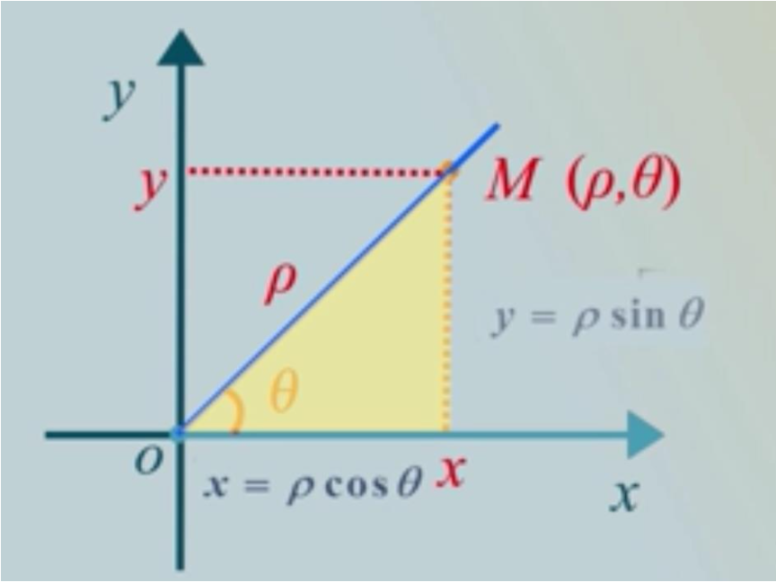
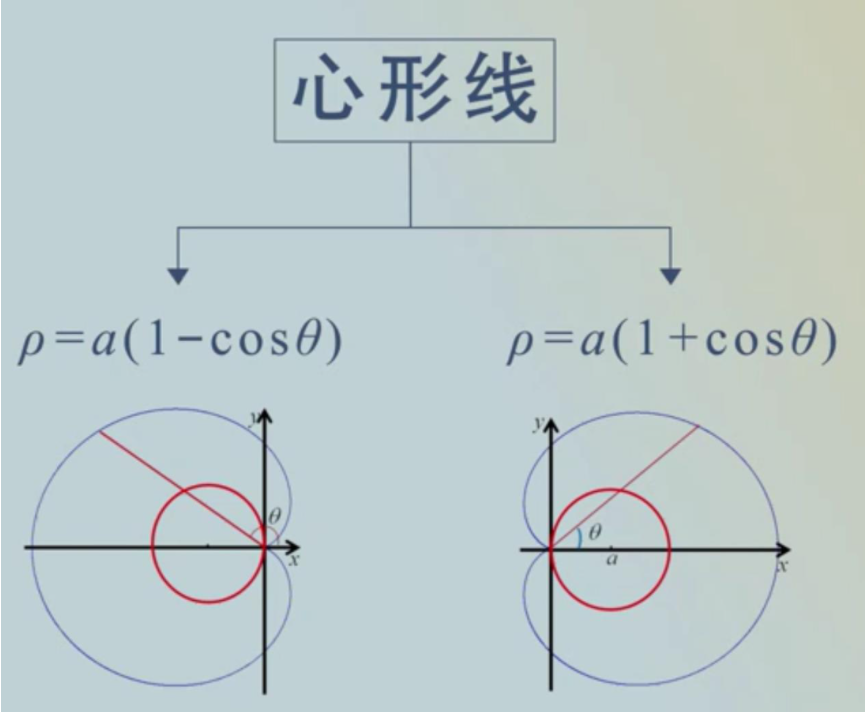
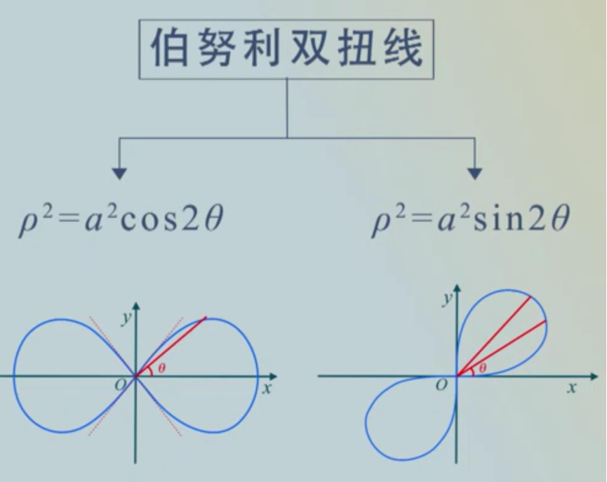
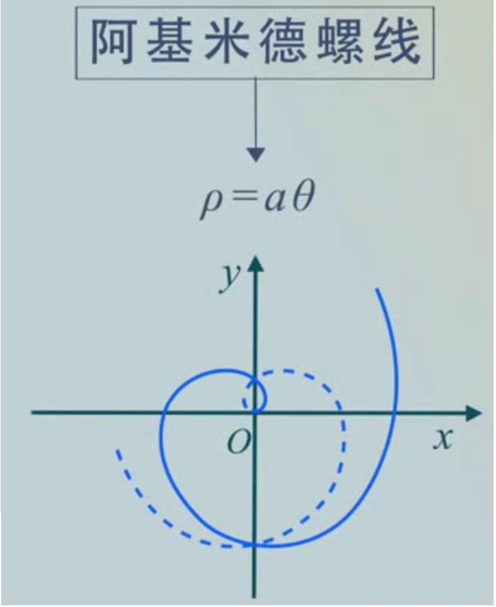
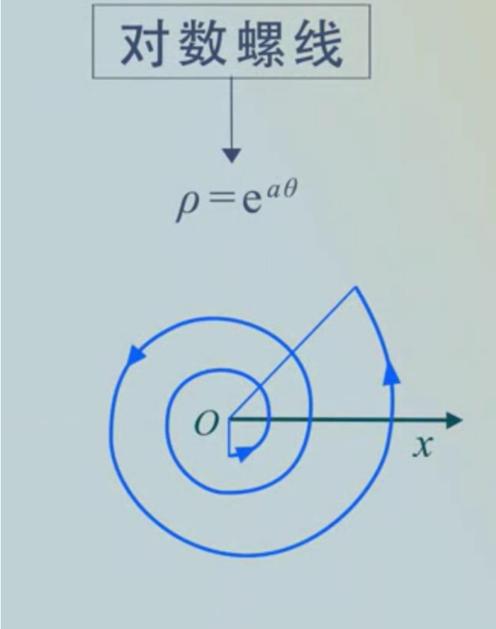
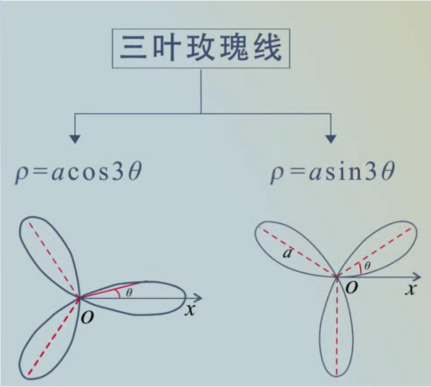
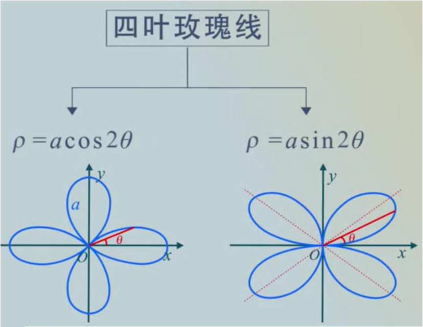
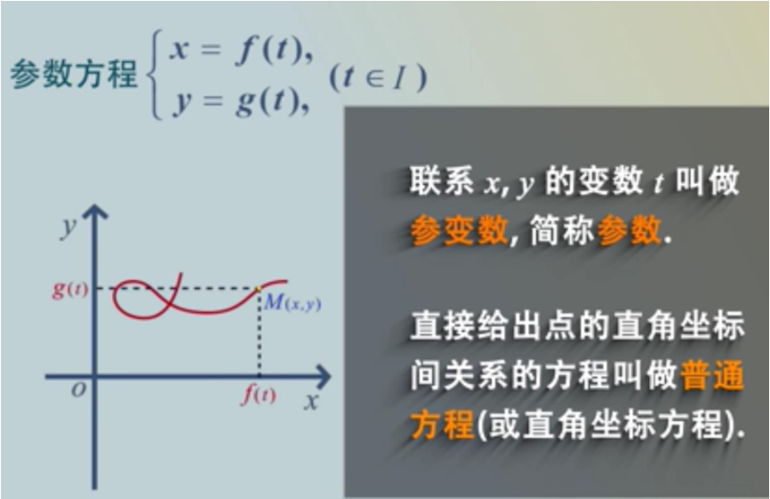

# 极坐标
主要表示无法在显函数中，无法表现的曲线函数。
[toc]

## 1. 曲线
* 一个抽象的数学概念，只有长度没有宽度的几何对象
* 平面或空间中按一定条件变动的动点的轨迹

### 1.1 如何描绘曲线
* 极坐标
* 曲线的极坐标方程
* 曲线的参数方程

## 2. 极坐标
* 主要是确定一条极轴，然后逆时针为正方向旋转角度，终边射线为长度为 $\rho$ ,该点坐标表示为$(\rho,\theta)$,并且点极坐标坐标不唯一，$(\rho,\theta+2k\pi),\quad k\in Z$

### 2.1 极坐标与平面坐标系的互化

* 由图可知重叠两个坐标系即可，由图可知$\rho\geq0,0\leq\theta\leq2\pi或-\pi\leq\theta<\pi$，然后根据三角函数可得：
$\begin{cases}x=\rho\cos\theta\\y=\rho\sin\theta\end{cases}$
$\begin{cases}\rho=\sqrt{x^2+y^2}\\\tan\theta=\frac{y}{x}(x\neq0)\end{cases}$

## 3. 极坐标方程的定义
* 在极坐标系中，如果平面曲线C上任意一点的极坐标中至少有一个满足方程
$F(\rho,\theta)=0$
并且极坐标适合方程的点都在曲线C上，那么此方程叫做曲线C的极坐标方程。

## 4. 常见曲线的极坐标方程

* 心形线直角坐标系方程：
  $\rho = \alpha(1-\cos\theta)\Rightarrow \sqrt{x^2+y^2}=\alpha(1-\frac{x}{\sqrt{x^2+y^2}})$
  $\rho = \alpha(1+\cos\theta)\Rightarrow \sqrt{x^2+y^2}=\alpha(1+\frac{x}{\sqrt{x^2+y^2}})$

* 伯努利双扭线直角坐标系方程：
  $\rho^2=\alpha^2\cos2\theta\Rightarrow\rho^2=\alpha^2(\cos^2\theta-\sin^2\theta)\Rightarrow x^2+y^2=\alpha^2(\frac{x^2-y^2}{x^2+y^2})$
  $\rho^2=\alpha^2\sin2\theta\Rightarrow\rho^2=\alpha^2(2\cos\theta\sin\theta)\Rightarrow x^2+y^2=\alpha^2(\frac{2xy}{x^2+y^2})$

* 阿基米德螺线直角坐标系方程：
  $\rho=\alpha\theta$
  $\tan{\theta}=\frac{y}{x}$
  $\sqrt{x^2+y^2}=\alpha\arctan\frac{y}{x}$

## 5. 曲线的参数方程
* 用 $y=f(x)$ 表示平面曲线时受到竖直判别法的限制条件：
函数 $y=f(x)$ 的图形与任何一条平行于 $y$ 轴的直线不能有一个以上的交点，
$x^2+y^2-a^2=0$ 不满足竖直判别法的条件。

### 5.1 参数方程的定义

* 满足上式的定义即可

