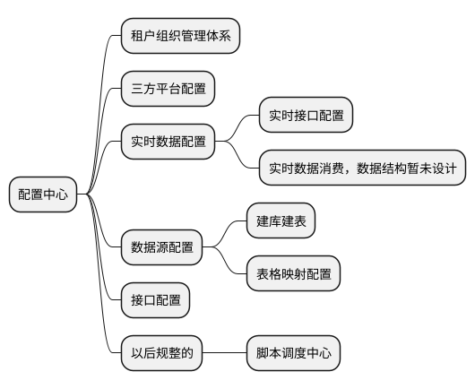

### 架构概览
* 初步考虑到数据量不大, 暂时一个mysql足以应付

```plantuml
cloud 抖音云 as douyin
cloud 有赞云 as youzan
rectangle 浏览器 as web

package 数据中台 {
  rectangle "LVS负载均衡" as nginx
  rectangle 数据探针 as rtc
  queue "数据队列(KafKa)" as kafka
  rectangle "配置中心" as pzzx
  rectangle "数据计算中心(Flink)" as flink {
    usecase 数据分流 as sjfl
    usecase 数据备份 as sjbf
    usecase 数据入库 as sjrk
    usecase other as other
  }

  rectangle "任务调度中心(DolphinScheduler)" as ds {
    usecase 抖音店家数据同步 as dydj
    usecase 验券历史数据同步 as yqls
    usecase 订单分账数据同步 as ddfz
  }

  database "数据库(Mysql)" as mysql
  file 本地 as local
  component "数据分析(datart)" as datart

  pzzx <-- ds: 读取配置
  pzzx <-- flink
  nginx -> rtc: 透传
  rtc --> kafka
  kafka --> flink

  sjrk --> mysql
  sjbf --> local

  ds -left-> douyin: 拉取数据
  ds --> mysql

  datart --> mysql: 分析
}

actor 决策者 as user

datart --> web
user --> web
douyin --> nginx:实时推送
youzan --> nginx
```

### 配置中心1.0.0
