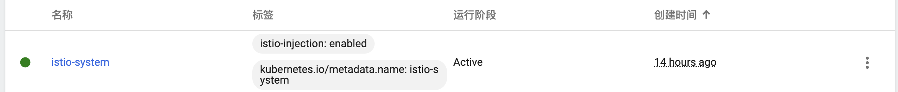
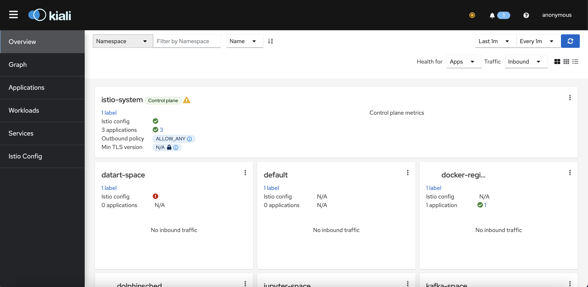
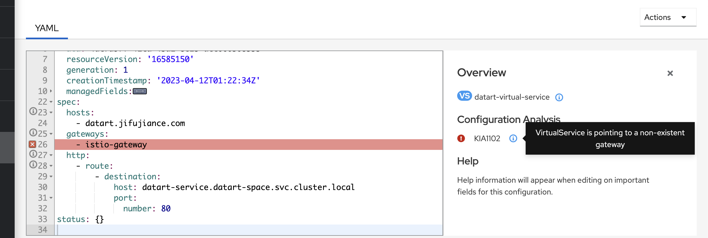
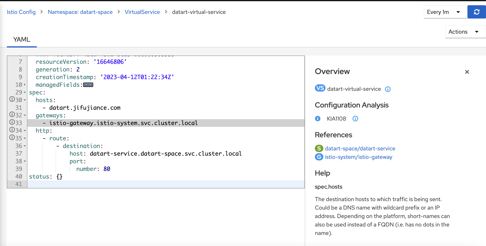
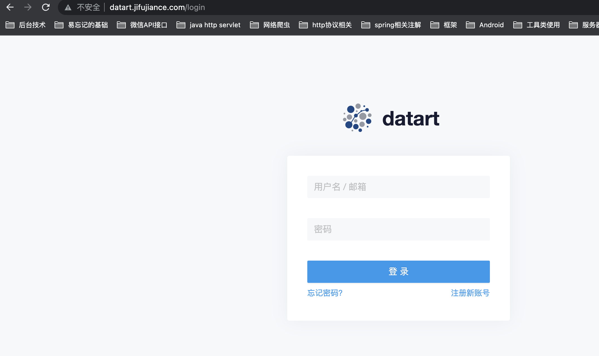
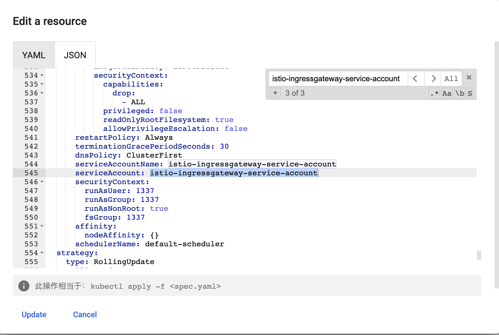
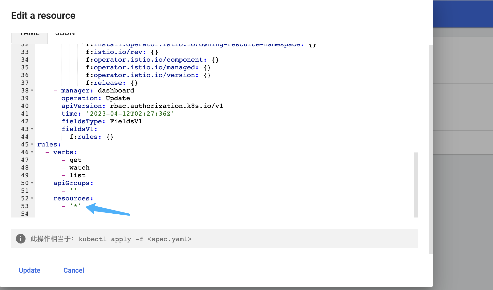

## 域名
> 域名是一个用于在互联网上标识特定网站的名称。它通常由两个或多个部分组成，例如 www.example.com，其中 ".com" 是顶级域名（TLD），"example" 是二级域名，"www" 是子域名。

### 多级域名
* 在域名 "blog.example.com.cn" 中，每一段分别代表以下内容：
1. ".cn" 是该域名的顶级域名（TLD），表示中国国家顶级域名。
2. ".com" 是该域名的二级域名（SLD），表示商业领域的顶级域名。
3. "example" 是该域名的三级域名，也称为子域名，是一个自定义的标识符，用于标识网站的名称。
4. "blog" 是该域名的四级域名，也称为子域名，用于进一步划分网站的内容或功能。

### 域名长度
1. 顶级域名（TLD）：通常不超过3到4个字符，例如 ".com"、".net"、".org"、".cn" 等。
2. 二级域名（SLD）：通常不超过63个字符，但建议将其控制在20个字符以内，以确保易于记忆和兼容性。
3. 子域名：与二级域名的长度限制相同，通常不超过63个字符，建议将其控制在20个字符以内。
4. 四级域名：与子域名的长度限制相同，通常不超过63个字符，建议将其控制在20个字符以内。

* 需要注意的是，这些长度限制只是建议值，实际上每个 DNS 服务器都可以根据其实际的配置和需求来设置不同的长度限制。

## 域名规划
* 规划域名分布

服务|描述|子域名名称|协议|端口|原因
:-|:-|:-|:-|:-|:-
kubernetes-dashboard|管理K8s的可视化界面|kubernetes-dashboard.|HTTP|-|-
kubeapps|用于快速升级部署集群的apps管理工具|kubeapps.|HTTP|-|-
jupyter|云开发编辑器, 用于编写测试一些python脚本|jupyter.|HTTP|-|-
redis|内存中间件|redis.|TCP|26379|没设密码,暂时不对外暴露
redis-admin|redis管理可视化界面|redis.|HTTP|-|-
zookeeper|注册中心中间件|zookeeper.|TCP|22181|没设密码,暂时不对外暴露
dolphinscheduler|任务调度中心|dolphinscheduler.|HTTP|-|-
datart|可视化服务|datart.|HTTP|-|-

* 延迟部署域名

服务|描述|子域名名称|协议|端口|原因
:-|:-|:-|:-|:-|:-
kafka|队列中间件|kafka.|TCP|29092|没设密码,暂不对外开放
kafka-ui|kafka管理可视化界面|kafka.|HTTP|-|-
docker-registry|docker镜像存储库|docker-registry.|TCP|25000|暂不对外开放镜像下载
docker-registry-ui|docker镜像存储管理可视化界面|HTTP|docker-registry.|-|-

## Ingress Controller 选型
名称|官网地址|优点|缺点
:-|:-|:-|:-
Kubernetes Ingress Controller|https://github.com/kubernetes/ingress-nginx|稳定、成熟，社区活跃，功能丰富，易于配置和管理|较为庞大，不适合用于轻量级应用，可能需要一些配置和调整
Nginx Ingress Controller|https://github.com/nginxinc/kubernetes-ingress|-|-
Traefik Ingress Controller|https://traefik.io/|快速、简单，支持自动配置，提供很多高级功能|部分功能可能需要付费的企业版才能使用，相对于 Nginx 的稳定性和成熟度较差
Istio Ingress Controller|https://istio.io/latest/docs/reference/|提供了很多高级功能，如流量管理、安全性、可观察性等，可以使用 Envoy 作为数据平面实现更高的性能|配置复杂，需要一定的学习曲线，可能会增加应用程序的部署时间和复杂度
Kong Ingress Controller|https://konghq.com/kong/|提供 API 网关、身份认证和授权等功能，支持自定义插件，可扩展性较好|可能需要较多的配置和调整，不适合小型应用
AWS ALB Ingress Controller|https://docs.aws.amazon.com/eks/latest/userguide/alb-ingress.html|适用于在 AWS 上运行的 Kubernetes 集群，与 AWS ELB 集成，自动进行网络负载均衡|仅适用于 AWS 环境，不适用于其他云服务提供商或私有数据中心

* 首先排除 traefik 和 AWS ALB 一个部分功能收费, 一个只支持 AWS 服务器上的 kubernetes 集群

* kong 排除, 不适用, 主要方向是用于 api 管理和控制, 在负载均衡、可观察性不如 nginx 和 lstio

* Istio Ingress Controller 提供了很多高级功能，如流量管理、安全性、可观察性等，可以使用 Envoy 作为数据平面实现更高的性能。但是，Istio Ingress Controller 的配置和使用需要您具备一定的 Kubernetes 和 Istio 相关技术知识

* 虽然 nginx 比较简单 也支持 1.26 版本, 但是是纯英文文档. 

* Istio 支持 1.26 的 kubernetes 版本, 文档更加丰富(有中文文档), 功能更加强大, 安全性方面适配较好, 虽然学习曲线较为陡峭, 但是问题不大, 

* 确定选型 Istio. 功能更加强大, 中文文档的诱惑力太香了, 英语渣渣

### 其他详细对比
* https://docs.google.com/spreadsheets/d/1DnsHtdHbxjvHmxvlu7VhzWcWgLAn_Mc5L1WlhLDA__k/edit#gid=0

## 选型 Gateway
* chartgpt 对比一下
> Istio Gateway 和 Kubernetes Gateway 都可以用于将外部流量引入到 Kubernetes 集群中，但是它们在实现和功能方面有一些不同：

1. 实现方式：Istio Gateway 是 Istio 提供的一种自定义资源类型，它是一个单独的 Kubernetes Service，通过 Istio Pilot 管理和配置。而 Kubernetes Gateway 是 Kubernetes Ingress 的一种实现，也是一个单独的 Kubernetes Service，但是它通过 Kubernetes Ingress Controller 管理和配置。

2. 功能：Istio Gateway 提供了一些额外的功能，如 L7 负载均衡、TLS 终止、路由规则等。它还支持使用自定义的 TLS 证书和 CA，以提供更高的安全性。Kubernetes Gateway 的功能相对较少，只提供基本的负载均衡和 HTTP/HTTPS 转发。

3. 适用场景：Istio Gateway 更适用于需要灵活的 L7 负载均衡、路由和安全策略的场景。Kubernetes Gateway 更适用于较简单的 HTTP/HTTPS 转发场景。

* 最终选择 Istio Gateway 的方式. 更加灵活, 也能发挥出 Istio 最大的使用价值, 同时上面也安装了 istio-gateway


## 部署 istio
* [官方文档](https://istio.io/latest/zh/docs/setup/install/helm/)

* 提供 helm 安装. 但是官方不推荐使用于生产环境
* 采用 istioctl 安装方式, 生产发布比较合适

1. 下载istio
```sh
# github 翻墙下载 即可 找到对应版本 https://github.com/istio/istio/releases/tag/1.17.2
$ curl -L https://istio.io/downloadIstio | sh -

$ tar -xf istio-1.17.2-linux-amd64.tar.gz

$ vi .bash_profile
ISTIO_HOME=/root/istio-1.17.2

export PATH=$ISTIO_HOME/bin:$PATH

# 验证环境变量配置
$ echo $PATH
/root/istio-1.17.2/bin:/usr/local/sbin:/usr/local/bin:/usr/sbin:/usr/bin:/root/bin

# 安装默认配置
$ istioctl install
This will install the Istio 1.17.2 default profile with ["Istio core" "Istiod" "Ingress gateways"] components into the cluster. Proceed? (y/N) y
✔ Istio core installed                                                                                                                                                    
✔ Istiod installed                                                                                                                                                        
✔ Ingress gateways installed                                                                                                                                              
✔ Installation complete                                                                                                                                                   Making this installation the default for injection and validation.

Thank you for installing Istio 1.17.  Please take a few minutes to tell us about your install/upgrade experience!  https://forms.gle/hMHGiwZHPU7UQRWe9

# 检查一下安装情况
$ kubectl get pod -n istio-system
NAME                                    READY   STATUS    RESTARTS   AGE
istio-ingressgateway-864db96c47-kd6mx   1/1     Running   0          3m12s
istiod-649d466b9-g42sw                  1/1     Running   0          3m16s

# 生成清单文件
$ istioctl manifest generate > ./generated-manifest.yaml

# 验证是否安装成功
$ istioctl verify-install -f generated-manifest.yaml
✔ CustomResourceDefinition: authorizationpolicies.security.istio.io.istio-system checked successfully
✔ CustomResourceDefinition: destinationrules.networking.istio.io.istio-system checked successfully
✔ CustomResourceDefinition: envoyfilters.networking.istio.io.istio-system checked successfully
✔ CustomResourceDefinition: gateways.networking.istio.io.istio-system checked successfully
✔ CustomResourceDefinition: istiooperators.install.istio.io.istio-system checked successfully
✔ CustomResourceDefinition: peerauthentications.security.istio.io.istio-system checked successfully
✔ CustomResourceDefinition: proxyconfigs.networking.istio.io.istio-system checked successfully
✔ CustomResourceDefinition: requestauthentications.security.istio.io.istio-system checked successfully
✔ CustomResourceDefinition: serviceentries.networking.istio.io.istio-system checked successfully
✔ CustomResourceDefinition: sidecars.networking.istio.io.istio-system checked successfully
✔ CustomResourceDefinition: telemetries.telemetry.istio.io.istio-system checked successfully
✔ CustomResourceDefinition: virtualservices.networking.istio.io.istio-system checked successfully
✔ CustomResourceDefinition: wasmplugins.extensions.istio.io.istio-system checked successfully
✔ CustomResourceDefinition: workloadentries.networking.istio.io.istio-system checked successfully
✔ CustomResourceDefinition: workloadgroups.networking.istio.io.istio-system checked successfully
✔ ServiceAccount: istio-ingressgateway-service-account.istio-system checked successfully
✔ ServiceAccount: istio-reader-service-account.istio-system checked successfully
✔ ServiceAccount: istiod.istio-system checked successfully
✔ ServiceAccount: istiod-service-account.istio-system checked successfully
✔ ClusterRole: istio-reader-clusterrole-istio-system.istio-system checked successfully
✔ ClusterRole: istio-reader-istio-system.istio-system checked successfully
✔ ClusterRole: istiod-clusterrole-istio-system.istio-system checked successfully
✔ ClusterRole: istiod-gateway-controller-istio-system.istio-system checked successfully
✔ ClusterRole: istiod-istio-system.istio-system checked successfully
✔ ClusterRoleBinding: istio-reader-clusterrole-istio-system.istio-system checked successfully
✔ ClusterRoleBinding: istio-reader-istio-system.istio-system checked successfully
✔ ClusterRoleBinding: istiod-clusterrole-istio-system.istio-system checked successfully
✔ ClusterRoleBinding: istiod-gateway-controller-istio-system.istio-system checked successfully
✔ ClusterRoleBinding: istiod-istio-system.istio-system checked successfully
✔ ValidatingWebhookConfiguration: istio-validator-istio-system.istio-system checked successfully
✔ EnvoyFilter: stats-filter-1.13.istio-system checked successfully
✔ EnvoyFilter: stats-filter-1.14.istio-system checked successfully
✔ EnvoyFilter: stats-filter-1.15.istio-system checked successfully
✔ EnvoyFilter: stats-filter-1.16.istio-system checked successfully
✔ EnvoyFilter: stats-filter-1.17.istio-system checked successfully
✔ EnvoyFilter: tcp-stats-filter-1.13.istio-system checked successfully
✔ EnvoyFilter: tcp-stats-filter-1.14.istio-system checked successfully
✔ EnvoyFilter: tcp-stats-filter-1.15.istio-system checked successfully
✔ EnvoyFilter: tcp-stats-filter-1.16.istio-system checked successfully
✔ EnvoyFilter: tcp-stats-filter-1.17.istio-system checked successfully
✔ ConfigMap: istio.istio-system checked successfully
✔ ConfigMap: istio-sidecar-injector.istio-system checked successfully
✔ MutatingWebhookConfiguration: istio-sidecar-injector.istio-system checked successfully
✔ Deployment: istio-ingressgateway.istio-system checked successfully
✔ Deployment: istiod.istio-system checked successfully
✔ PodDisruptionBudget: istio-ingressgateway.istio-system checked successfully
✔ PodDisruptionBudget: istiod.istio-system checked successfully
✔ Role: istio-ingressgateway-sds.istio-system checked successfully
✔ Role: istiod.istio-system checked successfully
✔ Role: istiod-istio-system.istio-system checked successfully
✔ RoleBinding: istio-ingressgateway-sds.istio-system checked successfully
✔ RoleBinding: istiod.istio-system checked successfully
✔ RoleBinding: istiod-istio-system.istio-system checked successfully
✔ HorizontalPodAutoscaler: istio-ingressgateway.istio-system checked successfully
✔ HorizontalPodAutoscaler: istiod.istio-system checked successfully
✔ Service: istio-ingressgateway.istio-system checked successfully
✔ Service: istiod.istio-system checked successfully
Checked 15 custom resource definitions
Checked 2 Istio Deployments
✔ Istio is installed and verified successfully


# 检查
$ export INGRESS_NAME=istio-ingressgateway
$ export INGRESS_NS=istio-system
$ kubectl get svc "$INGRESS_NAME" -n "$INGRESS_NS"
NAME                   TYPE           CLUSTER-IP      EXTERNAL-IP   PORT(S)                                      AGE
istio-ingressgateway   LoadBalancer   10.102.34.212   <pending>     15021:31867/TCP,80:32315/TCP,443:31582/TCP   25m

# istio-ingressgateway 状态pending因为对外ip端口不存在, 我在可视化界面完成的 
# 增加对外ip
$ kubectl edit svc istio-ingressgateway -n istio-system
# 修改spec下的内容, 增加 externalIPs,...
spec:
  externalIPs: # 增加的内容
  - 192.168.3.4 # 增加的内容
  - aa.bb.cc.dd  # 需要增加的ip
```
* 修改命名空间 开启自动注入 sidecar


* 重启 istio

* 再次检查
```sh
$ istioctl analyze -n istio-system

✔ No validation issues found when analyzing namespace: istio-system.

```

## 部署kiali
* istio 的演示版, 重在简单免费用
* 正式版等后期量大再改成正式版安装
```sh
$ kubectl apply -f https://raw.githubusercontent.com/istio/istio/release-1.17/samples/addons/kiali.yaml

# 日常需要翻墙. 真该死啊gfw
# 尝试修改 yaml 镜像, 这个镜像也要翻墙, dockerhub里面没有
containers:
  - name: kiali
    image: docker.io/kiali/kiali:v1.63

# 或者手动下载(我用的是这种方式) 硬等  等gfw大发慈悲
# 断断续续下了一个多小时, 次奥
$ docker pull quay.io/kiali/kiali:v1.63

# 打上私服标签
$ docker tag quay.io/kiali/kiali:v1.63 10.108.6.48:5000/kiali/kiali:v1.63

# push上私服
$ docker push 10.108.6.48:5000/kiali/kiali:v1.63

# 修改 yaml 镜像, 这个镜像也要翻墙, dockerhub里面没有
containers:
  - name: kiali
    image: 10.108.6.48:5000/kiali/kiali:v1.63

# 端口重定向
$ kubectl port-forward --address 0.0.0.0 --namespace istio-system service/kiali 12345:20001
```
* 终于进来了,开始排查代理不过去的问题


* 直接给我报错太人性化了(没装之前, 各种命令排查问题, 差点给我整自闭了)


* 报错资料查阅, 是因为短名称命名空间不一致导致. 无法找到确切的 gateway 和 VirtualService
* 简单修复就行了


* 终于配置好了, TvT



## 创建 Istio Gateway
* istio ingress gateway
```yaml
apiVersion: networking.istio.io/v1alpha3
kind: Gateway
metadata:
  name: istio-gateway
  namespace: istio-system
spec:
  selector:
    istio: ingressgateway
  servers:
  - hosts:
    - "kubeapps.example.com"
    - "jupyter.example.com"
    - "redis.example.com"
    - "zookeeper.example.com"
    - "dolphinscheduler.example.com"
    - "datart.example.com"
    - "kafka.example.com"
    - "docker-registry.example.com"
    port:
      name: http
      number: 80
      protocol: HTTP
  - hosts:
    - "kubernetes-dashboard.example.com"
    port:
      name: https
      number: 443
      protocol: HTTPS
      tls:
        # 透传 tls
        mode: PASSTHROUGH
        # 默认
      tls:
        mode: SIMPLE
        credentialName: kubernetes-dashboard.dashboard-certs
```

* 查看对应 gateway
```sh
$ kubectl get gateway,virtualservice -n istio-system
NAME                                        AGE
gateway.networking.istio.io/istio-gateway   27m
```

### datart
```yaml
apiVersion: networking.istio.io/v1alpha3
kind: VirtualService
metadata:
  name: datart-virtual-service
  namespace: datart-space
spec:
  hosts:
  - "datart.example.com"
  gateways:
  # 踩一天
  # 要映射的 Gateway 短名称 或者 Gateway 的全名称 Gateway 短名称 默认是 短名称 + 当前空间名 +.svc.cluster.local, 映射不知道具体空间是啥(坑啊)
  # 无脑给全services名就行了
  - istio-gateway.istio-system.svc.cluster.local
  http:
  - route:
    - destination:
        port:
          number: 80
        # 踩半天
        # 要映射的 pod 名称 或者 services 的全名称 service 短名称 默认是 当前空间名+.svc.cluster.local, 映射不知道具体空间是啥(坑啊)
        # 无脑给全services名就行了
        host: datart-service.datart-space.svc.cluster.local
```

* 查看对应的 virtual service
```sh
$ kubectl get gateway,virtualservice -n datart-space
NAME                                                        GATEWAYS            HOSTS                       AGE
virtualservice.networking.istio.io/datart-virtual-service   ["istio-gateway"]   ["datart.example.com"]   22m

# 查看详情
$ kubectl describe gateway,virtualservice -n datart-space
```

* 查看夸命名空间的服务的 endpoints 信息
```sh
# kubectl get endpoints datart-service -n datart-space
NAME             ENDPOINTS           AGE
datart-service   10.244.249.244:80   35d
```

### kubeapps
```yaml
apiVersion: networking.istio.io/v1alpha3
kind: VirtualService
metadata:
  name: kubeapps-virtual-service
  namespace: kubeapps
spec:
  hosts:
  - "kubeapps.example.com"
  gateways:
  - istio-gateway.istio-system.svc.cluster.local
  http:
  - route:
    - destination:
        port:
          number: 80
        host: kubeapps.kubeapps.svc.cluster.local
```


### redis
* 因为配置域名访问, 所以需要重新配置一下验证登录, 配置一下账号密码
```yaml
apiVersion: networking.istio.io/v1alpha3
kind: VirtualService
metadata:
  name: redis-admin-virtual-service
  namespace: redis-space
spec:
  hosts:
  - "redis.example.com"
  gateways:
  - istio-gateway.istio-system.svc.cluster.local
  http:
  - route:
    - destination:
        port:
          number: 80
        host: redis-admin-service.redis-space.svc.cluster.local
  # 下面的晚点, 早期搭建时为了方便没配置密码, 只能等配置密码了后再暴露
  # 配置 TCP协议用于暴露 redis 服务端口
  - match:
    - port: 26379
    route:
    - destination:
        port:
          number: 6379
        host: redis-headless.redis-space.svc.cluster.local
```

### dolphinscheduler
```yaml
apiVersion: networking.istio.io/v1alpha3
kind: VirtualService
metadata:
  name: dolphinscheduler-virtual-service
  namespace: dolphinscheduler-space
spec:
  hosts:
  - "dolphinscheduler.example.com"
  gateways:
  - istio-gateway.istio-system.svc.cluster.local
  http:
  - route:
    - destination:
        port:
          number: 12345
        host: dolphinscheduler-api.dolphinscheduler-space.svc.cluster.local
```

### kafka
* 只对外开放调试管理界面
* 不对外开放 kafka 服务, 没设密码不安全.
```yaml
apiVersion: networking.istio.io/v1alpha3
kind: VirtualService
metadata:
  name: kafka-virtual-service
  namespace: kafka-space
spec:
  hosts:
  - "kafka.example.com"
  gateways:
  - istio-gateway.istio-system.svc.cluster.local
  http:
  - route:
    - destination:
        port:
          number: 8080
        host: kafka-ui-service.kafka-space.svc.cluster.local
  # 下面的晚点, 早期搭建时为了方便没配置密码, 只能等配置密码了后再暴露
  # 配置 TCP协议用于暴露 kafka 服务端口
  - match:
    - port: 29092
    route:
    - destination:
        port:
          number: 9092
        host: kafka-headless.kafka-space.svc.cluster.local
```

### jupyter
```yaml
apiVersion: networking.istio.io/v1alpha3
kind: VirtualService
metadata:
  name: jupyter-virtual-service
  namespace: jupyter-space
spec:
  hosts:
  - "jupyter.example.com"
  gateways:
  - istio-gateway.istio-system.svc.cluster.local
  http:
  - route:
    - destination:
        port:
          number: 8888
        host: jupyter-deployment-service.jupyter-space.svc.cluster.local
```

### docker-registry
```yaml
apiVersion: networking.istio.io/v1alpha3
kind: VirtualService
metadata:
  name: docker-registry-ui-virtual-service
  namespace: docker-registry-space
spec:
  hosts:
  - "docker-registry.example.com"
  - "zookeeper.jifujiance.com"
  gateways:
  - istio-gateway.istio-system.svc.cluster.local
  http:
  - route:
    - destination:
        host: docker-registry-ui.docker-registry-space.svc.cluster.local
        port:
          number: 80
```

### zookeeper
* zookeeper 本身服务不对外开放
* zookeeper-ui: 可视化界面对外部开放, 但是这个项目不带登陆校验, 可考虑复用 docker-registry-ui 的 nginx 再代理一次, 相当于双重网关
* 更新之前部署好的 docker-registry-ui 的nginx配置
```yaml
kind: ConfigMap
apiVersion: v1
metadata:
  name: docker-registry-ui-nginx-config
  namespace: docker-registry-space
data:
  docker-registry.conf: |
    server {                            
        listen       80; 
        server_name  docker-registry.jifujiance.com;
        # charset koi8-r; 
        # access_log  /var/log/nginx/host.access.log  main;
        # disable any limits to avoid HTTP 413 for large image uploads  
        # error_log /var/log/nginx/error.log;
        
        client_max_body_size 0;
        # required to avoid HTTP 411: see Issue #1486 (https://github.com/moby/moby/issues/1486)                    
        chunked_transfer_encoding on;
        # required for strict SNI checking: see Issue #70 (https://github.com/Joxit/docker-registry-ui/issues/70)   
        proxy_ssl_server_name on;
        proxy_buffering off;
        # Fix push and pull of large images: see Issue #282 (https://github.com/Joxit/docker-registry-ui/issues/282)
        proxy_request_buffering off;
        proxy_ignore_headers "X-Accel-Buffering";

        # 新增 Basic Auth block
        auth_basic "Restricted Access";
        auth_basic_user_file /etc/nginx/conf.d/htpasswd;
        
        # 新增代理配置到集群内部 docker-registry 中, docker-registry不对外开放
        location /client/ {
            rewrite /client(/.*) $1 break;
            proxy_pass http://docker-registry-service.docker-registry-space.svc.cluster.local:5000/;
        }
        
        location /{
            root   /usr/share/nginx/html;
            index  index.html index.htm;
        }
        
        # redirect server error pages to the static page /50x.html                                                  
        #                                      
        error_page   500 502 503 504  /50x.html;
        location = /50x.html 
        {
            root   /usr/share/nginx/html;
        }                         
    }
  zookeeper.conf: |
    server {                            
        listen       80; 
        server_name  zookeeper.jifujiance.com;
        # charset koi8-r; 
        # access_log  /var/log/nginx/host.access.log  main;
        # disable any limits to avoid HTTP 413 for large image uploads  
        # error_log /var/log/nginx/error.log;
        
        client_max_body_size 0;
        # required to avoid HTTP 411: see Issue #1486 (https://github.com/moby/moby/issues/1486)                    
        chunked_transfer_encoding on;
        # required for strict SNI checking: see Issue #70 (https://github.com/Joxit/docker-registry-ui/issues/70)   
        proxy_ssl_server_name on;
        proxy_buffering off;
        # Fix push and pull of large images: see Issue #282 (https://github.com/Joxit/docker-registry-ui/issues/282)
        proxy_request_buffering off;
        proxy_ignore_headers "X-Accel-Buffering";

        # 新增 Basic Auth block
        auth_basic "Restricted Access";
        auth_basic_user_file /etc/nginx/conf.d/htpasswd;

        # 新增代理配置到集群内部 zk-web 中, zk-web没有登录校验 复用此处的校验
        location / {
            proxy_pass http://zk-web-docker.zookeeper-space.svc.cluster.local:8080/;
        }
                                      
        #                                      
        error_page   500 502 503 504  /50x.html;
        location = /50x.html 
        {
            root   /usr/share/nginx/html;
        }                         
    }
  htpasswd: admin:Q27K3mnRXJF0.
```


### kubernetes-dashboard
* 因为他只支持 tls 请求, 所以说得配置证书
* 顺带去阿里云申请一个证书
```sh
# 创建证书签名请求
# 阿里后台生成
# 将证书写入 kubernetes
[root@k8s-master /]# kubectl create secret tls dashboard-cert --key 9694426_kubernetes-dashboard.example.com.key --cert 9694426_kubernetes-dashboard.example.com.pem -n kubernetes-dashboard 
ert 9694426_kubernetes-dashboard.example.com_public.crt -n kubernetes-dashboard
secret/dashboard-certs created
```

* 修改 kubernetes-dashboard Deployment 更新证书
```yaml
spec:
  containers:
  - args:
    - --auto-generate-certificates=false   #不让他自动创建ssl文件使用我们给的
    - --namespace=kubernetes-dashboard    
    - --tls-cert-file=tls.crt           #指定cert文件
    - --tls-key-file=tls.key            #指定key文件
    - --token-ttl=21600
# 省略其他配置……
    volumeMounts:
    - mountPath: /certs   #上面不写绝对路径是因为他会自动到这个目录寻找指定的文件
      name: kubernetes-dashboard-certs
# 省略其他配置……
  volumes:
  - name: kubernetes-dashboard-certs
    secret:
      defaultMode: 420
      secretName: dashboard-cert   #这个是我们刚刚创建的cesret，挂载到/certs下，他会自己找
```


* VirtualService 配置
```yaml
apiVersion: networking.istio.io/v1alpha3
kind: VirtualService
metadata:
  name: kubernetes-dashboard
  namespace: kubernetes-dashboard
spec:
  hosts:
  - kubernetes-dashboard.example.com
  gateways:
  - istio-gateway.istio-system.svc.cluster.local
  tls:
  - match:
    - port: 443
      sniHosts:
      - kubernetes-dashboard.example.com
    route:
    - destination:
        host: kubernetes-dashboard.kubernetes-dashboard.svc.cluster.local
        port:
          number: 443
```

* 后续关闭 NodePort

### kiali 
* 由于安装的kiali是istio安装示例用于快速使用和运行. 所以没办法修改配置, 找不到对应的文档, 也没引入这种类型的文件格式
```yaml
apiVersion: kiali.io/v1
kind: Kiali
```
* 所以难以修改它的配置. 没时间研究了, 有时间后期补上
* 暂时使用端口重定向的方式访问
```sh
$ kubectl port-forward --address 0.0.0.0 --namespace istio-system service/kiali 12345:20001
```


## 可能遇到问题
### istio 账户权限不足问题
* 因为是以空间命名逻辑隔离每个服务, 易于治理, 但是因为istio 默认创建的用户只有当前命名空间的权限, 就会导致跨命名空间代理时, 请求无法正确转发
* 查看 sidecar 也就是, 自动创建的 istio-ingressgateway 容器所使用的账户


* 权限不足, Istio 依赖于 Kubernetes 的 API 来发现服务和 Pod，并根据需要配置 Envoy 代理。如果 Istio 的代理缺乏必要的访问权限，那么它将无法发现服务和 Pod，也无法对它们进行配置。
```sh
$ kubectl auth can-i list deployments --as istio-ingressgateway-service-account -n istio-system
no
$ kubectl auth can-i list deployments --as istio-ingressgateway-service-account -n datart-space
no
```

#### 解决方案
* 在当前空间下新增拥有全部命名空间只读的角色
```yaml
apiVersion: rbac.authorization.k8s.io/v1
kind: Role
metadata:
  namespace: istio-system
  name: read-all-namespaces
rules:
- apiGroups: [""]
  resources: ["*"]
  verbs: ["get", "list", "watch"]
```
* 或者是修改 istio-ingressgateway-sds 权限


### 监控问题
* 报错
```log
failed to get cpu utilization: unable to get metrics for resource cpu: unable to fetch metrics from resource metrics API: the server could not find the requested resource (get pods.metrics.k8s.io)
```

#### 解决方案
* 验证 是否有安装 kubernetes metrics server
```sh
$ kubectl get deployment metrics-server -n kube-system
Error from server (NotFound): deployments.apps "metrics-server" not found
```

* [部署 metrics server](https://github.com/kubernetes-sigs/metrics-server)
```sh
# 无法直接安装 镜像拉不下来
$ kubectl apply -f https://github.com/kubernetes-sigs/metrics-server/releases/latest/download/high-availability-1.21+.yaml[root@k8s-master ~]serviceaccount/metrics-server created
clusterrole.rbac.authorization.k8s.io/system:aggregated-metrics-reader created
clusterrole.rbac.authorization.k8s.io/system:metrics-server created
rolebinding.rbac.authorization.k8s.io/metrics-server-auth-reader created
clusterrolebinding.rbac.authorization.k8s.io/metrics-server:system:auth-delegator created
clusterrolebinding.rbac.authorization.k8s.io/system:metrics-server created
service/metrics-server created
deployment.apps/metrics-server created
poddisruptionbudget.policy/metrics-server created
apiservice.apiregistration.k8s.io/v1beta1.metrics.k8s.io created

# 更改镜像
containers:
  - name: metrics-server
    # 换成不同的替代品
    image: bitnami/metrics-server:0.6.3
    args:
      - '--cert-dir=/tmp'
      - '--secure-port=4443'
      - '--kubelet-preferred-address-types=InternalIP,ExternalIP,Hostname'
      - '--kubelet-use-node-status-port'
      - '--metric-resolution=15s'
      # 不校验tls证书
      - '--kubelet-insecure-tls'
```
