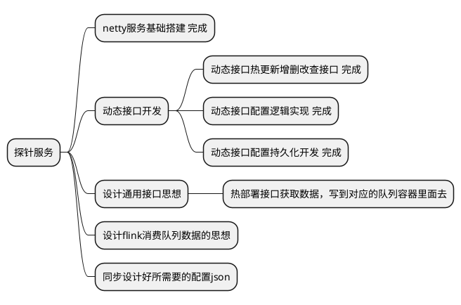

### Netty的使用
* [Netty 官方文档](https://netty.io/wiki/user-guide-for-4.x.html#wiki-h3-16)
* 其实就是个管道 pipeline 的思想. 一层一层的处理这个协议的请求方式，每层都做个转换。

### 规划


### 热部署配置
* 由于json不好加注释所以采用yaml 文件展示数据格式，实际采用json存储更新接口服务配置
```yaml
# 是否收集打印请求URI地址，true | false
is_collect_print_uri: false
# 是否打印请求体数据 true | false
is_print_request_data: false
is_collect_send_data: false
# 接口请求配置
request:
    # 监听接口地址
    path: /kuaishou/probe
    # 监听方式 GET | POST ｜ PUT | DELETE
    method: POST
    # 解析 http 请求 数据位置 CONTENT | PARAMS
    data: CONTENT
    # 接收数据类型 STRING | JSON | XML | CUSTOM CUSTOM是调用handler处理方法进行数据处理
    data_type: CUSTOM
# 响应配置
response: 
    # 响应请求头
    header:
        - key: Content-Type
          value: application/json; charset=utf-8
    # 响应数据 string 舍去各种转换成本直接使用字符串作为配置
    data:
        # 成功响应
        success: {"data": {"error_code":0, "description": "success"}}
        # 失败响应
        fails:  {"data": {"error_code":-1, "description": "error"}}
# 处理方法，主要用于处理接收到的数据，经过简单的处理判断对外抛出数据
handler: import java.util.function.Function;\n\npublic class TestLambda implements Function<String,String> {\n  @Override\n  public String apply(String o) {\n    System.out.println(\"Hello, Lambda! \" + o);\n    return o+\"-123123\";\n  }\n}
topic_name: kuaishou_data
topic_partitions: 1
# 需要，但是暂未加入字段
# 分区字段，利用哪个字段进行分区，以放入不同的partition内部 . 分割map的路径
partition_filed_path: data.userid
# 写入方法
# write_to:
    # 写入类型预支持队列和本地文件 kafka | rabbitmq ｜ localfile，目前只实现了 kafka 逻辑
    # type: kafka
    # 队列服务地址
    # servers: kafka.kafka-space.svc.cluster.local:9092
    # 生产消息配置
    # producer:
    #     # 默认字节大小
    #     batch_size: 16384 
    #     # 重试发送次数
    #     retries: 3 
    # kafka topic 配置
    # 为了提高并发，写入地方不可配，直接在程序中写死只能进入对应的kafka topic队列中去
    # 只允许配置简单的 topic name 
    # topic: 
        # 名称
        # name: kuaishou_data
        # 分区数量. 用于默认hashcode 求余写入不同partitions中
        # partitions: 1
        # 复制份数
        # replication: 2
```

### 部分接口
```http
#公共变量
@commonHost = http://127.0.0.1:8082
@commonAuthorization = Bearer YourAuthToken
@commonToken = token

# 测试心跳
### 发送 GET 请求 400
GET {{commonHost}}/NeHeartBeat HTTP/1.1

###  获取接口服务当前配置
GET {{commonHost}}/dynamic/interface/config HTTP/1.1

### 正式请求，增加接口配置
POST {{commonHost}}/kuaishou/setting HTTP/1.1
Cache-Setting-Token: {{commonToken}}

### 正式请求，删除接口配置
DELETE {{commonHost}}/kuaishou/setting HTTP/1.1
Cache-Setting-Token: {{commonToken}}

### 正式请求快手动态接口
GET {{commonHost}}/kuaishou/probe HTTP/1.1

{"test":"test-request"}

# 测试热更新接口
### 发送 GET 请求 400
GET {{commonHost}}/setting HTTP/1.1

### 发送 POST 请求 不带 token 401
POST {{commonHost}}/setting HTTP/1.1

### 发送 POST 请求 带正确的 token 正确收取数据
POST {{commonHost}}/kuaishou/setting HTTP/1.1
Cache-Setting-Token: {{commonToken}}
```

* 本来都按照这个思路写完了，但是各个平台的推送方式不一样，有些有加密有些没有加密，最终就是光处理数据不行，还得解密校验数据，不能为了提高并发量，而先收数据后验证，因为考虑到数据在传输中可能缺少了某个包，导致数据无法解密等等特殊情况。

* 所以一不做二不休，将控制器整个类，做个继承的方式暴露到外面来。配置只做ID唯一标记，和接口类的编辑，以及http的路由配置，以及数据流向的去处即可。
* 也不行，考虑到把整个类继承出去的话，耦合性太高了，继承类，要熟知里面的方法，还不好统计数据。如果要统计还得知道，项目中有哪些公共变量，简而言之就是非常鸡肋，跟后端写代码没什么区别。
* 所以思来想去了一波，还得保持现状，将数据解析和处理放到，handle自定义处理数据方法里面。

### 单机kafka测试
* 单节点kafka环境测试
```docker
# 使用一个基础镜像
FROM openjdk:11

# 设置环境变量
ENV KAFKA_HOME /opt/kafka
ENV PATH $KAFKA_HOME/bin:$PATH

# 复制你修改后的 Kafka 文件夹到镜像中
COPY /kafka_2.13-3.6.0 /opt/kafka

# 暴露 Kafka 监听端口
EXPOSE 9092

# 启动 Kafka
CMD ["kafka-server-start.sh", "/opt/kafka/config/server.properties"]
```

### 启用sidecar
* [官方文档](https://istio.io/latest/zh/docs/setup/additional-setup/sidecar-injection/#manual-sidecar-injection)
* 看情况是否启用，当请求多到需要分流的情况下可以启用
* Sidecar:
    * 定位： Sidecar 是一种轻量级的代理容器，与应用程序容器一起在同一 Pod 中运行。它负责管理流量和执行各种 Istio 功能，例如负载均衡、流量控制、故障注入等。
    * 作用： Sidecar 的主要作用是增强和管理在同一 Pod 中的应用程序的网络通信。它通过 Envoy 代理实现，与应用程序共享网络命名空间，能够截获并处理流量。
* Ingress Gateway:

    * 定位： Ingress Gateway 是一个独立的组件，负责处理外部流量进入 Istio 网格的入口。它通常是部署在集群外部，作为 Istio 网格与外部服务之间的接口。
    * 作用： Ingress Gateway 提供了入口点，用于将外部流量引导到 Istio 网格内的服务。它执行流量控制、路由、TLS 终止等功能。Ingress Gateway 可以配置为将外部请求转发到 Istio 内部的服务。

#### 手动注入sidecar
```sh
# 获取配置
kubectl -n istio-system get configmap istio-sidecar-injector -o=jsonpath='{.data.config}' > inject-config.yaml
kubectl -n istio-system get configmap istio-sidecar-injector -o=jsonpath='{.data.values}' > inject-values.yaml
kubectl -n istio-system get configmap istio -o=jsonpath='{.data.mesh}' > mesh-config.yaml

# 执行命令 your_deploy 文件内容一般是有个 deployment 和 service 的yaml就行
$ istioctl kube-inject \
    --injectConfigFile inject-config.yaml \
    --meshConfigFile mesh-config.yaml \
    --valuesFile inject-values.yaml \
    --filename your_deploy.yaml \
    | kubectl apply -f -
```