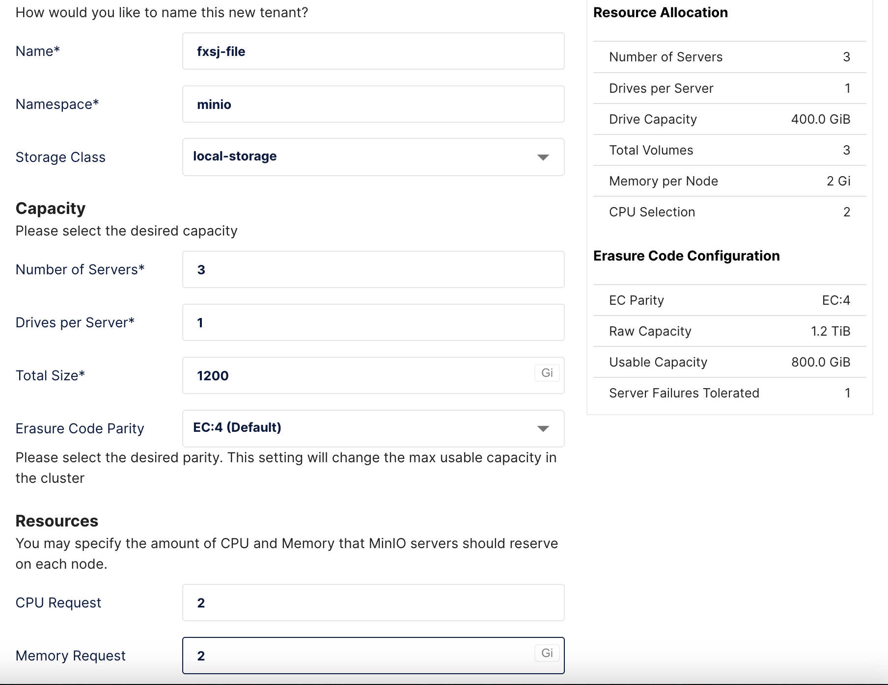
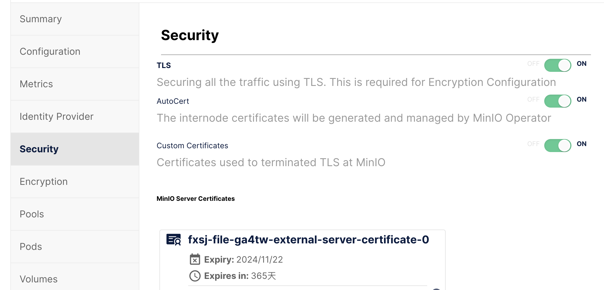
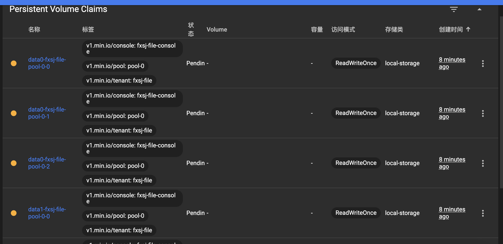
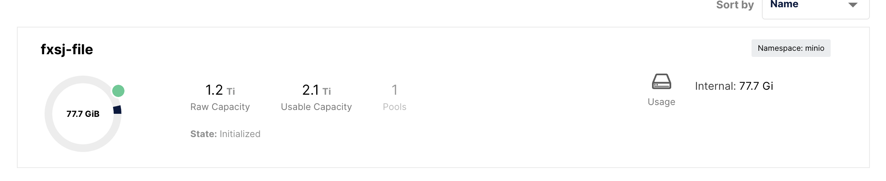
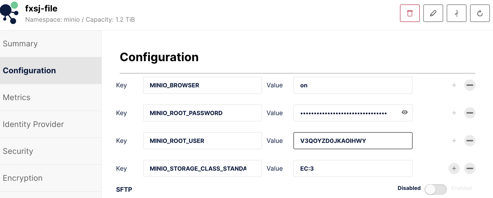

### minIO搭建
* [官方文档](https://min.io/docs/minio/kubernetes/upstream/operations/installation.html)

### 版本选择
* 查看一下kubernetes 的版本，选择对应的minio的兼容版本。
```sh
[root@k8s-master ~]# kubectl version --client
WARNING: This version information is deprecated and will be replaced with the output from kubectl version --short.  Use --output=yaml|json to get the full version.
Client Version: version.Info{Major:"1", Minor:"26", GitVersion:"v1.26.0", GitCommit:"b46a3f887ca979b1a5d14fd39cb1af43e7e5d12d", GitTreeState:"clean", BuildDate:"2022-12-08T19:58:30Z", GoVersion:"go1.19.4", Compiler:"gc", Platform:"linux/amd64"}
Kustomize Version: v4.5.7

# 版本架构
[root@k8s-master ~]# uname -m
x86_64
```
* 我这 kubernetes 是1.26版本, 官网介绍如下：
4.0.0+对应kubernetes版本>=1.19.0;
5.0.0+对应kubernetes>=1.21.0;
5.0.6+对应kubernetes>=1.25.0
* 所以我需要装5.0.6以上版本的 kubernetes
* 只能含泪装最新版了
* 日常访问不通，本地翻墙下载上传安装吧，[下载地址](https://github.com/minio/operator/releases)

* 检查 kubernetes 证书配置情况

```sh
# 查询kube-system的配置
$ kubectl get pod kube-controller-manager-$CLUSTERNAME-control-plane \
  -n kube-system -o yaml
# 检查有着两行证书配置才行
     - --cluster-signing-cert-file=/etc/kubernetes/pki/ca.crt
     - --cluster-signing-key-file=/etc/kubernetes/pki/ca.key
```

#### 安装 minio-operator
```sh
# 改名
[root@k8s-master appls-config]# mv kubectl-minio_5.0.11_linux_amd64  kubectl-minio

# 执行权限
$ chmod +x kubectl-minio
# 移动到命令文件夹下
$ mv kubectl-minio /usr/local/bin/
# 查看安装版本
$ kubectl minio version 
```

#### 初始化 minio kebernetes operator
```sh
$ kubectl minio init
# 验证安装成果
$ kubectl get all --namespace minio-operator
# 映射访问
$ kubectl minio proxy
# 获取token
$ kubectl get secret/console-sa-secret -n minio-operator -o json | jq -r '.data.token' | base64 -d
# 由于安装了网关直接网关映射访问即可
```
* 映射文件
```yaml
kind: VirtualService
apiVersion: networking.istio.io/v1beta1
metadata:
  name: minio-operator-virtual-service
  namespace: minio-operator
spec:
  hosts:
    - minio.exalmp.com
  gateways:
    - istio-system/istio-gateway
  http:
    - route:
        - destination:
            host: console.minio-operator.svc.cluster.local
            port:
              number: 9090
```

### 安装 minio
#### 准备空间
* 存储采用本地分布式存储
* 创建 local 类型的 storage classes
```yaml
apiVersion: storage.k8s.io/v1
kind: StorageClass
metadata:
  name: local-storage
provisioner: kubernetes.io/no-provisioner
volumeBindingMode: WaitForFirstConsumer
```

#### 创建
* 进入 minio operator， 创建tenants

* 从上到下依次是：
    1. 租户名称
    2. Kubernetes 明明空间
    3. 所使用的存储类型
    4. 服务器数量
    5. 服务器上磁盘数量，每个节点至少两个卷
    6. 内存总大小
    7. 纠删码级别，默认即可
    8. 最低CPU保留数
    9. 最低保留内存
* 记得选择第三方证书

* 点击创建 
会自动生成 pvc, 需要手动绑定 pvc 到 pv 上，pod 才能正常运行


* 因为是三台服务器，创建六个PV卷, 对应改一下配置即可
```yaml
apiVersion: v1
kind: PersistentVolume
metadata:
  name: pvc-data0-fxsj-file-pool-0-0
  namespace: minio
spec:
  capacity:
    storage: 200Gi
  volumeMode: Filesystem
  accessModes:
    - ReadWriteOnce
  persistentVolumeReclaimPolicy: Retain
  storageClassName: local-storage
  local:
    path: /data/minio-data-0
  claimRef: # PVC 绑定
    kind: PersistentVolumeClaim
    namespace: minio
    name: data0-fxsj-file-pool-0-0
  nodeAffinity:  # 绑定节点的本地存储
    required:
      nodeSelectorTerms:
        - matchExpressions:
            - key: kubernetes.io/hostname  # 使用节点的主机名匹配
              operator: In
              values:
                - k8s-master  # 替换为你的节点名称
---
apiVersion: v1
kind: PersistentVolume
metadata:
  name: pvc-data1-fxsj-file-pool-0-0
  namespace: minio
spec:
  capacity:
    storage: 200Gi
  volumeMode: Filesystem
  accessModes:
    - ReadWriteOnce
  persistentVolumeReclaimPolicy: Retain
  storageClassName: local-storage
  local:
    path: /data/minio-data-1
  claimRef: # PVC 绑定
    kind: PersistentVolumeClaim
    namespace: minio
    name: data1-fxsj-file-pool-0-0
  nodeAffinity:  # 绑定节点的本地存储
    required:
      nodeSelectorTerms:
        - matchExpressions:
            - key: kubernetes.io/hostname  # 使用节点的主机名匹配
              operator: In
              values:
                - k8s-master  # 替换为你的节点名称
---
apiVersion: v1
kind: PersistentVolume
metadata:
  name: pvc-data0-fxsj-file-pool-0-1
  namespace: minio
spec:
  capacity:
    storage: 200Gi
  volumeMode: Filesystem
  accessModes:
    - ReadWriteOnce
  persistentVolumeReclaimPolicy: Retain
  storageClassName: local-storage
  local:
    path: /data/minio-data-0
  claimRef: # PVC 绑定
    kind: PersistentVolumeClaim
    namespace: minio
    name: data0-fxsj-file-pool-0-1
  nodeAffinity:  # 绑定节点的本地存储
    required:
      nodeSelectorTerms:
        - matchExpressions:
            - key: kubernetes.io/hostname  # 使用节点的主机名匹配
              operator: In
              values:
                - vm-0-14-centos  # 替换为你的节点名称
---
apiVersion: v1
kind: PersistentVolume
metadata:
  name: pvc-data1-fxsj-file-pool-0-1
  namespace: minio
spec:
  capacity:
    storage: 200Gi
  volumeMode: Filesystem
  accessModes:
    - ReadWriteOnce
  persistentVolumeReclaimPolicy: Retain
  storageClassName: local-storage
  local:
    path: /data/minio-data-1
  claimRef: # PVC 绑定
    kind: PersistentVolumeClaim
    namespace: minio
    name: data1-fxsj-file-pool-0-1
  nodeAffinity:  # 绑定节点的本地存储
    required:
      nodeSelectorTerms:
        - matchExpressions:
            - key: kubernetes.io/hostname  # 使用节点的主机名匹配
              operator: In
              values:
                - vm-0-14-centos  # 替换为你的节点名称
---
apiVersion: v1
kind: PersistentVolume
metadata:
  name: pvc-data0-fxsj-file-pool-0-2
  namespace: minio
spec:
  capacity:
    storage: 200Gi
  volumeMode: Filesystem
  accessModes:
    - ReadWriteOnce
  persistentVolumeReclaimPolicy: Retain
  storageClassName: local-storage
  local:
    path: /data/minio-data-0
  claimRef: # PVC 绑定
    kind: PersistentVolumeClaim
    namespace: minio
    name: data0-fxsj-file-pool-0-2
  nodeAffinity:  # 绑定节点的本地存储
    required:
      nodeSelectorTerms:
        - matchExpressions:
            - key: kubernetes.io/hostname  # 使用节点的主机名匹配
              operator: In
              values:
                - vm-0-16-centos  # 替换为你的节点名称
---
apiVersion: v1
kind: PersistentVolume
metadata:
  name: pvc-data1-fxsj-file-pool-0-2
  namespace: minio
spec:
  capacity:
    storage: 200Gi
  volumeMode: Filesystem
  accessModes:
    - ReadWriteOnce
  persistentVolumeReclaimPolicy: Retain
  storageClassName: local-storage
  local:
    path: /data/minio-data-1
  claimRef: # PVC 绑定
    kind: PersistentVolumeClaim
    namespace: minio
    name: data1-fxsj-file-pool-0-2
  nodeAffinity:  # 绑定节点的本地存储
    required:
      nodeSelectorTerms:
        - matchExpressions:
            - key: kubernetes.io/hostname  # 使用节点的主机名匹配
              operator: In
              values:
                - vm-0-16-centos  # 替换为你的节点名称
```

* 漫长的等待，初始化完成

* 记录账号密码

