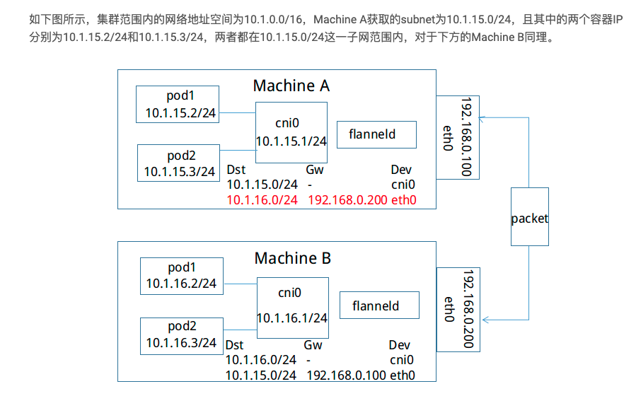
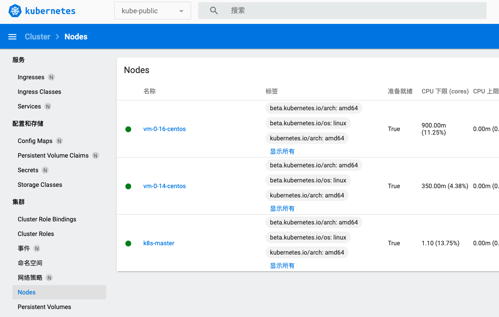
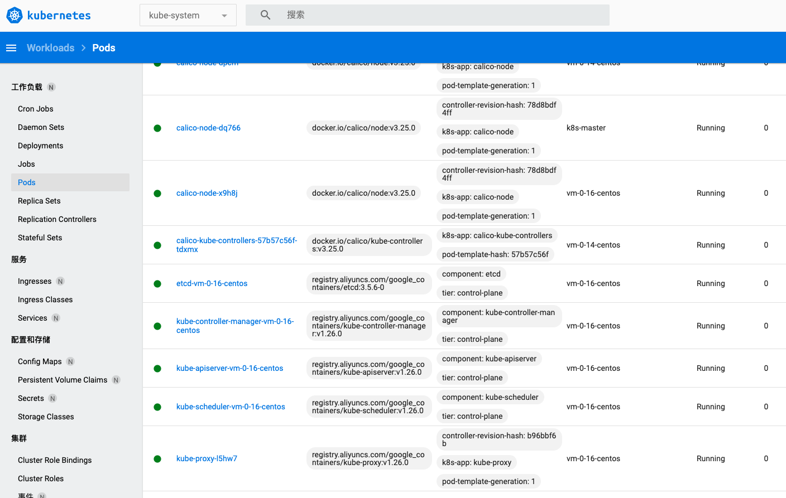
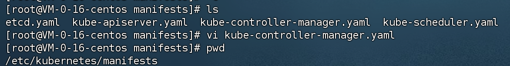

### 创建 Kubernetes 集群
* [原文地址](https://kubernetes.io/zh-cn/docs/setup/production-environment/tools/kubeadm/install-kubeadm/#installing-kubeadm-kubelet-and-kubectl)
* 在每台服务器装好 `docker` 之后, 在每台机器上安装以下的软件包：
  * `kubeadm`：用来初始化集群的指令。
  * `kubelet`：在集群中的每个节点上用来启动 Pod 和容器等。
  * `kubectl`：用来与集群通信的命令行工具。

### 注意事项
1. 确保每个节点上 MAC 地址和 product_uuid 的唯一性
  * 使用命令 `ip link` 或 `ifconfig -a` 来获取网络接口的 MAC 地址
  * 使用 `sudo cat /sys/class/dmi/id/product_uuid` 命令对 `product_uuid` 校验

2. 检查相关端口是否开放
    ```sh
    $ nc 127.0.0.1 6443
    ```

* 必须改主机名:
 * hostname 和 DNS 的解析规则不匹配导致报错,原因是 hostname 和 DNS 的解析规则不匹配， 不能有除-和 . 之外的特殊字符存在
hostnamectl set-hostname k_master

### 前置准备
* 检查并关闭以下
* 关闭交换分区
```sh
$ sudo swapoff -a #临时关闭
$ sudo sed -i 's/.*swap.*/#&/' /etc/fstab #永久关闭交换区
```

* 禁用selinux
```sh
setenforce 0 #临时关闭
sed -i "s/^SELINUX=enforcing/SELINUX=disabled/g" /etc/selinux/config #永久关闭
```

* 关闭防火墙
```sh
[root@VM-0-8-centos ~]$ sudo systemctl stop firewalld.service
[root@VM-0-8-centos ~]$ sudo systemctl disable firewalld.service
```

* 清除 iptables 配置
```sh
# 内网服务器全部清除即可
[root@VM-0-8-centos ~]$ iptables -F && iptables -t nat -F && iptables -t mangle -F && iptables -X

# 查看当前规则
[root@VM-0-8-centos ~]$ cat  /etc/sysconfig/iptables
cat: /etc/sysconfig/iptables: No such file or directory
# 这是因为没有安装 iptables-services 软件包

# 查看是否含有该软件
[root@VM-0-8-centos ~]$ yum list iptables-services --showduplicates | sort -r
Repository extras is listed more than once in the configuration
Repository epel is listed more than once in the configuration
Last metadata expiration check: 3:17:23 ago on Fri 13 Jan 2023 07:48:01 AM CST.
iptables-services.x86_64                   1.8.4-20.el8                   baseos
iptables-services.x86_64                   1.8.4-20.el8                   base


# 安装 iptables-services
[root@VM-0-8-centos ~]$ yum install iptables-services

# 云服务器应该默认自带这玩意儿, 但是又没办法覆盖配置, 所以得重新安装一个, 别折腾了去云服务器后台折腾安全组吧, 艹 浪费我大半天的时间
# 贴出自己的 规则配置, 放行单台设备, 防止其他设备连接
$ iptables -t filter -A INPUT -m mac --mac-source 00:00:00:00:00:00 -j ACCEPT #放行mac地址

# 允许接受远程 ssh 请求
$ iptables -A INPUT -i eth0 -p tcp --dport 22 -m state --state NEW,ESTABLISHED -j ACCEPT
# 2.允许发送本地主机的SSH响应
iptables -A OUTPUT -o eth0 -p tcp --sport 22 -m state --state ESTABLISHED -j ACCEPT

# 放行 22 端口, 区别就是所有流量都接受
$ iptables -A INPUT -i eth0 -p tcp --dport 22 -j ACCEPT

# 允许其他两台服务器的访问
$ iptables -t filter -I INPUT -s 172.17.0.14 -j ACCEPT
$ iptables -t filter -I INPUT -s 172.17.0.16 -j ACCEPT

# 放开 80端口和 443端口
$ iptables -A INPUT -i eth0 -p tcp --dport 80 -j ACCEPT
$ iptables -A INPUT -i eth0 -p tcp --dport 443 -j ACCEPT

```


### 安装 kubeadm、kubelet 和 kubectl
* master安装kubectl、kubeadm、kubelet, node安装kubeadm、kubelet
* 设置阿里云镜像, 因为原版镜像在国外访问不了.
```sh
# 设置镜像
# 其中 check 记得关闭, check不过的 会一直卡着
$ cat <<EOF > /etc/yum.repos.d/kubernetes.repo
[kubernetes]
name=Kubernetes
baseurl=https://mirrors.aliyun.com/kubernetes/yum/repos/kubernetes-el7-x86_64/
enabled=1
gpgcheck=0
repo_gpgcheck=0
gpgkey=https://mirrors.aliyun.com/kubernetes/yum/doc/yum-key.gpg https://mirrors.aliyun.com/kubernetes/yum/doc/rpm-package-key.gpg
EOF

# 查看版本, 可惜没得
$ yum list kubelet --showduplicates | sort -r
Repository extras is listed more than once in the configuration
Repository epel is listed more than once in the configuration
Kubernetes                                      493 kB/s | 162 kB     00:00
kubelet.x86_64                       1.9.9-0                          kubernetes
kubelet.x86_64                       1.9.8-0                          kubernetes
kubelet.x86_64                       1.9.7-0                          kubernetes

# 安装指定版本, 用不上可惜了
$ yum install -y kubelet-1.17.2 kubeadm-1.17.2 kubectl-1.17.2
```

* 安装最新版
```sh
# 每台机器都要装这两个
$ yum install -y kubelet kubeadm

# 设置开机自启, 后面初始化时需要用到 否则会报错
# 启动
systemctl start kubelet && systemctl enable kubelet

# 查看状态, 启动失败, 文件不存在 init之后就会正常运行, 可以无视它
systemctl status kubelet
● kubelet.service - kubelet: The Kubernetes Node Agent
   Loaded: loaded (/usr/lib/systemd/system/kubelet.service; disabled; vendor preset: disabled)
  Drop-In: /usr/lib/systemd/system/kubelet.service.d
           └─10-kubeadm.conf
   Active: activating (auto-restart) (Result: exit-code) since Thu 2023-01-12 11:00:52 CST; 2s ago
     Docs: https://kubernetes.io/docs/
  Process: 2601872 ExecStart=/usr/bin/kubelet $KUBELET_KUBECONFIG_ARGS $KUBELET_CONFIG_ARGS $KUBELET_KUBEADM_ARGS $KUBELET_EXTRA_ARGS (code=exited, status=1/FAILURE)
 Main PID: 2601872 (code=exited, status=1/FAILURE)
```

* curl 安装 kubectl (只有Master服务器才需要装这个):
```sh
# 安装最新版
$ curl -LO "https://dl.k8s.io/release/$(curl -L -s https://dl.k8s.io/release/stable.txt)/bin/linux/amd64/kubectl"
# curl -LO https://dl.k8s.io/release/v1.26.0/bin/linux/amd64/kubectl 脚本位置可以替换成具体的版本号

# 下载 kubectl 校验和文件
[root@VM-0-8-centos ~]$ curl -LO "https://dl.k8s.io/$(curl -L -s https://dl.k8s.io/release/stable.txt)/bin/linux/amd64/kubectl.sha256"
[root@VM-0-8-centos ~]$ ls
kubectl  kubectl.sha256

# 基于校验和文件，验证 kubectl 的可执行文件：
[root@VM-0-8-centos ~]$ echo "$(cat kubectl.sha256)  kubectl" | sha256sum --check
kubectl: OK

# 验证失败时
kubectl: FAILED
sha256sum: WARNING: 1 computed checksum did NOT match

# 安装 kubectl
[root@VM-0-8-centos ~]$ sudo install -o root -g root -m 0755 kubectl /usr/local/bin/kubectl
# 验证 安装是否成功
[root@VM-0-8-centos ~]$ kubectl version --client
WARNING: This version information is deprecated and will be replaced with the output from kubectl version --short.  Use --output=yaml|json to get the full version.
Client Version: version.Info{Major:"1", Minor:"26", GitVersion:"v1.26.0", GitCommit:"b46a3f887ca979b1a5d14fd39cb1af43e7e5d12d", GitTreeState:"clean", BuildDate:"2022-12-08T19:58:30Z", GoVersion:"go1.19.4", Compiler:"gc", Platform:"linux/amd64"}
Kustomize Version: v4.5.7
[root@VM-0-8-centos ~]$ kubectl version --client --output=yaml
clientVersion:
  buildDate: "2022-12-08T19:58:30Z"
  compiler: gc
  gitCommit: b46a3f887ca979b1a5d14fd39cb1af43e7e5d12d
  gitTreeState: clean
  gitVersion: v1.26.0
  goVersion: go1.19.4
  major: "1"
  minor: "26"
  platform: linux/amd64
kustomizeVersion: v4.5.7
```

### 安装 cri-docker
* [原文地址](https://blog.51cto.com/flyfish225/5977053)
* 因为我装的 Kubernetes 是最新版本 1.26.0, 而 Kubernetes 版本 >1.23时 已经全面移除了对 docker 的支持, 所以得装个插件
* 可能需要翻墙[github](https://github.com/Mirantis/cri-dockerd)
```sh
# 直接下载在服务器下载
$ wget https://github.com/Mirantis/cri-dockerd/releases/download/v0.3.0/cri-dockerd-0.3.0.amd64.tgz

$ tar -xf cri-dockerd-0.3.0.amd64.tgz
$ cp cri-dockerd/cri-dockerd /usr/bin/
$ chmod +x /usr/bin/cri-dockerd

# 配置启动文件, 记得其中的pause版本要修改成对应自己使用的版本
$ cat <<"EOF" > /usr/lib/systemd/system/cri-docker.service
[Unit]
Description=CRI Interface for Docker Application Container Engine
Documentation=https://docs.mirantis.com
After=network-online.target firewalld.service docker.service
Wants=network-online.target
Requires=cri-docker.socket

[Service]
Type=notify

ExecStart=/usr/bin/cri-dockerd --network-plugin=cni --pod-infra-container-image=registry.aliyuncs.com/google_containers/pause:3.9

ExecReload=/bin/kill -s HUP $MAINPID
TimeoutSec=0
RestartSec=2
Restart=always

StartLimitBurst=3

StartLimitInterval=60s

LimitNOFILE=infinity
LimitNPROC=infinity
LimitCORE=infinity

TasksMax=infinity
Delegate=yes
KillMode=process

[Install]
WantedBy=multi-user.target

EOF

# 生成socket 文件
$ cat <<"EOF" > /usr/lib/systemd/system/cri-docker.socket
[Unit]
Description=CRI Docker Socket for the API
PartOf=cri-docker.service

[Socket]
ListenStream=%t/cri-dockerd.sock
SocketMode=0660
SocketUser=root
SocketGroup=docker

[Install]
WantedBy=sockets.target

EOF

# 启动cri-docker并设置开机自动启动

[root@VM-0-8-centos ~]$ systemctl daemon-reload
[root@VM-0-8-centos ~]$ systemctl enable cri-docker --now
Created symlink /etc/systemd/system/multi-user.target.wants/cri-docker.service → /usr/lib/systemd/system/cri-docker.service.
[root@VM-0-8-centos ~]$ systemctl is-active cri-docker
active

# 安装包下发到另外的服务器去
# 因为之前配置了免密 直接发过去即可
[root@k8s-master ~]$ scp cri-dockerd-0.3.0.amd64.tgz root@VM-0-14-centos:~/
[root@k8s-master ~]$ scp cri-dockerd-0.3.0.amd64.tgz root@VM-0-16-centos:~/
# 然后重复执行以下安装步骤
```

### 初始化高可用集群
#### 概念
* 因为生产环境需要用到高可用环境, 普通集群环境无法满足
*
1. [普通集群官方文档](https://kubernetes.io/zh-cn/docs/reference/setup-tools/kubeadm/kubeadm-init/)

2. [etcd高可用集群官方文档](https://kubernetes.io/zh-cn/docs/setup/production-environment/tools/kubeadm/setup-ha-etcd-with-kubeadm/)

3. [两种高可用的区别](https://kubernetes.io/zh-cn/docs/setup/production-environment/tools/kubeadm/ha-topology/)

#### 初始化主要的参数
* 主要注意以下几个参数:
```sh
# api服务器所公布的其正在监听的 IP 地址。如果未设置，则使用默认网络接口。
# 主要是主服务器监听的IP, 一般是主服务器的 ip 地址即可
--apiserver-advertise-address string

# 默认值：6443
--apiserver-bind-port int32

# 拉取(web界面)控制平面镜像 默认值："registry.k8s.io" 连不上可换国内的阿里腾讯的镜像仓库
--image-repository string

# (web界面)控制平面镜像版本  默认值："stable-1"
--kubernetes-version string

# 指明 pod 网络可以使用的 IP 地址段。如果设置了这个参数，控制平面将会为每一个节点自动分配 CIDRs。flannel网络方案
--pod-network-cidr string

# 为控制平面指定一个稳定的 IP 地址或 DNS 名称。未配置的情况下不能升级为高可用集群
--control-plane-endpoint string

# 可能会用到
# 如果有需要https登陆的需要设置证书
--apiserver-cert-extra-sans strings

# 搭配上面配置证书使用, 默认值："/etc/kubernetes/pki"
--cert-dir string

# 用于加密 kubeadm-certs Secret 中的控制平面证书的密钥。
--certificate-key string
```

* 其中 `--pod-network-cidr` 相当于组建了一个这样的网络结构


---
#### 初始化Master
* `kubeadm-config.v1beta3` 配置文件[官方文档](https://kubernetes.io/zh-cn/docs/reference/config-api/kubeadm-config.v1beta3/)
```sh
[root@VM-0-8-centos ~]$ kubectl version
WARNING: This version information is deprecated and will be replaced with the output from kubectl version --short.  Use --output=yaml|json to get the full version.
Client Version: version.Info{Major:"1", Minor:"26", GitVersion:"v1.26.0", GitCommit:"b46a3f887ca979b1a5d14fd39cb1af43e7e5d12d", GitTreeState:"clean", BuildDate:"2022-12-08T19:58:30Z", GoVersion:"go1.19.4", Compiler:"gc", Platform:"linux/amd64"}
Kustomize Version: v4.5.7
The connection to the server localhost:8080 was refused - did you specify the right host or port?

# 提前拉取镜像, 国内服务器依旧连不上
$ kubeadm config images pull

# 国内服务器连不上, 打印默认配置
$ kubeadm config print init-defaults > kubeadm.conf

# 修改镜像地址
$ sed -i "s/imageRepository: .*/imageRepository: registry.aliyuncs.com\/google_containers/g" kubeadm.conf

# 修改固定版本, 因为我是最新版 所以不用改
$ sed -i "s/kubernetesVersion: .*/kubernetesVersion: v1.26.0/g" kubeadm.conf

# 再次拉取镜像
$ kubeadm config images pull --config kubeadm.conf
[config/images] Pulled registry.aliyuncs.com/google_containers/kube-apiserver:v1.26.0
[config/images] Pulled registry.aliyuncs.com/google_containers/kube-controller-manager:v1.26.0
[config/images] Pulled registry.aliyuncs.com/google_containers/kube-scheduler:v1.26.0
[config/images] Pulled registry.aliyuncs.com/google_containers/kube-proxy:v1.26.0
[config/images] Pulled registry.aliyuncs.com/google_containers/pause:3.9
[config/images] Pulled registry.aliyuncs.com/google_containers/etcd:3.5.6-0
[config/images] Pulled registry.aliyuncs.com/google_containers/coredns:v1.9.3

# 版本最好对上, 因为我装的是v1.26.0版本
# 初始化 Kubernetes 集群
# 指定阿里云的镜像仓库, 国外的确实访问不上, 试过了
$ sudo kubeadm init \
--image-repository registry.aliyuncs.com/google_containers \
--kubernetes-version v1.26.0 \
--pod-network-cidr 10.244.0.0/16 \
--control-plane-endpoint 172.17.0.8:6443 \
--upload-certs \
--cri-socket /var/run/cri-dockerd.sock

# 创建成功日志
Your Kubernetes control-plane has initialized successfully!

To start using your cluster, you need to run the following as a regular user:

  mkdir -p $HOME/.kube
  sudo cp -i /etc/kubernetes/admin.conf $HOME/.kube/config
  sudo chown $(id -u):$(id -g) $HOME/.kube/config

Alternatively, if you are the root user, you can run:

  export KUBECONFIG=/etc/kubernetes/admin.conf

You should now deploy a pod network to the cluster.
Run "kubectl apply -f [podnetwork].yaml" with one of the options listed at:
  https://kubernetes.io/docs/concepts/cluster-administration/addons/

You can now join any number of control-plane nodes by copying certificate authorities
and service account keys on each node and then running the following as root:

  kubeadm join 172.17.0.8:6443 --token abcdef.0123456789abcdef \
  --discovery-token-ca-cert-hash sha256:acaafee6364c580c65ab0b98183c89b94092d70647ed529441e9d239fda8f238 \
        --control-plane

Then you can join any number of worker nodes by running the following on each as root:

kubeadm join 172.17.0.8:6443 --token abcdef.0123456789abcdef \
        --discovery-token-ca-cert-hash sha256:acaafee6364c580c65ab0b98183c89b94092d70647ed529441e9d239fda8f238

# 其它worker节点加入
$ kubeadm join 172.17.0.8:6443 --token r9085e.e1jvq3fmpiq5zl33 \
        --discovery-token-ca-cert-hash sha256:136fce62e2153e9290ff1d6b0d7089bbabbb9e3aaf150b0072b552ec05a28315  --cri-socket /var/run/cri-dockerd.sock
# 加入成功
[kubelet-start] Waiting for the kubelet to perform the TLS Bootstrap...

This node has joined the cluster:
* Certificate signing request was sent to apiserver and a response was received.
* The Kubelet was informed of the new secure connection details.

Run 'kubectl get nodes' on the control-plane to see this node join the cluster.

# 配置节点
[root@k8s-master ~]# mkdir -p $HOME/.kube
[root@k8s-master ~]# sudo cp -i /etc/kubernetes/admin.conf $HOME/.kube/config
[root@k8s-master ~]# sudo chown $(id -u):$(id -g) $HOME/.kube/config
[root@k8s-master ~]# export KUBECONFIG=/etc/kubernetes/admin.conf
[root@k8s-master ~]# kubectl get node
NAME             STATUS     ROLES           AGE     VERSION
k8s-master       NotReady   control-plane   63m     v1.26.0
vm-0-14-centos   NotReady   <none>          5m30s   v1.26.0
vm-0-16-centos   NotReady   <none>          2m35s   v1.26.0

# 警告
# 警告
# 警告
# 一定要用 --control-plane 这代表一个master节点，一旦master节点死完了，k8s集群也就彻底废了，生产遇到过这个问题，直接原地爆炸，当初年轻不懂事，只装了一个master节点， 结果原地爆炸, 直接被祭天了
$ kubeadm join 172.17.0.8:6443 --token rf7py6.e21fwouh2kfcezvz \
        --discovery-token-ca-cert-hash sha256:911da9b05a11cbaf918ef9707be70f4142bb06f3844a4ac9193df44ddc645b34 \
        --control-plane --certificate-key d38867bf3b74163f377b7a37c5e611066821713c58ebd79bd91c21f1738350bb  --cri-socket /var/run/cri-dockerd.sock

# 证书过期生成新的证书
$ kubeadm init phase upload-certs --upload-certs --cri-socket /var/run/cri-dockerd.sock

```

#### 安装calico 网络插件
* 感兴趣的可以了解一下以下知识
1. [深入理解FLANNEL](http://www.sel.zju.edu.cn/blog/2018/03/14/%E6%8A%80%E6%9C%AF%E5%B9%B2%E8%B4%A7%E6%B7%B1%E5%85%A5%E7%90%86%E8%A7%A3flannel/)

2. [Kubernetes CNI网络对比](https://www.shuzhiduo.com/A/Vx5MZGBadN/), 常见CNI
    1. [flannel](https://github.com/coreos/flannel)
    2. [Calico](https://github.com/projectcalico/cni-plugin)
    3. [Canal](https://github.com/projectcalico/canal)
    4. [Weave](https://www.weave.works/oss/net/)
3. [K8s、Docker、Containerd、CRI之间的关系](https://blog.csdn.net/buppt/article/details/127312469)

```sh
# 下载 calico 插件
$ wget https://docs.projectcalico.org/manifests/calico.yaml --no-check-certificate

# 打开注释 修改网段
$ vim calico.yaml
-----

 # no effect. This should fall within `--cluster-cidr`.
 - name: CALICO_IPV4POOL_CIDR
   value: "10.244.0.0/16"
 # Disable file logging so `kubectl logs` works.

# https://docs.tigera.io/calico/latest/getting-started/kubernetes/quickstart
kubectl create -f https://raw.githubusercontent.com/projectcalico/calico/v3.26.3/manifests/tigera-operator.yaml
------
# 查询并拉取镜像
[root@k8s-master ~]$ cat calico.yaml |grep image
          image: docker.io/calico/cni:v3.25.0
          imagePullPolicy: IfNotPresent
          image: docker.io/calico/cni:v3.25.0
          imagePullPolicy: IfNotPresent
          image: docker.io/calico/node:v3.25.0
          imagePullPolicy: IfNotPresent
          image: docker.io/calico/node:v3.25.0
          imagePullPolicy: IfNotPresent
          image: docker.io/calico/kube-controllers:v3.25.0
          imagePullPolicy: IfNotPresent

$ docker pull docker.io/calico/cni:v3.25.0
$ docker pull docker.io/calico/node:v3.25.0
$ docker pull docker.io/calico/kube-controllers:v3.25.0

# 运行 caloco 网络插件
$ kubectl apply -f calico.yaml
# 最后两行日志
daemonset.apps/calico-node created
deployment.apps/calico-kube-controllers created

# 查询集群网络情况
$ kubectl get pod -n kube-system
# 正常情况下pod 的状态, 如果有init状态或者 container creating状态, 查看后面常见错误及解决方案
NAME                                      READY   STATUS    RESTARTS   AGE
calico-kube-controllers-57b57c56f-llf98   1/1     Running   0          42m
calico-node-9hnv4                         1/1     Running   0          42m
calico-node-br4v4                         1/1     Running   0          42m
calico-node-xw4k8                         1/1     Running   0          42m
coredns-5bbd96d687-jttnn                  1/1     Running   0          17h
coredns-5bbd96d687-wmvcg                  1/1     Running   0          17h
etcd-k8s-master                           1/1     Running   0          17h
kube-apiserver-k8s-master                 1/1     Running   0          17h
kube-controller-manager-k8s-master        1/1     Running   0          17h
kube-proxy-l2g9l                          1/1     Running   0          16h
kube-proxy-twq5b                          1/1     Running   0          16h
kube-proxy-x94rh                          1/1     Running   0          17h
kube-scheduler-k8s-master                 1/1     Running   0          17h


#查看污点
$ kubectl describe node k8s-master | grep -i taint
Taints:             node-role.kubernetes.io/control-plane:NoSchedule

#去除污点
$ kubectl taint node k8s-master node-role.kubernetes.io/control-plane:NoSchedule-

# 查看整个集群运行状况
[root@k8s-master ~]# kubectl get pods -A -o wide
NAMESPACE     NAME                                      READY   STATUS    RESTARTS   AGE   IP               NODE             NOMINATED NODE   READINESS GATES
kube-system   calico-kube-controllers-57b57c56f-llf98   1/1     Running   0          51m   10.244.235.195   k8s-master       <none>           <none>
kube-system   calico-node-9hnv4                         1/1     Running   0          51m   172.17.0.14      vm-0-14-centos   <none>           <none>
kube-system   calico-node-br4v4                         1/1     Running   0          51m   172.17.0.16      vm-0-16-centos   <none>           <none>
kube-system   calico-node-xw4k8                         1/1     Running   0          51m   172.17.0.8       k8s-master       <none>           <none>
kube-system   coredns-5bbd96d687-jttnn                  1/1     Running   0          17h   10.244.235.194   k8s-master       <none>           <none>
kube-system   coredns-5bbd96d687-wmvcg                  1/1     Running   0          17h   10.244.235.193   k8s-master       <none>           <none>
kube-system   etcd-k8s-master                           1/1     Running   0          17h   172.17.0.8       k8s-master       <none>           <none>
kube-system   kube-apiserver-k8s-master                 1/1     Running   0          17h   172.17.0.8       k8s-master       <none>           <none>
kube-system   kube-controller-manager-k8s-master        1/1     Running   0          17h   172.17.0.8       k8s-master       <none>           <none>
kube-system   kube-proxy-l2g9l                          1/1     Running   0          16h   172.17.0.14      vm-0-14-centos   <none>           <none>
kube-system   kube-proxy-twq5b                          1/1     Running   0          16h   172.17.0.16      vm-0-16-centos   <none>           <none>
kube-system   kube-proxy-x94rh                          1/1     Running   0          17h   172.17.0.8       k8s-master       <none>           <none>
kube-system   kube-scheduler-k8s-master                 1/1     Running   0          17h   172.17.0.8       k8s-master       <none>           <none>
```
---

#### 创建高可用集群
* 暂时用不上普通的高可用集群足够使用, 外部的etcd 集群暂时用不上
* 说白了 其实还是没装明白, 之前加入了节点之后 证书啥的都有了, 然后之前init又生成过了这些证书, 如果先初始化etcd 高可用服务器, 再init的时候 有init无法成功, 因为有pod的存在, 除非这些证书装在其他的服务器上, 但是没有其他的服务器了 无法尝试, 只能暂时一知半解了
* 以后有机会再去研究 [etcdadm](https://github.com/kubernetes-sigs/etcdadm) 吧
* 由于 etcd 是首先创建的，因此你必须通过创建具有更高优先级的新文件来覆盖 kubeadm 提供的 kubelet 单元文件。
* 所以跟在官网文档步骤之前执行, 否则搭好的集群会被破坏, 在之后执行, 所有的kubelet都会运行失败, 无法启动成功

* [原文地址](https://kubernetes.io/zh-cn/docs/setup/production-environment/tools/kubeadm/setup-ha-etcd-with-kubeadm/)

* ~~kubelet 默认是使用 `cgroupDriver: systemd` 模式, 跳过此步骤~~

```sh
# 将 kubelet 配置为 etcd 的服务管理器。
$ mkdir /etc/systemd/system/kubelet.service.d
$ cat << EOF > /etc/systemd/system/kubelet.service.d/20-etcd-service-manager.conf
[Service]
ExecStart=
# 将下面的 "systemd" 替换为你的容器运行时所使用的 cgroup 驱动。
# kubelet 的默认值为 "cgroupfs"。
# 如果需要的话，将 "--container-runtime-endpoint " 的值替换为一个不同的容器运行时。
ExecStart=/usr/bin/kubelet --address=127.0.0.1 --pod-manifest-path=/etc/kubernetes/manifests --cgroup-driver=systemd
Restart=always
EOF

# 重启 kubelet
$ systemctl daemon-reload
$ systemctl restart kubelet

# 检查 kubelet状态
$ systemctl status kubelet
```
---
* 生成子域名证书
```sh
# 使用脚本
# 使用你的主机 IP 替换 HOST0、HOST1 和 HOST2 的 IP 地址
export HOST0=172.17.0.8
export HOST1=172.17.0.14
export HOST2=172.17.0.16

# 使用你的主机名更新 NAME0、NAME1 和 NAME2
export NAME0="k8s-master"
export NAME1="VM-0-14-centos"
export NAME2="VM-0-16-centos"

# 创建临时目录来存储将被分发到其它主机上的文件
mkdir -p /tmp/${HOST0}/ /tmp/${HOST1}/ /tmp/${HOST2}/

HOSTS=(${HOST0} ${HOST1} ${HOST2})
NAMES=(${NAME0} ${NAME1} ${NAME2})

for i in "${!HOSTS[@]}"; do
HOST=${HOSTS[$i]}
NAME=${NAMES[$i]}
cat << EOF > /tmp/${HOST}/kubeadmcfg.yaml
---
apiVersion: "kubeadm.k8s.io/v1beta3"
kind: InitConfiguration
nodeRegistration:
    name: ${NAME}
    # 1.24版本之后 必须重新指定 cri
    criSocket: unix:///var/run/cri-dockerd.sock
localAPIEndpoint:
    advertiseAddress: ${HOST}
---
apiVersion: "kubeadm.k8s.io/v1beta3"
kind: ClusterConfiguration
# 国内必须指定版本, 会获取不到国外的版本
kubernetesVersion: 1.26.0
etcd:
    local:
        serverCertSANs:
        - "${HOST}"
        peerCertSANs:
        - "${HOST}"
        extraArgs:
            initial-cluster: ${NAMES[0]}=https://${HOSTS[0]}:2380,${NAMES[1]}=https://${HOSTS[1]}:2380,${NAMES[2]}=https://${HOSTS[2]}:2380
            initial-cluster-state: new
            name: ${NAME}
            listen-peer-urls: https://${HOST}:2380
            listen-client-urls: https://${HOST}:2379
            advertise-client-urls: https://${HOST}:2379
            initial-advertise-peer-urls: https://${HOST}:2380
EOF
done

# 如果之前初始化集群应该有了证书, 直接清理 ,到后面再重新生成一遍需要的证书
$ find /etc/kubernetes/pki -not -name ca.crt -not -name ca.key -type f -delete
# 创建证书
$ kubeadm init phase certs etcd-ca

# 为每台机器 创建证书
kubeadm init phase certs etcd-server --config=/tmp/${HOST2}/kubeadmcfg.yaml
kubeadm init phase certs etcd-peer --config=/tmp/${HOST2}/kubeadmcfg.yaml
kubeadm init phase certs etcd-healthcheck-client --config=/tmp/${HOST2}/kubeadmcfg.yaml
kubeadm init phase certs apiserver-etcd-client --config=/tmp/${HOST2}/kubeadmcfg.yaml
cp -R /etc/kubernetes/pki /tmp/${HOST2}/
# 清理不可重复使用的证书
find /etc/kubernetes/pki -not -name ca.crt -not -name ca.key -type f -delete

kubeadm init phase certs etcd-server --config=/tmp/${HOST1}/kubeadmcfg.yaml
kubeadm init phase certs etcd-peer --config=/tmp/${HOST1}/kubeadmcfg.yaml
kubeadm init phase certs etcd-healthcheck-client --config=/tmp/${HOST1}/kubeadmcfg.yaml
kubeadm init phase certs apiserver-etcd-client --config=/tmp/${HOST1}/kubeadmcfg.yaml
cp -R /etc/kubernetes/pki /tmp/${HOST1}/
find /etc/kubernetes/pki -not -name ca.crt -not -name ca.key -type f -delete

kubeadm init phase certs etcd-server --config=/tmp/${HOST0}/kubeadmcfg.yaml
kubeadm init phase certs etcd-peer --config=/tmp/${HOST0}/kubeadmcfg.yaml
kubeadm init phase certs etcd-healthcheck-client --config=/tmp/${HOST0}/kubeadmcfg.yaml
kubeadm init phase certs apiserver-etcd-client --config=/tmp/${HOST0}/kubeadmcfg.yaml
# 不需要移动 certs 因为它们是给 HOST0 使用的

# 清理不应从此主机复制的证书
$ find /tmp/${HOST2} -name ca.key -type f -delete
$ find /tmp/${HOST1} -name ca.key -type f -delete

# 移动证书
$ scp -r /tmp/${HOST1}/* ${NAME1}:~/
$ scp -r /tmp/${HOST2}/* ${NAME2}:~/

# 登陆 将pki 移动到 对应的文件夹下
$ mv pki/ /etc/kubernetes
```

* 最终的各服务器文件结构如下:
* k8s-master(HOST0):
```file
/tmp/${HOST0}
└── kubeadmcfg.yaml
---
/etc/kubernetes/pki
├── apiserver-etcd-client.crt
├── apiserver-etcd-client.key
└── etcd
    ├── ca.crt
    ├── ca.key
    ├── healthcheck-client.crt
    ├── healthcheck-client.key
    ├── peer.crt
    ├── peer.key
    ├── server.crt
    └── server.key
```

* vm-0-14-centos(HOST1):
```file
$HOME
└── kubeadmcfg.yaml
---
/etc/kubernetes/pki
├── apiserver-etcd-client.crt
├── apiserver-etcd-client.key
└── etcd
    ├── ca.crt
    ├── ca.key
    ├── healthcheck-client.crt
    ├── healthcheck-client.key
    ├── peer.crt
    ├── peer.key
    ├── server.crt
    └── server.key
```

* vm-0-16-centos(HOST2):
```file
$HOME
└── kubeadmcfg.yaml
---
/etc/kubernetes/pki
├── apiserver-etcd-client.crt
├── apiserver-etcd-client.key
└── etcd
    ├── ca.crt
    ├── ca.key
    ├── healthcheck-client.crt
    ├── healthcheck-client.key
    ├── peer.crt
    ├── peer.key
    ├── server.crt
    └── server.key
```

* 证书生成完毕后, 创建静态 Pod 清单:
```sh
# 每台主机上分别运行
$ root@HOST0 $ kubeadm init phase etcd local --config=/tmp/${HOST0}/kubeadmcfg.yaml
$ root@HOST1 $ kubeadm init phase etcd local --config=$HOME/kubeadmcfg.yaml
$ root@HOST2 $ kubeadm init phase etcd local --config=$HOME/kubeadmcfg.yaml
```

#### ~~安装 kubesphere~~
* [支持版本](https://kubesphere.io/zh/docs/v3.3/reference/environment-requirements/#%E6%94%AF%E6%8C%81%E7%9A%84-kubernetes-%E7%89%88%E6%9C%AC)
* 因为我装的kubenertes 是最新版1.26.0, 而目前最新版的 kubesphere 只支持到1.24.x, 只能放弃了

#### 安装 kubernetes-dashboard
* [官方文档](https://kubernetes.io/zh-cn/docs/tasks/access-application-cluster/web-ui-dashboard/)
* 也查阅了一些资料, 了解了一下其他的 kubernetes 的管理面板, 大多数第三方开源的项目, 主要是用于管理多个不同的 Kubernetes 集群, 目前暂时就一个集群, 直接装官网的dashboard 也够用, 不做过度设计和过度开发

```sh
# 最新版是 2.7.0, 中文文档没更新 特地切换成英文文档看了一眼
$ wget https://raw.githubusercontent.com/kubernetes/dashboard/v2.7.0/aio/deploy/recommended.yaml

# 添加端口配置进去
$ vi recommended.yaml
---

kind: Service
apiVersion: v1
metadata:
  labels:
    k8s-app: kubernetes-dashboard
  name: kubernetes-dashboard
  namespace: kubernetes-dashboard
spec:
  ports:
    - port: 443
      targetPort: 8443
      nodePort: 30001
  type: NodePort
  selector:
    k8s-app: kubernetes-dashboard

---

# 创建 dashboard
$ kubectl apply -f recommended.yaml

# 验证 dashboard 运行情况
[root@k8s-master ~]$ kubectl get pods -n kubernetes-dashboard
NAME                                        READY   STATUS    RESTARTS   AGE
dashboard-metrics-scraper-7bc864c59-gv6bn   1/1     Running   0          3m27s
kubernetes-dashboard-6c7ccbcf87-srdvg       1/1     Running   0          3m27s
[root@k8s-master ~]$ kubectl get pods,svc -n kubernetes-dashboard
NAME                                            READY   STATUS    RESTARTS   AGE
pod/dashboard-metrics-scraper-7bc864c59-zg628   1/1     Running   0          5s
pod/kubernetes-dashboard-6c7ccbcf87-nnxhn       1/1     Running   0          5s

NAME                                TYPE        CLUSTER-IP      EXTERNAL-IP   PORT(S)         AGE
service/dashboard-metrics-scraper   ClusterIP   10.107.27.85    <none>        8000/TCP        6s
service/kubernetes-dashboard        NodePort    10.103.32.234   <none>        443:30001/TCP   6s

$ vi dashboard-user.yaml
apiVersion: v1
# 此集群角色绑定允许 “manager” 组中的任何人访问任何名字空间中的 Secret 资源
kind: ServiceAccount
metadata:
  name: admin-user
  namespace: kubernetes-dashboard
---
apiVersion: rbac.authorization.k8s.io/v1
kind: ClusterRoleBinding
metadata:
  name: admin-user
roleRef:
  apiGroup: rbac.authorization.k8s.io
  kind: ClusterRole
  name: cluster-admin
subjects:
- kind: ServiceAccount
  name: admin-user
  namespace: kubernetes-dashboard

# 创建管理员账号
[root@k8s-master ~]$ kubectl apply -f dashboard-user.yaml
serviceaccount/admin-user created
clusterrolebinding.rbac.authorization.k8s.io/admin-user unchanged

# 创建token
$ kubectl -n kubernetes-dashboard create token admin-user
# 然后把 生成的 token 复制贴到浏览器登陆界面即可

# 开启端口转发, 临时使用即可, 0.0.0.0监听所有外网地址
$ kubectl port-forward --address 0.0.0.0 --namespace kubernetes-dashboard service/kubernetes-dashboard 12345:443

```
* 其中创建文件含义可以看[官方文档](https://kubernetes.io/zh-cn/docs/reference/access-authn-authz/rbac/#default-roles-and-role-bindings)

* 登录后的情形




#### 遇见的报错及解决方案
##### 代理导致无法连接上集群
* 因为之前为了打通外网 配置了squid代理,
```sh
# 报错日志
[WARNING HTTPProxy]: Connection to "https://172.17.0.8" uses proxy "http://172.17.0.8:3128". If that is not intended, adjust your proxy settings

# 解决方案 内部IP 全部不走代理
vim  /etc/profile
export no_proxy=localhost,172.17.0.0/16,192.168.0.0/16,127.0.0.1,10.10.0.0/16,192.168.1.0/24,10.2.0.0/12,10.244.0.0/16
```
##### Unfortunately, an error has occurred
```sh
# 然后有可能遇到这个糟心的问题, 没遇到直接创建成功了
# 原因是 基础镜像pause的拉取地址需要单独设置，否则还是会从k8s.gcr.io来拉取，导致init的时候卡住，并最终失败
Unfortunately, an error has occurred:
        timed out waiting for the condition

This error is likely caused by:
        - The kubelet is not running
        - The kubelet is unhealthy due to a misconfiguration of the node in some way (required cgroups disabled)

If you are on a systemd-powered system, you can try to troubleshoot the error with the following commands:
        - 'systemctl status kubelet'
        - 'journalctl -xeu kubelet'

# 先初始化 节点
# 重置 init, 一定得用命令重置才能恢复到最初状态
[root@VM-0-8-centos ~]$ kubeadm reset --cri-socket /var/run/cri-dockerd.sock

# 解决办法有两个:
# 1. 打个tag, 进行替换
$ docker tag registry.aliyuncs.com/google_containers/pause:3.9 k8s.gcr.io/pause:3.9

# 2. 通过修改 kubeadm.conf 中的 initConfigration 的 nodeRegistration:kubeletExtraArgs:pod-infra-container-image 参数来设置基础镜像
# 因为到最后启动的时候 需要指定文件 索性把之前的 init 的一些参数全部写文件里面
# 编辑之前的文件, 修改拉去的地址
$ vi kubeadm.conf
kind: InitConfiguration
localAPIEndpoint:
  advertiseAddress: 1.2.3.4
  bindPort: 6443
nodeRegistration:
  kubeletRxtraArgs:
    pod-infra-container-image: registry.aliyuncs.com/google_containers/pause:3.9
# 可根据上面 init 命令指定参数替换 成自己想要的
$ sed -i "s/advertiseAddress: .*/advertiseAddress: 172.17.0.8/g" kubeadm.conf

# 默认值可能没有配置这一行
$ sed -i "s/podSubnet: .*/podSubnet: \"10.244.0.0\/16\"/g" kubeadm.conf
# vi 配置文件 然后在尾部networking下新增 podSubnet 和 controlPlaneEndpoint (这个是web界面地址)
$ vi kubeadm.conf
networking:
  dnsDomain: cluster.local
  serviceSubnet: 10.96.0.0/12
  podSubnet: 10.244.0.0/24
# 与localAPIEndpoint下的ip 端口保持一致  不一致不知道为什么会出错
controlPlaneEndpoint: 172.17.0.8:6443


# name 改成自己的主机名
# 由于k8s 1.24 之后删除kubelet重的dockershim代码, 所以需要用到cri-docker 做为桥梁 将 k8s 与 docker 连接起来
nodeRegistration:
  name: VM-0-8-centos
  criSocket: unix:///var/run/cri-dockerd.sock

# 初始化集群, 两条命令都可一样
[root@VM-0-8-centos ~]$ sudo kubeadm init --config kubeadm.conf
$ kubeadm init \
--image-repository registry.aliyuncs.com/google_containers \
--apiserver-advertise-address 172.17.0.8 \
--kubernetes-version v1.26.0 \
--pod-network-cidr 10.244.0.0/16 \
--cri-socket /var/run/cri-dockerd.sock


# 验证 kubelet 是否正常工作
[root@VM-0-8-centos ~]$ systemctl status kubelet
● kubelet.service - kubelet: The Kubernetes Node Agent
   Loaded: loaded (/usr/lib/systemd/system/kubelet.service; enabled; vendor preset: disabled)
  Drop-In: /usr/lib/systemd/system/kubelet.service.d
           └─10-kubeadm.conf
   Active: active (running) since Thu 2023-01-12 11:39:01 CST; 8min ago
     Docs: https://kubernetes.io/docs/
 Main PID: 2810607 (kubelet)
    Tasks: 15 (limit: 200625)
   Memory: 56.5M
   CGroup: /system.slice/kubelet.service

```

##### 再次 init 报错
```sh
# 之前初始化失败, 重新初始化提示, 按照提示关掉对应的进程, 删掉对应的文件即可
[root@VM-0-8-centos ~]# sudo kubeadm init --config kubeadm.conf
W0112 19:17:53.296024  654925 initconfiguration.go:305] error unmarshaling configuration schema.GroupVersionKind{Group:"kubeadm.k8s.io", Version:"v1beta3", Kind:"InitConfiguration"}: strict decoding error: unknown field "nodeRegistration.kubeletRxtraArgs"
[init] Using Kubernetes version: v1.26.0
[preflight] Running pre-flight checks
error execution phase preflight: [preflight] Some fatal errors occurred:
        [ERROR Port-6443]: Port 6443 is in use
        [ERROR Port-10259]: Port 10259 is in use
        [ERROR Port-10257]: Port 10257 is in use
        [ERROR FileAvailable--etc-kubernetes-manifests-kube-apiserver.yaml]: /etc/kubernetes/manifests/kube-apiserver.yaml already exists
        [ERROR FileAvailable--etc-kubernetes-manifests-kube-controller-manager.yaml]: /etc/kubernetes/manifests/kube-controller-manager.yaml already exists
        [ERROR FileAvailable--etc-kubernetes-manifests-kube-scheduler.yaml]: /etc/kubernetes/manifests/kube-scheduler.yaml already exists
        [ERROR FileAvailable--etc-kubernetes-manifests-etcd.yaml]: /etc/kubernetes/manifests/etcd.yaml already exists
        [ERROR Port-10250]: Port 10250 is in use
        [ERROR Port-2379]: Port 2379 is in use
        [ERROR Port-2380]: Port 2380 is in use
        [ERROR DirAvailable--var-lib-etcd]: /var/lib/etcd is not empty

# 重置 init, 一定得用命令重置才能恢复到最初状态
[root@VM-0-8-centos ~]$ kubeadm reset --cri-socket /var/run/cri-dockerd.sock

# 以下皆为错误重置方式
# 删除集群配置文件
[root@VM-0-8-centos ~]$ rm -rf  /etc/kubernetes/*
# 关闭kubelet
[root@VM-0-8-centos ~]$ systemctl stop kubelet
# 查询端口占用进程 并kill掉
[root@VM-0-8-centos ~]$ ps -aux | grep 2379
[root@VM-0-8-centos ~]$ kill -9 xxxx

# 停止 kubenetes 容器运行
$ docker stop $(docker ps -a | awk '{ print $1}' | tail -n +2)

# 删除所有停止运行的容器
$ docker stop $(docker ps -a | awk '{ print $1}' | tail -n +2)
# 删除etcd文件
[root@VM-0-8-centos ~]$ rm -rf /var/lib/etcd/*
# 然后就可以重新执行初始化集群了
```

##### tc not found
```sh
# 如果出现以下错误
[preflight] Running pre-flight checks
        [WARNING FileExisting-tc]: tc not found in system path
# 检查并安装 iproute-tc
[root@VM-0-8-centos ~]$ yum list iproute-tc --showduplicates | sort -r
[root@VM-0-8-centos ~]$ yum install iproute-tc
```

##### pod状态为container creating
* 这是`node`节点无法部署`pod`致使`pod`处于错误状态，`node`节点上有两个服务，一个是`kubelet`，另一个是`kube-porxy`，`pod`部署报错一般是`kubelet`或`kube-porxy`服务出了问题
* 如果是`kubelet`有问题
在node节点上使用命令`journalctl -u kubelet`查看`kubelet`服务的日志，一般`Error`后面就是原因了

* 我这里主要是因为内网环境导致, 其他两个节点无法下载到对应的镜像
```shell
# 另外两个节点出现了问题
$ kubectl get pod -n kube-system
NAME                                      READY   STATUS              RESTARTS   AGE
calico-kube-controllers-57b57c56f-2mhfz   1/1     Running             0          16m
calico-node-4j782                         0/1     Init:0/3            0          16m
calico-node-gxpqj                         1/1     Running             0          16m
calico-node-hs776                         0/1     Init:0/3            0          16m
coredns-5bbd96d687-jttnn                  1/1     Running             0          16h
coredns-5bbd96d687-wmvcg                  1/1     Running             0          16h
etcd-k8s-master                           1/1     Running             0          16h
kube-apiserver-k8s-master                 1/1     Running             0          16h
kube-controller-manager-k8s-master        1/1     Running             0          16h
kube-proxy-l2g9l                          0/1     ContainerCreating   0          15h
kube-proxy-twq5b                          0/1     ContainerCreating   0          15h
kube-proxy-x94rh                          1/1     Running             0          16h
kube-scheduler-k8s-master                 1/1     Running

# master 镜像一堆
[root@k8s-master ~]$ docker images
REPOSITORY                                                        TAG       IMAGE ID       CREATED         SIZE
calico/kube-controllers                                           v3.25.0   5e785d005ccc   28 hours ago    71.6MB
calico/cni                                                        v3.25.0   d70a5947d57e   28 hours ago    198MB
calico/node                                                       v3.25.0   08616d26b8e7   29 hours ago    245MB
registry.aliyuncs.com/google_containers/kube-apiserver            v1.26.0   a31e1d84401e   5 weeks ago     134MB
registry.aliyuncs.com/google_containers/kube-scheduler            v1.26.0   dafd8ad70b15   5 weeks ago     56.3MB
registry.aliyuncs.com/google_containers/kube-proxy                v1.26.0   556768f31eb1   5 weeks ago     65.6MB
registry.aliyuncs.com/google_containers/kube-controller-manager   v1.26.0   5d7c5dfd3ba1   5 weeks ago     124MB
registry.aliyuncs.com/google_containers/etcd                      3.5.6-0   fce326961ae2   7 weeks ago     299MB
registry.aliyuncs.com/google_containers/pause                     3.9       e6f181688397   3 months ago    744kB
registry.aliyuncs.com/google_containers/coredns                   v1.9.3    5185b96f0bec   7 months ago    48.8MB
hello-world

# node 节点环境, 比我裤兜还干净
[root@VM-0-16-centos ~]# docker ps
CONTAINER ID   IMAGE     COMMAND   CREATED   STATUS    PORTS     NAMES
[root@VM-0-16-centos ~]# docker images
REPOSITORY   TAG       IMAGE ID   CREATED   SIZE

# 查看节点信息, 可以看到运行的东西都没有
[root@k8s-master ~]# kubectl describe pod calico-node-9hnv4 -n kube-system
Name:                 calico-node-9hnv4
Namespace:            kube-system
Priority:             2000001000
Priority Class Name:  system-node-critical
Service Account:      calico-node
Node:                 vm-0-14-centos/172.17.0.14
Start Time:           Sat, 14 Jan 2023 10:40:47 +0800
Labels:               controller-revision-hash=78d8bdf4ff
                      k8s-app=calico-node
                      pod-template-generation=1
Annotations:          <none>
Status:               Pending
IP:                   172.17.0.14
IPs:
  IP:           172.17.0.14
Controlled By:  DaemonSet/calico-node
Init Containers:
  upgrade-ipam:
    Container ID:
    Image:         docker.io/calico/cni:v3.25.0
    Image ID:
    Port:          <none>
    Host Port:     <none>

# 配置doker pull的代理
# 然后等待集群自动下载启动
# 下载了部分, 这下就比我裤兜脏了
[root@VM-0-14-centos ~]$ docker images
REPOSITORY                                           TAG       IMAGE ID       CREATED        SIZE
calico/cni                                           v3.25.0   d70a5947d57e   28 hours ago   198MB
calico/node                                          v3.25.0   08616d26b8e7   29 hours ago   245MB
registry.aliyuncs.com/google_containers/kube-proxy   v1.26.0   556768f31eb1   5 weeks ago    65.6MB
registry.aliyuncs.com/google_containers/pause        3.9       e6f181688397   3 months ago   744kB
[root@VM-0-14-centos ~]$ docker ps
CONTAINER ID   IMAGE                                                COMMAND                  CREATED              STATUS              PORTS     NAMES
1cab5482bb53   08616d26b8e7                                         "start_runit"            About a minute ago   Up About a minute             k8s_calico-node_calico-node-9hnv4_kube-system_19ae56b8-49a2-49c3-924c-881f8f99c1f0_0
d57faa0e05c7   registry.aliyuncs.com/google_containers/kube-proxy   "/usr/local/bin/kube…"   2 minutes ago        Up 2 minutes                  k8s_kube-proxy_kube-proxy-l2g9l_kube-system_d2ca779c-f2ce-4ce4-8e7a-5f03e12fa06c_0
ab5132090081   registry.aliyuncs.com/google_containers/pause:3.9    "/pause"                 4 minutes ago        Up 4 minutes                  k8s_POD_kube-proxy-l2g9l_kube-system_d2ca779c-f2ce-4ce4-8e7a-5f03e12fa06c_0
fc25de08cf12   registry.aliyuncs.com/google_containers/pause:3.9    "/pause"                 4 minutes ago        Up 4 minutes                  k8s_POD_calico-node-9hnv4_kube-system_19ae56b8-49a2-49c3-924c-881f8f99c1f0_0

```

* 解决办法: 配置一下 docker 的代理即可[docker pull代理配置](./centos%E5%AE%89%E8%A3%85docker.md?id=pull代理设置)
* 然后等一段时间, 集群间的命令会自动下载镜像 并启动

##### dashboard卸载
* 因为一开始 忘了把节点设置为 nodePort 导致外网无法访问, 删除重新创建dashboard 即可
```sh
# 查询 dashboard 运行情况
[root@k8s-master ~]# kubectl get pods,svc -n kubernetes-dashboard
NAME                                            READY   STATUS    RESTARTS   AGE
pod/dashboard-metrics-scraper-7bc864c59-gv6bn   1/1     Running   0          3m45s
pod/kubernetes-dashboard-6c7ccbcf87-srdvg       1/1     Running   0          3m45s

NAME                                TYPE        CLUSTER-IP      EXTERNAL-IP   PORT(S)    AGE
service/dashboard-metrics-scraper   ClusterIP   10.98.138.177   <none>        8000/TCP   3m45s
service/kubernetes-dashboard        ClusterIP   10.97.243.63    <none>        443/TCP    3m46s

# 删除现有的dashboard服务

$ kubectl delete service kubernetes-dashboard --namespace=kubernetes-dashboard

$ kubectl delete service dashboard-metrics-scraper --namespace=kubernetes-dashboard

# 删除现有的dashboard pod

$ kubectl delete deployment kubernetes-dashboard --namespace=kubernetes-dashboard

$ kubectl delete deployment dashboard-metrics-scraper --namespace=kubernetes-dashboard

# 然后重新创建 dashboard 即可
```

### kubectl 常用命令
* [官方文档](https://kubernetes.io/zh-cn/docs/reference/kubectl/)

* 批量删除同种状态pods
```sh
$ kubectl get pods -n <Namespace> | grep <status> | awk '{print $1}' | xargs kubectl delete pod -n <Namespace>

# kubectl get pods -n <Namespace> 获取指定 Namespace 下的所有 Pods
# grep <status> 筛选出指定状态的 Pods
# awk '{print $1}' 取 Pod 的 Name
# xargs kubectl delete pod -n <Namespace> 传递 Pod's Name 用于删除 Pod

$ kubectl get pods -n istio-system | grep Evicted | awk '{print $1}' | xargs kubectl delete pod -n istio-system

# 直接修改 yaml 文件
$ kubectl edit deployment kubernetes-dashboard -n kubernetes-dashboard

# 获取yaml 文件
$ kubectl get deployment -n kubernetes-dashboard kubernetes-dashboard -o yaml

# 获取描述信息
$ kubectl describe pod -n kubernetes-dashboard <Pod名称>

# 获取日志
$ kubectl logs -n kubernetes-dashboard <Pod名称>
```

* 强制删除某个pod
```
kubectl delete pod <Pod名称> -n <命名空间> --grace-period=0 --force
kubectl delete pod coredns-5bbd96d687-m69rp -n kube-system --grace-period=0 --force
```

### 血的教训
```txt
一定要检查
docker kubelet cri-docker 的运行情况
docker 忘记调自启动了，艹，导致重启启动不了服务，然后手动把数据清除了
```

### 证书更新
0. 查看全部证书有效期
```sh
kubeadm certs check-expiration
```
1. kubernetes API 证书会到期（默认有效期一年）,证书到期，会导致集群通信中断。
    * 自定义证书有效期：
    如果不希望每年更新证书，可以通过 kubeadm init 或 kubeadm certs renew 时使用 --cert-dir 和 --cert-extra-args 参数来手动配置更长的有效期，比如 5 年或 10 年。
    * 但是不太安全，还是默认一年换一个证书比较好
2. 查询证书有效期
```sh
openssl x509 -in /etc/kubernetes/pki/apiserver.crt -noout -dates
```
3. 在所有master节点 使用kubeadm更新证书
* 一开始只更新了一个master节点，恢复正常但是通信错误 导致一段时间不能正常掉度
* 想更新全部master节点有不敢，终于找到了[官方文档](https://kubernetes.io/zh-cn/docs/tasks/administer-cluster/kubeadm/kubeadm-certs/)
```sh
# 如果你运行的集群具有多副本的控制平面，则需要在所有控制平面节点上执行这条命令
kubeadm certs renew all
```
4. 重启 Kubernetes 组件
```sh
systemctl restart kubelet
```
* 更新失败[文档](https://kubernetes.io/zh-cn/docs/setup/production-environment/tools/kubeadm/troubleshooting-kubeadm/#kubelet-client-cert)
* 重启以下组件，可以在面板删除自动掉度也可以在对应的master节点修改yaml 保存

* 因为kubelet 重启不会重启这些运行在docker 里面的组件，导致他们一直使用的是旧证书。
5. 验证集群状态
```sh
kubectl get nodes
kubectl get pods -n kube-system
```
6. 更新管理员证书
```sh
sudo cp -i /etc/kubernetes/admin.conf $HOME/.kube/config
```
