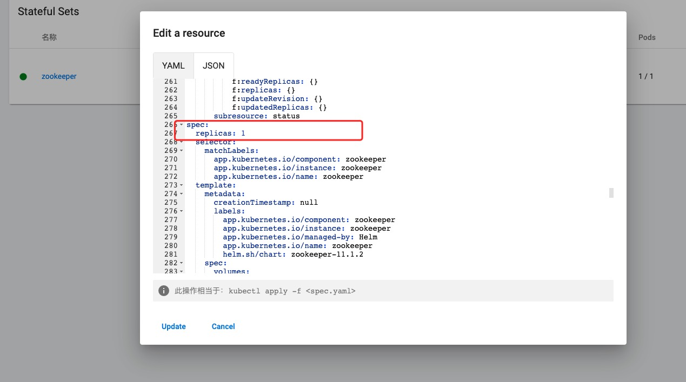
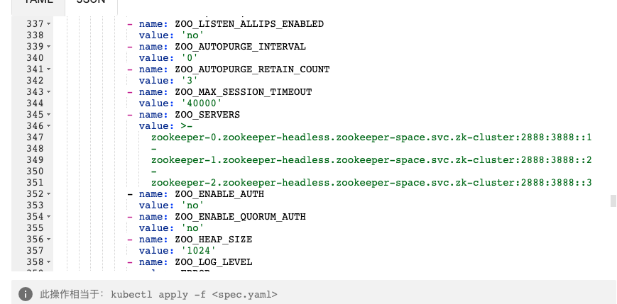
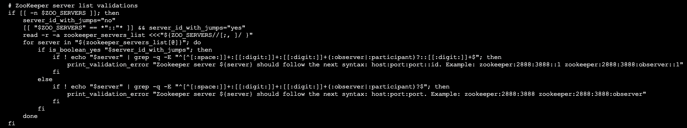
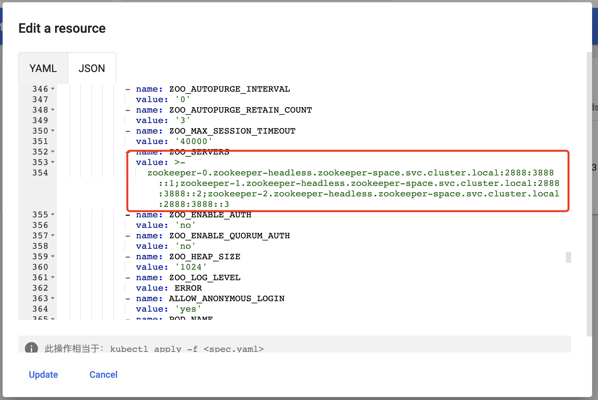
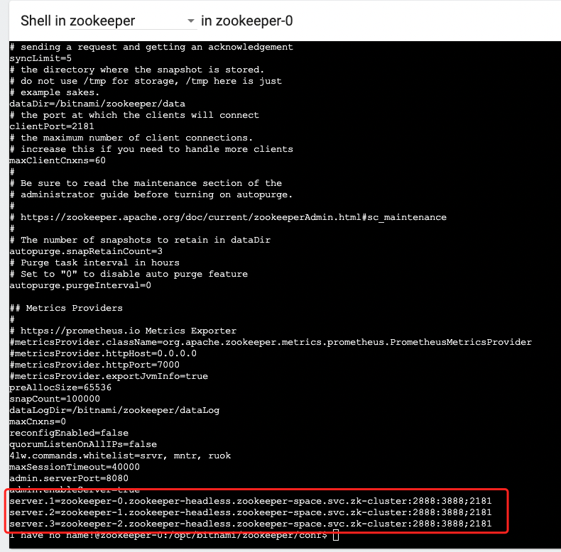
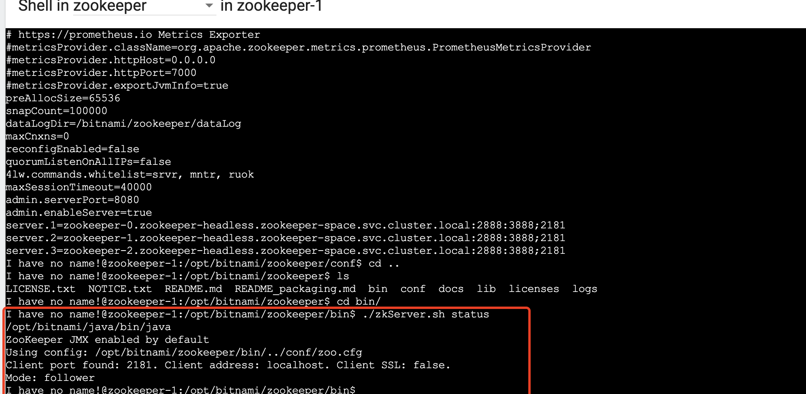

## 应用部署
* [全部概念](https://kubernetes.io/zh-cn/docs/concepts/): 最好全部看一遍简单了解一下, 否则简直就是寸步难行
### 一些重要概念
* 简单的理解一下, 以下概念即可, 根据文档搭建集群
* [命名空间](https://kubernetes.io/zh-cn/docs/concepts/overview/working-with-objects/namespaces/): 逻辑隔离一堆pod节点
* [pod](https://kubernetes.io/zh-cn/docs/concepts/workloads/pods/): 最小计算单元, 换算成`docker`下的最小的一个运行容器
* [config-map](https://kubernetes.io/zh-cn/docs/concepts/configuration/configmap/): 相当于独立运行的一个容器里面只保存一些常用的健值对数据, 将环境配置信息和容器镜像解耦, 便于应用配置的修改
* [service 服务](https://kubernetes.io/zh-cn/docs/concepts/services-networking/service/): 主要定义一组pod它们对外的端口, 用作集群的负载均衡
* [StatefulSet基础](https://kubernetes.io/zh-cn/docs/tutorials/stateful-application/basic-stateful-set/): 创建、删除、扩容/缩容更新一组pod(集群节点)的管理概念
* [pvc](https://kubernetes.io/zh-cn/docs/concepts/storage/persistent-volumes/): 容器持久化存储的逻辑节点, 通过这个节点去访问世纪 PV 持久卷, 进行数据持久化的存储
* [LabelSelector](https://kubernetes.io/zh-cn/docs/reference/kubernetes-api/common-definitions/label-selector/): 对一组资源的标签查询
* [dns](https://kubernetes.io/zh-cn/docs/concepts/services-networking/dns-pod-service/): dns解析

### ~~部署 zookeeper 集群~~
* [参考](https://kubernetes.io/zh-cn/docs/tasks/run-application/run-replicated-stateful-application/#services)
#### ~~创建 Service 服务~~
```yaml
# 用于连接到任一 zookeeper 实例执行读操作的客户端服务
apiVersion: v1
kind: Service
metadata:
  # DNS would be like zookeeper.zoons
  name: zookeeper-client
  # 指定命名空间
  namespace: zookeeper-space
  labels:
    app: zookeeper
spec:
  # 服务类型 向外暴露端口
  type: NodePort
  ports:
    # 客户端连接端口, 对外提供服务
    - port: 2181
      # 对外调试端口
      nodePort: 31811
      name: client
    # prometheus 监控端口, zookeeper 3.6.0 版本新增功能
    - port: 7000
      # 对外调试端口
      nodePort: 31812
      name: prometheus
  selector:
    app: zookeeper
    what: node
---
# 为 StatefulSet 成员提供稳定的 DNS 表项的无头服务（Headless Service）
apiVersion: v1
kind: Service
metadata:
  # DNS would be like zookeeper-0.zookeeper-headless.etc
  name: zookeeper-headless
  # 指定命名空间
  namespace: zookeeper-space
  labels:
    app: zookeeper
spec:
  ports:
    - port: 2888
      name: server
    - port: 3888
      name: leader-election
  clusterIP: None
  selector:
    app: zookeeper
```

#### ~~创建策略资源~~
* [PodDisruptionBudget](https://kubernetes.io/zh-cn/docs/reference/kubernetes-api/policy-resources/pod-disruption-budget-v1/): 主要限制, 当一组pod中, 有几个pod挂了, 会导致整个pod集群不可用
```yaml
apiVersion: policy/v1beta1
kind: PodDisruptionBudget
metadata:
  name: zookeeper-pod-disruption-budget
spec:
  selector:
    matchLabels:
      app: zookeeper
  # 当这组pod(集群)中最多驱逐1个pod(节点)不可用
  # 因为zookeeper部署的集群是三个节点 也就是3个pod 超过1个不可用, 会导致整个zookeeper集群无法使用, 所以此处最多设置1
  maxUnavailable: 1
```
#### ~~创建 StatefulSet 服务~~
```yaml
# 部署zookeeper集群
apiVersion: apps/v1
kind: StatefulSet
metadata:
  # nodes would be named as zookeeper-0, zookeeper-1, zookeeper-2
  name: zookeeper
  namespace: zookeeper-space
spec:
  selector:
    matchLabels:
      app: zookeeper
  serviceName: zookeeper-headless
  # 3个节点, 最低为1个 zookeeper最小集群单位为3个
  replicas: 3
  # 滚动更新策略
  updateStrategy:
    type: RollingUpdate
    rollingUpdate:
      # 最大下线数量
      maxUnavailable: 1
  # 取消 StatefulSet 每次部署的并行, 因为zookeeper 不需要按照顺序串行启动, 直接同时启动, 然后互相选主即可
  podManagementPolicy: Parallel
  # 集群模版配置
  template:
    metadata:
      labels:
        app: zookeeper
        what: node
      annotations:
        prometheus.io/port: '7000'
        prometheus.io/scrape: 'true'
    spec:
      # pod反亲和性topologyKey, 处于 Pod 所在的同一可用区且至少一个 Pod 具有 app=zookeeper 标签，则该 Pod 不应被调度到该节点上 
      affinity:
        podAntiAffinity:
          requiredDuringSchedulingIgnoredDuringExecution:
            - labelSelector:
                matchExpressions:
                  - key: "app"
                    operator: In
                    values:
                      - zookeeper
              # 固定值
              topologyKey: "kubernetes.io/hostname"
      # 容器相关配置
      containers:
        - name: zookeeper
          # 镜像拉取策略: 镜像在本地不存在时才会拉取
          imagePullPolicy: IfNotPresent
          # 拉取最新版 zookeeper
          image: "zookeeper:latest"
          resources:
            requests:
              memory: "500Mi"
              cpu: "0.5"
            limits:
              memory: "1Gi"
              cpu: "1"
          ports:
            - containerPort: 2181
              name: client
            - containerPort: 2888
              name: server
            - containerPort: 3888
              name: leader-election
            - containerPort: 7000
              name: prometheus
          # 初步执行命令
          command:
            - bash
            - -x
            - -c
```
* 放弃了, 采用这种方式去部署 zookeeper 集群, 需要自己将用到的镜像按照自己的运行方式重新打包一遍, 才能无缝的使用
* 若不然使用市面上的官方打包的景象, 或是第三方的镜像, 会存在一个极高的, 各个集群间的版本兼容性问题, 以及极高的学习成本, 部分第三方镜像文档不全

* 等以后有时间了, 在考虑去打包一套常用镜像, 版本吧

### 部署 kubeapps
* 吸收之前的教训, 使用 kubeapps 让专业的开源人员, 帮我去解决各种版本兼容性问题
> kubeapps是Bitnami公司的一个项目,其目的是为Kubernetes的使用者们提供已经打包好的应用仪表盘,它拥有网页界面可以更方便的部署和管理k8s 原生应用

#### 安装 helm
* helm 是kubernetes 包管理器。帮助您管理 Kubernetes 应用 -- Helm Chart。
* [官方安装](https://helm.sh/docs/intro/install/)

```sh
# 脚本安装就不想了, 用的git仓库之类的 扛不住
# 国内镜像安装
$ wget https://mirrors.huaweicloud.com/helm/v3.9.4/helm-v3.9.4-linux-amd64.tar.gz
# 解压
[root@k8s-master ~]# tar -zxvf helm-v3.9.4-linux-amd64.tar.gz 
linux-amd64/
linux-amd64/helm
linux-amd64/LICENSE
linux-amd64/README.md
# 移动
[root@k8s-master ~]# mv linux-amd64/helm /usr/local/bin/helm
```

#### 安装 kubeapps 
* [kubeapps官方文档](https://kubeapps.dev/docs/latest/tutorials/getting-started/)

```sh
[root@k8s-master ~]# helm repo add bitnami https://charts.bitnami.com/bitnami
"bitnami" has been added to your repositories
[root@k8s-master ~]# kubectl create namespace kubeapps
namespace/kubeapps created
[root@k8s-master ~]# helm install kubeapps --namespace kubeapps bitnami/kubeapps
NAME: kubeapps
LAST DEPLOYED: Tue Jan 31 19:33:39 2023
NAMESPACE: kubeapps
STATUS: deployed
REVISION: 1
TEST SUITE: None
NOTES:
CHART NAME: kubeapps
CHART VERSION: 12.2.0
APP VERSION: 2.6.2** Please be patient while the chart is being deployed **

Tip:

  Watch the deployment status using the command: kubectl get pods -w --namespace kubeapps

Kubeapps can be accessed via port 80 on the following DNS name from within your cluster:

   kubeapps.kubeapps.svc.cluster.local

To access Kubeapps from outside your K8s cluster, follow the steps below:

1. Get the Kubeapps URL by running these commands:
   echo "Kubeapps URL: http://127.0.0.1:8080"
   kubectl port-forward --namespace kubeapps service/kubeapps 8080:80

2. Open a browser and access Kubeapps using the obtained URL.

# 直接修改为nodeport ingress 需要使用域名进行负载均衡, 前期暂时使用 nodeport 暴露端口(暂不考虑, 不常用, 不需要长时间把服务暴露出来)

# 创建kubeapps 登陆, token
$ kubectl create --namespace default serviceaccount kubeapps-operator
$ kubectl create clusterrolebinding kubeapps-operator --clusterrole=cluster-admin --serviceaccount=default:kubeapps-operator
$ cat <<EOF | kubectl apply -f -
  apiVersion: v1
  kind: Secret
  metadata:
    name: kubeapps-operator-token
    namespace: default
    annotations:
      kubernetes.io/service-account.name: kubeapps-operator
  type: kubernetes.io/service-account-token
  EOF

# 获取登陆密钥
$ kubectl get --namespace default secret kubeapps-operator-token -o go-template='{{.data.token | base64decode}}'

# 开启端口转发, 临时使用即可, 0.0.0.0监听所有外网地址
$  kubectl port-forward --address 0.0.0.0 --namespace kubeapps service/kubeapps 8080:80
```

#### 库网站
* [应用网站](https://artifacthub.io/): 内容介绍详细, 快速安装搭建

### 安装 zookeeper
#### helm安装
* 安装文件
* 记得提前准备好 storageClass, 否则数据不会持久化
```yaml
## @section Global parameters
## Global Docker image parameters
## Please, note that this will override the image parameters, including dependencies, configured to use the global value
## Current available global Docker image parameters: imageRegistry, imagePullSecrets and storageClass
##

## @param global.imageRegistry Global Docker image registry
## @param global.imagePullSecrets Global Docker registry secret names as an array
## @param global.storageClass Global StorageClass for Persistent Volume(s)
##
global:
  imageRegistry: ""
  ## E.g.
  ## imagePullSecrets:
  ##   - myRegistryKeySecretName
  ##
  imagePullSecrets: []
  storageClass: ""

## @section Common parameters
##

## @param kubeVersion Override Kubernetes version
##
kubeVersion: ""
## @param nameOverride String to partially override common.names.fullname template (will maintain the release name)
##
nameOverride: ""
## @param fullnameOverride String to fully override common.names.fullname template
##
fullnameOverride: ""
## @param clusterDomain Kubernetes Cluster Domain
##
### 外部有没有生效不知道 
### 内部dns使用 svc.cluster.local
clusterDomain: zk-cluster
## @param extraDeploy Extra objects to deploy (evaluated as a template)
##
extraDeploy: []
## @param commonLabels Add labels to all the deployed resources
##
commonLabels: {}
## @param commonAnnotations Add annotations to all the deployed resources
##
commonAnnotations: {}
## @param namespaceOverride Override namespace for ZooKeeper resources
## Useful when including ZooKeeper as a chart dependency, so it can be released into a different namespace than the parent
##
namespaceOverride: zookeeper-space

## Enable diagnostic mode in the statefulset
##
diagnosticMode:
  ## @param diagnosticMode.enabled Enable diagnostic mode (all probes will be disabled and the command will be overridden)
  ##
  enabled: false
  ## @param diagnosticMode.command Command to override all containers in the statefulset
  ##
  command:
    - sleep
  ## @param diagnosticMode.args Args to override all containers in the statefulset
  ##
  args:
    - infinity

## @section ZooKeeper chart parameters

## Bitnami ZooKeeper image version
## ref: https://hub.docker.com/r/bitnami/zookeeper/tags/
## @param image.registry ZooKeeper image registry
## @param image.repository ZooKeeper image repository
## @param image.tag ZooKeeper image tag (immutable tags are recommended)
## @param image.digest ZooKeeper image digest in the way sha256:aa.... Please note this parameter, if set, will override the tag
## @param image.pullPolicy ZooKeeper image pull policy
## @param image.pullSecrets Specify docker-registry secret names as an array
## @param image.debug Specify if debug values should be set
##
image:
  registry: docker.io
  repository: bitnami/zookeeper
  tag: 3.8.1-debian-11-r0
  digest: ""
  ## Specify a imagePullPolicy
  ## Defaults to 'Always' if image tag is 'latest', else set to 'IfNotPresent'
  ## ref: https://kubernetes.io/docs/user-guide/images/#pre-pulling-images
  ##
  pullPolicy: IfNotPresent
  ## Optionally specify an array of imagePullSecrets.
  ## Secrets must be manually created in the namespace.
  ## ref: https://kubernetes.io/docs/tasks/configure-pod-container/pull-image-private-registry/
  ## Example:
  ## pullSecrets:
  ##   - myRegistryKeySecretName
  ##
  pullSecrets: []
  ## Set to true if you would like to see extra information on logs
  ##
  debug: false
## Authentication parameters
##
auth:
  client:
    ## @param auth.client.enabled Enable ZooKeeper client-server authentication. It uses SASL/Digest-MD5
    ##
    enabled: false
    ## @param auth.client.clientUser User that will use ZooKeeper clients to auth
    ##
    clientUser: ""
    ## @param auth.client.clientPassword Password that will use ZooKeeper clients to auth
    ##
    clientPassword: ""
    ## @param auth.client.serverUsers Comma, semicolon or whitespace separated list of user to be created
    ## Specify them as a string, for example: "user1,user2,admin"
    ##
    serverUsers: ""
    ## @param auth.client.serverPasswords Comma, semicolon or whitespace separated list of passwords to assign to users when created
    ## Specify them as a string, for example: "pass4user1, pass4user2, pass4admin"
    ##
    serverPasswords: ""
    ## @param auth.client.existingSecret Use existing secret (ignores previous passwords)
    ##
    existingSecret: ""
  quorum:
    ## @param auth.quorum.enabled Enable ZooKeeper server-server authentication. It uses SASL/Digest-MD5
    ##
    enabled: false
    ## @param auth.quorum.learnerUser User that the ZooKeeper quorumLearner will use to authenticate to quorumServers.
    ## Note: Make sure the user is included in auth.quorum.serverUsers
    ##
    learnerUser: ""
    ## @param auth.quorum.learnerPassword Password that the ZooKeeper quorumLearner will use to authenticate to quorumServers.
    ##
    learnerPassword: ""
    ## @param auth.quorum.serverUsers Comma, semicolon or whitespace separated list of users for the quorumServers.
    ## Specify them as a string, for example: "user1,user2,admin"
    ##
    serverUsers: ""
    ## @param auth.quorum.serverPasswords Comma, semicolon or whitespace separated list of passwords to assign to users when created
    ## Specify them as a string, for example: "pass4user1, pass4user2, pass4admin"
    ##
    serverPasswords: ""
    ## @param auth.quorum.existingSecret Use existing secret (ignores previous passwords)
    ##
    existingSecret: ""
## @param tickTime Basic time unit (in milliseconds) used by ZooKeeper for heartbeats
##
tickTime: 2000
## @param initLimit ZooKeeper uses to limit the length of time the ZooKeeper servers in quorum have to connect to a leader
##
initLimit: 10
## @param syncLimit How far out of date a server can be from a leader
##
syncLimit: 5
## @param preAllocSize Block size for transaction log file
##
preAllocSize: 65536
## @param snapCount The number of transactions recorded in the transaction log before a snapshot can be taken (and the transaction log rolled)
##
snapCount: 100000
## @param maxClientCnxns Limits the number of concurrent connections that a single client may make to a single member of the ZooKeeper ensemble
##
maxClientCnxns: 60
## @param maxSessionTimeout Maximum session timeout (in milliseconds) that the server will allow the client to negotiate
## Defaults to 20 times the tickTime
##
maxSessionTimeout: 40000
## @param heapSize Size (in MB) for the Java Heap options (Xmx and Xms)
## This env var is ignored if Xmx an Xms are configured via `jvmFlags`
##
heapSize: 1024
## @param fourlwCommandsWhitelist A list of comma separated Four Letter Words commands that can be executed
##
fourlwCommandsWhitelist: srvr, mntr, ruok
## @param minServerId Minimal SERVER_ID value, nodes increment their IDs respectively
## Servers increment their ID starting at this minimal value.
## E.g., with `minServerId=10` and 3 replicas, server IDs will be 10, 11, 12 for z-0, z-1 and z-2 respectively.
##
minServerId: 1
## @param listenOnAllIPs Allow ZooKeeper to listen for connections from its peers on all available IP addresses
##
listenOnAllIPs: false
## Ongoing data directory cleanup configuration
##
autopurge:
  ## @param autopurge.snapRetainCount The most recent snapshots amount (and corresponding transaction logs) to retain
  ##
  snapRetainCount: 3
  ## @param autopurge.purgeInterval The time interval (in hours) for which the purge task has to be triggered
  ## Set to a positive integer to enable the auto purging
  ##
  purgeInterval: 0
## @param logLevel Log level for the ZooKeeper server. ERROR by default
## Have in mind if you set it to INFO or WARN the ReadinessProve will produce a lot of logs
##
logLevel: ERROR
## @param jvmFlags Default JVM flags for the ZooKeeper process
##
jvmFlags: ""
## @param dataLogDir Dedicated data log directory
## This allows a dedicated log device to be used, and helps avoid competition between logging and snapshots.
## E.g.
## dataLogDir: /bitnami/zookeeper/dataLog
##
dataLogDir: /bitnami/zookeeper/dataLog
## @param configuration Configure ZooKeeper with a custom zoo.cfg file
## e.g:
## configuration: |-
##   deploy-working-dir=/bitnami/geode/data
##   log-level=info
##   ...
##
configuration: ""
## @param existingConfigmap The name of an existing ConfigMap with your custom configuration for ZooKeeper
## NOTE: When it's set the `configuration` parameter is ignored
##
existingConfigmap: ""
## @param extraEnvVars Array with extra environment variables to add to ZooKeeper nodes
## e.g:
## extraEnvVars:
##   - name: FOO
##     value: "bar"
##
extraEnvVars: []
## @param extraEnvVarsCM Name of existing ConfigMap containing extra env vars for ZooKeeper nodes
##
extraEnvVarsCM: ""
## @param extraEnvVarsSecret Name of existing Secret containing extra env vars for ZooKeeper nodes
##
extraEnvVarsSecret: ""
## @param command Override default container command (useful when using custom images)
##
command:
  - /scripts/setup.sh
## @param args Override default container args (useful when using custom images)
##
args: []

## @section Statefulset parameters

## @param replicaCount Number of ZooKeeper nodes
##
replicaCount: 1
## @param containerPorts.client ZooKeeper client container port
## @param containerPorts.tls ZooKeeper TLS container port
## @param containerPorts.follower ZooKeeper follower container port
## @param containerPorts.election ZooKeeper election container port
##
containerPorts:
  client: 2181
  tls: 3181
  follower: 2888
  election: 3888
## Configure extra options for ZooKeeper containers' liveness, readiness and startup probes
## ref: https://kubernetes.io/docs/tasks/configure-pod-container/configure-liveness-readiness-startup-probes/#configure-probes
## @param livenessProbe.enabled Enable livenessProbe on ZooKeeper containers
## @param livenessProbe.initialDelaySeconds Initial delay seconds for livenessProbe
## @param livenessProbe.periodSeconds Period seconds for livenessProbe
## @param livenessProbe.timeoutSeconds Timeout seconds for livenessProbe
## @param livenessProbe.failureThreshold Failure threshold for livenessProbe
## @param livenessProbe.successThreshold Success threshold for livenessProbe
## @param livenessProbe.probeCommandTimeout Probe command timeout for livenessProbe
##
livenessProbe:
  enabled: true
  initialDelaySeconds: 30
  periodSeconds: 10
  timeoutSeconds: 5
  failureThreshold: 6
  successThreshold: 1
  probeCommandTimeout: 2
## @param readinessProbe.enabled Enable readinessProbe on ZooKeeper containers
## @param readinessProbe.initialDelaySeconds Initial delay seconds for readinessProbe
## @param readinessProbe.periodSeconds Period seconds for readinessProbe
## @param readinessProbe.timeoutSeconds Timeout seconds for readinessProbe
## @param readinessProbe.failureThreshold Failure threshold for readinessProbe
## @param readinessProbe.successThreshold Success threshold for readinessProbe
## @param readinessProbe.probeCommandTimeout Probe command timeout for readinessProbe
##
readinessProbe:
  enabled: true
  initialDelaySeconds: 5
  periodSeconds: 10
  timeoutSeconds: 5
  failureThreshold: 6
  successThreshold: 1
  probeCommandTimeout: 2
## @param startupProbe.enabled Enable startupProbe on ZooKeeper containers
## @param startupProbe.initialDelaySeconds Initial delay seconds for startupProbe
## @param startupProbe.periodSeconds Period seconds for startupProbe
## @param startupProbe.timeoutSeconds Timeout seconds for startupProbe
## @param startupProbe.failureThreshold Failure threshold for startupProbe
## @param startupProbe.successThreshold Success threshold for startupProbe
##
startupProbe:
  enabled: false
  initialDelaySeconds: 30
  periodSeconds: 10
  timeoutSeconds: 1
  failureThreshold: 15
  successThreshold: 1
## @param customLivenessProbe Custom livenessProbe that overrides the default one
##
customLivenessProbe: {}
## @param customReadinessProbe Custom readinessProbe that overrides the default one
##
customReadinessProbe: {}
## @param customStartupProbe Custom startupProbe that overrides the default one
##
customStartupProbe: {}
## @param lifecycleHooks for the ZooKeeper container(s) to automate configuration before or after startup
##
lifecycleHooks: {}
## ZooKeeper resource requests and limits
## ref: https://kubernetes.io/docs/user-guide/compute-resources/
## @param resources.limits The resources limits for the ZooKeeper containers
## @param resources.requests.memory The requested memory for the ZooKeeper containers
## @param resources.requests.cpu The requested cpu for the ZooKeeper containers
##
resources:
  limits: {}
  requests:
    memory: 256Mi
    cpu: 250m
## Configure Pods Security Context
## ref: https://kubernetes.io/docs/tasks/configure-pod-container/security-context/#set-the-security-context-for-a-pod
## @param podSecurityContext.enabled Enabled ZooKeeper pods' Security Context
## @param podSecurityContext.fsGroup Set ZooKeeper pod's Security Context fsGroup
##
podSecurityContext:
  enabled: true
  fsGroup: 1001
## Configure Container Security Context
## ref: https://kubernetes.io/docs/tasks/configure-pod-container/security-context/#set-the-security-context-for-a-container
## @param containerSecurityContext.enabled Enabled ZooKeeper containers' Security Context
## @param containerSecurityContext.runAsUser Set ZooKeeper containers' Security Context runAsUser
## @param containerSecurityContext.runAsNonRoot Set ZooKeeper containers' Security Context runAsNonRoot
## @param containerSecurityContext.allowPrivilegeEscalation Force the child process to be run as nonprivilege
##
containerSecurityContext:
  enabled: true
  runAsUser: 1001
  runAsNonRoot: true
  allowPrivilegeEscalation: false
## @param hostAliases ZooKeeper pods host aliases
## https://kubernetes.io/docs/concepts/services-networking/add-entries-to-pod-etc-hosts-with-host-aliases/
##
hostAliases: []
## @param podLabels Extra labels for ZooKeeper pods
## ref: https://kubernetes.io/docs/concepts/overview/working-with-objects/labels/
##
podLabels: {}
## @param podAnnotations Annotations for ZooKeeper pods
## ref: https://kubernetes.io/docs/concepts/overview/working-with-objects/annotations/
##
podAnnotations: {}
## @param podAffinityPreset Pod affinity preset. Ignored if `affinity` is set. Allowed values: `soft` or `hard`
## ref: https://kubernetes.io/docs/concepts/scheduling-eviction/assign-pod-node/#inter-pod-affinity-and-anti-affinity
##
podAffinityPreset: ""
## @param podAntiAffinityPreset Pod anti-affinity preset. Ignored if `affinity` is set. Allowed values: `soft` or `hard`
## Ref: https://kubernetes.io/docs/concepts/scheduling-eviction/assign-pod-node/#inter-pod-affinity-and-anti-affinity
##
podAntiAffinityPreset: soft
## Node affinity preset
## Ref: https://kubernetes.io/docs/concepts/scheduling-eviction/assign-pod-node/#node-affinity
##
nodeAffinityPreset:
  ## @param nodeAffinityPreset.type Node affinity preset type. Ignored if `affinity` is set. Allowed values: `soft` or `hard`
  ##
  type: ""
  ## @param nodeAffinityPreset.key Node label key to match Ignored if `affinity` is set.
  ## E.g.
  ## key: "kubernetes.io/e2e-az-name"
  ##
  key: ""
  ## @param nodeAffinityPreset.values Node label values to match. Ignored if `affinity` is set.
  ## E.g.
  ## values:
  ##   - e2e-az1
  ##   - e2e-az2
  ##
  values: []
## @param affinity Affinity for pod assignment
## Ref: https://kubernetes.io/docs/concepts/configuration/assign-pod-node/#affinity-and-anti-affinity
## Note: podAffinityPreset, podAntiAffinityPreset, and nodeAffinityPreset will be ignored when it's set
##
affinity: {}
## @param nodeSelector Node labels for pod assignment
## Ref: https://kubernetes.io/docs/user-guide/node-selection/
##
nodeSelector: {}
## @param tolerations Tolerations for pod assignment
## Ref: https://kubernetes.io/docs/concepts/configuration/taint-and-toleration/
##
tolerations: []
## @param topologySpreadConstraints Topology Spread Constraints for pod assignment spread across your cluster among failure-domains. Evaluated as a template
## Ref: https://kubernetes.io/docs/concepts/workloads/pods/pod-topology-spread-constraints/#spread-constraints-for-pods
##
topologySpreadConstraints: []
## @param podManagementPolicy StatefulSet controller supports relax its ordering guarantees while preserving its uniqueness and identity guarantees. There are two valid pod management policies: `OrderedReady` and `Parallel`
## ref: https://kubernetes.io/docs/tutorials/stateful-application/basic-stateful-set/#pod-management-policy
##
podManagementPolicy: Parallel
## @param priorityClassName Name of the existing priority class to be used by ZooKeeper pods, priority class needs to be created beforehand
## Ref: https://kubernetes.io/docs/concepts/configuration/pod-priority-preemption/
##
priorityClassName: ""
## @param schedulerName Kubernetes pod scheduler registry
## https://kubernetes.io/docs/tasks/administer-cluster/configure-multiple-schedulers/
##
schedulerName: ""
## @param updateStrategy.type ZooKeeper statefulset strategy type
## @param updateStrategy.rollingUpdate ZooKeeper statefulset rolling update configuration parameters
## ref: https://kubernetes.io/docs/concepts/workloads/controllers/statefulset/#update-strategies
##
updateStrategy:
  type: RollingUpdate
  rollingUpdate: {}
## @param extraVolumes Optionally specify extra list of additional volumes for the ZooKeeper pod(s)
## Example Use Case: mount certificates to enable TLS
## e.g:
## extraVolumes:
## - name: zookeeper-keystore
##   secret:
##     defaultMode: 288
##     secretName: zookeeper-keystore
## - name: zookeeper-truststore
##   secret:
##     defaultMode: 288
##     secretName: zookeeper-truststore
##
extraVolumes: []
## @param extraVolumeMounts Optionally specify extra list of additional volumeMounts for the ZooKeeper container(s)
## Example Use Case: mount certificates to enable TLS
## e.g:
## extraVolumeMounts:
## - name: zookeeper-keystore
##   mountPath: /certs/keystore
##   readOnly: true
## - name: zookeeper-truststore
##   mountPath: /certs/truststore
##   readOnly: true
##
extraVolumeMounts: []
## @param sidecars Add additional sidecar containers to the ZooKeeper pod(s)
## e.g:
## sidecars:
##   - name: your-image-name
##     image: your-image
##     imagePullPolicy: Always
##     ports:
##       - name: portname
##         containerPort: 1234
##
sidecars: []
## @param initContainers Add additional init containers to the ZooKeeper pod(s)
## Example:
## initContainers:
##   - name: your-image-name
##     image: your-image
##     imagePullPolicy: Always
##     ports:
##       - name: portname
##         containerPort: 1234
##
initContainers: []
## ZooKeeper Pod Disruption Budget
## ref: https://kubernetes.io/docs/concepts/workloads/pods/disruptions/
## @param pdb.create Deploy a pdb object for the ZooKeeper pod
## @param pdb.minAvailable Minimum available ZooKeeper replicas
## @param pdb.maxUnavailable Maximum unavailable ZooKeeper replicas
##
pdb:
  create: false
  minAvailable: ""
  maxUnavailable: 1

## @section Traffic Exposure parameters

service:
  ## @param service.type Kubernetes Service type
  ##
  type: ClusterIP
  ## @param service.ports.client ZooKeeper client service port
  ## @param service.ports.tls ZooKeeper TLS service port
  ## @param service.ports.follower ZooKeeper follower service port
  ## @param service.ports.election ZooKeeper election service port
  ##
  ports:
    client: 2181
    tls: 3181
    follower: 2888
    election: 3888
  ## Node ports to expose
  ## NOTE: choose port between <30000-32767>
  ## @param service.nodePorts.client Node port for clients
  ## @param service.nodePorts.tls Node port for TLS
  ##
  nodePorts:
    client: ""
    tls: ""
  ## @param service.disableBaseClientPort Remove client port from service definitions.
  ##
  disableBaseClientPort: false
  ## @param service.sessionAffinity Control where client requests go, to the same pod or round-robin
  ## Values: ClientIP or None
  ## ref: https://kubernetes.io/docs/user-guide/services/
  ##
  sessionAffinity: None
  ## @param service.sessionAffinityConfig Additional settings for the sessionAffinity
  ## sessionAffinityConfig:
  ##   clientIP:
  ##     timeoutSeconds: 300
  ##
  sessionAffinityConfig: {}
  ## @param service.clusterIP ZooKeeper service Cluster IP
  ## e.g.:
  ## clusterIP: None
  ##
  clusterIP: ""
  ## @param service.loadBalancerIP ZooKeeper service Load Balancer IP
  ## ref: https://kubernetes.io/docs/user-guide/services/#type-loadbalancer
  ##
  loadBalancerIP: ""
  ## @param service.loadBalancerSourceRanges ZooKeeper service Load Balancer sources
  ## ref: https://kubernetes.io/docs/tasks/access-application-cluster/configure-cloud-provider-firewall/#restrict-access-for-loadbalancer-service
  ## e.g:
  ## loadBalancerSourceRanges:
  ##   - 10.10.10.0/24
  ##
  loadBalancerSourceRanges: []
  ## @param service.externalTrafficPolicy ZooKeeper service external traffic policy
  ## ref https://kubernetes.io/docs/tasks/access-application-cluster/create-external-load-balancer/#preserving-the-client-source-ip
  ##
  externalTrafficPolicy: Cluster
  ## @param service.annotations Additional custom annotations for ZooKeeper service
  ##
  annotations: {}
  ## @param service.extraPorts Extra ports to expose in the ZooKeeper service (normally used with the `sidecar` value)
  ##
  extraPorts: []
  ## @param service.headless.annotations Annotations for the Headless Service
  ## @param service.headless.publishNotReadyAddresses If the ZooKeeper headless service should publish DNS records for not ready pods
  ## @param service.headless.servicenameOverride String to partially override headless service name
  ##
  headless:
    publishNotReadyAddresses: true
    annotations: {}
    servicenameOverride: ""
## Network policies
## Ref: https://kubernetes.io/docs/concepts/services-networking/network-policies/
##
networkPolicy:
  ## @param networkPolicy.enabled Specifies whether a NetworkPolicy should be created
  ##
  enabled: false
  ## @param networkPolicy.allowExternal Don't require client label for connections
  ## When set to false, only pods with the correct client label will have network access to the port Redis&reg; is
  ## listening on. When true, zookeeper accept connections from any source (with the correct destination port).
  ##
  allowExternal: true

## @section Other Parameters

## Service account for ZooKeeper to use.
## ref: https://kubernetes.io/docs/tasks/configure-pod-container/configure-service-account/
##
serviceAccount:
  ## @param serviceAccount.create Enable creation of ServiceAccount for ZooKeeper pod
  ##
  create: false
  ## @param serviceAccount.name The name of the ServiceAccount to use.
  ## If not set and create is true, a name is generated using the common.names.fullname template
  ##
  name: ""
  ## @param serviceAccount.automountServiceAccountToken Allows auto mount of ServiceAccountToken on the serviceAccount created
  ## Can be set to false if pods using this serviceAccount do not need to use K8s API
  ##
  automountServiceAccountToken: true
  ## @param serviceAccount.annotations Additional custom annotations for the ServiceAccount
  ##
  annotations: {}

## @section Persistence parameters

## Enable persistence using Persistent Volume Claims
## ref: https://kubernetes.io/docs/user-guide/persistent-volumes/
##
persistence:
  ## @param persistence.enabled Enable ZooKeeper data persistence using PVC. If false, use emptyDir
  ##
  enabled: true
  ## @param persistence.existingClaim Name of an existing PVC to use (only when deploying a single replica)
  ##
  existingClaim: ""
  ## @param persistence.storageClass PVC Storage Class for ZooKeeper data volume
  ## If defined, storageClassName: <storageClass>
  ## If set to "-", storageClassName: "", which disables dynamic provisioning
  ## If undefined (the default) or set to null, no storageClassName spec is
  ##   set, choosing the default provisioner.  (gp2 on AWS, standard on
  ##   GKE, AWS & OpenStack)
  ##
  ## todo 重要, 与pvc的storage class 名称相同
  ## 没有  或者Kubernetes 中没有默认的, 那就无法安装成功, 
  storageClass: managed-nfs-storage
  ## @param persistence.accessModes PVC Access modes
  ##
  accessModes:
    - ReadWriteOnce
  ## @param persistence.size PVC Storage Request for ZooKeeper data volume
  ## 跑的东西不多 暂时给5G应该够用
  size: 5Gi
  ## @param persistence.annotations Annotations for the PVC
  ##
  annotations: {}
  ## @param persistence.labels Labels for the PVC
  ##
  labels: {}
  ## @param persistence.selector Selector to match an existing Persistent Volume for ZooKeeper's data PVC
  ## If set, the PVC can't have a PV dynamically provisioned for it
  ## E.g.
  ## selector:
  ##   matchLabels:
  ##     app: my-app
  ##
  selector: {}
  ## Persistence for a dedicated data log directory
  ##
  dataLogDir:
    ## @param persistence.dataLogDir.size PVC Storage Request for ZooKeeper's dedicated data log directory
    ##
    size: 8Gi
    ## @param persistence.dataLogDir.existingClaim Provide an existing `PersistentVolumeClaim` for ZooKeeper's data log directory
    ## If defined, PVC must be created manually before volume will be bound
    ## The value is evaluated as a template
    ##
    existingClaim: ""
    ## @param persistence.dataLogDir.selector Selector to match an existing Persistent Volume for ZooKeeper's data log PVC
    ## If set, the PVC can't have a PV dynamically provisioned for it
    ## E.g.
    ## selector:
    ##   matchLabels:
    ##     app: my-app
    ##
    selector: {}

## @section Volume Permissions parameters
##

## Init containers parameters:
## volumePermissions: Change the owner and group of the persistent volume(s) mountpoint(s) to 'runAsUser:fsGroup' on each node
##
volumePermissions:
  ## @param volumePermissions.enabled Enable init container that changes the owner and group of the persistent volume
  ##
  enabled: false
  ## @param volumePermissions.image.registry Init container volume-permissions image registry
  ## @param volumePermissions.image.repository Init container volume-permissions image repository
  ## @param volumePermissions.image.tag Init container volume-permissions image tag (immutable tags are recommended)
  ## @param volumePermissions.image.digest Init container volume-permissions image digest in the way sha256:aa.... Please note this parameter, if set, will override the tag
  ## @param volumePermissions.image.pullPolicy Init container volume-permissions image pull policy
  ## @param volumePermissions.image.pullSecrets Init container volume-permissions image pull secrets
  ##
  image:
    registry: docker.io
    repository: bitnami/bitnami-shell
    tag: 11-debian-11-r77
    digest: ""
    pullPolicy: IfNotPresent
    ## Optionally specify an array of imagePullSecrets.
    ## Secrets must be manually created in the namespace.
    ## ref: https://kubernetes.io/docs/tasks/configure-pod-container/pull-image-private-registry/
    ## Example:
    ## pullSecrets:
    ##   - myRegistryKeySecretName
    ##
    pullSecrets: []
  ## Init container resource requests and limits
  ## ref: https://kubernetes.io/docs/user-guide/compute-resources/
  ## @param volumePermissions.resources.limits Init container volume-permissions resource limits
  ## @param volumePermissions.resources.requests Init container volume-permissions resource requests
  ##
  resources:
    limits: {}
    requests: {}
  ## Init container' Security Context
  ## Note: the chown of the data folder is done to containerSecurityContext.runAsUser
  ## and not the below volumePermissions.containerSecurityContext.runAsUser
  ## @param volumePermissions.containerSecurityContext.enabled Enabled init container Security Context
  ## @param volumePermissions.containerSecurityContext.runAsUser User ID for the init container
  ##
  containerSecurityContext:
    enabled: true
    runAsUser: 0

## @section Metrics parameters
##

## ZooKeeper Prometheus Exporter configuration
##
metrics:
  ## @param metrics.enabled Enable Prometheus to access ZooKeeper metrics endpoint
  ##
  enabled: false
  ## @param metrics.containerPort ZooKeeper Prometheus Exporter container port
  ##
  containerPort: 9141
  ## Service configuration
  ##
  service:
    ## @param metrics.service.type ZooKeeper Prometheus Exporter service type
    ##
    type: ClusterIP
    ## @param metrics.service.port ZooKeeper Prometheus Exporter service port
    ##
    port: 9141
    ## @param metrics.service.annotations [object] Annotations for Prometheus to auto-discover the metrics endpoint
    ##
    annotations:
      prometheus.io/scrape: "true"
      prometheus.io/port: "{{ .Values.metrics.service.port }}"
      prometheus.io/path: "/metrics"
  ## Prometheus Operator ServiceMonitor configuration
  ##
  serviceMonitor:
    ## @param metrics.serviceMonitor.enabled Create ServiceMonitor Resource for scraping metrics using Prometheus Operator
    ##
    enabled: false
    ## @param metrics.serviceMonitor.namespace Namespace for the ServiceMonitor Resource (defaults to the Release Namespace)
    ##
    namespace: ""
    ## @param metrics.serviceMonitor.interval Interval at which metrics should be scraped.
    ## ref: https://github.com/coreos/prometheus-operator/blob/master/Documentation/api.md#endpoint
    ##
    interval: ""
    ## @param metrics.serviceMonitor.scrapeTimeout Timeout after which the scrape is ended
    ## ref: https://github.com/coreos/prometheus-operator/blob/master/Documentation/api.md#endpoint
    ##
    scrapeTimeout: ""
    ## @param metrics.serviceMonitor.additionalLabels Additional labels that can be used so ServiceMonitor will be discovered by Prometheus
    ##
    additionalLabels: {}
    ## @param metrics.serviceMonitor.selector Prometheus instance selector labels
    ## ref: https://github.com/bitnami/charts/tree/main/bitnami/prometheus-operator#prometheus-configuration
    ##
    selector: {}
    ## @param metrics.serviceMonitor.relabelings RelabelConfigs to apply to samples before scraping
    ##
    relabelings: []
    ## @param metrics.serviceMonitor.metricRelabelings MetricRelabelConfigs to apply to samples before ingestion
    ##
    metricRelabelings: []
    ## @param metrics.serviceMonitor.honorLabels Specify honorLabels parameter to add the scrape endpoint
    ##
    honorLabels: false
    ## @param metrics.serviceMonitor.jobLabel The name of the label on the target service to use as the job name in prometheus.
    ##
    jobLabel: ""
  ## Prometheus Operator PrometheusRule configuration
  ##
  prometheusRule:
    ## @param metrics.prometheusRule.enabled Create a PrometheusRule for Prometheus Operator
    ##
    enabled: false
    ## @param metrics.prometheusRule.namespace Namespace for the PrometheusRule Resource (defaults to the Release Namespace)
    ##
    namespace: ""
    ## @param metrics.prometheusRule.additionalLabels Additional labels that can be used so PrometheusRule will be discovered by Prometheus
    ##
    additionalLabels: {}
    ## @param metrics.prometheusRule.rules PrometheusRule definitions
    ##  - alert: ZooKeeperSyncedFollowers
    ##    annotations:
    ##      message: The number of synced followers for the leader node in ZooKeeper deployment my-release is less than 2. This usually means that some of the ZooKeeper nodes aren't communicating properly. If it doesn't resolve itself you can try killing the pods (one by one).
    ##    expr: max(synced_followers{service="my-release-metrics"}) < 2
    ##    for: 5m
    ##    labels:
    ##      severity: critical
    ##  - alert: ZooKeeperOutstandingRequests
    ##    annotations:
    ##      message: The number of outstanding requests for ZooKeeper pod {{ $labels.pod }} is greater than 10. This can indicate a performance issue with the Pod or cluster a whole.
    ##    expr: outstanding_requests{service="my-release-metrics"} > 10
    ##    for: 5m
    ##    labels:
    ##      severity: critical
    ##
    rules: []

## @section TLS/SSL parameters
##

## Enable SSL/TLS encryption
##
tls:
  client:
    ## @param tls.client.enabled Enable TLS for client connections
    ##
    enabled: false
    ## @param tls.client.auth SSL Client auth. Can be "none", "want" or "need".
    ##
    auth: "none"
    ## @param tls.client.autoGenerated Generate automatically self-signed TLS certificates for ZooKeeper client communications
    ## Currently only supports PEM certificates
    ##
    autoGenerated: false
    ## @param tls.client.existingSecret Name of the existing secret containing the TLS certificates for ZooKeeper client communications
    ##
    existingSecret: ""
    ## @param tls.client.existingSecretKeystoreKey The secret key from the tls.client.existingSecret containing the Keystore.
    ##
    existingSecretKeystoreKey: ""
    ## @param tls.client.existingSecretTruststoreKey The secret key from the tls.client.existingSecret containing the Truststore.
    ##
    existingSecretTruststoreKey: ""
    ## @param tls.client.keystorePath Location of the KeyStore file used for Client connections
    ##
    keystorePath: /opt/bitnami/zookeeper/config/certs/client/zookeeper.keystore.jks
    ## @param tls.client.truststorePath Location of the TrustStore file used for Client connections
    ##
    truststorePath: /opt/bitnami/zookeeper/config/certs/client/zookeeper.truststore.jks
    ## @param tls.client.passwordsSecretName Existing secret containing Keystore and truststore passwords
    ##
    passwordsSecretName: ""
    ## @param tls.client.passwordsSecretKeystoreKey The secret key from the tls.client.passwordsSecretName containing the password for the Keystore.
    ##
    passwordsSecretKeystoreKey: ""
    ## @param tls.client.passwordsSecretTruststoreKey The secret key from the tls.client.passwordsSecretName containing the password for the Truststore.
    ##
    passwordsSecretTruststoreKey: ""
    ## @param tls.client.keystorePassword Password to access KeyStore if needed
    ##
    keystorePassword: ""
    ## @param tls.client.truststorePassword Password to access TrustStore if needed
    ##
    truststorePassword: ""
  quorum:
    ## @param tls.quorum.enabled Enable TLS for quorum protocol
    ##
    enabled: false
    ## @param tls.quorum.auth SSL Quorum Client auth. Can be "none", "want" or "need".
    ##
    auth: "none"
    ## @param tls.quorum.autoGenerated Create self-signed TLS certificates. Currently only supports PEM certificates.
    ##
    autoGenerated: false
    ## @param tls.quorum.existingSecret Name of the existing secret containing the TLS certificates for ZooKeeper quorum protocol
    ##
    existingSecret: ""
    ## @param tls.quorum.existingSecretKeystoreKey The secret key from the tls.quorum.existingSecret containing the Keystore.
    ##
    existingSecretKeystoreKey: ""
    ## @param tls.quorum.existingSecretTruststoreKey The secret key from the tls.quorum.existingSecret containing the Truststore.
    ##
    existingSecretTruststoreKey: ""
    ## @param tls.quorum.keystorePath Location of the KeyStore file used for Quorum protocol
    ##
    keystorePath: /opt/bitnami/zookeeper/config/certs/quorum/zookeeper.keystore.jks
    ## @param tls.quorum.truststorePath Location of the TrustStore file used for Quorum protocol
    ##
    truststorePath: /opt/bitnami/zookeeper/config/certs/quorum/zookeeper.truststore.jks
    ## @param tls.quorum.passwordsSecretName Existing secret containing Keystore and truststore passwords
    ##
    passwordsSecretName: ""
    ## @param tls.quorum.passwordsSecretKeystoreKey The secret key from the tls.quorum.passwordsSecretName containing the password for the Keystore.
    ##
    passwordsSecretKeystoreKey: ""
    ## @param tls.quorum.passwordsSecretTruststoreKey The secret key from the tls.quorum.passwordsSecretName containing the password for the Truststore.
    ##
    passwordsSecretTruststoreKey: ""
    ## @param tls.quorum.keystorePassword Password to access KeyStore if needed
    ##
    keystorePassword: ""
    ## @param tls.quorum.truststorePassword Password to access TrustStore if needed
    ##
    truststorePassword: ""
  ## Init container resource requests and limits
  ## ref: https://kubernetes.io/docs/user-guide/compute-resources/
  ## @param tls.resources.limits The resources limits for the TLS init container
  ## @param tls.resources.requests The requested resources for the TLS init container
  ##
  resources:
    limits: {}
    requests: {}
```

* 安装命令
```yaml
$ helm repo add my-repo https://charts.bitnami.com/bitnami
$ helm install zookeeper -f zookeeper-helm.yaml my-repo/zookeeper
```
#### 集群模式
* 创建集群启动模式
1. 修改 zookeeper satefulset 的文件将 replicas 改为 3个节点即可

2. 新增集群服务器
* 错误示范

* 找了一堆脚本才找到
* 解析服务群的脚本, 用逗号或者分号分割

* 重新修改配置
* 安装了 dnsutls 排查问题才知道, 内部访问得用 `svc.cluster.local`, 不知道设置的 `zk-cluster` 在外部会不会生效, 暂时不追究

* 再次进入容器

* 查询状态, 终于是集群模式了

##### 突发问题
* [阿文_ing](https://blog.csdn.net/qq_41793064/article/details/123111934): 遇到的问题主要与这位作者遇到的问题差不多
###### storageClass 未安装
* 由于安装成功后, 集群 一直处于 pending 状态, pvc 也处于 pending 状态, 
* 查阅资料才得知, 动态 pvc 部署模式需要, 有 storageclass 才能正常运行
* 最终决定搭建 nfs 存储, 搭过, 也最熟悉, 暂无精力去比较其他的优缺点

