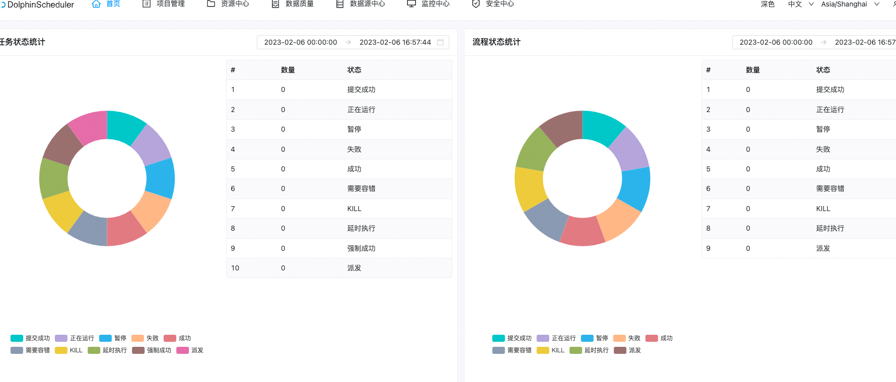
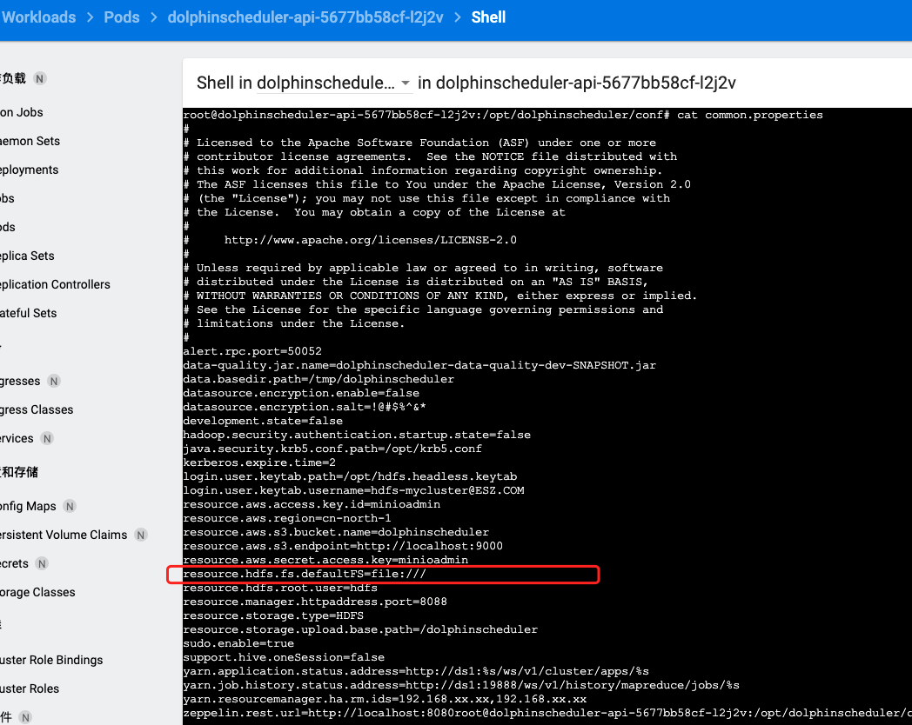

## 任务调度中心搭建
* 选用 dolphin Schedul 进行调度
* [dolphinscheduler 官网](https://dolphinscheduler.apache.org/)
* [k8s安装文档](https://dolphinscheduler.apache.org/zh-cn/docs/3.1.3/guide/installation/kubernetes)

### kubernetes 部署方式
#### 先决条件
* Helm 3.1.0+
* Kubernetes 1.12+
* PV 供应(需要基础设施支持)
> 还好之前装 kubeapps 和 zookeeper 时把这些搞定了

#### 下载安装包
```sh
# 该死的墙.  
[root@k8s-master ~]# wget https://dlcdn.apache.org/dolphinscheduler/3.1.3/apache-dolphinscheduler-3.1.3-src.tar.gz
--2023-02-03 11:20:41--  https://dlcdn.apache.org/dolphinscheduler/3.1.3/apache-dolphinscheduler-3.1.3-src.tar.gz
Resolving dlcdn.apache.org (dlcdn.apache.org)... 151.101.2.132, 2a04:4e42::644
Connecting to dlcdn.apache.org (dlcdn.apache.org)|151.101.2.132|:443... failed: Connection timed out.
Connecting to dlcdn.apache.org (dlcdn.apache.org)|2a04:4e42::644|:443... failed: No route to host.

#  手动下载
# 解压
[root@k8s-master install-package]# tar -zxvf apache-dolphinscheduler-3.1.3-src.tar.gz 
[root@k8s-master install-package]# cd apache-dolphinscheduler-3.1.3-src/deploy/kubernetesdolphinscheduler/
[root@k8s-master dolphinscheduler]# ls
Chart.yaml  resources  templates  values.yaml
# Chart.yaml 是helm 镜像依赖
# values.yaml 是helm 安装配置
```

#### 制作镜像
##### 替换PostgreSQL
* 需要替换以下所有的服务包的驱动, 
  * dolphinscheduler-tools
  * dolphinscheduler-master
  * dolphinscheduler-worker
  * dolphinscheduler-api
  * dolphinscheduler-alert-server
1. 下载对应驱动
```sh
[root@k8s-master install-package]# wget https://repo1.maven.org/maven2/mysql/mysql-connector-java/8.0.16/mysql-connector-java-8.0.16.jar
```
2. 创建一个新的Dockerfile, 挨个换5次
```docker
FROM dolphinscheduler.docker.scarf.sh/apache/dolphinscheduler-tools:3.1.3
# 例如
# FROM dolphinscheduler.docker.scarf.sh/apache/dolphinscheduler-tools:<version>

# 注意，如果构建的是dolphinscheduler-tools镜像
# 需要将下面一行修改为COPY mysql-connector-java-8.0.16.jar /opt/dolphinscheduler/tools/libs
# 其他服务保持不变即可
COPY mysql-connector-java-8.0.16.jar /opt/dolphinscheduler/libs
```
3. 构建一个包含 MySQL 驱动包的新镜像: 挨个构建5次
```sh
docker build -t apache/dolphinscheduler-tools:mysql-driver-3.1.3 .
```
4. 发布到私有仓库, 节点过多, 每个节点构建会很繁琐
```yaml
# 打上远程标签
$ docker tag apache/dolphinscheduler-worker:mysql-driver-3.1.3 10.108.6.48:5000/apache/dolphinscheduler-worker:mysql-driver-3.1.3

# push 上私服
[root@k8s-master dolphinscheduler]# docker push 10.108.6.48:5000/apache/dolphinscheduler-worker:mysql-driver-3.1.3 
The push refers to repository [10.108.6.48:5000/apache/dolphinscheduler-worker]
ce4c2a20bacf: Pushed 
b977f5bf174e: Pushed 
dd41e56d43ef: Pushed 
ae7e56b9e643: Pushed 
70b1f73ce610: Pushed 
f05805c5815d: Pushed 
edae32ac2ac2: Pushed 
4f169ae5a253: Pushed 
6515074984c6: Pushed 
mysql-driver-3.1.3: digest: sha256:89af098b05b33259d5c0130c26a6d40eca29c430060b6bcfb05126324c5edc69 size: 2213

# 检查镜像
[root@k8s-master dolphinscheduler]# curl http://10.108.6.48:5000/v2/_catalog
{"repositories":["apache/dolphinscheduler-alert-server","apache/dolphinscheduler-api","apache/dolphinscheduler-master","apache/dolphinscheduler-tools","apache/dolphinscheduler-worker"]}

```

5. 修改 values.yaml 文件
```yaml
image:
  # registry: "dolphinscheduler.docker.scarf.sh/apache"
  # 替换成私有地址
  registry: "10.108.6.48:5000/apache"
  # 打上内部标签即可
  tag: "mysql-driver-3.1.3"
  pullPolicy: "IfNotPresent"
  pullSecret: ""
  master: dolphinscheduler-master
  worker: dolphinscheduler-worker
  api: dolphinscheduler-api
  alert: dolphinscheduler-alert-server
  tools: dolphinscheduler-tools

## If not exists external database, by default, Dolphinscheduler's database will use it.
postgresql:
  # 关闭内部 postgresql
  enabled: false

# 配置外部数据库 信息
externalDatabase:
  type: "mysql"
  # 不能使用用的原因, 可能是它映射的不是主机IP 而是镜像自身的虚拟ip
  # host: "localhost"
  # host: "公网ip"
  # 用本机局域网IP即可
  host: "172.16.0.8"
  port: "3306"
  username: "root"
  password: "密码"
  database: "dolphinscheduler"
  params: "characterEncoding=utf8"
```

##### 更新前端 html 页面
1. 创建一个新的 index.html 页面
```html
<!--
* Licensed to the Apache Software Foundation (ASF) under one
* or more contributor license agreements.  See the NOTICE file
* distributed with this work for additional information
* regarding copyright ownership.  The ASF licenses this file
* to you under the Apache License, Version 2.0 (the
* "License"); you may not use this file except in compliance
* with the License.  You may obtain a copy of the License at
*
*     http://www.apache.org/licenses/LICENSE-2.0
*
* Unless required by applicable law or agreed to in writing, software
* distributed under the License is distributed on an "AS IS" BASIS,
* WITHOUT WARRANTIES OR CONDITIONS OF ANY KIND, either express or implied.
* See the License for the specific language governing permissions and
* limitations under the License.
-->

<!DOCTYPE html>
<html lang="en">
  <head>
    <meta charset="UTF-8" />
    <link rel="icon" href="/dolphinscheduler/ui/favicon.ico" />
    <!-- @antv/layout compiled lodash package exception,
    * temporarily solve the problem through script.
    -->
    <script src="/dolphinscheduler/ui/lodash.min.js"></script>
    <meta name="viewport" content="width=device-width, initial-scale=1.0" />
    <title>Dolphin Scheduler Admin</title>
    <script type="module" crossorigin src="/dolphinscheduler/ui/assets/index.0ec0bb2d.js"></script>
    <link rel="stylesheet" href="/dolphinscheduler/ui/assets/index.788a1deb.css">
  </head>
  <body>
    <div id="app"></div>

  </body>
</html>
```

2. 创建新的镜像
```docker
FROM dolphinscheduler.docker.scarf.sh/apache/dolphinscheduler-api:3.1.3
## 适配mysql 连接
COPY mysql-connector-java-8.0.16.jar /opt/dolphinscheduler/libs
## 更新html文件,因为原版镜像的html与打包后的js,css不一致
COPY index.html /opt/dolphinscheduler/ui
```

3. 构建一个包含 MySQL 驱动包的新镜像
```sh
docker build -t apache/dolphinscheduler-api:mysql-driver-3.1.3 .
```
4. 发布到私有仓库, 节点过多, 每个节点构建会很繁琐
```yaml
# 打上远程标签
$ docker tag apache/dolphinscheduler-api:mysql-driver-3.1.3 10.108.6.48:5000/apache/dolphinscheduler-api:mysql-driver-3.1.3

# push 上私服
[root@k8s-master dolphinscheduler]# docker push 10.108.6.48:5000/apache/dolphinscheduler-api:mysql-driver-3.1.3 

# 检查镜像
[root@k8s-master dolphinscheduler]# curl http://10.108.6.48:5000/v2/_catalog
{"repositories":["apache/dolphinscheduler-alert-server","apache/dolphinscheduler-api","apache/dolphinscheduler-master","apache/dolphinscheduler-tools","apache/dolphinscheduler-worker"]}

```

##### 支持 Python 3 和 Flink
1. 创建一个新的Dockerfile, 需要支持 flink hadoop spark 等, 可以在这一步直接把相关程序打包进去
```docker
FROM dolphinscheduler.docker.scarf.sh/apache/dolphinscheduler-worker:3.1.3
## 适配mysql 连接
COPY mysql-connector-java-8.0.16.jar /opt/dolphinscheduler/libs
## 安装python3 与 pip3
RUN apt-get update && \
    apt-get install -y --no-install-recommends python3-pip && \
    rm -rf /var/lib/apt/lists/*
## 支持 Flink, 直接打进镜像里面
COPY flink /opt/soft/flink

## 支持常用包
RUN pip3 install -i https://pypi.tuna.tsinghua.edu.cn/simple ramda requests moment mysql-connector-python redis kafka-python confluent-kafka
```
2. 构建一个包含 MySQL 驱动包, 又支持python3的新镜像: 
```sh
docker build -t apache/dolphinscheduler-worker:mysql-driver-3.1.3 .
```

3. 修改 values.yaml 文件
* 修改PYTHON的环境路径
```yaml
    # dolphinscheduler env
    HADOOP_HOME: "/opt/soft/hadoop"
    HADOOP_CONF_DIR: "/opt/soft/hadoop/etc/hadoop"
    SPARK_HOME1: "/opt/soft/spark1"
    SPARK_HOME2: "/opt/soft/spark2"
    PYTHON_HOME: "/usr/bin/python3"
```

#### 安装
##### 使用外部 zookeeper
1. 修改 values.yaml 文件

```yaml
## If not exists external registry, the zookeeper registry will be used by default.
zookeeper:
  # 关闭内部 zookeeper
  enabled: false
  service:
    port: 2181
  fourlwCommandsWhitelist: "srvr,ruok,wchs,cons"
  persistence:
    enabled: false
    size: "20Gi"
    storageClass: "-"

## If exists external registry and set zookeeper.enable value to false, the external registry will be used.
externalRegistry:
  registryPluginDir: "lib/plugin/registry"
  registryPluginName: "zookeeper"
  # 设置外部zookeeper服务
  registryServers: "10.104.105.72:2181"
```

##### 使用本地存储
* 因为任务调度时, 可能会上传2进制的任务包, 或者是任务运行过后的日志, 这都是很重要的东西
* 安装包默认使用的是 HDFS 作为存储

```yaml
# 硬性修改本地存储位置, 此处配置文件, 会直接写到镜像中, 相当于镜像的默认配置
# 之前没硬性修改导致 本地存储还是没生效
conf:
  common:
    # resource storage type: HDFS, S3, NONE
    # 本地存储得是 HDFS 类型
    resource.storage.type: HDFS
    # if resource.storage.type=S3, the value like: s3a://dolphinscheduler; if resource.storage.type=HDFS and namenode HA is enabled, you need to copy core-site.xml and hdfs-site.xml to conf dir
    # 修改为 file 本地路径
    # resource.hdfs.fs.defaultFS: hdfs://mycluster:8020
    resource.hdfs.fs.defaultFS: file:///

common:
  configmap:
    ## 添加一行类型改为 HDFS
    RESOURCE_STORAGE_TYPE: "HDFS"
    RESOURCE_UPLOAD_PATH: "/dolphinscheduler"
    ## 使用本地存储路径
    FS_DEFAULT_FS: "file:///"
    ## 网络代理(可选), 我集群中有几台服务器没有外网环境, 需要配置代理
    http_proxy: "http://172.17.0.8:3128"
    https_proxy: "http://172.17.0.8:3128"
    # 常用局域网, 不走代理
    no_proxy: "localhost,172.17.0.0/16,10.96.0.0/12,10.108.0.0/16,192.168.0.0/16,127.0.0.1,10.10.0.0/16,192.168.1.0/24,10.2.0.0/12,10.244.0.0/16"
  ## If RESOURCE_STORAGE_TYPE is HDFS and FS_DEFAULT_FS is file:///, fsFileResourcePersistence should be enabled for resource storage
  fsFileResourcePersistence:
    ## 启用本地文件存储
    enabled: true
    accessModes:
    - "ReadWriteMany"
    ## storageClassName must support the access mode: ReadWriteMany
    ## 使用实际的 storageClassName
    storageClassName: "managed-nfs-storage"
    storage: "10Gi"
```


##### 创建专属命名空间
```sh
$ kubectl create namespace dolphinscheduler-space
```

##### 部署
```sh
$ helm install dolphinscheduler . -n dolphinscheduler-space
```

##### 进入界面
* 端口重定向
```sh
$ kubectl port-forward --address 0.0.0.0 -n dolphinscheduler-space svc/dolphinscheduler-api 12345:12345
```

##### 使用说明
* [官方文档](https://dolphinscheduler.apache.org/zh-cn/docs/3.1.3/guide/project/project-list)

* 创建租户

* 创建环境
  把用得到的环境 export 出来
```sh
export PYTHON_HOME=/opt/soft/python3
export PATH=$PYTHON_HOME/bin:$PATH
```

#### 支持 Flink
* 打算使用 flink 做分布式离线计算, 单点部署计算, 后期可以上集群
```yaml
# 下载安装包, 直接下很慢, 建议翻墙
$ wget https://downloads.apache.org/flink/flink-1.16.1/flink-1.16.1-bin-scala_2.12.tgz
# /opt/soft 没挂载出来, 最后选择打包进镜像里面的方式
```
* [原文地址](https://dolphinscheduler.apache.org/zh-cn/docs/3.1.3/guide/installation/kubernetes)

#### 卸载
* 卸载集群
```sh
$ helm uninstall dolphinscheduler
```

* 删除 pvc(不可逆)
```sh
$ kubectl delete pvc -n dolphinscheduler-space -l app.kubernetes.io/instance=dolphinscheduler
```

#### 遇到问题
##### 白屏报错
* 浏览器进入界面, 好家伙, 白屏报错

* 一查问题是, 找不到这个js文件
* 连入容器查看js和html情况

* 查找对应的js和css文件ll
```shell
root@dolphinscheduler-api-7665f78f6c-hxwdw:/opt/dolphinscheduler/ui/assets# ls -l | grep index.13e03d85.js
root@dolphinscheduler-api-7665f78f6c-hxwdw:/opt/dolphinscheduler/ui/assets# ls -l | grep index.29250954.css
```

* 根本没有这两个文件
* 猜测, 这个html应该是上次打包生成的, 这些js是最新打包生成的, 导致js, css对不上.

* 解决办法一:
1. 放弃使用3.1.3版本, 回退版本选择低一级的3.1.2版本
2. 根据多年前端开发经验, 一版最大的js和css是主入口文件, 尝试更换入口 js和css
```shell
root@dolphinscheduler-api-7665f78f6c-hxwdw:/opt/dolphinscheduler/ui/assets# ls -l -h | grep index
-rw-r--r-- 1 root root 7.6K Feb 18  2022 index.01dea79d.js
-rw-r--r-- 1 root root 1.2K Feb 18  2022 index.050fa82b.css
-rw-r--r-- 1 root root 5.9K Feb 18  2022 index.07317269.js
-rw-r--r-- 1 root root 2.7M Feb 18  2022 index.0ec0bb2d.js
-rw-r--r-- 1 root root 685K Feb 18  2022 index.0ec0bb2d.js.gz
-rw-r--r-- 1 root root 3.0K Feb 18  2022 index.14d6e249.js
-rw-r--r-- 1 root root  526 Feb 18  2022 index.15f6dc1c.js
-rw-r--r-- 1 root root  524 Feb 18  2022 index.16c7e6c3.js
-rw-r--r-- 1 root root  332 Feb 18  2022 index.18dd2a58.css
-rw-r--r-- 1 root root 8.0K Feb 18  2022 index.1e84e4fc.js
-rw-r--r-- 1 root root 1.4K Feb 18  2022 index.1ed3c6df.js
-rw-r--r-- 1 root root  699 Feb 18  2022 index.20598062.js
-rw-r--r-- 1 root root  13K Feb 18  2022 index.209d13a1.js
-rw-r--r-- 1 root root 4.8K Feb 18  2022 index.209d13a1.js.gz
-rw-r--r-- 1 root root 3.4K Feb 18  2022 index.211b04e3.js
-rw-r--r-- 1 root root  324 Feb 18  2022 index.21a0ab67.css
-rw-r--r-- 1 root root 5.0K Feb 18  2022 index.228ac285.js
-rw-r--r-- 1 root root  518 Feb 18  2022 index.2339cc54.js
-rw-r--r-- 1 root root  474 Feb 18  2022 index.260d3607.js
-rw-r--r-- 1 root root 5.7K Feb 18  2022 index.2ccaf7ef.js
-rw-r--r-- 1 root root  122 Feb 18  2022 index.2daae5a3.css
-rw-r--r-- 1 root root  669 Feb 18  2022 index.2f3f5eb0.css
-rw-r--r-- 1 root root  294 Feb 18  2022 index.37376b4b.css
-rw-r--r-- 1 root root 5.7K Feb 18  2022 index.378d7f0d.js
-rw-r--r-- 1 root root  732 Feb 18  2022 index.407d59a5.js
-rw-r--r-- 1 root root 6.2K Feb 18  2022 index.4483bf39.js
-rw-r--r-- 1 root root  551 Feb 18  2022 index.4c3c0132.js
-rw-r--r-- 1 root root  16K Feb 18  2022 index.4eb2055a.js
-rw-r--r-- 1 root root 3.9K Feb 18  2022 index.4eb2055a.js.gz
-rw-r--r-- 1 root root 7.9K Feb 18  2022 index.5164b0ca.js
-rw-r--r-- 1 root root 6.9K Feb 18  2022 index.569f07c7.js
-rw-r--r-- 1 root root 2.6M Feb 18  2022 index.596dff61.js
-rw-r--r-- 1 root root 536K Feb 18  2022 index.596dff61.js.gz
-rw-r--r-- 1 root root 8.4K Feb 18  2022 index.639488a2.js
-rw-r--r-- 1 root root 1.3K Feb 18  2022 index.67368889.js
-rw-r--r-- 1 root root 3.0K Feb 18  2022 index.6822eae4.js
-rw-r--r-- 1 root root 5.1K Feb 18  2022 index.6dcf5259.js
-rw-r--r-- 1 root root 1.9K Feb 18  2022 index.73d30709.js
-rw-r--r-- 1 root root 2.5K Feb 18  2022 index.747a136e.js
-rw-r--r-- 1 root root  82K Feb 18  2022 index.788a1deb.css
-rw-r--r-- 1 root root  14K Feb 18  2022 index.788a1deb.css.gz
-rw-r--r-- 1 root root  278 Feb 18  2022 index.79a4858f.css
-rw-r--r-- 1 root root 4.9K Feb 18  2022 index.7a321c59.js
-rw-r--r-- 1 root root  688 Feb 18  2022 index.7a579f81.js
-rw-r--r-- 1 root root 3.1K Feb 18  2022 index.7c232fef.js
-rw-r--r-- 1 root root 4.6K Feb 18  2022 index.7c903912.js
-rw-r--r-- 1 root root 2.1K Feb 18  2022 index.7d7de990.js
-rw-r--r-- 1 root root 4.1K Feb 18  2022 index.7e013300.js
-rw-r--r-- 1 root root  668 Feb 18  2022 index.7f3c4ec9.css
-rw-r--r-- 1 root root   95 Feb 18  2022 index.806728e2.js
-rw-r--r-- 1 root root 1.5K Feb 18  2022 index.8076608c.js
-rw-r--r-- 1 root root  616 Feb 18  2022 index.837ed3da.js
-rw-r--r-- 1 root root  571 Feb 18  2022 index.84e475ca.js
-rw-r--r-- 1 root root 5.9K Feb 18  2022 index.87353438.js
-rw-r--r-- 1 root root  404 Feb 18  2022 index.87378698.js
-rw-r--r-- 1 root root 7.9K Feb 18  2022 index.8e64a71d.js
-rw-r--r-- 1 root root  518 Feb 18  2022 index.8ed96bfe.js
-rw-r--r-- 1 root root  140 Feb 18  2022 index.8f894881.css
-rw-r--r-- 1 root root  440 Feb 18  2022 index.909a9f2b.js
-rw-r--r-- 1 root root 3.9K Feb 18  2022 index.919c3175.js
-rw-r--r-- 1 root root 3.0K Feb 18  2022 index.9befcfb4.js
-rw-r--r-- 1 root root 5.5K Feb 18  2022 index.9de3c2d9.js
-rw-r--r-- 1 root root 4.7K Feb 18  2022 index.a08f743d.js
-rw-r--r-- 1 root root  71K Feb 18  2022 index.a095fbaf.js
-rw-r--r-- 1 root root  20K Feb 18  2022 index.a095fbaf.js.gz
-rw-r--r-- 1 root root 5.3K Feb 18  2022 index.a3d48e37.js
-rw-r--r-- 1 root root  761 Feb 18  2022 index.a4ca7c75.css
-rw-r--r-- 1 root root 6.1K Feb 18  2022 index.a90cf6ec.js
-rw-r--r-- 1 root root 1.2K Feb 18  2022 index.b06bce39.js
-rw-r--r-- 1 root root  257 Feb 18  2022 index.b78136ee.js
-rw-r--r-- 1 root root 2.4K Feb 18  2022 index.b80db5d7.js
-rw-r--r-- 1 root root  979 Feb 18  2022 index.bc461ce8.js
-rw-r--r-- 1 root root  995 Feb 18  2022 index.bc90de22.js
-rw-r--r-- 1 root root  464 Feb 18  2022 index.bd1546c9.js
-rw-r--r-- 1 root root 8.0K Feb 18  2022 index.be7b7980.js
-rw-r--r-- 1 root root 3.9K Feb 18  2022 index.c101d81d.js
-rw-r--r-- 1 root root 1.7K Feb 18  2022 index.c66ae35a.js
-rw-r--r-- 1 root root  12K Feb 18  2022 index.c6780824.js
-rw-r--r-- 1 root root 4.0K Feb 18  2022 index.c6780824.js.gz
-rw-r--r-- 1 root root  19K Feb 18  2022 index.c8e469f4.js
-rw-r--r-- 1 root root 6.4K Feb 18  2022 index.c8e469f4.js.gz
-rw-r--r-- 1 root root 5.5K Feb 18  2022 index.cbd11909.js
-rw-r--r-- 1 root root  837 Feb 18  2022 index.cf1f0a6c.js
-rw-r--r-- 1 root root  732 Feb 18  2022 index.d15df0df.js
-rw-r--r-- 1 root root 5.8K Feb 18  2022 index.d34c57ea.js
-rw-r--r-- 1 root root 6.3K Feb 18  2022 index.d3de00e5.js
-rw-r--r-- 1 root root 5.7K Feb 18  2022 index.d4205e81.js
-rw-r--r-- 1 root root  18K Feb 18  2022 index.d440a3bc.js
-rw-r--r-- 1 root root 6.1K Feb 18  2022 index.d440a3bc.js.gz
-rw-r--r-- 1 root root  251 Feb 18  2022 index.d9732156.js
-rw-r--r-- 1 root root 6.1K Feb 18  2022 index.e0ab1f85.js
-rw-r--r-- 1 root root 5.6K Feb 18  2022 index.e3d1187b.js
-rw-r--r-- 1 root root 4.7K Feb 18  2022 index.e523de3a.js
-rw-r--r-- 1 root root 4.1K Feb 18  2022 index.e7322512.js
-rw-r--r-- 1 root root 5.4K Feb 18  2022 index.e9822d55.js
-rw-r--r-- 1 root root 4.1K Feb 18  2022 index.ead355d3.js
-rw-r--r-- 1 root root 4.7K Feb 18  2022 index.ecff1c11.js
-rw-r--r-- 1 root root  114 Feb 18  2022 index.f1ef6725.css
-rw-r--r-- 1 root root 4.2K Feb 18  2022 index.f515a395.js
-rw-r--r-- 1 root root  120 Feb 18  2022 index.f5fa946f.js
-rw-r--r-- 1 root root 4.6K Feb 18  2022 index.f6e1515a.js
-rw-r--r-- 1 root root  373 Feb 18  2022 index.f8a38d43.css
-rw-r--r-- 1 root root  16K Feb 18  2022 index.fa4041f8.js
-rw-r--r-- 1 root root 6.0K Feb 18  2022 index.fa4041f8.js.gz
-rw-r--r-- 1 root root 4.2K Feb 18  2022 index.fbf4cdf0.js
-rw-r--r-- 1 root root  218 Feb 18  2022 index.module.b13963ba.js
```
###### 验证猜想
* 安装编辑器, 
```sh
# 进入容器内部
$ docker exec -it 容器ID /bin/bash

# 安装编辑器
apt-get update
apt-get install vim
```

* 测试结果
* 只要把script 标签引入的 hash js 更新成有的就行, 试了两个 `index.0ec0bb2d.js`, `index.596dff61.js`, css修改成`index.788a1deb.css`,都可以, hash后缀的js 类似于分块的压缩包, 只要引入一个块就相当于全部引入了, 所以我随便引入一个都可以


###### 重新装镜像
* 如果放弃用3.1.3版本的话,  呜呜呜太痛苦了, 要打那么多镜像,  重新安装一遍3.1.2 
* 所以选择重新打一个镜像覆盖掉一个 `dolphinschedule-api` 模块
* 跳转参考前面[更新前端 html 页面](#更新前端-html-页面)
* 删掉原有镜像之后就会自动从私库中拉去最新镜像部署了

* 安装的vim被清除了, 内容也成功更新上去了
* 再次进入界面 查看运行情况, 完美进入,搞定


##### 本地存储不生效
* 因为默认安装使用的配置是使用HDFS用作默认存储, 需要改成本地存储后, 上传各种资源还是报错问题

* 获取配置文件的configMap配置, 已经按照官方文档改成了对应路径
```yaml
[root@k8s-master dolphinscheduler]# kubectl get configmap dolphinscheduler-common -n dolphinscheduler-space -o yaml
apiVersion: v1
data:
  DATA_BASEDIR_PATH: /tmp/dolphinscheduler
  DATAX_HOME: /opt/soft/datax
  DOLPHINSCHEDULER_OPTS: ""
  FLINK_HOME: /opt/soft/flink
  FS_DEFAULT_FS: file:///
  HADOOP_CONF_DIR: /opt/soft/hadoop/etc/hadoop
  HADOOP_HOME: /opt/soft/hadoop
  HIVE_HOME: /opt/soft/hive
  JAVA_HOME: /opt/java/openjdk
  PYTHON_HOME: /usr/bin/python3
  RESOURCE_STORAGE_TYPE: HDFS
  RESOURCE_UPLOAD_PATH: /dolphinscheduler
  SPARK_HOME1: /opt/soft/spark1
  SPARK_HOME2: /opt/soft/spark2
kind: ConfigMap
metadata:
  annotations:
    meta.helm.sh/release-name: dolphinscheduler
    meta.helm.sh/release-namespace: dolphinscheduler-space
  creationTimestamp: "2023-02-07T03:01:22Z"
  labels:
    app.kubernetes.io/instance: dolphinscheduler
    app.kubernetes.io/managed-by: Helm
    app.kubernetes.io/name: dolphinscheduler-common
    app.kubernetes.io/version: 3.1.3
  name: dolphinscheduler-common
  namespace: dolphinscheduler-space
  resourceVersion: "3776150"
  uid: 8854c347-0505-4dfd-a16e-62fd74224d1e
```
* 可以看到确实是配置上去了
* dolphinschedule-api 实际配置文件

* dolphinschedule-worker 实际配置文件

* 实际上还是访问的 hdfs 节点
* 猜测还是版本太新官方文档没有实时更新导致的, 按照官方文档添加的两个参数是增加的, 而不是默认在配置文件里面的, 或许 `FS_DEFAULT_FS` 和 `RESOURCE_STORAGE_TYPE` 这两个参数已经是废除状态的了

###### 解决办法
* 重新修改几处安装的信息
```yaml
# 硬性修改本地存储位置, 此处配置文件, 会直接写到镜像中, 相当于镜像的默认配置
conf:
  common:
    # resource storage type: HDFS, S3, NONE
    # 本地存储得是 HDFS 类型
    resource.storage.type: HDFS
    # if resource.storage.type=S3, the value like: s3a://dolphinscheduler; if resource.storage.type=HDFS and namenode HA is enabled, you need to copy core-site.xml and hdfs-site.xml to conf dir
    # 修改为 file 本地路径
    # resource.hdfs.fs.defaultFS: hdfs://mycluster:8020
    resource.hdfs.fs.defaultFS: file:///
```
* 然后卸载重新部署集群就行了
* 然后就正常了

* 创建各种资源也正常了


##### worker 节点无访问外网
* 开始跑任务时发现, 任务分配到非内网服务器去执行, 然后拉取数据超时
1. 修改 dolphinscheduler-common 节点, 把代理配置添加上
```yaml
  http_proxy: http://172.17.0.8:3128
  https_proxy: http://172.17.0.8:3128
  no_proxy: >-
    localhost,172.17.0.0/16,10.96.0.0/12,10.108.0.0/16,192.168.0.0/16,127.0.0.1,10.10.0.0/16,192.168.1.0/24,10.2.0.0/12,10.244.0.0/16
```


2. 挨个删除节点, 重新部署获取最新的configmap的配置即可
然后随便进入一台,验证一下即可,连上了代理


3. 果然再次执行任务, 还是超时, 前面只配置了容器的代理. 但是, http 类型的任务是用的是java请求, 而且用的还是dolphinscheduler本身的jar包, 就得想办法去配置, jvm的代理服务了


4. worker节点的启动脚本

* dolphinscheduler-worker节点的start.sh
```shell
#!/bin/bash
#
# Licensed to the Apache Software Foundation (ASF) under one or more
# contributor license agreements.  See the NOTICE file distributed with
# this work for additional information regarding copyright ownership.
# The ASF licenses this file to You under the Apache License, Version 2.0
# (the "License"); you may not use this file except in compliance with
# the License.  You may obtain a copy of the License at
#
#     http://www.apache.org/licenses/LICENSE-2.0
#
# Unless required by applicable law or agreed to in writing, software
# distributed under the License is distributed on an "AS IS" BASIS,
# WITHOUT WARRANTIES OR CONDITIONS OF ANY KIND, either express or implied.
# See the License for the specific language governing permissions and
# limitations under the License.
#

BIN_DIR=$(dirname $0)
DOLPHINSCHEDULER_HOME=${DOLPHINSCHEDULER_HOME:-$(cd $BIN_DIR/..; pwd)}

source "$DOLPHINSCHEDULER_HOME/conf/dolphinscheduler_env.sh"

export DOLPHINSCHEDULER_WORK_HOME=${DOLPHINSCHEDULER_HOME}

JAVA_OPTS=${JAVA_OPTS:-"-server -Duser.timezone=${SPRING_JACKSON_TIME_ZONE} -Xms4g -Xmx4g -Xmn2g -XX:+PrintGCDetails -Xloggc:gc.log -XX:+HeapDumpOnOutOfMemoryError -XX:HeapDumpPath=dump.hprof"}

if [[ "$DOCKER" == "true" ]]; then
  JAVA_OPTS="${JAVA_OPTS} -XX:-UseContainerSupport"
fi

$JAVA_HOME/bin/java $JAVA_OPTS \
  -cp "$DOLPHINSCHEDULER_HOME/conf":"$DOLPHINSCHEDULER_HOME/libs/*" \
  org.apache.dolphinscheduler.server.worker.WorkerServer
```

* dolphinscheduler-master节点的start.sh
```shell
#!/bin/bash
#
# Licensed to the Apache Software Foundation (ASF) under one or more
# contributor license agreements.  See the NOTICE file distributed with
# this work for additional information regarding copyright ownership.
# The ASF licenses this file to You under the Apache License, Version 2.0
# (the "License"); you may not use this file except in compliance with
# the License.  You may obtain a copy of the License at
#
#     http://www.apache.org/licenses/LICENSE-2.0
#
# Unless required by applicable law or agreed to in writing, software
# distributed under the License is distributed on an "AS IS" BASIS,
# WITHOUT WARRANTIES OR CONDITIONS OF ANY KIND, either express or implied.
# See the License for the specific language governing permissions and
# limitations under the License.
#

BIN_DIR=$(dirname $0)
DOLPHINSCHEDULER_HOME=${DOLPHINSCHEDULER_HOME:-$(cd $BIN_DIR/..; pwd)}

source "$DOLPHINSCHEDULER_HOME/conf/dolphinscheduler_env.sh"

JAVA_OPTS=${JAVA_OPTS:-"-server -Duser.timezone=${SPRING_JACKSON_TIME_ZONE} -Xms4g -Xmx4g -Xmn2g -XX:+PrintGCDetails -Xloggc:gc.log -XX:+HeapDumpOnOutOfMemoryError -XX:HeapDumpPath=dump.hprof"}

if [[ "$DOCKER" == "true" ]]; then
  JAVA_OPTS="${JAVA_OPTS} -XX:-UseContainerSupport"
fi

$JAVA_HOME/bin/java $JAVA_OPTS \
  -cp "$DOLPHINSCHEDULER_HOME/conf":"$DOLPHINSCHEDULER_HOME/libs/*" \
  org.apache.dolphinscheduler.server.master.MasterServer
```
* 对比差距不大


* 为工作节点配置专用的 JVM 启动参数
```yaml
kind: ConfigMap
apiVersion: v1
metadata:
  name: dolphinscheduler-worker-jvm
  namespace: dolphinscheduler-space
  labels:
    app.kubernetes.io/instance: dolphinscheduler
    app.kubernetes.io/managed-by: Helm
    app.kubernetes.io/name: dolphinscheduler-common
    app.kubernetes.io/version: 3.1.3
  annotations:
    meta.helm.sh/release-name: dolphinscheduler
    meta.helm.sh/release-namespace: dolphinscheduler-space
data:
  # 在原有的参数上加上代理参数
  JAVA_OPTS: -server -Duser.timezone=${SPRING_JACKSON_TIME_ZONE} -Xms4g -Xmx4g -Xmn2g -XX:+PrintGCDetails -Xloggc:gc.log -XX:+HeapDumpOnOutOfMemoryError -XX:HeapDumpPath=dump.hprof -Dhttps.proxyHost=172.17.0.8 -Dhttps.proxyPort=3128 -Dhttp.proxyHost=172.17.0.8 -Dhttp.proxyPort=3128 -Dhttp.nonProxyHosts=“localhost|172.17.*.*|10.244.*.*|10.96.*.*|10.104.*.*”
```

* 修改 statefulSets dolphinscheduler-worke, 把新的 configmap挂载上去, 然后静待重启即可
```yaml
          envFrom:
            - configMapRef:
                name: dolphinscheduler-common
            - configMapRef:
                name: dolphinscheduler-worker-jvm
```

* 进入容器查看最新的环境变量 
```sh
root@dolphinscheduler-worker-1:/opt/dolphinscheduler# echo $JAVA_OPTS
-server -Duser.timezone=${SPRING_JACKSON_TIME_ZONE} -Xms4g -Xmx4g -Xmn2g -XX:+PrintGCDetails -Xloggc:gc.log -XX:+HeapDumpOnOutOfMemoryError -XX:HeapDumpPath=dump.hprof -Dhttps.proxyHost=172.17.0.8 -Dhttps.proxyPort=3128 -Dhttp.proxyHost=172.17.0.8 -Dhttp.proxyPort=3128 -Dhttp.nonProxyHosts=“localhost|172.17.*.*|10.244.*.*|10.96.*.*|10.104.*.*”
```
* 值进来了,但是貌似时区不太对的样子

* 查看日志时间是对上的, 战略性的疏略这个问题先
* 可能是证书还是还是什么原因反正就是内网机还是无法走代理

* 终究是徒劳, 没设置了代理也没生效, 时间宝贵, 只能换个思路解决问题了

###### 解决办法
* 暂时无解, 采用固定pod到外网机的方式,然后所有外网请求的任务都圈定固定pod执行
* 然而 statefulset 的方式已经圈定了外网机 暂时就这样吧, 就不手动去部署pod固定了, 只要statefulset没删除, 重启, 缩扩容, 他们部署的方式就不会变
1. 创建单独的外网机环境

2. 所有需要外网访问任务都交由这个worker去执行

3. 其他不需要访问外网资源的服务, 用默认集群即可, 或者是采用非外网节点, 自己创建worker分组和环境

4. 测试请求和执行python脚本, 搞定完成
