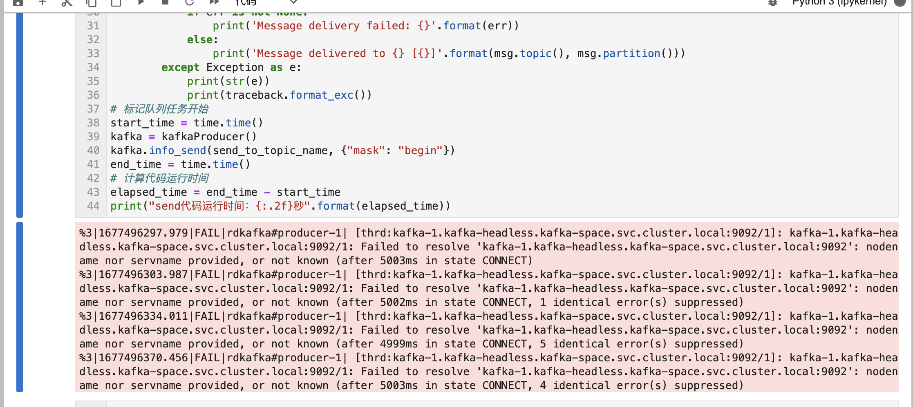

### 外网连接内部kafka问题
* 抱着调试的心理调试代码与kafka集群, 经过一万个试错, 和切换连接客户端发现: 

* 不想了解原理, 一下内容全是自我理解: 
1. 首先程序访问 kafka kafka 主节点呢。告诉python程序说你把这条消息 发送到某个broker 那里去就行了, 返回要发送的 broker 相关的信息(也就是kafka-1.kafka-headless.kafke-snace.svc.cluster.local:9092)
2. 然后 python 程序拿到了 kafka 集群返回的这个具体的 broker 信息后, 就根据broker信息往这里面发, 然后因为 kafka 是部署在 kubernetes 里面的, 导致 broker 节点,返回的是 kubernetes 的 DNS信息, 所以我在外网环境根本没办法解析集群返回给我的 broker 信息, 导致虽然能连接上集群, 但是根本没办法往某个具体的 broker 发送实际的消息

* 消息图片. 日后补齐