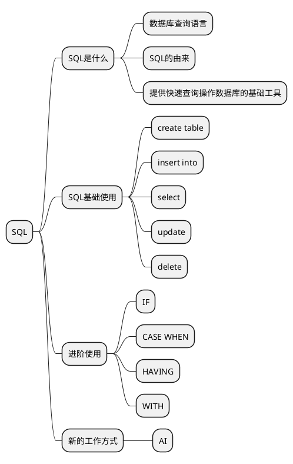

# 前言
* 写这玩意儿, 主要是针对初学者的使用, 让他们对 SQL 有一定的了解, 能在工作中进行使用快速分析工具, 基本能保证他们在最快的时间能达到上手使用 SQL 进行, 数据库的数据分析. 基本能满足日常数据分析工作需求, 也能达到 BI 工具使用的程度.

# 介绍 SQL
## SQL 的由来
> SQL（Structured Query Language）是一种用于管理关系型数据库的编程语言。它的发展历史和起源可以追溯到上个世纪70年代末和80年代初，以下是SQL的发展历史和起源的主要阶段：
早期关系型数据库系统：
在上世纪70年代，关系型数据库的概念开始出现。IBM的研究员 E.F. Codd 在1970年提出了关系数据库的理论基础，他发表的论文《A Relational Model of Data for Large Shared Data Banks》标志着关系型数据库的雏形。
1974年，IBM推出了第一个商业化的关系型数据库管理系统（DBMS）——System R。虽然该系统并没有直接使用SQL，但它为关系型数据库的发展奠定了基础。
SEQUEL 到 SQL：
在1970年代末，IBM开发了一种查询语言称为 SEQUEL（Structured English Query Language）。SEQUEL 最初用于 System R，后来发展成了 SQL。
由于 SEQUEL 这个名称可能与另一个产品的名称冲突，因此在1981年，IBM将其改名为 SQL。
ANSI 和 ISO 标准化：
在80年代，SQL逐渐被认可并广泛应用于各种数据库系统。为了统一和标准化SQL语言，美国国家标准学会（ANSI）于1986年发布了SQL的第一个标准，称为SQL-86。
随后，国际标准化组织（ISO）也发布了SQL标准，称为ISO/IEC 9075。这些标准对SQL的语法、语义和用法进行了规范，使得不同数据库系统能够遵循统一的规则。
数据库厂商的实现：
不同的数据库厂商开始基于SQL标准开发自己的数据库管理系统，如Oracle、Microsoft SQL Server、MySQL、PostgreSQL等。
尽管这些数据库系统都遵循SQL标准，但在实际实现中可能会有一些差异和扩展功能。
SQL的持续发展：
随着计算机技术的发展，SQL也不断演化和完善。不同的SQL版本相继发布，引入了更多的功能、优化和新特性。
SQL的应用范围也逐渐扩展，从最初的查询语言发展为支持数据定义、数据操作、事务控制、数据权限等多方面的功能。
总之，SQL的起源可以追溯到关系型数据库的理论基础和IBM的早期研究项目，而其发展历史则经历了标准化、实现、扩展和持续演化的过程，成为了管理关系型数据库的重要工具和标准化语言。

## 什么是 SQL？
SQL 是 Structured Query Language 的缩写，翻译为结构化查询语言。
SQL 是一种用于管理和操作关系型数据库的编程语言。

## SQL 的作用
SQL 提供了执行关系型数据库查询和操作的基本工具。

## 总结
* SQL 其实就是为了解决关系型数据库操作数据的便利性, 所产生的结构型语言, 并且经过历史的发展, 已经形成了一套国际通用标准化规范与准则

* 总结的总结: 
  * SQL 代表的关系型数据库操作的通用标准规范, 并且衍生出的操作语言
  * 关系型数据库操作数据 = SQL
  * SQL 是基于数据库执行的, 根据使用的不同的数据库, 会有部分差异和扩展

```plantuml
rectangle SQL语言工具 as ut
rectangle SQL标准 as t
rectangle 私货 as s
database mysql
database oracle
database sqlServer
t <-- mysql
t <-- sqlServer
t <-- oracle
s <-- mysql
s <-- sqlServer
s <-- oracle
ut <-- s
ut <-- t
```
* 学习时基本都是学统一的SQL标准那一部分的语言, 具体各个数据库上的私货, 得根据具体数据库具体学习

# SQL 基础使用
## 创建表格（CREATE TABLE）
* `CREATE TABLE` 根据之前SQL定义, 其实就是一个固定的语法, 通过语法固定去创建表格.
以下是一个基本的示例，展示了如何使用 MySQL 创建一个名为 users 的表格：
```sql
CREATE TABLE users (
    id INT AUTO_INCREMENT PRIMARY KEY,
    username VARCHAR(50) NOT NULL,
    email VARCHAR(100) NOT NULL,
    age int not null,
    birthdate DATE,
    created_at TIMESTAMP DEFAULT CURRENT_TIMESTAMP
);
```
```text
id 列：整数类型，自动递增的主键。
username 列：字符类型，最大长度为 50，不能为空。
email 列：字符类型，最大长度为 100，不能为空。
age 列：整数类型，不能为空。
birthdate 列：日期类型，用于存储出生日期。
created_at 列：时间戳类型，设置默认值为当前时间。
```

* 可视化: 我们得到了这样一张空表

id|username|email|age|birthdate|created_at
:-|:-|:-|:-|:-|:-|:-

### 数据类型
```text
INT：整数类型。
VARCHAR(n)：可变长度字符类型，最大长度为 n。
CHAR(n)：定长字符类型，长度为 n。
DATE：日期类型。
TIMESTAMP：时间戳类型。
FLOAT：浮点数类型。
```

### 约束
```text
PRIMARY KEY：主键约束，用于唯一标识每行。
NOT NULL：非空约束，确保列的值不为空。
UNIQUE：唯一约束，确保列的值在表中是唯一的。
DEFAULT：默认值约束，为列设置默认值。
AUTO_INCREMENT：自动递增约束，适用于主键列。
```
在创建表格时，您可以根据您的需求选择适当的数据类型和约束来定义列。确保您在创建表格之前仔细考虑每个列的数据类型、约束和关系，以确保数据的完整性和一致性。
* 约束一般很少用到, 因为将大部分数据校验能力都放在数据库层面的话, 会导致数据库的效率变慢.

## 插入数据（INSERT INTO）
```sql
INSERT INTO users (id, username, email, age)
VALUES (1, 'john_doe', 'john@example.com', 30);
```
* 可视化:

id|username|email|age|birthdate|created_at
:-|:-|:-|:-|:-|:-
1|john_doe|john@example.com|30|-|-

```sql
INSERT INTO users (id, username, email, age)
VALUES ('jane_doe', 'jane@example.com', 23),
       ('bob_smith', 'bob@example.com', 23),
       ('alice_johnson', 'alice@example.com', 12);
```

* 可视化:

id|username|email|age|birthdate|created_at
:-|:-|:-|:-|:-|:-
1|john_doe|john@example.com|30|-|-
2|jane_doe|jane@example.com|23|-|-
3|bob_smith|bob@example.com|23|-|-
4|alice_johnson|alice@example.com|12|-|-

## 筛选条件 (WHERE)
* WHERE 无法单独使用, 必须搭配 SELECT, UPDATE, DELETE语句使用
* WHERE 筛选, 
  * cloumns \> N
  * cloumns \= N
  * cloumns <> N
  * cloumns < N
  * cloumns != N
  * cloumns between N1 and N2
  * AND 且 同时符合多个条件
  * OR 或 满足其中一个条件

```sql
-- 筛选 字段 a 大于 10, b字段为douyin --
-- 并且 create_time 在 '2023-08-23 00:00:00' 和 '2023-08-24 00:00:00' 之间的数据 --
WHERE a > 10 and b = 'douyin' and create_time between '2023-08-23 00:00:00' and '2023-08-24 00:00:00' 
```
## 查询数据（SELECT）
* `SELECT * FROM table_name;`
  * table_name 是您要查询数据的表格的名称。
  * 通配符 * 表示选择所有的列
```sql
SELECT * FROM users
```
* 可视化:

id|username|email|age|birthdate|created_at
:-|:-|:-|:-|:-|:-
1|john_doe|john@example.com|30|-|-
2|jane_doe|jane@example.com|23|-|-
3|bob_smith|bob@example.com|23|-|-
4|alice_johnson|alice@example.com|12|-|-

### 指定结果
```sql
SELECT username, age+1 FROM users
```
* 指定查询结果, 并且干预某一列的数据
* 可视化:

username|age
:-|:-
john_doe|31
jane_doe|24
bob_smith|24
alice_johnson|13

### 指定数量
```sql
SELECT * FROM users LIMIT 0, 2
```
* 指定查询结果, 返回几条数据
* LIMIT, 0 代表的是位置, 2 代表的是条数
* 可视化:

id|username|email|age|birthdate|created_at
:-|:-|:-|:-|:-|:-
1|john_doe|john@example.com|30|-|-
2|jane_doe|jane@example.com|23|-|-

#### 私货差异
* oracle:
```sql
SELECT * FROM  
(  
SELECT A.*, ROWNUM RN  
FROM (SELECT * FROM users ) A WHERE ROWNUM <= 2  
 )  
WHERE RN > 0
```
* 可视化

id|username|email|age|birthdate|created_at
:-|:-|:-|:-|:-|:-
1|john_doe|john@example.com|30|-|-
2|jane_doe|jane@example.com|23|-|-

* 结果一样, 这就是数据库之间对于SQL标准上实现的差异

### 排序
```sql
SELECT * FROM users order by age asc
```
* desc 倒序
* asc 顺序
* 可视化:

id|username|email|age|birthdate|created_at
:-|:-|:-|:-|:-|:-
4|alice_johnson|alice@example.com|12|-|-
3|bob_smith|bob@example.com|23|-|-
2|jane_doe|jane@example.com|23|-|-
1|john_doe|john@example.com|30|-|-

### 分组
```sql
SELECT * FROM users group by age
```
* 可视化:

id|username|email|age|birthdate|created_at
:-|:-|:-|:-|:-|:-
1|john_doe|john@example.com|30|-|-
2|jane_doe|jane@example.com|23|-|-
4|alice_johnson|alice@example.com|12|-|-

### 条件
```sql
SELECT * FROM users WHERE age
```
* 可视化:

id|username|email|age|birthdate|created_at
:-|:-|:-|:-|:-|:-
1|john_doe|john@example.com|30|-|-
2|jane_doe|jane@example.com|23|-|-
4|alice_johnson|alice@example.com|12|-|-


### 函数使用
* COUNT(): 计数, 对某一列进行计数
```sql
SELECT count(*) FROM users group by age
```
COUNT(*)|
:-|
4|
* SUM(): 求和, 对某一列进行求和
```sql
SELECT sum(age) FROM users group by age
```
sum(age)|
:-|
88|

* 主要常用以上两个, 其他的不常用, 不赘述

### 子查询嵌套
* 用括号括起来的一条完整查询语句 
* 例一: 
```sql
SELECT * FROM (SELECT id FROM users) as new_table
```
* 例二: 
```sql
SELECT * FROM users where id in (SELECT id FROM users)
```
* `SELECT id FROM users`可视化1: 

id|
:-|
1|
2|
3|
4|

* 例一 可视化:

id|
:-|
1|
2|
3|
4|

* 例二 可视化:

id|username|email|age|birthdate|created_at
:-|:-|:-|:-|:-|:-
1|john_doe|john@example.com|30|-|-
2|jane_doe|jane@example.com|23|-|-
3|bob_smith|bob@example.com|23|-|-
4|alice_johnson|alice@example.com|12|-|-


## 更新数据（UPDATE）
* 必须与 WHEERE 强绑定使用
```sql
UPDATE users
SET email = 'newemail@example.com', age = 25
WHERE id = 1;
```
* 可视化:

id|username|email|age|birthdate|created_at
:-|:-|:-|:-|:-|:-
1|john_doe|newemail@example.com|25|-|-
2|jane_doe|jane@example.com|23|-|-
3|bob_smith|bob@example.com|23|-|-
4|alice_johnson|alice@example.com|12|-|-

```sql
UPDATE users
SET email = 'newemail@example.com'
WHERE age > 30;
```
* 更新年龄大于30岁的用户的邮箱, 但是由于年龄没有超过30岁的 所以就没更新
* 可视化:

id|username|email|age|birthdate|created_at
:-|:-|:-|:-|:-|:-
1|john_doe|newemail@example.com|25|-|-
2|jane_doe|jane@example.com|23|-|-
3|bob_smith|bob@example.com|23|-|-
4|alice_johnson|alice@example.com|12|-|-

### 警告
* 执行更新操作前务必确保您已经仔细检查和验证了要更新的数据和条件，以避免不必要的数据损失或错误。

## 删除数据（DELETE）
* delete 与 update 类似, 需要与WHERE 绑定使用
```sql
DELETE FROM users
WHERE id = 1 and id = 3;
```
id 既要等于 1 又要等于3, 所以删除不了数据, 数据库不存在 所以删不掉
* 可视化

id|username|email|age|birthdate|created_at
:-|:-|:-|:-|:-|:-
1|john_doe|newemail@example.com|25|-|-
2|jane_doe|jane@example.com|23|-|-
3|bob_smith|bob@example.com|23|-|-
4|alice_johnson|alice@example.com|12|-|-
```sql
DELETE FROM users
WHERE age < 18;
```

* 可视化

id|username|email|age|birthdate|created_at
:-|:-|:-|:-|:-|:-
1|john_doe|newemail@example.com|25|-|-
2|jane_doe|jane@example.com|23|-|-
3|bob_smith|bob@example.com|23|-|-

### 警告
* 执行删除操作前务必谨慎检查和验证要删除的数据和条件，以避免不必要的数据丢失。删除操作是不可逆的，可能会导致数据无法恢复。

# SQL 进阶使用
##  IF 语句
```sql
--- 基础语法 ---
SELECT
    column_name,
    IF(condition, "对的", "错的") AS alias
FROM table_name;

-- 实际用例 --
SELECT
    product_name,
    IF(in_stock > 0, '有货', '无货') AS availability
FROM products;
```
## CASE WHEN 语句
* 与if使用条件差不多的, 只是是多条件分支
```sql
-- 基础语法 --
SELECT
    column_name,
    CASE
        WHEN condition1 THEN result1
        WHEN condition2 THEN result2
        ...
        ELSE else_result
    END AS alias
FROM table_name;
-- 实际用例 --
SELECT
    order_id,
    order_date,
    CASE
        WHEN total_amount > 1000 THEN 'High Value'
        WHEN total_amount > 500 THEN 'Medium Value'
        ELSE 'Low Value'
    END AS value_category
FROM orders;

```
## HAVING 子句
* 过滤符合条件的结果出来
```sql
-- 基础语法 --
SELECT column1, aggregate_function(column2)
FROM table_name
GROUP BY column1
HAVING condition;
-- 实际用例 --
SELECT customer_id, SUM(order_amount) AS total_amount
FROM orders
GROUP BY customer_id
HAVING SUM(order_amount) > 1000;
```
## WITH 子句
> WITH 子句（通常称为 Common Table Expression 或 CTE）用于创建临时的命名查询结果集，以便在查询中引用。这对于提高查询可读性、重用子查询以及进行递归查询非常有用。WITH 子句可以在查询中定义一个临时的、命名的数据表，然后在查询的其他部分中使用该表。
```sql
-- 基础语法 --
WITH cte_name (column1, column2, ...) AS (
    SELECT ...
)
SELECT ...
FROM ...
-- 实际用例 --
WITH AvgSalaryPerDepartment AS (
    SELECT department_id, AVG(salary) AS avg_salary
    FROM employees
    GROUP BY department_id
)
SELECT e.employee_id, e.employee_name, e.salary
FROM employees e
JOIN AvgSalaryPerDepartment avg ON e.department_id = avg.department_id
WHERE e.salary > avg.avg_salary;
```
* 本质上就是把嵌套子查询的表抽离出来, 在最外层创建一个临时表, 然后这个临时表可以重复使用, 让多个地方去使用这个表, 做关联, 合并等查询操作
# 新的工作方式
## 工作中使用SQL
* 这年头有AI了, 很多都不需要自己从头写了, 只需要描绘清楚思路, 和提出问题, AI 大体都会给一个初步的解决方案. 这个方案不一定是有用的, 需要我们具备一定的专业知识进行优化
* 等优化完毕能查出对应的结果后, 将成品SQL 再给AI过一遍有没有可以优化运行效率的地方. 以此达到一个效率最大化的工作方式

### 通常方式
* 简单的把表格结构导出来喂给AI学习一下, 然后直接描述要查询哪些数据, 他基本都会给你一个现成的SQL 语句 这个SQL语句基本处于60-90分不等, 除非是非常简单的才能直接拿来用, 否则都会有瑕疵,
* 修改给出的出版SQL, 或者自己从源头把SQL写好调试好后, 喂给AI在不修改查询结果的情况下, 优化一下SQL的执行速度即可

