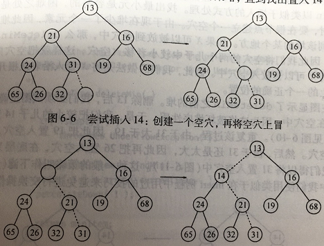
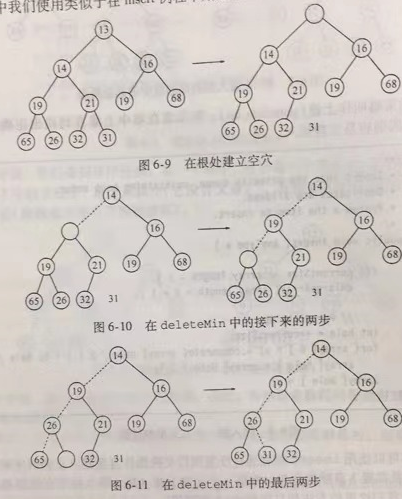
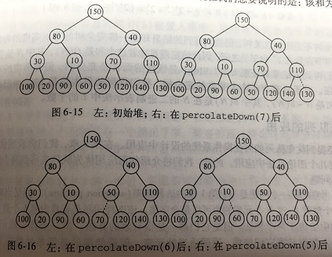
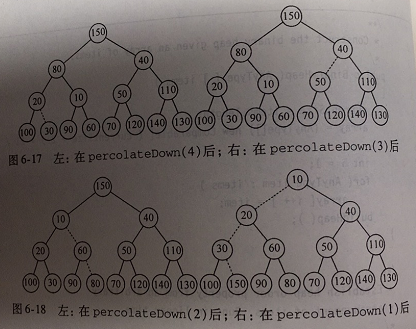

# 优先队列(堆)
> 在多用户环境中，操作系统调度程序必须决定在若干个进程中运行哪个进程。一般一个进程只被允许运行一个固定的时间片。一般来说，短的作业要尽可能的快地结束，这一点很重要，因此在已经运行的作业当中这些短作业应该拥有优先权。此外，有些作业虽不短小但很重要，也应该拥有优先权。
* 这种特殊的应用似乎需要一类特殊地队列，称之为**优先队列(priority queue)**

## 模型
* 优先队列是允许至少下列两种操作的数据结构：
  1. insert(插入)
  2. deleteMin(删除最小值)/deleteMax(删除最大值)
* 满足以上条件的模型，都是优先队列的基本模型
* 在**贪婪算法(greedy algorithm)**的实现方面优先队列起到了重要的作用

## 二叉堆
* 实现优先队列最普遍的数据结构

### 结构性质
* 堆是一棵完全被填满的二叉树(有可能底层最后有一个节点没填满)
* 容易证明，一棵高为 $h$ 的二叉树有 $2^{h}$ 到 $2^{h+1}$ 个节点。这意味着完全二叉树的高为 $\log N$, 显然时间复杂度为 $O(\log N)$
* 因为完全二叉树非常有规律，所以它可以用一个数组表示，不需要使用链，对于任一位置 $i$ 上的元素，其左儿子在 $2i$ 上，右儿子在 $2i+1$ 上，父亲则在$\frac{i}{2}$ 上。

### 堆序性质
* 让操作快速执行的性质是**堆序性质(heap-order property)**。
* 由于我们想要快速找出最小元素，因此最小元素应该在根上面
* 考虑任意字数也应该是一个堆，那么任意节点就应该小于它的所有后裔

### 基本的堆操作
* 插入(insert)
```plantuml
:增加一个空穴;
while(如果放入空穴是否会破坏堆序性质?) is (yes)
:空穴上浮一个节点;
endwhile(no)
:放入元素;
:插入完成;
```

为什么要用到空穴呢？因为先插入的话每次执行交换操作就需要执行3条赋值语句，用空穴的话只需要执行一次赋值语句

* 其中流程中涉及到的空穴的上浮，一般叫做<span id="上滤">**上滤(percolate up)**</span>
</br>
* 删除最小元(deleteMin)
  由于堆的性质，根节点是最小元素
```plantuml
:删除根节点;
:形成空节点;
while(该节点是否是叶子节点?)
if(左儿子小于右儿子) then (YES)
:左儿子上浮/空穴下移;
else (NO)
:右儿子上浮/空穴下移;
endif
endwhile
:将该堆的最后一个元素放入该空穴;
:删除该堆的最后一个元素;
```


* 其中空穴的下移，一般叫做<span id="下滤">**下滤(percolate down)**</span>

### 其它堆操作
* 降低关键字的值(decreaseKey)
  decreaseKey(p,$\Delta$)操作降低在位置p处的项的值，其中这可能破坏堆序性质，因此必须通过之前提到的[上滤](#上滤)对堆进行调整
</br>

* 增加关键字的值(increaseKey)
  increaseKey(p,$\Delta$)操作增加在位置p处的项的值，其中这可能破坏堆序性质，因此必须通过之前提到的[下滤](#上滤)对堆进行调整
</br>

* 删除(delete)
  delete(p) 操作删除堆中位置 p 上的节点。该操作通过首先执行 decreaseKey(p,$\infty$)，将该节点上升到根节点来，在执行 deleteMin()来完成。
</br>

* 构建堆(buildHeap)
  1. 构造二叉堆由一些项的初始集合构造而得，这种构造方法以N项作为输入，并把它们放到一个堆中。显然，这可以使用N个相继得 insert 操作来完成。
  由于每个 insert 将花费O(1)得平均时间和O($\log$N)得最坏情形时间，因此该算法的总运行时间是O(N)平均时间而不是O(N$\log$N)最坏情形时间。
  </br>
  2. 一般的算法是将 N 项以任意的顺序放入树中，保持结构特性。创建一个 percolateDown(i) 从 i 节点下滤，并且对每个有儿子节点的节点进行一次下滤操作，那么就可以构造成一棵合格的二叉堆.例如(以下过程)：
  
  
  * 为了确定buildHeap的运行时间的界，我们必须确定虚线条数(对比次数)的界。这可以通过计算堆中所有节点的高度的和来得到，它是虚线的最大条数。
    证明：
    树由高度 $h$ 上的 1 个节点，高度 h-1上的两个节点以及一般地在高度 $h-i$ 上的 $2^i$ 个节点组成。则
    $S=\sum^{h}_{i=0}2^i(h-i)=h+2(h-1)+4(h-2)+8(h-3)+...+2^{h-1}(1)$
    将两边乘以2得到新式子再减去原式，可得：
    $S=-h+2+4+8+...+2^{h-1}+2^h=(2^{h+1}-1)-(h+1)$
    得出：
    一颗完全树不是理想二叉树，但我们的到的结果却是一棵完全树的节点高度的和的上界。
    由于一棵完全数节点数在$2^h$和$2^{h+1}$之间，因此该证明意味着这个和是O(N),其中N是节点的个数

### 优先队列的应用
* 选择问题
  找出无序集中的第K个最大元素。
* 事件模拟
  模拟排队事件中，最需要优先完成的任务。
