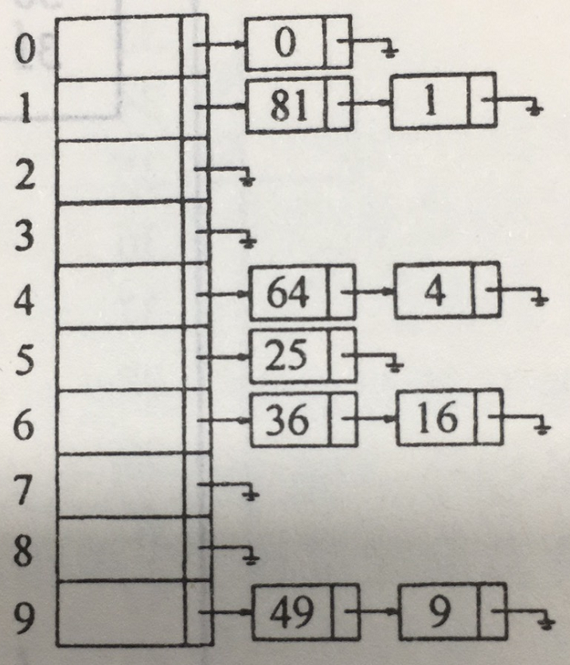

# 散列
* 散列表的实现常常叫做**散列**（hashing）。散列是一种用于常数平均时间执行插入、删除和查找的技术

## 一般想法
* 理想的散列表数据结构只不过是一个包含一些项（item）的具有固定大小的数组。
* 查找数据时，通常查找时对项的某个部分（即数据域）进行的，这个部分就叫作**关键字**（key）
* 现如今我们将需要查找数据的关键字通过固定的计算，算出唯一值，此唯一值对应固定大小数组中的一块下标区域
* 通过下标区域直接获取数据就能实现常数时间复杂度，对数据进行查询
* 以上时散列的基本想法，剩下的问题就是要选择一个函数，当两个关键字散列到同一个值的时候（这叫做冲突（collision））应该做什么以及如何确定散列表的大小

## 散列函数
> 如果输入的关键字是整数，则一般合理的方法就是直接返回 Key mod TableSize, 除非 key 碰巧具有某些不合乎需要的性质。在这种情况下，散列函数的选择都需要仔细地考虑。
* 散列函数并非唯一，基本上只要能使传入值能均匀分布在散列表中，计算快速都可以。
* 以下是常见比较容易想到的散列函数

### ASCII码散列
* 通过ASCII码求和，对散列表大小进行模运算。
```JAVA
public static int hash(String key, int tableSize){
  int hashVal = 0;
  for(int i =0; i < key.length(); i++){
    hashVal += key.charAt(i);
  }
  return hashVal % tableSize;
}
```
* 优点
1. 实现简单
2. 能快速计算出答案
* 缺点
1. 表太大的情况，不能很好均匀的分配关键，例如：
  设 $TableSize = 10007$ （10007是素数），并设所有的关键字至多8个字符长。由于ASCII字符值最多127，因此散列函数只能假设值在0-127*8=1016之间。显然还有一大堆空间剩余，并不能好好的利用起来

### 固定算法散列
* 假设这个散列函数关键字至少有三个字符。值27表示26个字母+空格字符，729是$27^2$。
```java
public static int hash(String key, int tableSize){
  return (key.charAt(0) + 27 * key.charAt(1) + 729 * key.charAt(2)) % tableSize;
}
```
* 假设散列表依旧是 10007，这次的确能得到一个合理的均匀分布。但是经过计算，三个字符除去空格的排列组合方式 有 $26^3 = 17576$ 种可能的组合，但查验英文字典，却表示：三个字母不同的组合数，实际只有 2851. 也就是说在实际应用的情况下，哪怕这些组合没有冲突，也不过只有28%被真正散列到。因此，此算法虽然计算容易，但是当散列表具有合理大小的时候这个函数还是不合适。

### 合格的散列算法
* 通过计算 $\sum^{KeySize-1}_{i=0} Key[KeySize-i-1]*37^i$, 并将结果限制在适当的范围内。
```java
public static int hash(String key, int tableSize){
  int hashVal = 0;
  for(int i =0; i < key.length(); i++){
    hashVal = 37 * hashVal + key.charAt(i);
  }
  return hashVal % tableSize;
}
```
* 此散列函数未必是最好的，但确实简单有效。
* 当字符长度过长，进行散列的时间也很久
* 散列函数并非会计算字符串所有值，可以挑选部分字符

## 散列冲突
* 由上一节的讨论可知道，极限情况下一定会有散列出的值相同的情况。
* 简单介绍一下最简单的两种解决冲突的办法
## 分离链接法
* 将散列到同一个值的所有元素保留到一个表中。我们可以使用标准库表的实现方法。如果表空间很紧，则更可取的方法是避免使用他们（因为这些表是双向链接的并且浪费表空间）
### 存放形式


* 基本架构
```java
public class SeparateChainingHashTable<T>{
  public SeparateChainingHashTable(){
    // do something
  }

  public SeparateChainingHashTable(int size){
    // do something
  }

  public void insert(T t){
    // do insert
  }

  public void remove(T t){
    // do remove
  }

  public boolean contains(T t){
    // do contains
  }

  public void makeEmpty() {
    // do make empty
  }

  private static final int DEFAULT_TABLE_SIZE = 101;

  private List<T>[] theList;

  private int currentSize;

  private void rehash(){
    // do rehash
  }

  private int myhash(T t){
    // do myhash
  }

  private static int nextPrime(int n){
    // do next prime
  }

  private static boolean isPrime(int n){
    // do is prime
  }
}
```

* hash方法
```java
private int myhash(T t){
  int hashVal = t.hashCode();
  hashVal %= theLists.length;
  if ( hashVal < 0 ){
    hashVal += theLists.length;
  }
  return hashVal;
}
```

* 构造方法
```java
public SeparateChainingHashTable(){
  this(DEFAULT_TABLE_SIZE)
}

public SeparateChainingHashTable(int size){
  theLists = new LinkedList[nextPrime(size)];
  for ( int i = 0; i< theLists.length; i++ ){
    theLists[i] = new LinkedList();
  }
}
```

* 清空方法
```java
public void makeEmpty() {
  for ( int i = 0; i< theLists.length; i++ ){
    theLists[i].clear();
  }
  currentSize = 0;
}
```

* 包含方法
```java
public boolean contains(T t){
  List<T> whichList = theLists[myhash(t)];
  return whichList.contains(t);
}
```

* 插入方法
```java
public void insert(T t){
  List<T> whichList = theLists[myhash(t)];
  if(!whichList.contains(t)){
    whichList.add(t);
    if(++currentSize>theLists.length){
      // 再散列，扩容
      rehash();
    }
  }
}
```

* 删除方法
```java
public void remove(T t){
  List<T> whichList = theLists[myhash(t)];
  if(whichList.contains(t)){
    whichList.remove(t);
    currentSize--;
  }
}
```

* 除链表以外，任何方案都可以解决冲突现象；一棵二叉查找树或甚至另一个散列表都将胜任这个工作

### 装填因子
* 定义散列表的**装填因子**（load factor）$\lambda$ 为散列表中的元素个数对该表大小的比。在上面的例子中,$\lambda = 1.0$。链表的平均长度为$\lambda$。执行一次查找所需要的工作是计算散列函数值所需要的常数时间加上遍历链表所用的时间。
* 在一次不成功的查找中，要考查的节点数平均为 $\lambda$ 。一次成功的查找则需要遍历大约 $1+(\lambda/2)$个链。

## 不用链表的散列表
* 分离链接散列算法的缺点是使用一些链表。由于给新单元分配地址需要时间，导致算法速度有些减慢，同时算法实际上还要求对第二种数据结构的实现。
* 不用链表解决冲突的方式是尝试另外一些单元，知道找出空的单元为止。
* 常见的 单元$h_0(x),h_1(x),h_2(x)...$ 相继被试选中，其中 $h_i(x)=(hash(x)+f(i)) \mod TableSize, 且 f(0)=0$。函数$f$是冲突解决办法。
* 因为所有的数据都需要置入表内，所以这种解决方案所需要的表比分离链接散列的表大。
* 一般来说，对于不适用分离链接的散列表来说，其中的装填因子应该低于 $\lambda=0.5$。
* 符合这种性质的表叫做**探测散列表（probing hash table）**

### 线性探测法
* 在线性探测法中，函数$f$是$i$的线性函数。
  1. 典型的情况是 $f(i)=i$ 这相当于相继探测逐个单元格(必要时可以回绕)
  2. 试想插入关键字{89,18,49,58,69} 于散列表 $hash(i)=i\mod TableSize, TableSize=10$
  3. 当插入49时就与89冲突，然后向下查找放入0的位置，58与18冲突，向下查找以此与89，49冲突，最后插入下标为1的位置
* 所以只要表足够大，总能够找到一个自由的单元，但是如此花费的时间是相当多的。
* 更糟的是，即使表相对较空，这样占据的单元也会开始形成一些区块，其中结果称为**一次聚集（primary clustering）**


