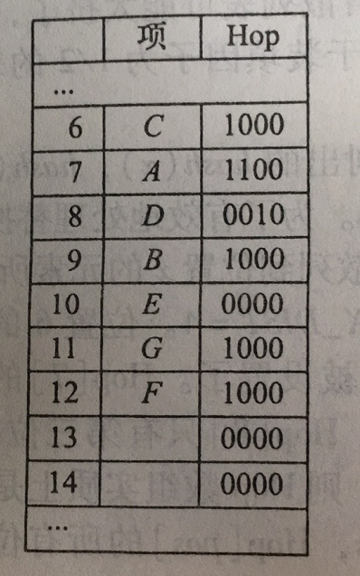

# 散列
* 散列表的实现常常叫做**散列**（hashing）。散列是一种用于常数平均时间执行插入、删除和查找的技术

## 一般想法
* 理想的散列表数据结构只不过是一个包含一些项（item）的具有固定大小的数组。
* 查找数据时，通常查找时对项的某个部分（即数据域）进行的，这个部分就叫作**关键字**（key）
* 现如今我们将需要查找数据的关键字通过固定的计算，算出唯一值，此唯一值对应固定大小数组中的一块下标区域
* 通过下标区域直接获取数据就能实现常数时间复杂度，对数据进行查询
* 以上时散列的基本想法，剩下的问题就是要选择一个函数，当两个关键字散列到同一个值的时候（这叫做冲突（collision））应该做什么以及如何确定散列表的大小

## 散列函数
> 如果输入的关键字是整数，则一般合理的方法就是直接返回 Key mod TableSize, 除非 key 碰巧具有某些不合乎需要的性质。在这种情况下，散列函数的选择都需要仔细地考虑。
* 散列函数并非唯一，基本上只要能使传入值能均匀分布在散列表中，计算快速都可以。
* 以下是常见比较容易想到的散列函数

### ASCII码散列
* 通过ASCII码求和，对散列表大小进行模运算。
```JAVA
public static int hash(String key, int tableSize){
  int hashVal = 0;
  for(int i =0; i < key.length(); i++){
    hashVal += key.charAt(i);
  }
  return hashVal % tableSize;
}
```
* 优点
1. 实现简单
2. 能快速计算出答案
* 缺点
1. 表太大的情况，不能很好均匀的分配关键，例如：
  设 $TableSize = 10007$ （10007是素数），并设所有的关键字至多8个字符长。由于ASCII字符值最多127，因此散列函数只能假设值在0-127*8=1016之间。显然还有一大堆空间剩余，并不能好好的利用起来

### 固定算法散列
* 假设这个散列函数关键字至少有三个字符。值27表示26个字母+空格字符，729是$27^2$。
```java
public static int hash(String key, int tableSize){
  return (key.charAt(0) + 27 * key.charAt(1) + 729 * key.charAt(2)) % tableSize;
}
```
* 假设散列表依旧是 10007，这次的确能得到一个合理的均匀分布。但是经过计算，三个字符除去空格的排列组合方式 有 $26^3 = 17576$ 种可能的组合，但查验英文字典，却表示：三个字母不同的组合数，实际只有 2851. 也就是说在实际应用的情况下，哪怕这些组合没有冲突，也不过只有28%被真正散列到。因此，此算法虽然计算容易，但是当散列表具有合理大小的时候这个函数还是不合适。

### 合格的散列算法
* 通过计算 $\sum^{KeySize-1}_{i=0} Key[KeySize-i-1]*37^i$, 并将结果限制在适当的范围内。
```java
public static int hash(String key, int tableSize){
  int hashVal = 0;
  for(int i =0; i < key.length(); i++){
    hashVal = 37 * hashVal + key.charAt(i);
  }
  return hashVal % tableSize;
}
```
* 此散列函数未必是最好的，但确实简单有效。
* 当字符长度过长，进行散列的时间也很久
* 散列函数并非会计算字符串所有值，可以挑选部分字符

## 散列冲突
* 由上一节的讨论可知道，极限情况下一定会有散列出的值相同的情况。
* 简单介绍一下最简单的两种解决冲突的办法
## 分离链接法
* 将散列到同一个值的所有元素保留到一个表中。我们可以使用标准库表的实现方法。如果表空间很紧，则更可取的方法是避免使用他们（因为这些表是双向链接的并且浪费表空间）
### 存放形式


* 基本架构
```java
public class SeparateChainingHashTable<T>{
  public SeparateChainingHashTable(){
    // do something
  }

  public SeparateChainingHashTable(int size){
    // do something
  }

  public void insert(T t){
    // do insert
  }

  public void remove(T t){
    // do remove
  }

  public boolean contains(T t){
    // do contains
  }

  public void makeEmpty() {
    // do make empty
  }

  private static final int DEFAULT_TABLE_SIZE = 101;

  private List<T>[] theList;

  private int currentSize;

  private void rehash(){
    // do rehash
  }

  private int myhash(T t){
    // do myhash
  }

  private static int nextPrime(int n){
    // do next prime
  }

  private static boolean isPrime(int n){
    // do is prime
  }
}
```

* hash方法
```java
private int myhash(T t){
  int hashVal = t.hashCode();
  hashVal %= theLists.length;
  if ( hashVal < 0 ){
    hashVal += theLists.length;
  }
  return hashVal;
}
```

* 构造方法
```java
public SeparateChainingHashTable(){
  this(DEFAULT_TABLE_SIZE)
}

public SeparateChainingHashTable(int size){
  theLists = new LinkedList[nextPrime(size)];
  for ( int i = 0; i< theLists.length; i++ ){
    theLists[i] = new LinkedList();
  }
}
```

* 清空方法
```java
public void makeEmpty() {
  for ( int i = 0; i< theLists.length; i++ ){
    theLists[i].clear();
  }
  currentSize = 0;
}
```

* 包含方法
```java
public boolean contains(T t){
  List<T> whichList = theLists[myhash(t)];
  return whichList.contains(t);
}
```

* 插入方法
```java
public void insert(T t){
  List<T> whichList = theLists[myhash(t)];
  if(!whichList.contains(t)){
    whichList.add(t);
    if(++currentSize>theLists.length){
      // 再散列，扩容
      rehash();
    }
  }
}
```

* 删除方法
```java
public void remove(T t){
  List<T> whichList = theLists[myhash(t)];
  if(whichList.contains(t)){
    whichList.remove(t);
    currentSize--;
  }
}
```

* 除链表以外，任何方案都可以解决冲突现象；一棵二叉查找树或甚至另一个散列表都将胜任这个工作

### 装填因子
* 定义散列表的**装填因子**（load factor）$\lambda$ 为散列表中的元素个数对该表大小的比。在上面的例子中,$\lambda = 1.0$。链表的平均长度为$\lambda$。执行一次查找所需要的工作是计算散列函数值所需要的常数时间加上遍历链表所用的时间。
* 在一次不成功的查找中，要考查的节点数平均为 $\lambda$ 。一次成功的查找则需要遍历大约 $1+(\lambda/2)$个链。

## 不用链表的散列表
* 分离链接散列算法的缺点是使用一些链表。由于给新单元分配地址需要时间，导致算法速度有些减慢，同时算法实际上还要求对第二种数据结构的实现。
* 不用链表解决冲突的方式是尝试另外一些单元，知道找出空的单元为止。
* 常见的 单元$h_0(x),h_1(x),h_2(x)...$ 相继被试选中，其中 $h_i(x)=(hash(x)+f(i)) \mod TableSize, 且 f(0)=0$。函数$f$是冲突解决办法。
* 因为所有的数据都需要置入表内，所以这种解决方案所需要的表比分离链接散列的表大。
* 一般来说，对于不适用分离链接的散列表来说，其中的装填因子应该低于 $\lambda=0.5$。
* 符合这种性质的表叫做**探测散列表（probing hash table）**

### 线性探测法
* 在线性探测法中，函数$f$是$i$的线性函数。
  1. 典型的情况是 $f(i)=i$ 这相当于相继探测逐个单元格(必要时可以回绕)
  2. <span id="dict"></span>试想插入关键字{89,18,49,58,69} 于散列表 $hash(i)=i\mod TableSize, TableSize=10$
  3. 当插入49时就与89冲突，然后向下查找放入0的位置，58与18冲突，向下查找以此与89，49冲突，最后插入下标为1的位置

* 所以只要表足够大，总能够找到一个自由的单元，但是如此花费的时间是相当多的。更糟的是，即使表相对较空，这样占据的单元也会开始形成一些区块，其中结果称为 **一次聚集（primary clustering）** 散列表的预期探测次数对于 **插入和不成功的查找来说大约为$\frac{1}{2}(1+\frac{1}{(1-\lambda)^2})$** **成功的查找来说是 $\frac{1}{2}(1+\frac{1}{(1-\lambda)})$**

#### 推算
* 假设现在有个很大的散列表，其中每次探测都与前面的探测无关。对于随机冲突解决方法而言，这些假设是成立的，并且当 $\lambda$ 不是非常接近于1时也是合理的。
* 首先，导出在一次不成功查找中探测的期望次数，而这正式知道我们找到一个空单元的探测的期望次数。由于空单元所占的份额为 $1-\lambda$，因此预计要探测的单元数是 $\frac{1}{1-\lambda}$
* 由于一次成功的查找探测次数等于该特定元素插入时所需要的探测次数
* 当一个元素被插入时，可以看作是一次不成功查找的结果。
* 所以可以使用一次不成功的查找开销来计算一次成功查找的平均开销
* 则有：
  单次不成功查询单元数为: $\frac{1}{1-\lambda}$
  多次不成功查询单元数为: $\int^{\lambda}_0\frac{1}{1-x}dx$
  平均插入成功查询单元数为：$\frac{1}{\lambda}\ln\frac{1}{1-\lambda}$

### 平方探测法
* 平方探测是消除线性探测中一次聚集问题的冲突解决方法
* 平方探测就是冲突函数为二次的探测方法
* 平方探测法常用函数为 $f(i)=i^2$

#### 定理
* 如果使用平方探测，且表的大小是素数，那么当表至少有一半是空的时候，总能够插入一个新的元素
* 证明：
  $令: TableSize \gt 3 \land TableSize \in 素数$
  $前[TableSize/2]个备选位置(包括储时位置h_0(x))是互异的$
  $h(x)+i^2(\mod TableSize) 和 h(x)+j^2(\mod TableSize),是这些位置中的两个$
  $其中0 \le i,j \le [TableSize/2]。为推出矛盾，如下：假设两位置相同$
  $h(x)+i^2=h(x)+j^2 \Rightarrow i^2=j^2 \Rightarrow (i+j)(i-j)=0\ \ (\mod TableSize)$
  由于 $TableSize$ 是素数，因此要么$i-j=0\mod TableSize$要么$i+j=0\mod TableSize$
  因为 $i$互异$j$,那么第一个选择是不可能的。但$0 \le i,j \le [TableSize/2]$,因此第二个选择也是不可能的，从而前$[TableSize/2]$个备选位置是互异的。

* 即使表被填充的位置仅仅比一半多一个，那么插入都有可能失败(虽然非常难于见到)
* 如果表大小不是素数，则备选单元格可能会锐减。<span id="e.g.2">例如</span>：表大小为16，则备选单元只能是在距散列值$h(x)+1，4，9$处。

* 在探测散列表中标准的删除操作不能执行，因为相应的单元可能已经引起过冲突，元素绕过它，存在了别处。所以探测散列表需要懒惰删除，不过在这种情况下实际上并不存在所意味的懒惰删除
* 虽然平方探测法排除了一次聚集，但是散列刀同一位置上的哪些元素将探测相同的备选单元，这叫做**二次聚集(secondary clustering)**，二次聚集是理论上的一个小缺陷，模拟结果指出对每次查找，他一般要引起另外的少于一半的探测。下面的**双散列**技术能弥补这个缺陷

### 双散列
* 常用函数是$f(i)=i*hash_2(x)$
  这个公式是说，将第二个散列函数应用到$x$并在距离$hash_2(x)$,$2hash_2(x)$,...等处探测。$hash_2(x)$ 选择的不好将会是灾难性的。例如：[前面的例子](#dict)中最后插入元素99，并且选择$hash_2(x)=x\mod 9$为二次散列函数，则该散列函数将不起作用，函数一定不能算得0值

* 在使用双散列时散列表得大小为素数很重要。如果大小不为素数，那么备选单元就有可能提前用完。例如前面所提到的[例子](#e.g.2)

* 正确实现双散列时，模拟表明，预期得探测次数几乎和随机冲突解决方法得情形相同。

## 再散列
> 对于平方探测的开放定址散列法，如果散列表填的太满，那么操作的运行时间将开始消耗过长、且插入可能失败。这可能发生再有太多的移动和插入混合的场合。
* 此时的一种解决方法是建立另外一个大约两倍大的表(并且使用一个相关的新散列函数)，扫描整个原始散列表，计算每个(未删除的)元素的新散列值并将其插入到新表中
* 这整个操作就叫作**再散列(rehashing)**。显然这是一种开销非常大的操作；其运行时间为$O(N)$, 因为有N个元素要再散列而表的大小约为2N，不过，由于不是经常发生，因此实际效果根本没有那么差
* 特别是在最后的再散列之前比然已经存在N/2次insert，因此添加到每个插入上的花费基本上是一个常数开销。
* 如果这种数据结构是程序的一部分，那么其影响是不明显的
* 如果是交互系统的一部分，那么当最后一次插入引起再散列的时候，用户会感到速度减慢。
* 常用的再散列方式：
  1. 表满到一半，进行再散列
  2. 插入失败，进行再散列
  3. 当散列表达到某个装填因子时，进行再散列，由于散列表的性能随着装填因子的上升而下降。所以有适当的截止手段实现的这种策略，可能是最好的策略。

# 标准库中的散列
> java中散列包括 Set 和 Map 散列表的实现，即 HashSet 类和 HashMap 类。HashSet 和 HashMap 通常是用分离链接散列实现的。

# 其它散列
## 布谷鸟散列法
* 通过两个以上的散列表和散列函数，进行计算散列值
  例如：两个散列函数分别计算，插入值第一个值的下标为$(x_1,y_1)$
  1. 先插入第一张表中的第一个位置
  2. 若不存在，直接插入
  3. 若存在将，表中的数据移至下一张表中
  4. 将新数据插入此张表
  5. 如果挪动数据产生冲突则重复2-4步骤，当轮回替换一圈以后此新数据再次被替换
  6. 将新数据在自身数据插入在下一张表中对应的位置上
  7. 如有冲突重复步骤2-6
  8. 直到最后一张表无法轮回替换一次后，此数据无法插入

### 优点
1. 极大的提升了每个单元的(内存空间的)利用率
2. 虽然增加了查找开销，但是在并行环境下可以忽略不计(每张散列表可以单独查询)

### 缺点
1. 增加了查询开销

## 跳房子散列
* 改进了经典的线性探测算法，解决了一次和二次聚集。

* 其中下标对应hash值
* Hop对应下面4位Hash值是否为6的单元，例如C对应1000代表hash值为6的只有下标为6的，下标789存储的都不是hash值为6的数据

# 常用计算
## 梅森素数(Mersenne)
* 对计算机而言最容易计算的素数。例如：
  $2^{5}-1,2^{31}-1,2^{61}-1,2^{89}-1$
* 梅森素数的取模运算可以通过位移运算和一次加法完成
  总所周知，计算机在计算2的倍数的商的时候直接通过位移计算即可
  通过所计算出来的商+对(梅森素数+1)的余数就会等于实际余数(一点简单的小学数学知识)
  当然最终结果有可能会大于梅森素数本身。所以得再判断一下，再减少一次
  这招也叫做**卡特-韦格曼绝招(Carter-Wegman trick)**
