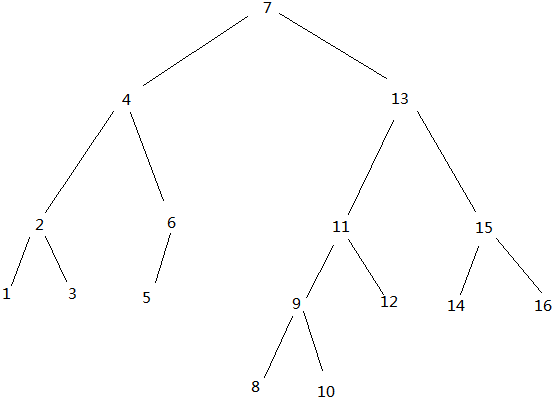
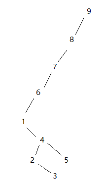

# 树
[toc]

## 基本定义
1. 定义树的一种自然方式是递归的方式
2. 一棵树是一些节点的集合
3. 这些集合可以是空集；若不是空集，则树又称作**根(root)**节点，以及 0 个或多个非空的子树组成
4. 子树中每一棵的**根**都被来自**根(root)**的一条有向**边(edge)**所连接
5. 每棵子树的**根**叫做**根(root)**的**儿子(child)**，而**根(root)**是每一棵子树的**父亲(parent)**
6. 一棵树是 N 个节点和 N - 1 条边的集合，其中一个节点交做**根**
7. 每条边都将某个节点链接到它的父亲，除去根节点外每个节点都有一个父亲
8. 每个节点可以有任意多个儿子，也可能是0个儿子
9. 没有儿子的节点称为**树叶(leaf)**
10. 相同父亲的节点称为**兄弟(siblings)**
11. 根据 7、8、9、10 可定义出 **祖父(grandparent)** 和 **孙子(grandchild)** 节点关系
12. 从节点 $n_1$ 到 $n_k$ 的 **路径(path)** 定义为节点 $n_1,n_2,...,n_k$ 的一个序列，使得对于 $1\leq i<k$ 节点 $n_i$ 是 $n_{i+1}$ 的父亲。这了路径的 **长(length)** 是该路径上的边的数量，即 $k-1$
13. 每个节点到它子有一条长为零的路径
14. 在一棵树种从根到每个节点恰好值有一条路径
15. 对任意节点 $n_i$, $n_i$ 的 **深度(depth)** 为从根到 $n_i$ 的唯一路径的长
16. 对任意节点 $n_i$, $n_i$ 的 **高(height)** 为从 $n_i$ 到一片树叶的最长路径
17. 如果存在 $n_1$ 到 $n_2$ 的一条路径，那么 $n_1$ 是 $n_2$ 的一位 **祖先(ancestor)** 而 $n_2$ 是 $n_1$ 的一个 **后裔(descendant)** ；如果 $n_1\neq n_2$ 那么 $n_1$ 是 $n_2$ 的 **真祖先(proper ancestor)** 而 $n_2$ 是 $n_1$ 的 **真后裔(proper descendant)**

### 一般的树
```plantuml
circle root
circle child_1
circle child_2
circle child_3
circle child_4
circle child_5
circle child_6

root -- child_1
root -- child_2
root -- child_3
root -- child_4
root -- child_5
root -- child_6
```

### 一棵树
```plantuml
circle A
circle B
circle C
circle D
circle E
circle F
circle G
circle H
circle I
circle J
circle K
circle L
circle M
circle N
circle P
circle Q

A -- B
A -- C
A -- D
A -- E
A -- F
A -- G
D -- H
E -- I
E -- J
J -- P
J -- Q
F -- K
F -- L
F -- M
G -- N
```

### 树的实现
> 实现树的一种方法可以是在每一个节点除外数据还有一些链，使得该节点的每一个儿子节点都有一个链指向他。然而，由于每个节点的儿子数可以变化很大并且事先不知道，因此在数据结构中建立到各个**子节点**的直接链接是不可行的，因为会产生大量的浪费空间。
* 一般树的数据结构表现形式
```java
class TreeNode{
  Object element;// 本身节点
  TreeNode firstChild;// 第一儿子节点 没有则为null
  TreeNode nextSibling;// 下一兄弟节点 没有则为null
}
```
* 由上个点的数据结构可，构想出，放入程序中的一棵树的数据形式。
```plantuml
circle A
circle B
circle C
circle D
circle E
circle F
circle G
circle H
circle I
circle J
circle K
circle L
circle M
circle N
circle P
circle Q

A -- B
B - C
C - D
D - E
E - F
F - G
D -- H
E -- I
I - J
J -- P
P - Q
F -- K
K - L
L - M
G -- N
```

### 树的应用
> 典型的应用就是 UNIX 等常用的操作系统中的目录结构。从根路径下展开的形式，就不展开一一赘述。

### 树的遍历
* 先序遍历：先遍历中间节点，再遍历左节点，最后遍历右节点。
  例如：上面所提到的树的先序遍历就是：`ABCDHEIJPQFKLMGN`
  用途：上一节所提到的可以用于遍历，Unix 系统的文件夹路径
```java
// 伪代码,传入树的根节点
public void print(TreeNode treeNode){
  if(treeNode == null){
    return;
  }
  System.out.println(treeNode.element);
  print(treeNode.firstChild);
  print(treeNode.nextSbiling);
}
```
<br/>

* 后序遍历：先遍历左边节点，再遍历右边节点，最后遍历中间节点。
  例如：上面所提到的树的先序遍历就是：`BDHDIPQJEKLMFNGA`
  用途：上一节所提到的可以用于逆序遍历，Unix 系统的文件夹大小计算文件夹大小等。
```java
// 伪代码,传入树的根节点
public void print(TreeNode treeNode){
  if(treeNode == null){
    return;
  }
  print(treeNode.firstChild);
  System.out.println(treeNode.element);
  print(treeNode.nextSbiling);
}
```

## 二叉树(binary tree)
### 概述
> 二叉树是一棵特殊的树, 其中每个节点都不能有多于两个的子节点。

### 性质
> 一棵平均二叉树的深度要比节点数 N 小得多，分析表明其平均深度为 $O(\sqrt N)$, 对于特殊类型的二叉树，即**二叉查找树(binary search tree)**,其深度平均值是 $O(\log N)$, 最坏情况的二叉树深度可以达到 $N-1$
### 实现
* 二叉树数据结构
```java
class BinaryNode{
  Object element;
  BinaryNode left;
  BinaryNode Right;
}
```

### 遍历方式
* 左序遍历/先序遍历：同上一节树的遍历方式
<br/>

* 右序遍历/后序遍历：同上
<br/>

* 中序遍历：先遍历左节点，再遍历中间节点(父节点)

### 表达式树
&emsp;很有趣的一种树的运用方式。
&emsp;假设存在以下计算式：$(a+b*c)+((d*e+f)*g)$，把操作符当做根节点，操作数当做叶子节点，可以看出，这其实就是一颗二叉树的中序遍历后的结果。
* 且通过压栈的方式可以把它凑成一颗表达式树，然后通过后续遍历就可以得到，计算机能够看得懂的，运算计算式。
* 如下图，凑合着看，排不了顺序，而且节点还不能重复
```plantuml
circle a
circle b
circle c
circle d
circle e
circle f
circle g
circle "*_1"
circle "+_1"
circle "*_2"
circle "+_2"
circle "*_3"
circle "+_3"

[+_1] -- [+_2]
[+_1] -- [*_1]
[+_2] -- a
[+_2] -- [*_2]
[*_2] -- b
[*_2] -- c
[*_1] -- [+_3]
[*_1] -- g
[+_3] -- [*_3]
[+_3] -- f
[*_3] -- d
[*_3] -- e
```

## 二叉查找树
&emsp;假设树中的每个节点存储一项数据。假设他们存储的都是整数。使每个节点  X它的左子树中的所有值小于X中的值，而使它的右子树大于X中的值。
* 二叉查找树的平均深度是 $O(\log N)$

### 遍历
从根节点开始，需要查找值，大于该节点往右走，如果小于该节点往左走，如果等于该节点输出。未找到继续重复本步骤，直至遍历完整棵树。

### 插入
按照遍历的套路进行查找，找到最后的节点，再根据大小插入该节点的 左孩子或者右孩子上

### 删除
* 删除分为三种情况
1. 删除叶子节点，直接删除即可
2. 当节点有一个儿子，由当前删除节点的父节点直接绕过该节点，去指向它的唯一儿子节点，然后删除该节点
3. 当节点有两个儿子时，一般删除策略是用它的右子树中的最小节点，代替当前节点，并递归的删除那个节点(如果最小节点有0或1个节点就重复第1或2步骤即可)。

### 懒惰删除(lazy deletion)
* 当一个节点要被删除时，它仍留在书中，只是被标记删除。
1. 该方式对有重复项的树就，很常用，只需要在节点的频率树域减1即可
2. 如果有被删除的项重新插入了，这样也避免了重新分配一个新单元的开销
3. 如果树实际存在的节点和‘被标记删除’的节点数相同，那么树的深度预计只上升一个小的常数($\log(2n)-\log{n}$ = 1)

### 平均情况分析
* 一棵树的所有节点的深度和称为 **内部路径长**(internal path length)。
* 令 $D(N)$ 是具有 $N$ 个 节点的某棵树 $T$ 的内部路径长，$D(1)=0$。
一棵 $N$ 节点树由一棵 $i$ 节点的左子树和一棵($N-i-1$) 节点的右子树以及深度0处的一个根节点组成，其中 $0\leq i<N$, $D(i)$ 为跟的左子树内部路径长。但在原树中，由于多了一个根节点，所以这些节点都要加深一度，同理对右子树也成立。因此得到以下关系式：
$D(N)=D(i)+D(N-i-1)+N-1$
$\because 0<i\leq N-1$
$\therefore 左右子树的平均内部路径长为: \frac{\sum_{j=0}^{N-1}D(j)}{N}$
$D(N)=\frac{2}{N}(\sum^{N-1}_{j=0}D(j))+N-1$
求解过程可参考$D(N)=2D(\frac{N}{2})+N-1$ 这个递归式求解。具体求解过程暂时不会，以后记得就补充。
最后可得到平均值为 $D(N)=O(N\log N)$，因此任意节点预期的深度为 $O(\log N)$
* 因为在N次插入二叉查找树后，容易造成对二叉查找树的失衡，在根节点 左子树过大，或右子树过大的情况，这时候二叉查找树的最效率将降低
## AVL 树
&emsp;AVL(Adelson-Velskii 和 Landis)树是 **带有平衡条件(balance condition)** 的二叉树。这个平衡条件必须要容易保持，而且它保证树的深度须是 $O(\log N)$。每个节点的左子树和右子树高度最多差1，当超过1时，则此AVL树失衡

### 修正平衡-单旋转
* 个人称之为特殊的旋转，左左单旋转或者右右单旋转。
* 假设有如下的一颗 AVL 树

* 当插入 6 时，AVL 树的平衡就被破坏

* 此时显而易见的修正方式就是断开5和8，连上5和7，8作为7的右子节点，搞定（这种操作称之为7-8的单旋转）。


* 试着想象从一颗空树依次插入3、2、1、4、5、6、7。通过AVL 单旋转修正后的二叉树，和普通二叉查找树插入后的区别。

### 修正平衡-双旋转
* 由上面提到的树插入而成的 AVL 树。

* 现在依次倒叙插入8-16
* 插入16简单，不涉及 AVL 树的破坏。接着插入15。

* 这时候就要来一 7 为起节点的 右-左双旋转了(个人跟倾向于理解为两次单旋转，先旋转16-15，在旋转7-15,就等于右左双旋转了)。
* 双旋转时的操作。断开6-7 连上6-15 连上15-7 连上 15-16 断开 7-16 断开 16-15


* 插入 14 时 节点6-15-7 凑成 右-左双旋转。进行旋转
* 然后插入 13 会在根节点造成一个不平衡，经过单旋转修正。
* 之后不再举例，最后结果会生成如下树：


### 伪代码
```java
public class AvlTree<AnyType>{

  // 平衡阈值
  private static final int ALLOWED_IMBALACE = 1;

  // 树节点
  private class AvlNode<AnyType>{
    AnyType data;
    AvlNode<AnyType> left;
    AvlNode<AnyType> right;
    int height;

    // 新建根节点
    AvlNode(AnyType node){
      this(node,null,null);
    }

    // 新建节点
    AvlNode(AnyType data, AvlNode<AnyType> lt, AvlNode<AnyType> rt){
      this.data = data;
      this.left = lt;
      this.right = rt;
      this.height = 0;
    }
  }

  // 获取节点高度
  private int nodeHeight(AvlNode<Type> node){
    return node==null?-1:node.height;
  }

  // 插入节点
  private AvlNode<AnyType> insert(AvlNode<AnyType> node, AnyType data){
    if(node == null){
      // 节点不存在，初始化
      return new AvlNode(data);
    }
    int resultNum = data.compareTo(node.data);
    if(resultNum > 0){
      node.right = insert(node.right, data);
    }else if(resultNum < 0){
      node.left = insert(node.left, data);
    }
    return blance(node);
  }

  // 自平衡
  private AvlNode<AnyType> blance(AvlNode<AnyType> node){
    if(node == null){
      return node;
    }
    // 左子树 比 右子树高度要高
    if(nodeHeight(node.left) - nodeHeight(node.right) > ALLOWED_IMBALACE){
      if(nodeHeight(node.left.left)>=nodeHeight(node.left.right)){
        // 左子树的左节点高度 高于 左子树左节点的右子树 高度情况就只需要左左旋转，也就是只要单旋转就能使这部分节点保持平衡
        node = rotateWithLeftChild(node);
      }else{
        // 反之就是左子树的左节点的 右子树高于 左子树左节点的左子树，这种情况就是 左右旋转了，就是双旋转。
        node = rotateLeftRightChild(node);
      }
    }else if(nodeHeight(node.right) - nodeHeight(node.left) > ALLOWED_IMBALACE){
      // 与左子树同理
      if(nodeHeight(node.right.right)>=nodeHeight(node.right.left)){
        // 右右旋转，也就是只要单旋转就能使这部分节点保持平衡
        node = rotateWithRightChild(node);
      }else{
        // 右左旋转 需要用到双旋转。
        node = rotateRightLeftChild(node);
      }
    }
    // 更新当前节点的高度(当前节点永远是 左右子树最高 + 1)
    node.height = Math.max(nodeHeight(node.left), nodeHeight(node.right))+1;
    return node;
  }

  // 左旋转
  private AvlNode<AnyType> rotateWithLeftChild(AvlNode<AnyType> node){
    // 拿出当前节点的左节点
    AvlNode<AnyType> nodeLeft = node.left;
    // 当前节点的左子树 接上之前节点的 左节点的右子树
    node.left = nodeLeft.right;
    // 把当前节点， 设为之前节点的 右子树
    nodeLeft.right = node;
    // 更新当前的节点的高度(这时候左子树已经换掉了，重新求一下当前节点的高度)
    node.height = Math.max(nodeHeight(node.left), nodeHeight(node.right)) + 1;
    // 更新换位后的节点(此时它的右子树 已经变成了 node)
    nodeLeft.height = Math.max(nodeHeight(nodeLeft.left), node.height) + 1;
    // 返回换位后的新节点
    return nodeLeft;
  }

  // 右旋转 与左旋转 同理 不赘述
  private AvlNode<AnyType> rotateWithRightChild(AvlNode<AnyType> node){
    AvlNode<AnyType> nodeRight = node.right;
    node.right = nodeRight.left;
    nodeRight.left = node;
    node.height = Math.max(nodeHeight(node.left), nodeHeight(node.right)) + 1;
    nodeRight.height = Math.max(node.height,nodeHeight(nodeLeft.right)) + 1;
    return nodeRight;
  }

  // 左右旋转
  private AvlNode<AnyType> rotateLeftRightChild(AvlNode<AnyType> node){
    // 此节点需要 先用子节点去右旋转，然后再本节点左旋转，就能完成了 左右旋转
    node.left = rotateWithRightChild(node.left);
    return rotateWithLeftChild(node);
  }

  // 右左旋转
  private AvlNode<AnyType> rotateRightLeftChild(AvlNode<AnyType> node){
    // 先子节点 左旋转 然后本节点右旋转
    node.right = rotateWithLeftChild(node.right);
    return rotateWithRightChild(node);
  }

  // 删除
  private AvlNode<AnyType> remove(AvlNode<AnyType> node， AnyType data){
    if(node == null){
      return null;
    }
    int resultNum = data.compareTo(node.data);
    if(resultNum>0){
      node = remove(node.right, data);
    }else if(resultNum<0){
      node = remove(node.left, data);
    }else if(node.left!=null && node.right!=null){
      // 当前节点 有两颗子树的情形
      // 情形一：找到左子树最大的data 代替当前节点，然后删除左子树最大的节点
      // 情形二：找到右子树最小的data 代替当前节点，然后删除右子树最小的节点
      node.data = findMax(node.left).data;
      node.left = remove(node.left, node.data);
    }else {
      // 单子树的情况 删除本节点，后面子节点代替本节点的位置就行
      node = node.left == null ? node.right : node.left
    }
    // 删除节点后，可能导致AVL树失衡，所以最后再自平衡一下
    return balance(node);
  }

  // 最后再补充一个 找最大值
  private AvlNode<AnyType> findMax(AvlNode<AnyType> node){
    if(node == null || node.right==null){
      return node;
    } else {
      return findMax(node);
    }
  }
}
```

## 伸展树
&emsp;大致的讲一下 ，伸展树的概念就是，访问树中的某一个节点，通过该节点和它的父节点，还有它的父节点的父节点，通过两次单旋转 **(专业术语叫做之字形旋转(zig-zag))** 个人还是比较喜欢称之为 **(左左/右右双旋转)**，旋转上去，一直把，被访问的这个节点，旋转到根节点的位置。例如：有以下这颗树：

* 第一次访问 节点 1 (通过1，2，3，三个节点单旋转) **(就像左右、右左双旋转一样，分有先后两个节点的先后顺序)**
* 一定是先旋转 爷爷节点和父亲节点，并且两次旋转要是同方向两次 左节点的单旋转，或者两次右节点的单旋转。
* 一直重复旋转到，要访问的节点为根节点为止。

* 第二次就是 1，4，5 之旋转

* 第三次 1，6，7 

* 第四次 1，8，9

&emsp;虽然此次访问时间比较多，但是对于未来可能需要访问的数据，无疑是减少了未来数据的访问时间。但让只有这种极端树的存在，这些操作才是有益的，如果是相对平衡或者稳定的树，这种操作无疑是致命的打击。

## $B$ 树
> &emsp;b树（balance tree）和b+树应用在数据库索引，可以认为是m叉的多路平衡查找树，但是从理论上讲，二叉树查找速度和比较次数都是最小的，为什么不用二叉树呢？ 
因为我们要考虑磁盘IO的影响，它相对于内存来说是很慢的。数据库索引是存储在磁盘上的，当数据量大时，就不能把整个索引全部加载到内存了，只能逐一加载每一个磁盘页（对应索引树的节点）。所以我们要减少IO次数，对于树来说，IO次数就是树的高度，而“矮胖”就是b树的特征之一，它的每个节点最多包含m个孩子，m称为b树的阶，m的大小取决于磁盘页的大小。
### 概念
* B树和平衡二叉树稍有不同的是B树属于多叉树又名平衡多路查找树（查找路径不只两个），数据库索引技术里大量使用者B树和B+树的数据结构。
* 完全M叉树 **(complete M-ary tree)** ：类似与完全二叉树的树，例如完全5叉树的每个节点最多有5个子节点。而一颗完全M叉树的高度大约是 $\log_MN$ 
### 规则
（1）排序方式：所有节点关键字是按递增次序排列，并遵循左小右大原则；
（2）子节点数：非叶节点的子节点数>1，且<=M ，且M>=2，空树除外（注：M阶代表一个树节点最多有多少个查找路径，M=M路,当M=2则是2叉树,M=3则是3叉）；
（3）关键字数：枝节点的关键字数量大于等于ceil(m/2)-1个且小于等于M-1个（注：ceil()是个朝正无穷方向取整的函数 如ceil(1.1)结果为2);
（4）所有叶子节点均在同一层、叶子节点除了包含了关键字和关键字记录的指针外也有指向其子节点的指针只不过其指针地址都为null对应下图最后一层节点的空格子;
### 特性
1. 关键字集合分布在整颗树中；
2. 任何一个关键字出现且只出现在一个结点中；
3. 搜索有可能在非叶子结点结束；
4. 其搜索性能等价于在关键字全集内做一次二分查找；

### 查询过程
* 如图是一个3阶b树，查询元素5的过程


* 最后获取数据
利用 $B-$树的性质，降低树的高度，从而减少磁盘IO次数，从而达到查找效率提升的目的。

### 插入过程
* 遵循规则：
1. 节点拆分规则：当前是要组成一个3路查找树，那么此时m=3,关键字数必须<=3-1（这里关键字数>2就要进行节点拆分）；
2. 排序规则：满足节点本身比左边节点大，比右边节点小的排序规则;

* 由于上述树是一颗3叉树，它每个节点只能有三棵子树。然后根据M阶B树的性质进行插入。
1. 当需要插入的数据在叶子节点上，且叶子节点数据小于M的话，直接插入。例如插入：10

2. 当插入数据在叶子节点上，但叶子节点满员情况。将本节点的中间值提升到父节点上，保证子树颗树比父节关键字个数多1，例如插入：16

* 基本上就以上两种处理过程，如果当前节点，一直满员就一直拆分节点，直至根节点无法拆分的话，就在根节点的以上，生成一个新根。例如以下树：

* 现在要插入一个 18。找到叶子节点，中间值把17往上挤，上层节点超载，然后把中间值15往上挤，根节点也超载把中间值9往上挤，最后就形成了一颗新树


### 删除
1. 节点合并规则：当前是要组成一个3路查找树，那么此时m=3,关键字数必须大于等于ceil（3/2）-1（这里关键字数<1就要进行节点合并）；
2. 满足节点本身比左边节点大，比右边节点小的排序规则;
3. 关键字数小于一时先从子节点取，子节点没有符合条件时就向向父节点取，取中间值往父节点放；

## $B^+$树
> &emsp;b+树，是b树的一种变体，查询性能更好。m阶的b+树的特征：

1. 有n棵子树的非叶子结点中含有n-1个关键字，这些关键字不保存数据，只用来索引，所有数据都保存在叶子节点（b树是每个关键字都保存数据）。关键字 i 代表子树 i+1 中的最小的关键字。
2. 所有的叶子结点中包含了全部关键字的信息，及指向含这些关键字记录的指针，且叶子结点本身依关键字的大小自小而大顺序链接。
3. 通常在b+树上有两个头指针，一个指向根结点，一个指向关键字最小的叶子结点。
4. 所有叶子节点上的数据有[M/2，M]个数据，M/2向上取整


# 引用
$B$树，范围部分引用[什么是B-树](https://mp.weixin.qq.com/s?__biz=MzI2NjA3NTc4Ng==&mid=2652079363&idx=1&sn=7c2209e6b84f344b60ef4a056e5867b4&chksm=f1748ee6c60307f084fe9eeff012a27b5b43855f48ef09542fe6e56aab6f0fc5378c290fc4fc&scene=0&pass_ticket=75GZ52L7yYmRgfY0HdRdwlWLLEqo5BQSwUcvb44a7dDJRHFf49nJeGcJmFnj0cWg#rd)
其他借鉴，[数据结构与算法分析(JAVA语言描述)(第三版)]()