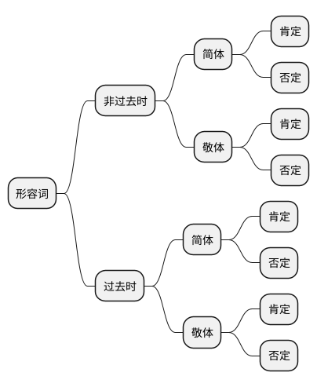

## 初级语法
语法|意思|详情
:-|:-|:-
〜は〜です|〜是〜|は：提示助词 です：肯定判断, 是
〜は〜ではありません 口语: じゃありません|〜不是〜|は：提示助词 ではありません：否定判断, 不是 じゃ：では的口语表达
〜は〜ですか. 肯定回答: はい/ええ、そうです 否定回答: いいえ、ちがいます いいえ、〜です|〜是〜吗? 是的 不,不是的 不,是~|は：提示助词 です：肯定判断, 是 か：接句尾表示疑问,相当于吗 当后者为疑问词时, 构成特殊疑问句, 需要回答相关疑问内容
の|连词,相当于中文里的‘的’|表示所有, 所属时, 连接两个名词, 相当于‘的’ 连接两个名词,不译
Sね|终助词|S代表一个句子 轻微感叹: 相当于中文的‘吧’,‘呐’  向对方确认
〜は〜で、〜です|〜是〜、是〜|は：提示助词 で：です的连用形,表示中顿,连接两个名词谓语句 です：肯定判断, 是 两个分句主语相同,第二个分句主语省略, 反之不能省略
と|并列, ‘和’的意思|と: 并列助词.用于连接两个及两个以上的名词, 表示并列关系, 并且是完全列举, 一旦列举会列举出所有内容来
も|类同, ‘也’的意思|も: 提示助词. 接在名词的后面, 提示句子的话题同时也表示同类事物
それから|连词(接续词), “另外、还有”的意思|1. 用于连接两个及两个以上的句子, 表示“补充、附加” 2. 有时也可以连接词组或词
から|<起点>从,由,自(开始)|1. [から] 接在表示时间、处所、顺序等名词的后面, 表示时间、空间、顺序的起点 2. 格助词 [から] 后可直接接 [です] 结句, 构成名词谓语句
まで|<终点>到、止、为止(结束)|1.[まで]　接在表示时间、处所、顺序等名词的后面，表示时间、空间、顺序的终点 2.格助词 [まで] 后可直接接[です] 结句，构成名词谓语句
〜から〜まで|<范围>从\~(开始)到\~(结束)|接在表时间、处所、顺序等的名词后，表时间、处所、顺序等的范围
でも|<转折>不过、可是、但是|1.实词中的连词 (接续词)，用于连接两个句子，表示转折关系，一般多用于口语中 2.常常为了语气委婉，转折之后，省略后面的话
Nじゃ（では）ありませんか|<反问>“不是···吗”|1.N为名词。是[〜じゃ（では）ありません] 的疑问形式，表示反问。 2.[じゃありませんか]是 [ではありませんか]的口语形式，较随意, 多用于委婉肯定或确认
どんなNですか|"是怎样的N、什么样的N?”|[どんな] 连体词。 用来询问名词所指的人或事物的性质、状态
N1やN2など|<并列> N1和N2等等|[や] 用于连接2个或2个以上的事物，表示并列关系。  [など] 表示“等等、之类”之意。二者通常搭配使用，构成 [N1やN2など]的形式 [など]有时也可以省略。在表示列举时，是部分列举，暗示除了列举的事物之外，还包含其他类似的事物,

## 数字
### 音读
名称|音读发音|训读发音
:-|:-|:-
0|ゼロ/れい|-
1|いち|ひとつ
2|に|ふたつ
3|さん|みっつ
4|よん/し|よっつ
5|ご|いつつ
6|ろく|むっつ
7|しち/なな|ななつ
8|はち|やっつ
9|く/きゅう|ここのつ
10|じゅう|とお
100|ひゃく|-
1000|せん|-
万|まん|-
亿|おく|-

### 人数
1. 基本都是数字　+　にん, 的读法
2. 1,2人额外记忆: 疑问词: 何人[なんにん]
    * 1人: ひとり
    * 2人：ふたり
3. 数人数时, 数字中带有4的都读作 [よ]

### 岁数
1. 基本都是数字　+　さい, 的读法
2. 1, 8, 10岁结尾, 是 っさい　有促音
3. 20岁的读法比较特殊, 读作 はたち。
    にじゅうさい不常用, 考试都考 はたち
* 疑问词: 
    * 何歳：なんさい(年纪小的, 没那么礼貌的用法)/いくつ

### 年级
1. 基本都是数字　+ ねんせい, 的读法
* 疑问词: 
  何年生：なんねんせい

### 时间
#### 时
1. 基本都是数字 + 時（じ）, 的读法
2. ４時（よじ）、７時（しちじ）、９時（くじ）单独记忆, 并且带有4, 7, 9结尾的都读作这个发音
* 疑问词:
  何時：なんじ

#### 分
1. 基本都是数字 +　分（ぷん）, 的读法
2. 3/4结尾发生半浊音变化 数字 +　分（ぷん）
3. 1/6/8/10 结尾发生促音变 数字 +　分（っぷん）
4. 其他情况读作 数字 +　分（ふん）
* 疑问词:
  何分：なんぷん

#### 时间段
1. 基本都是数字 + 時間（じかん）, 的读法
* 疑问词:
  何時間：なんじかん

#### 星期
名称|音读发音|意思
:-|:-|:-
日曜日|にちようび|星期日
月曜日|げつようび|星期一
火曜日|かようび|星期二
水曜日|すいようび|星期三
木曜日|もくようび|星期四
金曜日|きんようび|星期五
土曜日|どようび|星期六
* 疑问词:
  何曜日：なんようび

#### 月份
1. 基本都是数字 + 月（がつ）, 的读法
2. 四月：しがつ、七月：しちがつ、九月：くがつ
3. 先月：せんげつ、来月：らいげつ、 今月：こんげつ
* 疑问词:
  何月：なんがつ

#### 日期
1. 基本上是数字发音 + 日（にち）

名称|发音|数字训读发音
:-|:-|:-
一日|ついたち|ひとつ
二日|ふつか|ふたつ
三日|みっか|みっつ
四日|よっか|よっつ
五日|いつか|いつつ
六日|むいか|むっつ
七日|なのか|ななつ
八日|ようか|やっつ
九日|ここのか|ここのつ
十日|とおか|とお
二十日|はつか|-
十四日|じゅうよっか|-
十七日|じゅうしちにち|-
十九日|じゅうくにち|-
二十四日|にじゅうよっか|-
二十九日|にじゅうくにち|-

* 疑问词:
  何日：なんにち

## 指示代词
指示词|こ（近称）|そ（中称）|あ（远称）|ど（疑问称）
:-|:-|:-|:-|:-|
事物|これ（这个）|それ（那个）|あれ（那个）|どれ（哪个）
事、物、人|この+名词（这~）|その+名词（那~）|あの+名词（那~）|どの+名词（哪~）
场所|ここ（这里）|（そこ那里）|あそこ（那里）|どこ（哪里）
场所、人、方向、事物(郑重)|こちら（这里、这位、这边）|（そちら那里、那位、那边）|あちら（那里、那位、那边）|（どちら哪里、哪位、哪边）

### 对立指示
> 两人对话场景
* 近称里说话人近
* 中称里听话人近
* 远程里双方都远

### 融合指示
> 两人融合场景, 当做一个整体
* 近称离双方近
* 中称离双方中等距离
* 远程离双方都远

## 形容詞(けいようし)
结构: 词干+词尾
### 一类形容词
* 词尾以い结尾, 有汉字形式时候, い通常在汉字外
可愛い、美味しい、赤い
#### 形容词连体
* 直接+名词

### 二类形容词
* 词尾为　だ、词尾不会出现在单词表(词典)上. 单词表上都是词干部分, 所以词尾得自己记住
嫌い（だ）、綺麗（だ）
#### 形容词连体
* 词干+な+名词

* 简体用于对家人熟悉的朋友使用
* 敬体用于对上司,长辈等使用, 礼貌用语
### 形容词非过去时(肯定)
#### 一类形容词
* 形容词简体:形容词本身不变
* 形容词敬体:形容词整体+です
* 優しい：
  简体: 優しい 
  敬体: 優しいです
* 可愛い：
  简体: 可愛い
  敬体: 可愛いです

#### 二类形容词
* 形容词简体:形容词词干+だ
* 形容词敬体:形容词词干+です
* 綺麗：
  简体: 綺麗だ 
  敬体: 綺麗です
* 簡単：
  简体: 簡単だ 
  敬体: 簡単です

#### 练习
* 高い：
  简体: 高い 
  敬体: 高いです
* 嫌い：
  简体: 嫌いだ 
  敬体: 嫌いです

### 形容词非过去时(否定)
#### 一类形容词
* 形容词简体:形容词词尾い$\rightarrow$く+ない。
* 形容词敬体:
  1. 形容词词尾い$\rightarrow$く+ないです
  2. 形容词词尾い$\rightarrow$く+ありません
* 優しい：
  * 简体: 優しくない
  * 敬体1: 優しくないです
  * 敬体2: 優しくありません

* 需要注意两个形容词是特殊情况
  * いい：
    * 简体：いい$\rightarrow$よく＋ない＝よくない
    * 敬体1：いい$\rightarrow$よく＋ないです＝よくないです
    * 敬体2：いい$\rightarrow$よく＋ありません＝よくありません
  * かっこいい：
    * 简体：かっこいい$\rightarrow$かっこよく＋ない＝かっこよくない
    * 敬体1：かっこいい$\rightarrow$かっこよく＋ないです＝かっこよくないです
    * 敬体2：かっこいい$\rightarrow$かっこよく＋ありません＝かっこよくありません

#### 二类形容词
* 形容词简体:形容词词干+ではない。
* 形容词敬体:
  1. 形容词词干+ではないです。
  2. 形容词词干+ではありません
* 綺麗（きれい）：
  * 简体: 綺麗ではない
  * 敬体1: 綺麗ではないです
  * 敬体2: 綺麗ではありません

### 過去形の肯定
####　一类形容词
* 形容词简体: 形容词词尾い＋かった。
* 形容词敬体: 形容词词尾い＋かったです  
* 優しい：
  简体: 優しかった 
  敬体: 優しかったです
* 可愛い：
  简体: 可愛かった
  敬体: 可愛かったです

* 需要注意两个形容词是特殊情况
  * いい：
    * 简体：いい$\rightarrow$よ＋かった＝よかった 
    * 敬体1：いい$\rightarrow$よ＋かったです＝よかったです
  * かっこいい：
    * 简体：かっこいい$\rightarrow$かっこよ＋かった＝かっこよかった
    * 敬体1：かっこいい$\rightarrow$かっこよ＋かったです＝かっこよかったです

####　二类形容词
* 形容词简体: 形容词词干+だった。
* 形容词敬体: 形容词词干+でした。
* 綺麗（きれい）：
  * 简体: 綺麗だった
  * 敬体: 綺麗でした
* 簡単（かんたん）：
  * 简体: 簡単だった
  * 敬体: 簡単でした

### 形容词过去式(否定)
#### 一类形容词
* 形容词简体:形容词词尾い$\rightarrow$く+なかった。
* 形容词敬体:
  1. 形容词词尾い$\rightarrow$く+なかったです
  2. 形容词词尾い$\rightarrow$く+ありませんでした
* 優しい：
  * 简体: 優しくなかった
  * 敬体1: 優しくなかったです
  * 敬体2: 優しくありませんでした
* 需要注意两个形容词是特殊情况
  * いい：
    * 简体：いい$\rightarrow$よく＋なかった＝よくなかった
    * 敬体1：いい$\rightarrow$よく＋なかったです＝よくなかったです
    * 敬体2：いい$\rightarrow$よく＋ありませんでした＝よくありませんでした
  * かっこいい：
    * 简体：かっこいい$\rightarrow$かっこよく＋なかった＝かっこよくなかった
    * 敬体1：かっこいい$\rightarrow$かっこよく＋なかったです＝かっこよくなかったです
    * 敬体2：かっこいい$\rightarrow$かっこよく＋ありませんでした＝かっこよくありませんでした

#### 二类形容词
* 形容词简体:形容词词干+ではなかった。
* 形容词敬体:
  1. 形容词词干+ではななかったです。
  2. 形容词词干+ではありませんでした
* 綺麗（きれい）：
  * 简体: 綺麗ではなかった
  * 敬体1: 綺麗ではなかったです
  * 敬体2: 綺麗ではありませんでした
