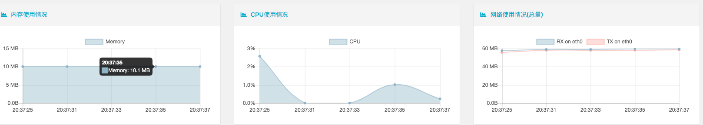

## trojan docker化打包运行
### [dockerfile](https://docs.docker.com/develop/develop-images/dockerfile_best-practices/)

```docker
FROM debian
LABEL maintainer=“fonss.fun”
RUN apt-get update && apt-get -y install trojan 
COPY config.json /etc/trojan/config.json
EXPOSE 1080
CMD /usr/bin/trojan
```

* 命令行构建：
  * 因为一开始在页面上构建，无法知道网页构建的Dockerfile上下文在哪。无法复制配置文件进行覆盖
  * COPY 命令只能访问当前上下文的文件， 所以无法用相对路径和绝对路径 定位其他文件夹下的文件
  * 分配了最小内存0 最大内存64M， 0.25核（cecos-caas算力最低单位）
* trojan实际耗费资源， 大概是10M左右的内存， Cp 5%左右 主要是做个网络转发
* 还能将该镜像内存降低到16M最低内存， 将足以使用（后期等内存不够在改吧）

