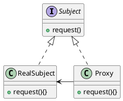
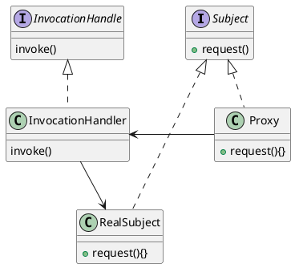

# 代理模式
* 为需要访问控制的对象创建一个经纪人，由经纪人来决定，是否允许访问控制。
[toc]

## 代理模式定义
* 为另一个对象提供一个替身或占位符以控制对这个对象的访问

## 代理模式类图

```puml
@startuml
interface Subject{
    +request()
}
class RealSubject{
    +request(){}
}
class Proxy{
    +request(){}
}
RealSubject .up.|> Subject
Proxy .up.|> Subject
Proxy -left-> RealSubject
@enduml
* 所以需要用RealSubject 的地方都可以用 Proxy 取代。
```

## JDK动态代理

```puml
@startuml
interface Subject{
    +request()
}
class RealSubject{
    +request(){}
}
class Proxy{
    +request(){}
}
interface InvocationHandle{
    invoke()
}
class InvocationHandler{
    invoke()
}
RealSubject .up.|> Subject
Proxy .up.|> Subject
InvocationHandler .up.|> InvocationHandle
Proxy -left-> InvocationHandler
InvocationHandler -down-> RealSubject
@enduml
```