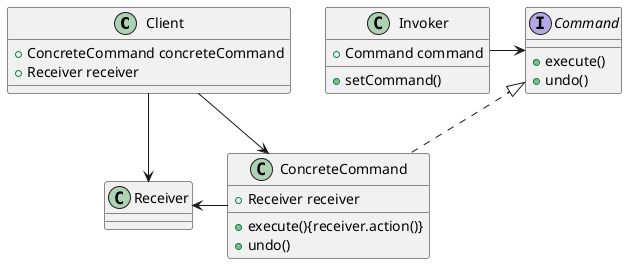

# 命令模式
* 将需要做的事情封装成一个命令，不关心如何实现，只关心调用哪个方法使用，可以根据不同的命令块，去执行不同的命令
[toc]

## 何为命令模式
* 命令模式将“请求”封装成对象，以便使用不同的请求、队列或者日志来参数化其他对象。命令模式也支持可撤销的操作。

## 命令模式的定义

由一个连接器定义一个接收者，与一个实际命令，调用者在某一时刻使用这个连接器时，可以通过命令接口中的公共execute()方法执行命令。

## 常用用途
1. 队列请求
2. 日志请求

## 总结
* 命令模式实质性只是将一系列操作中，将命令视为变化的，调用命令的方式行为不变，从而进行封装，演变出来的设计模式。
* 命令一个接受命令，一个发起命令不变得一块，一个命令去对应的执行完毕就行，其中这个发起命令，接受命令，执行命令这个宏观过程是不会变化的，而例如谁是发起人，谁是接收者，命令是什么命令这是可变的。