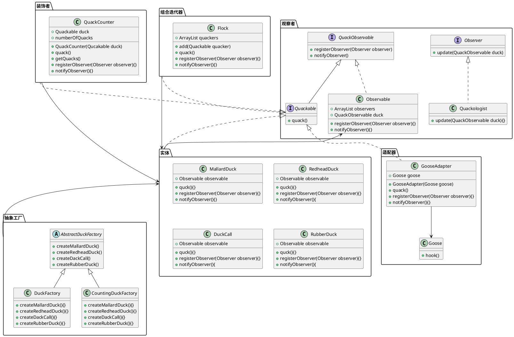

# 复合模式
* 利用多种模式的组合使用，用于解决实际问题
* 没有最好的模式，只有最适合的模式
[toc]

## 复合模式定义
* 模式通常被一起使用，并被组合在同一个设计解决方案中。
* 复合模式在一个解决方案中结合两个或多个模式，以解决一般或重复发生的问题。

## 例：类图

* 东西有点多，图画的不咋地
* 上例就是一个典型的，复合模式的设计，
1. 通过适配器，将鹅适配进鸭子中。
2. 通过装饰者，对鸭子的quack方法进行计数统计
3. 通过抽象工厂，对各种类型的鸭子进行确定的包装，使每只鸭子都被装饰器装饰。
4. 通过组合迭代模式，将不再需要关注一只鸭子的个体，扩展成为关注鸭群
5. 通过观察者模式，将每只鸭子每quack一次，都做一个通知，

## 最佳实践者MVC
* 复合模式的最佳实践产物，MVC模式
* M：控制数据的具体形式，数据格式，获取具体数据等。
* V：控制视图的外观用于填塞数据展示不同细节的可视化视图
* C：M与V中间的调和物控制视图展示的更新，接受视图的请求转发进M层
主要用到以下模式：
1. 策略模式：视图是一个对象，可以调用不同的控制器，而控制器则提供不同的策略。  
达到一个视图展示，与用户交互请求关系的解耦效果。
2. 组合模式：传统的MVC模式主要体现在一个页面放有多个Swing GUI组件的套用。  
但在WEB端的组合模式体现主要体现在HTML页面的各种dom节点的组合。
3. 观察者模式：传统的MVC主要体现，模型数据展示改变，直接通知视图层进行视图层的变化。通常在WEB端下MVC模式不体现观察者模式。