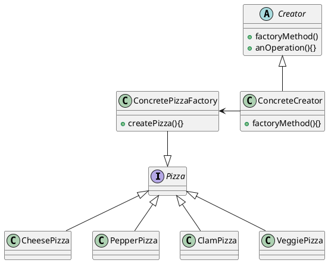
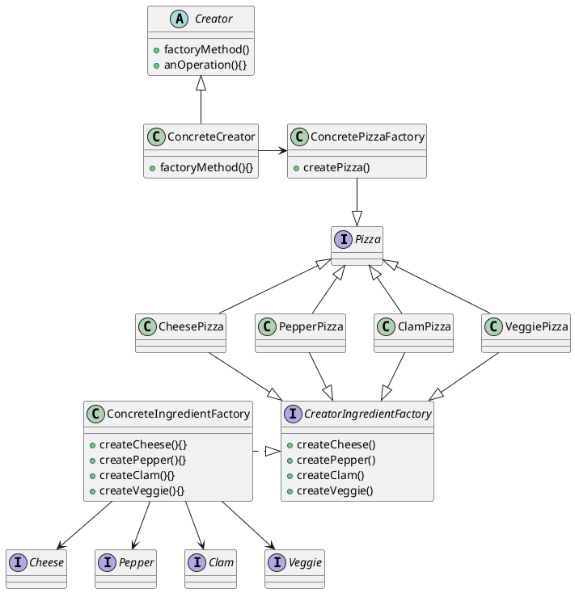

# 工厂模式
* 只关注生产产品得过程不关注具体产品是什么，但共同点就是他们拥有同一套生产过程。
[toc]

## 工厂方法模式
* 工厂方法模式（Factory Methode Pattern）通过让子类决定该创建得对象是什么，来达到将对象创建得过程封装得目的。
* 定义了一个创建对象的接口，但由子类决定要实例化的类是哪一个。工厂方法让类的实例化推迟到子类
例如：
抽象出Pizza无论是什么味道的Pizza，它始终都是Pizza，从而可定义超类就是Pizza而已，实际的Pizza所产生的行为，都是共同的，实际上只有一个超类Pizza的使用而已，其余的都只是Pizza的派生类而已。不要关注某一个具体其他类型Pizza是如何实现的，只要抽象出共同的行为即可（都是pizza，都要被顾客吃掉），具体是什么Pizza将它交给工厂即可。  
对应设计UML图。

## 抽象工厂模式
* 提供一个接口，用于创建相关或依赖对象的家族，而不需要明确指定具体类。

* 说白了其实就是，工厂方法模式多重套用，将更加复杂的行为过程抽象化，由多个工厂共同生产实际的具体类。达到多种不同组合的目的。

例如：
一个Pizza的一生，从生产到出售，到最后的被吃掉。都是有共同的部分，记住策略者模式中的，找到一个对象或者行为不会变化的部分，将变化和不会变化的分离出来。
其中不会变化的属性：
制作过程（都是发面粉，打饼，烘焙，上配料等，没做过Pizza不是很懂其中的过程），打包过程（拿出Pizza,切片，放入包装盒，套上袋子等），被吃掉过程（都是被消灭，一个从有到无的过程）。
变化的属性：
制作Pizza的原料，Pizza的风味，Pizza售卖店铺等等。
让我们整合一下以上改进过的Pizza的一生。

## 总结
* 工厂方法其实就相当于是一个小厂，具体去工作，去生产商品上流水线。
* 而抽象工厂方法，相当于集团公司，定制好战略布局，调配集团下面的所有相同行为不同类型的厂房，一同去生产一件产品上流水线。
* 工厂方法最主要的是，针对于行为抽象，抓住事物行为的共同性即可。