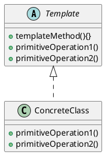

# 模板模式
* 将对象相同的加工行为抽象出来，将可变的部分延迟放入子类实现。所有子类公用一套相似的加工方式。
* 原理还是将变化的，和不变的抽象出来。
[toc]

## 模板模式定义
* 在一个方法中定义算法的股价，而将一些步骤延迟到子类中。模板方法使得子类可以在不改变算法结构的情况下，重新定义算法中的某些步骤。

## 好莱坞原则
* 别调用我们，我们会调用你。
* 高层组件调用底层组件，底层组件不能调用高层组件。