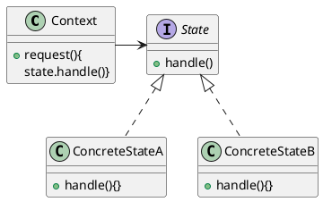

# 状态模式
* 将一个对象的所有的状态抽象成一个公共接口，每种状态都实现这个接口，并且实现对应的状态的行为，封锁不应该有的行为。
[toc]
## 状态模式的定义
* 允许对象在内部状态改变时改变它的行为，对象看起来好像修改了它的类。

## 状态模式类图

```puml
@startuml
class Context{
    +request(){
        state.handle()}
}
interface State{
    +handle()
}
class ConcreteStateA{
    +handle(){}
}
class ConcreteStateB{
    +handle(){}
}
Context -right-> State
ConcreteStateA .up.|>State
ConcreteStateB .up.|>State
@enduml
```
