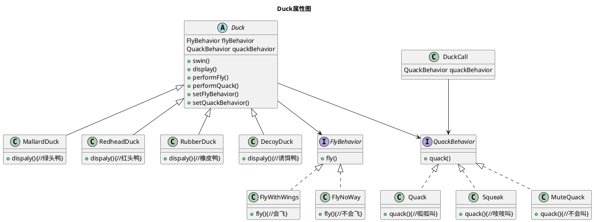

# 策略模式
[toc]

## 1. 分开变化和不会变化的属性
* 何为变化和不会变化的部分？  
1. 鸭子，由鸭子的属性可知，外观，叫声，飞行，游泳等特性。  
其中鸭子的外观确定之后基本是不会变化的。  
其中野鸭会飞，家鸭不会飞，玩具鸭也不会飞，木鸭不会叫，铁鸭，石头鸭甚至不会游泳。  
所以此部分需要拆开设计不同鸭子不同所对应不同的属性
2. 电视，由电视的属性可知，分辨率，电视屏幕尺寸，音响，内置安装软件，打开，关闭等特性。
其中明确不可变的电视的屏幕尺寸，打开，关闭属性。
其中分辨率可根据电视属性进行调节不同的分辨率，音响也可以通过外接或者更换不同的音响取代原本内置音响，内置的安装软件也可以卸载重新安装不同的收视软件。
也需要拆分出不可变的属性，以及可变属性。

## 2. 设计变化属性的不同行为
* 如何设计变化属性的不同行为？
例如：  
1.1中鸭子的属性，可以抽象出三个行为不相同的相同属性，对应不同的叫喊行为，飞行行为，以及游泳行为。  
1.2中电视的属性，可以抽象出三个行为不相同的相同属性，对应不同的分辨率属性，音响属性，软件属性。

## 3. 实现变化属性的不同行为
* 如何实现变化属性的不同行为？
1. 设计好对应的相同属性，只要接口实现相同属性的不同的实际行为即可
  
||飞行行为|叫喊行为|游泳行为|
|:-:|:-:|:-:|:-:|
|野鸭|T|嘎嘎叫|T|
|家鸭|F|呱呱叫|T|
|玩具鸭|F|吱吱叫|T|
|木鸭|F|F|T|
|铁鸭/石头鸭|F|F|F|

||分辨率|音响|收视软件|
|:-:|:-:|:-:|:-:|
|液晶电视|最高支持分辨率1980*1024|内置杜比音响|云OS|
|显像管电视|最高支持分辨率1280*800|外接音响|收视天线|

以上仅仅只是相同属性的不同行为而已。

## 4. 整合变化属性的不同行为
* 不同的行为对应相同的属性，此属性依旧是对象的特有属性之一。
1. 变化的属性依旧是对象的特有属性。
2. 变化的属性作为一个超类，会有很多对应的不同实际行为。

## 5. 动态设定内容的行为
* 加入setter方法随即改变变化属性，的不同行为。
1. 1.1中玩具鸭石头鸭，都是有可能会被人为因素所影响，而实现飞行，例如我把它们带上飞机，或者进行投掷等。
2. 1.2中电视机的分辨率，音响，软件属性等都是可以通过外界因素从而印象对象的实际属性产生变化。

## 6. 封装行为的大局观
* 例1.1：

## 7. 'IS-A'可能比'HAS-A'更好
* 当两个类或者多个类结合起来使用，这就是组合。
* 多用组合，少用继承。
1. 例6.1 就使用了3次组合  
Duck-FlyBehavior 组合出不同的鸭子不同的飞行行为
Duck-QuackBehavior 组合出不同的鸭子不同的叫喊行为
DuckCall-QuackBehavior 组合出不同的鸭鸣器不同的引诱声音