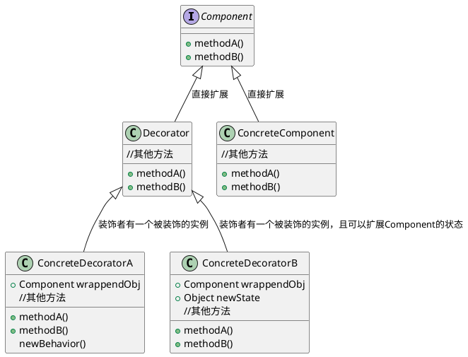
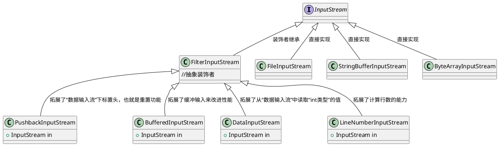

# 装饰者模式
* 将类的关系设计成乐高积木，形状不一（实现功能不同），互不影响干涉，又可以互相搭配出不同的形状（功能扩展），但又统称积木（拥有同一个超类）
[toc]

## 1.开放-关闭原则
* 目标类允许容易扩展，在不修改对应代码的情况下，就可搭配出新的行为。

## 2.装饰者模式
例如：
1. 拿一杯深培咖啡（这是一个对象）
2. 在加一份摩卡（这是一个装饰对象的装饰品）
3. 还有一份奶泡（这也是一个装饰对象的装饰品）  

把上面3步看做三块积木，实际的行为就是这三块积木拼凑而成的真正行为。

##3. 装饰者的工作原理
* 装饰者模式动态地将责任附加到对象上。若要扩展功能，装饰者提供了比继承更有弹性的替代方案。

## 4. 实践装饰者-Java I/O
