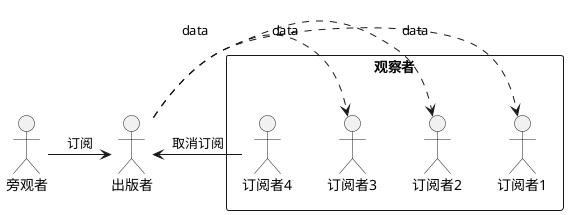
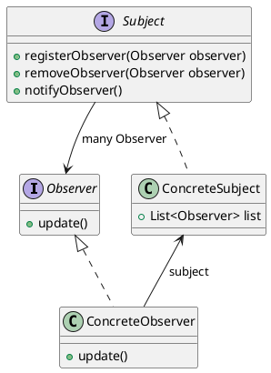
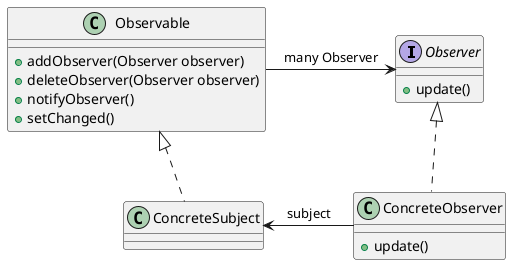

# 观察者模式
[toc]

## 何为观察者模式
* 出版者+订阅者=观察者模式

例如：
1. 晨光牛奶预订的牛奶，会有人每天送到家中
2. 报社订阅的报纸，每天有新报纸发行的时候就会有人送到家中
3. 手机各种APP的推送，出现了各种新闻，热点就进行推送到手机的通知栏
当然这条例子是不完全的，APP的推送属于流氓形式，不允许退订，只要你安装了APP，就一定会受到各种推送。

## 观察者模式

## 观察者模式实现

## JAVA 内置观察者模式

* 其中setChanged()方法标记改变状态。
## 观察者模式运行过程
1. 创建一个主题。
2. 将需要注册为订阅者的对象通过主题进行注册
3. 主题内容改变，将变化一一发送给订阅者
4. 删除订阅
例如：
通过主题的registerObserver()方法将需要订阅对象加入，订阅名单中。
主题内容改变时，触发notifyObserver()方法将变化后的值，一一推送给订阅者
通过主题的removeObserver()方法取消订阅
